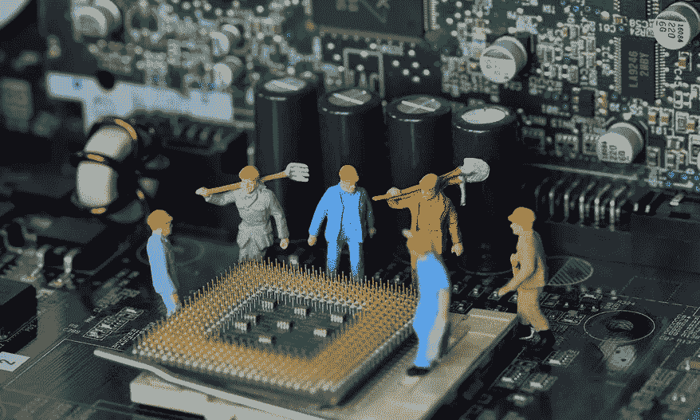
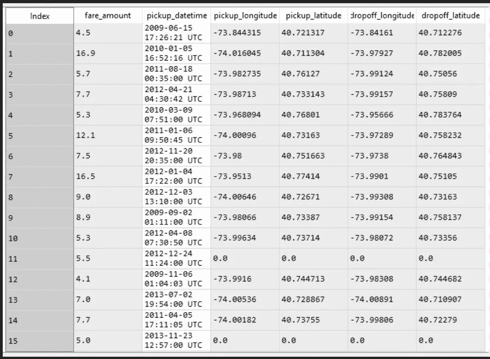
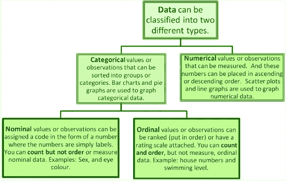
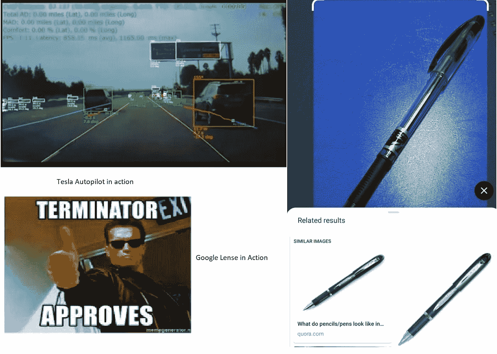
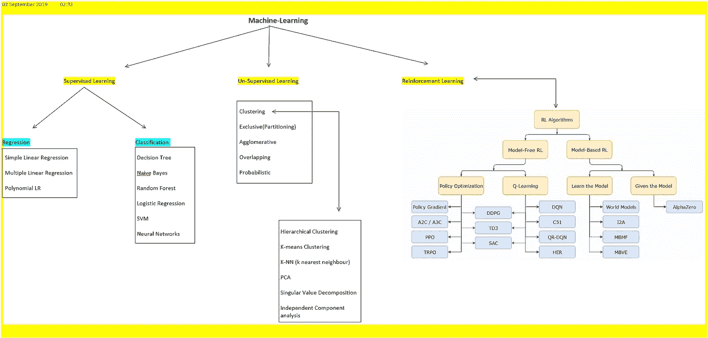
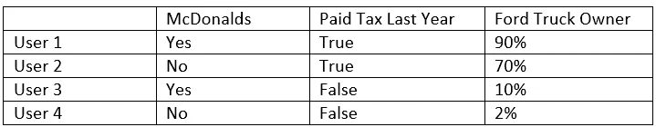
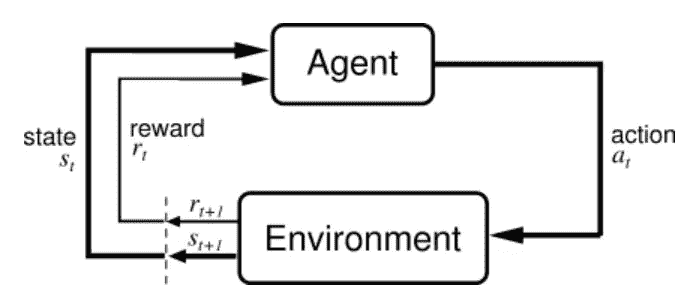
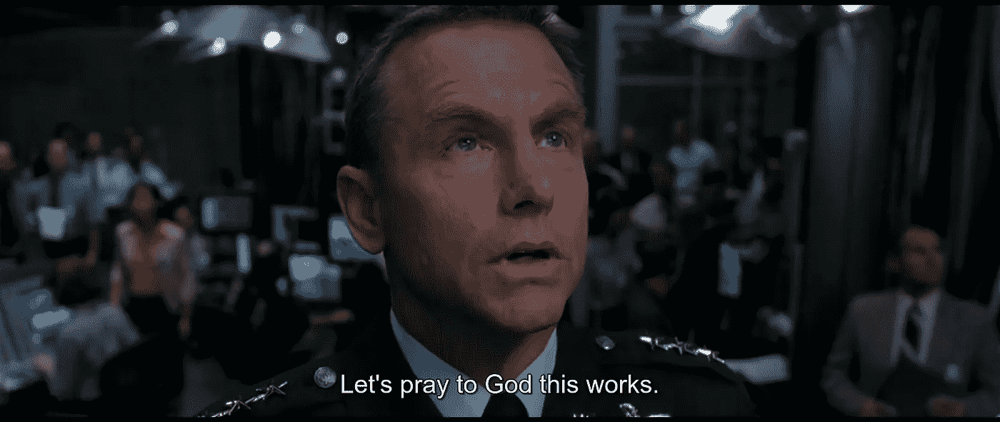

# 为什么说数据是人工智能的支柱？

> 原文：<https://medium.datadriveninvestor.com/why-data-is-said-to-be-the-backbone-of-artificial-intelligence-bde4e1c209ac?source=collection_archive---------9----------------------->

本文探讨了人工智能和机器学习对数据的基本需求。首先，让我们看看数据的一般含义和来源。

“数据是主体关于定性或定量变量的一组值。数据和信息或知识经常互换使用；但是，当在上下文中或在后期分析中查看数据时，数据就变成了信息。”未识别形式的信息是数据，我们每个人身边都有大量的数据。

 [## 今年值得关注的人工智能趋势|数据驱动的投资者

### 预计 2019 年人工智能将取得广泛的重大进展。从谷歌搜索到处理复杂的工作，如…

www.datadriveninvestor.com](https://www.datadriveninvestor.com/2019/02/19/artificial-intelligence-trends-to-watch-this-year/) 

如上所述，数据是经过处理的信息，对于不熟练的人来说是垃圾，但对于知道要寻找什么的人来说却是主要的商业机会。

让我们看一个来自 KAGGLE 的例子，提供的数据集是基于纽约市出租车费用预测的。

Trian Dataset for NYC-cab- Fare prediction Model

以上条目向我们展示了优步用户在纽约的 15 次旅行的相关数据。我们可以看到纬度和经度上的上下车地点，以及乘客人数和收费。如果被问及如何将这些数据转化为盈利模型，您的第一个想法是什么？

嗯，15 个条目并不是可用于任何预测建模的大量数据，数据的约束条件是在它开始有任何意义之前需要大量的数据。本例的数据集有 20，83，000 行条目。让我们看看这些数据经过一些预处理后是什么样子。

[source](https://github.com/filipyoo/nyc-taxi-analysis)

现在这个图像可以被称为信息，这是更互动和有用的。我们更容易确定这幅图像的含义，以及 2000k 行数据如何产生如此美丽的表示。我们可以看到上下车点如何帮助创建纽约市的街道地图，颜色梯度代表收费金额。我们可以清楚地看到黄金地段附近的热点。如果被问及我们如何轻易评论热点附近的出租车费会高于城市外围的出租车费。

我们知道，每当我们使用该应用程序预订出租车时，我们都能够看到如果我们继续预订，我们将支付的最终金额的近似值。上述数据集可以用来制作我们的模型，以便它可以预测大约。一辆新车的价钱。

这只是数据被用来缓解我们生活的一个例子。当你开始环顾每个应用程序时，每个物联网设备都被设计为以任何方式获取数据。让我们看看另一个例子这可能是非常相关的- [Siri](https://www.cnet.com/news/apple-will-no-longer-keep-siri-recordings-for-people-to-listen/) 听 iPhone 用户的每一个命令来训练自己并增强用户体验。Siri 本身还没有能力利用你的私人对话来对付你。但问题是在这个循环中扮演积极角色的人类，他们在这一切中扮演什么角色，为什么需要他们？像所有其他人工智能工具一样，Siri 已经接受了大量数据的训练，这里的数据是指音频剪辑以及人类翻译的剪辑文本。

“嘿，Siri，今天天气会怎么样？”—你的 iPhone 会向你展示当天剩余时间的完整天气预报。试试看。现在想想每天有多少人用多少种语言和方言做这件事。尽管如此，他们得到了相同的结果。Siri 能够理解所有这些内容，这只有在 Siri 熟悉了大量带有文字记录的音频剪辑后才有可能实现。时至今日，新的语言仍在增加，新的挑战也随之而来，其中大部分是前所未有的，但 Siri 的表现一直非常出色。Siri 在短时间内在新语言中表现同样好/或变得非常好的原因是第一，学习的技能已经存在，第二，中途出现的人类代理正在/正在倾听并试图理解命令的意思，然后更新 Siri 数据库。从用户的角度来看，收听随机语音剪辑的人类代理的存在是危险的，并且从公司的角度来看，将人类保持在链接中是非常划算的，并且产生高质量的模型。数据所有权是一个非常复杂的话题，你研究得越多，就越会意识到没有解决方案。每个企业巨头都在利用数据作为燃料，如果没有数据，他们将在几分钟内崩溃。

[Types of Statistical data](http://scaryscientist.blogspot.com/2015/02/classification-of-data-types.html)

为什么是统计数据？就像这个宇宙中的每种物质都可以分解成 n 种组合的质子、电子和中子一样，几乎所有收集、传输和创建的数据都可以在非常基础的水平上分解成上述类别。数据科学研究的是获取、过滤、分类、清理和可视化数据并将其转化为可用信息的过程。因为我们知道基本的格式，所有的数据都可以分解成。像线性回归、SVM 和 CNN 这样的工具就是为了处理这种低格式的数据类型并使它们变得有用而创建的。在这个层次上工作有助于我们互换使用这些工具

谷歌镜头用于识别物体的算法与特斯拉在其自动驾驶期间用于检测物体的算法基本相同。

人工智能到今天仍然没有完全独立，应该被称为人工的。我们有非常强大的机器学习模型和非常快速可靠的计算能力，可以用我们的模型处理数据，并在短时间内产生结果。人工智能是人工智能的下一个维度。我们将研究 ML 及其类型，以及如何在 ML 模型中使用统计数据。

机器学习——它是人工智能的一种应用，为系统提供从经验中学习和改进的能力，而无需显式编程。ML 专注于开发能够访问数据并利用数据进行自我学习的计算机程序。

ML- i) **监督学习的类型**

ii) **无人监督学习**

iii) **强化学习**

*-数据集包含输入变量和各自的输出变量。数据集本身是完整的。我们的目标是学习最佳映射函数，以便对于新的输入，我们可以预测正确的输出。Ml 完全基于给定的数据来学习。简而言之，数据既有问题也有答案，因为数据量巨大，神经网络有望在两者之间建立某种关系。*

**

****无监督学习***——它是一种人工智能(AI)算法的训练，使用既没有分类也没有标记的信息，并允许算法在没有指导的情况下对这些信息进行操作。人工智能系统提供了未标记、未分类的数据，系统的算法在没有事先训练的情况下对数据进行操作。输出取决于编码算法。让系统接受无监督学习是测试人工智能的一种方式。无监督学习算法可以执行比监督学习系统更复杂的处理任务。无监督学习中的数据不包含标签/目标标签，模型的工作是找出数据本身中的隐藏模式，数据点如何相互关联，以及如何将数据点联系起来。*

*想看看无监督学习和数据聚类的力量，看看网飞秀-伟大的黑客。让我来给你剧透一下，这部纪录片是基于剑桥分析公司，他们被指责操纵美国大选。它显示了白吹者是如何被质疑如此繁重的操作是如何执行的。纪录片中有一个令人震惊的例子，它清楚地表明，每个注册的美国选民的数据有 5000 个数据点，存储在 9 Tb 的硬盘上。每一次投票都有 5000 个数据点，他们拥有影响投票者的终极力量，操纵他们的本能，并在每个数字平台上向他们投放类似的广告。5000 个数据点/参数是各种是/否、真/假、0/1 和概率的集合。示例:*

**

*这只是 3 个用户的 3 个数据点的一个粗略的例子，想象有 5000 个数据点列和超过 1000 万个用户行的 excel 表。*

*起初这没有任何意义，但在应用聚类算法后不久，模式就会出现，然后数据科学家的工作就是从中得出结论。比如有可能吗？从数以百万计的用户数据中，我们可以看到没有纳税和没有福特卡车的用户是否在同一地区。这种避税者最不可能拥有福特卡车的假设有助于填补我们数据集中可能面临的数据缺口。这也使我们仔细分析他们的消费习惯和信用评分。这与居住背景相结合，将为我们提供足够的数据来了解一个人，因此，如果 X 先生当选总统，他们可以成为低息贷款等广告的特定目标。接收端的用户不知道他是他的社交媒体上所有内容的特定目标，甚至在广播中，附近的酒吧折扣一切都是由比用户更聪明的人认可的。*

*这一切听起来非常戏剧性，但它发生了，而且不是一次，但多个国家聘请剑桥分析公司来提高他们的投票银行。凭借极高的成功率，剑桥分析公司不断从脸书、Instagram 和智能手机上的几乎大多数社交媒体应用程序中获取数据点和用户计数。*

****强化学习*** :强化学习问题是指从交互中学习以达到目标的问题的直接框架。学习者和决策者被称为代理人。它与之交互的东西，包括代理之外的一切，被称为环境。这些不断地相互作用，主体选择动作，环境响应这些动作并向主体呈现新的情况。环境也会产生奖励，即代理人试图随时间最大化的特殊数值。一个完整的环境规范定义了一个任务，即强化学习问题的一个实例。*

**

*[Source](http://www.incompleteideas.net/book/ebook/node28.html)*

*在一种非常基本的形式中，强化学习是基于奖励的，学习主体对每一个正确的步骤进行奖励，对每一个错误的步骤进行惩罚，环境决定什么是错的，什么是对的。经过多次迭代后，agent 变得聪明起来，并且根据环境的状态，Agent 根据它在训练中获得的经验做出决定。在这种情况下，代理不知道它采取步骤的原因，它的唯一目标是最大化奖励，因此这更像是一个本地化的程序，即，为玩 DOTA 而设计的强化学习模型不能玩使命召唤，如果应用于任何其他不是为它设计的应用程序，模型将会悲惨地失败。*

**

*Terminator 3*

*这表明人工智能的整个基础是如何建立在数据上的，没有数据就没有特征提取、预测分析和模式识别。数据是新的货币，复制、篡改、盗窃等属性困扰着公司的大时代。*

*下一篇文章将对监督学习进行深入的数学分析，包括公式和推导。这将是回归和分类的介绍。与此同时，如果你想检查一个非常酷的深度神经网络应用([git-hub-Object detection–images/video/web cam](https://github.com/deep28vish))，无需编写或理解一行代码，也无需沉重的工作站，2 核系统就足够了。代码非常容易理解，只需预装 OPENCV 库和 python 即可运行。*