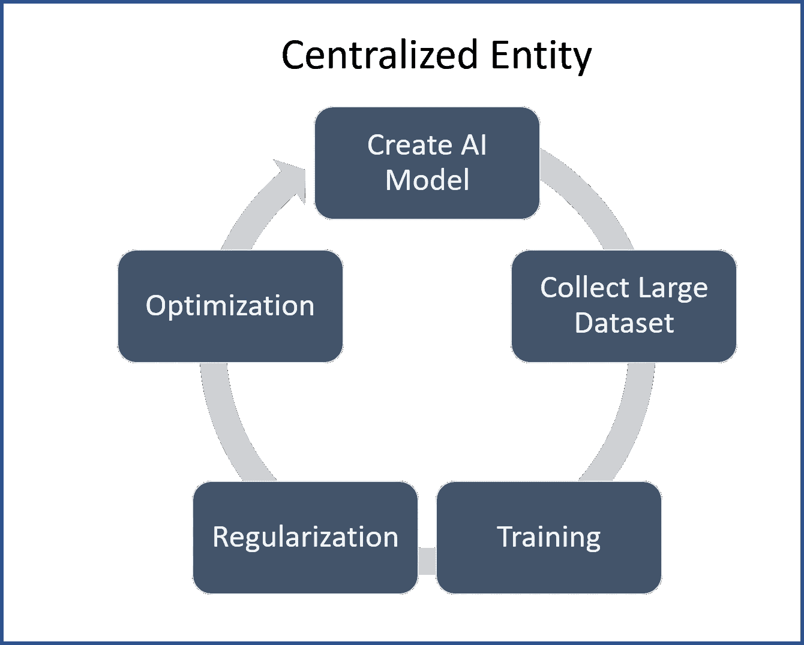
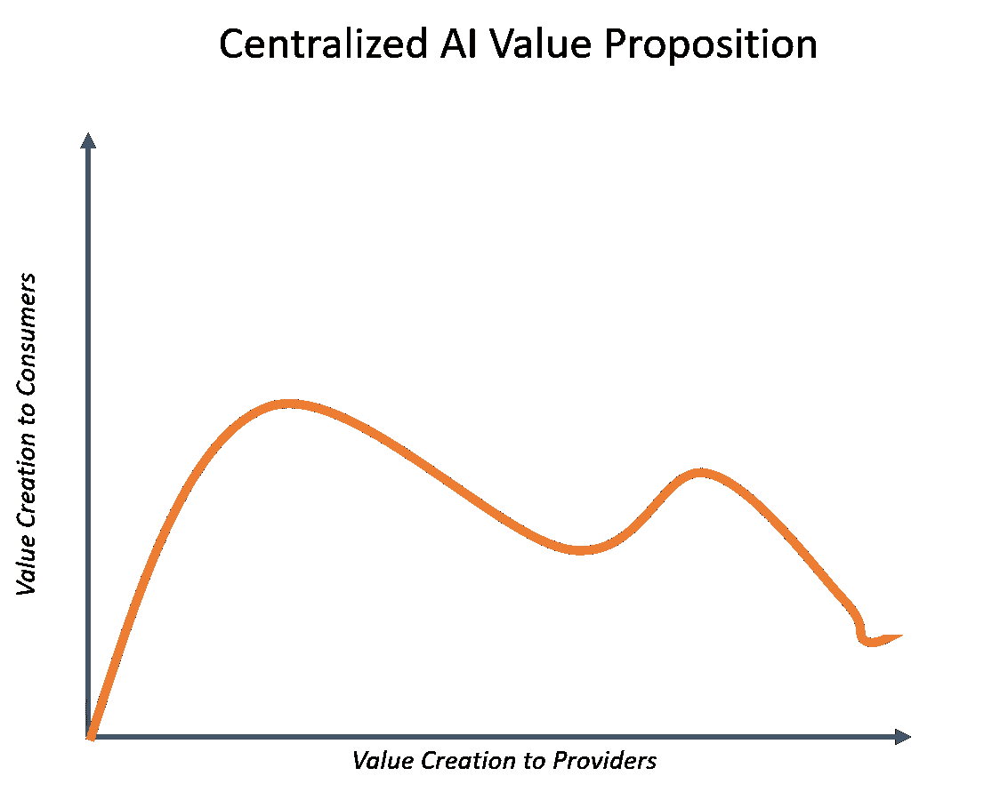

# 为什么去中心化人工智能很重要第一部分:经济学和使能因素

> 原文：<https://medium.datadriveninvestor.com/why-decentralized-ai-matters-part-i-economics-and-enablers-5576aeeb43d1?source=collection_archive---------0----------------------->

分散式人工智能(AI)的新兴领域正在成为过去几个月最令人兴奋的技术趋势之一。已经有很多关于人工智能(AI)和区块链技术交叉的潜在价值的文章，今年，我们甚至有整个会议专门讨论分散式人工智能的主题。然而，我觉得分散式人工智能背后的大量宣传未能突出新技术运动的一些关键价值主张，这些价值主张可以使其成为这十年最基础的技术趋势之一。如果你相信人工智能将成为我们日常生活中越来越有影响力的因素，我相信分散式人工智能将是引导机器智能对未来几代人产生影响的重要元素。听起来很戏剧化？让我们看看分散式人工智能背后的一些经济动态，以试图阐明我们的观点。

 [## 挑战你对人工智能和社会的看法的 4 本书——数据驱动的投资者

### 深度学习、像人类一样思考的机器人、人工智能、神经网络——这些技术引发了…

go.datadriveninvestor.com](http://go.datadriveninvestor.com/4AI1) 

如今，人工智能系统的概念直观地与集中化联系在一起。当我们谈论人工智能时，首先想到的是亚马逊、脸书或谷歌等公司，它们的机器智能系统正在成为我们日常生活的一部分。这些公司拥有越来越丰富的数据资产，这使他们能够首先利用人工智能革命，创造一种并不总是与最终消费者一致的经济动力。即使是我们今天用来构建人工智能系统的技术和方法，其核心也是一个集中化的模型。

现代人工智能项目的生命周期假设你有一个模型和一个大规模的高质量数据集，你可以用它来训练它，以及一群数据科学家，他们可以不断地调整和优化模型，以便变得更加智能。在大多数人工智能场景中，整个周期由一个实体执行，该实体拥有收集大型数据集的资源，创建高度复杂的人工智能模型，并运行在昂贵的计算资源上。

所有这一切的讽刺之处在于，当你深入观察时，提供人工智能模型的大公司的经济激励不一定与为消费者创造的价值一致。从经济角度来看，在许多场景中，人工智能代理以收入、数据或简单结果的形式增加其创造者的资产价值的能力，与为消费者创造更多价值的能力并不直接相关。

# 集中式智能与联合知识

人工智能系统的集中特性与人类智能的进化形成了鲜明对比。知识完全分散并联合在世界各地。博学是人生一个新目标，但没有人能声称拥有某一特定学科的全部知识。知识合作和联合是一个关键的独特优势，它允许人类进化并统治其他身体上更强大的物种。然而，人工智能仍然越来越集中。在一个快速创造通用人工智能和可以大大超越人类智能水平的系统的世界里，难道我们不希望知识和影响力联合起来，而不是由几个组织控制吗？

移动计算或物联网(IOT)等技术的出现挑战了人工智能的集中化概念。今天，知识在边缘不断被创造，并流向集中的中心。钟摆必须转变为一种动态，其中人工智能模型的训练、优化、测试和知识创造等方面在许多参与者之间变得联合起来。

为了分散人工智能模型，我们需要解决几个挑战:

a) **隐私问题:**实体可以在不公开其数据的情况下训练一个模型吗？

b) **影响问题:**第三方能否以量化影响的方式对 AI 模型的知识行为做出贡献。

c) **经济问题:**能否正确激励第三方为人工智能模型的知识和质量做出贡献。

d) **透明性问题:**一个 AI 模型的行为活动是否可以透明地为各方所用，而不需要信任一个集中的权威机构。

# 今天的集中式人工智能就像 20 世纪 90 年代的封闭源代码

如今，开源获得了很高的回报，是创建软件的最佳和最有效的方式，但情况并非总是如此。几十年来，为了在知识产权(IP)方面拥有优势，大型软件公司更喜欢采用闭源交付模式。最终，经济动态证明，成千上万定期为一个项目做出贡献的天才工程师比少数受公司利益驱动的工程师能写出更好的代码。

如果我们将开源的演变推断到人工智能世界，今天我们处于 20 世纪 90 年代的某个地方，当时软件的价值创造被少数公司控制和影响。更糟糕的是，当谈到人工智能时，我们不仅在谈论软件或人工智能模型，还包括其他昂贵的资源，如数据科学人才、数据和计算能力。在那个世界里，去中心化的人工智能是新的开源，除了对人类的影响可能比对人类的影响大几个数量级。

在本文的下一部分，我们将讨论支持分散式人工智能架构的技术，以及该领域的一些新兴参与者。

# DDI 推荐阅读:

*   人类不需要申请:人工智能时代的财富和工作指南
*   [*生活 3.0:成为人工智能时代的人类*](http://go.datadriveninvestor.com/daib04/mbmp000102) 马克斯·泰格马克著
*   [*Python 人工智能:为 Python 初学者和开发者构建智能应用的综合指南*](http://go.datadriveninvestor.com/daib09/mbmp000102) 作者 Prateek Joshi