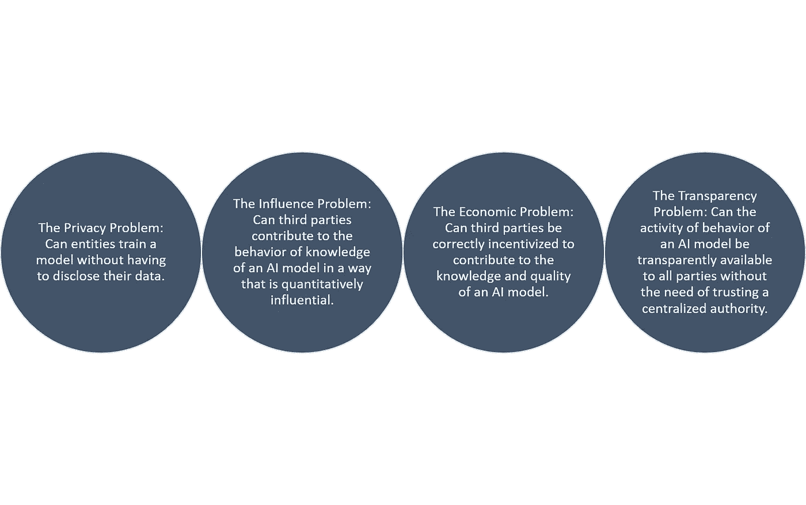

# 为什么去中心化的人工智能很重要第二部分:技术支持者

> 原文：<https://medium.datadriveninvestor.com/why-decentralized-ai-matters-part-ii-technological-enablers-a67e3115312e?source=collection_archive---------0----------------------->

这是一篇文章的第二部分，探讨了分散式人工智能(AI)作为未来十年基础技术趋势之一的价值主张。在前一部分中，我们讨论了一些分散式人工智能的经济基础。今天，我们将探索一些正在实现第一波去中心化人工智能平台的技术趋势。

尽管其价值主张有些明显，但通往分散式人工智能的道路受到非常困难的技术挑战的困扰，这使得它在现实世界的应用中完全不切实际。[在我们之前的文章](https://medium.com/datadriveninvestor/why-decentralized-ai-matters-part-i-economics-and-enablers-5576aeeb43d1)中，我们确定了分散式人工智能要成为现代人工智能应用中可行的架构需要解决的四个主要挑战:

从纯技术的角度来看，这些问题中有许多直到最近才被认为是无法解决的。在过去的几年里，密码学、数字货币和人工智能领域的新技术共同为分散式人工智能应用的实施提供了坚实的基础。

# 分散式人工智能使能器

## 隐私解决方案:同态加密

在数学上，同态被定义为“一个数学集合(如群、环或向量空间)到另一个集合或其自身的映射，其映射方式是通过对第一个集合的元素应用运算而获得的结果被映射到通过对第二个集合中它们各自的图像应用相应的运算而获得的结果上”。同态加密允许在密文上执行特定类型的计算，产生也是密文的加密结果。其结果是对明文执行操作的结果。例如，一个人可以将两个加密的数字相加，然后另一个人可以解密结果，而他们中的任何一个都无法找到这两个数字的值。

同态加密可以被认为是过去十年中密码学领域最大的突破之一。在分布式人工智能的背景下，同态加密使人工智能应用程序中的参与者能够以对其他方保持加密的方式将数据贡献给模型的训练。

## 经济解决方案:区块链

区块链提供了基本的运行时和协议来实现真正的分散式人工智能应用。第一代去中心化的人工智能应用程序正在利用智能合约或 DApps 等概念来模拟人工智能应用程序中不同端点之间的交互。

数字令牌也是分散式人工智能应用中的一个相关概念，因为它代表了对数据科学家对模型的贡献进行补偿的主要机制。数字令牌还提供了一个经济渠道，以一种有益于所有相关方的方式来引导和影响模型的行为。

## 影响解决方案:联合学习

联合学习是一种新的学习架构，用于在高度分布式拓扑结构中运行的人工智能系统，如移动或物联网(IOT)系统。最初由谷歌研究实验室提出，联合学习代表了集中式人工智能训练的一种替代方案，在集中式人工智能训练中，共享的全球模型在中央服务器的协调下进行训练，来自参与设备的联盟。在该模型中，不同的设备可以为模型的训练和知识做出贡献，同时将大部分数据保留在设备中。

不难想象为什么联合学习是分散式人工智能平台的基础。使用联合学习，人工智能应用程序中的多个参与者可以独立地训练或优化人工智能模型，而不必相互信任或信任中央权威。

我希望这个系列能让你保持兴趣。在下一部分，我们将讨论非集中式人工智能领域的一些新平台。

# DDI 推荐阅读:

*   人类不需要申请:人工智能时代的财富和工作指南
*   [*生活 3.0:成为人工智能时代的人类*](http://go.datadriveninvestor.com/daib04/mbmp000105) 马克斯·泰格马克著
*   [*Python 人工智能:为 Python 初学者和开发者构建智能应用的综合指南*](http://go.datadriveninvestor.com/daib09/mbmp000105) 作者 Prateek Joshi