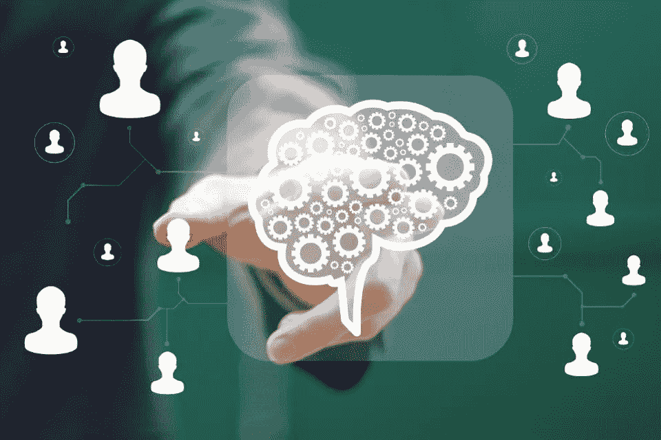

# 为什么分散式人工智能很重要第三部分:技术

> 原文：<https://medium.datadriveninvestor.com/why-decentralized-ai-matters-part-iii-technologies-930c3c9d10d?source=collection_archive---------1----------------------->

对于今天的技术星期五部分，我们将采取不同的方法。我们将讨论一组平台，而不是分析一个特定的产品或技术，作为我一直在写的关于分散式人工智能(AI)平台的系列的一部分。本文的第一部分和第二部分[探索了市场动态和技术促成因素，这些因素使得分散式人工智能技术的发展成为可能。今天，我想重点谈谈去中心化人工智能领域的一些主要平台，以及它们的一些价值主张。](https://medium.com/datadriveninvestor/why-decentralized-ai-matters-part-ii-technological-enablers-a67e3115312e)

 [## 挑战你对人工智能和社会的看法的 4 本书——数据驱动的投资者

### 深度学习、像人类一样思考的机器人、人工智能、神经网络——这些技术引发了…

go.datadriveninvestor.com](http://go.datadriveninvestor.com/4AI1) 

正如前一篇文章中所解释的，有几个技术运动，如同态加密，区块链技术和联合学习，结合起来实现了第一波分散式人工智能平台。因此，该领域的第一组技术将传统的人工智能功能与复杂的加密功能相结合。具体来说，分散式人工智能平台的最初发展侧重于实现分散式安全运行时，以自动化人工智能应用的生命周期。虽然分散式人工智能市场仍处于非常初期的状态，但我们已经可以看到许多平台有可能在该领域取得领先地位。

## [奇点网](https://singularitynet.io/)

可以说是去中心化人工智能领域最知名的项目，SingularityNET 是一个开源协议和智能合同的集合，用于协调人工智能服务的去中心化市场。从概念上讲，SingularityNET 充当了一个通用的、去中心化的市场，它提供了一个人工智能代理的投资组合，可以用来交换加密货币。

SingularityNet 平台通过基于区块链智能合约的接口扩展了人工智能代理，允许它们加入网络并与第三方应用程序或其他代理进行交互。SingularityNET 智能合约的初始版本基于以太坊的 Solidity 语言，但未来应该会支持其他智能合约环境。为了执行操作，智能合约交换作为主要经济单位的 AGI 令牌，以支付人工智能代理所执行的服务。

我最近发表了对奇点网络平台的分析。

## [露天开采](https://www.openmined.org/)

OpenMined 喜欢将自己标榜为一个去中心化的 AI 社区，而不是一个特定的平台。从这个角度来看，OpenMined 一直在实施一系列工具和框架，以实现去中心化的人工智能应用。

**声纳**——一个运行在区块链上的联合学习服务器，处理所有的战役请求，托管赏金。

**Capsule** —第三方 PGP 服务器，用于生成公钥和私钥，以确保声纳神经网络保持正确加密。

*   **Mine** —用户的个人数据仓库。这些是不断检查声纳新的神经网络作出贡献。上传到矿井的数据越多，它就越与声纳相关。
*   **Syft** —包含可以在加密状态下训练的神经网络的库(这样矿工就无法窃取他们下载来训练的神经网络)。

我最近发表了对 OpenMined 平台的分析。

## [海洋](https://oceanprotocol.com/)

Ocean 正试图成为分散式人工智能应用的通用协议。从概念上讲,《海洋议定书》是一个共享数据和相关服务的生态系统。它提供了一个令牌化的服务层，通过一组可用性和完整性的确定性证明来公开数据、存储、计算和算法以供使用，这些证明可用作可验证的服务协议。在架构上，海洋协议包括以下组件 **:**

**提供者:**这些参与者拥有人工智能数据或服务，他们以一种密码可证明的方式提供这些数据或服务。服务可能包括:数据本身、存储(集中式或分散式)、计算 10(集中式或分散式、隐私保护与否)等等。

**市场:**为了方便起见，数据/服务市场通常是提供商和消费者与海洋网络互动的方式。每个市场都应该促进诸如发现、可交易性或验证之类的特征

**数据共享接口:**与提供定价数据的数据市场并行的是数据共享接口，免费或共享数据。这些界面可能是网页、软件库等等。保管人。海洋网络本身由一组海洋守护者**节点组成。**

**守护者:**守护者负责集体维护网络。任何人都可以运行海洋守护者节点；这是未经许可的。参与是公开和匿名的。

## [效果。艾](https://effect.ai/)

效果。人工智能平台利用 NEO 区块链为人工智能应用程序提供一个分散的运行时。在高水平上，效果。人工智能包括以下组件:

Effect M-Turk: Effect M-Turk 是一个按需劳动力，允许世界上的任何人请求或执行教授和开发 AI 算法的任务。

效应智能市场(Effect Smart Market):效应智能市场是一个分散的交易所，人们可以在这里提供和购买 AI/ML 服务和算法。

Effect M-Power: Effect M-Power 可以将计算能力分配给使用 Caffe、MXNet 和 Tensorflow 等深度学习框架构建的 AI 模型。

## [DML](https://decentralizedml.com/)

分散式机器学习(DML)是分散式人工智能领域的一个新成员。新协议提供了区块链不可知的运行时，以在不同设备上运行机器学习模型，同时还分散了其他功能，如训练或数据共享。

## [算法 ia](https://blog.algorithmia.com/trustless-machine-learning-contracts-danku/)

Algorithmia 最近通过推出他们的 Danku 进入了分散式人工智能领域，这是一个新的基于区块链的协议，用于在诸如以太坊这样的公共区块链上评估和购买 ML 模型。DanKu 使任何人都能够获得高质量、客观测量的机器学习模型。

你可以在这里阅读我对 Algorithmia Danku [的分析。](https://towardsdatascience.com/a-decentralized-kaggle-inside-algorithmias-approach-to-blockchain-based-ai-competitions-8c6aec99e89b)