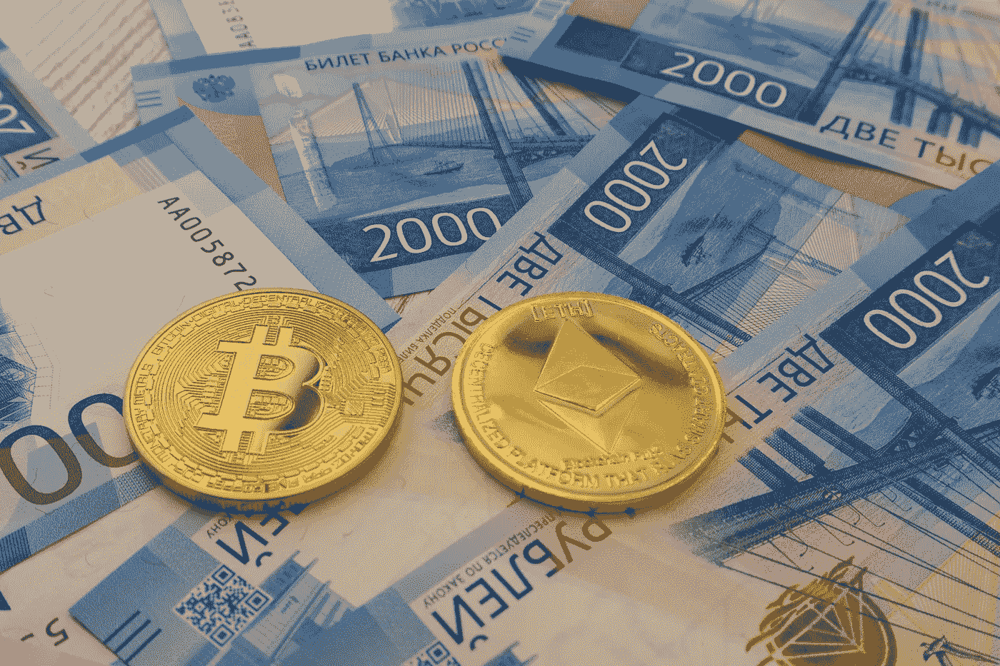

# 为什么银行比加密货币更关心区块链？

> 原文：<https://medium.datadriveninvestor.com/why-do-banks-care-more-about-blockchain-than-cryptocurrencies-9c43a27a0140?source=collection_archive---------5----------------------->

“我对比特币不感兴趣。我不知道我为什么要说这件事。区块链是一项好技术。我们实际上使用它。它将在许多不同的事情上有用。上帝保佑区块链。” —杰米·戴蒙，摩根大通首席执行官。

戴蒙[关于比特币的无数贬低性评论](https://www.cnbc.com/2017/10/13/jamie-dimon-says-people-who-buy-bitcoin-are-stupid.html)已经引起了世界领先加密货币支持者的极大愤怒。但是他说的一件事是绝对正确的——银行对比特币背后的技术*——区块链——比比特币本身更感兴趣。*

加密货币只是区块链支持的无数应用之一。加密世界目前获得了最多的关注，原因很简单，投资者从比特币、以太坊等产品中获得了极高的收益。

但实际情况是，区块链有一系列的特点，使得这项技术在提高银行业务流程的速度、效率、成本、透明度、安全性和验证方面非常有用。事实上，在这些优势开始被发现后不久，许多最大的银行迅速跟进，建立研究实验室来探索其潜在的破坏性。重要的是，银行通过采用这种技术继续期待巨大的变革和有益的可能性…

# 区块链在银行业的巨大而广泛的潜力

区块链为银行业解决的问题比比特币更多。以下是分布式账本技术最受银行期待的五种应用:

*   贸易融资——银行向商业客户提供信贷以保证货物交换的过程。这一过程非常陈旧，大部分是基于纸张的；例如，通过传真或邮件发送到世界各地的提单或信用证。区块链可以"[提高效率，降低成本基础，并开辟新的收入机会，如支持交易的信贷和融资担保的新模式](https://www2.deloitte.com/content/dam/Deloitte/global/Documents/grid/trade-finance-placemat.pdf)"
*   支付——跨境支付目前仍然缓慢、昂贵，并且明显缺乏透明度。著名的金融科技公司 R3 目前正在与世界上许多最大的银行组成的财团合作，以建立一个国际支付系统“[，这将允许现有的中央银行货币和任何新的数字货币通过区块链](https://www.reuters.com/article/us-banks-blockchain-r3/top-banks-and-r3-build-blockchain-based-payments-system-idUSKBN1D00ZB)进行交易。IBM 还在[设计新的区块链](http://www-03.ibm.com/press/us/en/pressrelease/53290.wss)，使银行能够加快跨境支付，预计到 2018 年初，该技术将处理南太平洋零售外汇走廊(包括澳大利亚、新西兰、斐济、萨摩亚和汤加)60%的外币交易。早在 2015 年，[桑坦德银行(Santander)与 Oliver Wyman 和 Anthemis Group](https://www.finextra.com/finextra-downloads/newsdocs/the%20fintech%202%200%20paper.pdf) 合作发表的一篇著名论文预测，到 2022 年，分布式总账技术可以将银行因跨境支付、证券交易和监管合规性而产生的基础设施成本每年减少 150-200 亿美元。
*   清算和结算——埃森哲[估计](https://www.accenture.com/t20170120T074124Z__w__/us-en/_acnmedia/Accenture/Conversion-Assets/DotCom/Documents/Global/PDF/Consulting/Accenture-Banking-on-Blockchain.pdf#zoom=50)世界上最大的投资银行可以通过使用区块链技术来提高清算和结算过程的效率，从而节省 100 亿美元。例如，澳大利亚证券交易所与著名的区块链初创企业 Digital Asset Holdings 合作，并购买了该公司 5%的股权，以开发一种新的区块链交易清算和结算解决方案。这项技术有望简化和加快交易后的处理。
*   监管和合规——值得记住的是，自 2007 年至 2009 年金融危机以来，银行一直处于一种风险管理和/或厌恶监管的环境中。对银行鲁莽行为的强烈反对、低利率、严格的监管、政府控制和消费者信任度低，这些因素结合在一起，使得银行将重点从优先赚钱转移到确保客户和纳税人得到保护。区块链现在在 RegTech 革命中发挥着重要作用。正如国际金融研究所承认的那样，“区块链的设计是透明的，它可以成为一种机制，让监管者直接、即时、全面地了解金融机构的信息。由于所有交易都记录在分布式分类账中，因此监管机构可以有一个全面、安全、精确、不可逆和永久的财务审计跟踪。报告可以由监管者参与适当许可的与交易相关的分布式分类账来代替”。
*   银团贷款——在美国，银行结算通过银团贷款筹集的资金平均需要 19 天。许多交流也是基于传真/纸张的。包括法国巴黎银行、汇丰银行、荷兰国际集团、BNY 梅隆银行和道富银行在内的七家银行正在[联合开发一个由区块链驱动的银团贷款市场。](https://www.gtreview.com/news/fintech/seven-global-banks-bring-blockchain-to-syndicated-lending/)

还有更多的用途，包括[身份/KYC 改进](https://medium.com/marino-software/blockchain-and-identity-revolutionising-kyc-for-financial-institutions-96f4bd8e508f)、[使用智能合约技术数字化公司债券](https://www.fnlondon.com/articles/deutsche-bank-reveals-blockchain-corporate-bond-successful-20151204)，以及[欺诈预防。](https://www.ibm.com/blogs/blockchain/2017/07/blockchain-for-fraud-prevention-industry-use-cases/)

还有[竞争](https://www.pwc.com/us/en/financial-services/research-institute/fintech.html)的问题。不管银行喜不喜欢，金融科技初创企业正在提供基于区块链的服务(例如汇款和支付)，与银行业以前提供的服务相比，这些服务更具成本效益、更快、更简单、更容易获得。银行不得不创新并提供类似的服务，仅仅是为了确保它们不会失去客户，并能保持市场份额。

# 银行对比特币的问题

尽管不到十年，比特币短暂的历史已经充满了重大争议:

*   据报道，4.6 亿美元被黑客窃取后，世界上最大的比特币交易所破产。
*   比特币交易的匿名性意味着跨境交易业务不可避免地会吸引非法活动，包括毒品交易、洗钱甚至恐怖主义融资。此类活动导致[在 2014 年关闭了臭名昭著的网上黑市场所丝绸之路](https://www.theguardian.com/technology/2015/may/31/silk-road-sentencing-darknet-drugs)。目前，银行正在尽最大努力*提高*他们的反洗钱资质——暴露于比特币无助于这一事业。
*   虽然区块链本身是不变的，但托管加密交易的交易所并不是分散的。这导致了无数的交易所被黑客攻击，数百万美元的比特币和其他数字货币被盗的事件；比如 [Bithumb](https://bravenewcoin.com/news/fourth-largest-bitcoin-exchange-bithumb-hacked-for-billions-of-won) 。显然，交易所如此糟糕的安全性对银行来说是不允许的。
*   波动性——今年早些时候，比特币突破了 10，000 美元，这意味着它去年飙升了难以置信的 850%。这是 20 世纪 90 年代末网络股最疯狂时期的 4 倍多。比特币是泡沫吗？最终会崩溃吗？很难说，但在这个问题上缺乏任何明确的确定性，在这个后危机时期，银行显然过于谨慎了。

应该提到的是，银行对使用加密货币的想法并没有完全死心。相反，Ripple 尤其吸引了桑坦德银行、意大利联合信贷银行、瑞士联合银行和渣打银行等知名银行的兴趣。这家总部位于旧金山的公司旨在成为一个“快速杀手”，创建一个单一的全球结算网络，在几秒钟内将任何货币转移给世界上任何人。因此，通过为其他货币提供网络，Ripple 不仅仅是像比特币一样的另一种加密货币。

更重要的是，[闪电般的结算速度](https://ripple.com/xrp/)(不到 4 秒)，可扩展性(可以处理“每秒 1500 笔交易，24×7，可以扩展到与 Visa 相同的吞吐量”)和相对稳定的价格也让 Ripple 吸引了银行的兴趣，而它们在很大程度上继续忽视比特币。

这并不是说银行完全反对比特币；事实上，高盛(Goldman Sachs)正在权衡建立新的比特币交易业务的可能性——这一举措将标志着华尔街首次大举进军加密货币市场。但与此同时，该银行[强调黄金等传统资产类别](https://www.cnbc.com/2017/10/19/bitcoin-is-not-the-new-gold-goldman-sachs-says.html)的重要性，暗示任何进入比特币交易世界的举措都将是试探性的。

随着比特币[期货](http://www.cmegroup.com/media-room/press-releases/2017/10/31/cme_group_announceslaunchofbitcoinfutures.html) / [期权](https://www.coindesk.com/first-long-term-ledgerx-bitcoin-option-pegs-price-10000-one-year/)市场的逐步发展，如果银行相信随着衍生工具变得越来越容易获得，它们可以有效地管理/对冲价格风险，它们可能会对比特币更感兴趣。

*原载于 2018 年 6 月 29 日*[*www.datadriveninvestor.com*](http://www.datadriveninvestor.com/2018/06/29/why-do-banks-care-more-about-blockchain-than-cryptocurrencies/)*。*