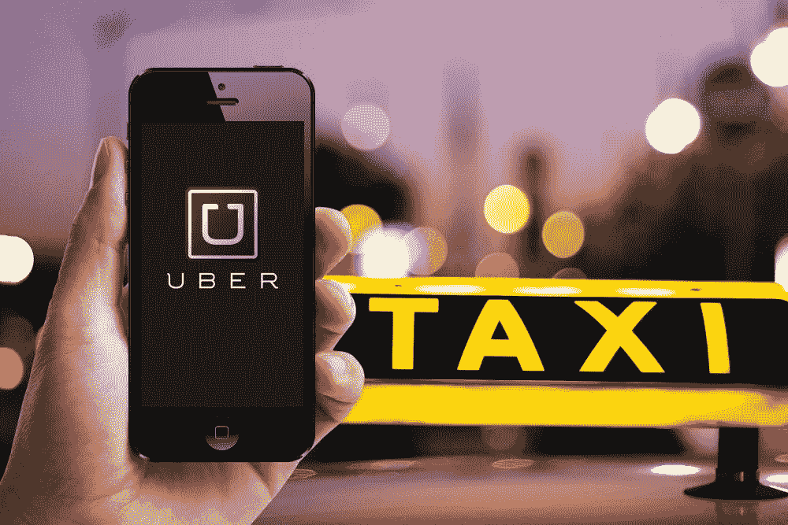
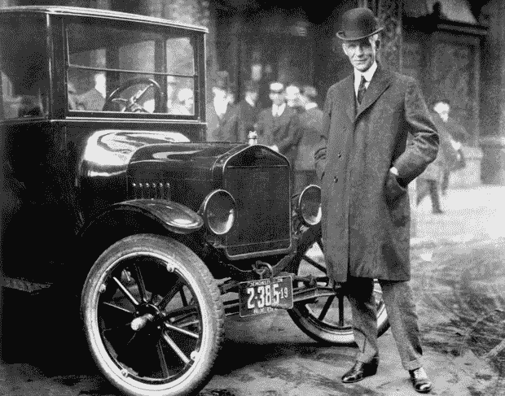
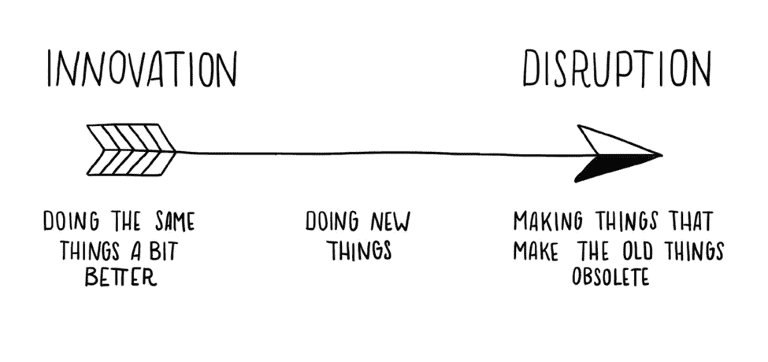
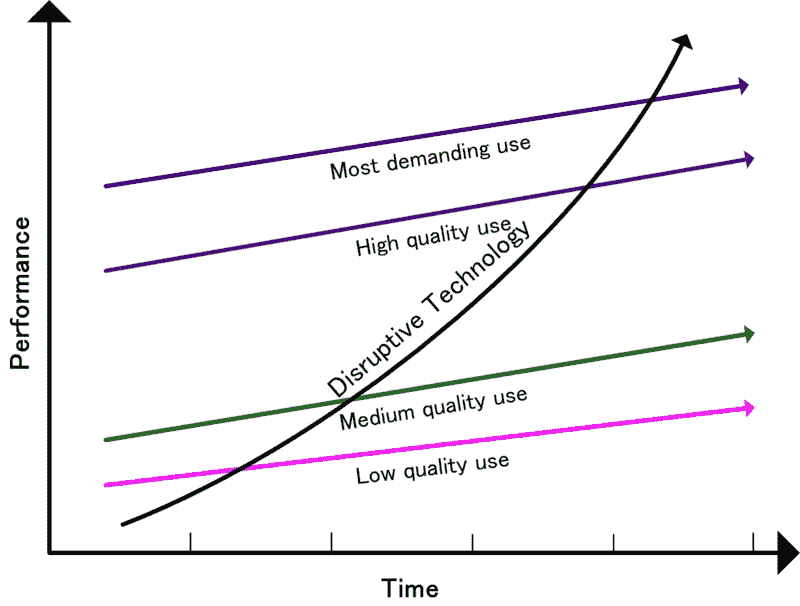
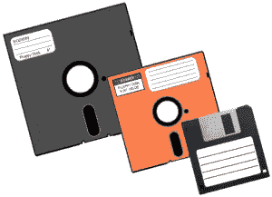
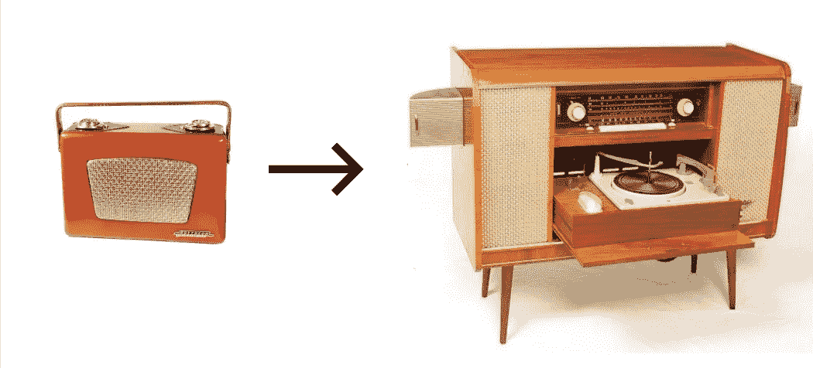

# 大公司为什么会失败？颠覆性创新的故事。

> 原文：<https://medium.datadriveninvestor.com/why-do-big-companies-fail-the-tale-of-disruptive-innovation-74ba76cfd70d?source=collection_archive---------1----------------------->

> “如果我问人们想要什么，他们会说是更快的马。”—亨利·福特，福特汽车公司的创始人

当现有的企业忙于寻找更快的马匹来满足人们日益增长的运输需求时，亨利·福特尝试了一种不同的方法。当他的汽车设计最终取得成功时，福特 T 系列彻底颠覆了整个骑马行业。这被称为颠覆性创新。

破坏性创新并不是一个新概念，它在我们的生态系统中已经存在了很长时间。颠覆性创新的几个常见例子是，当民主取代了君主制，互联网取代了传统的赚钱模式，以在线替代方式赚钱，或者当电子邮件取代了邮件和电报。

# 两种创新:

哈佛大学教授克莱顿·克里斯滕森(Clayton Christensen)在《创新者的困境》(最初出版于 1997 年)一书中描述了商业世界中有两种创新——持续创新和破坏性创新。

这本书对创新者如何看待创新和技术产生了深远的影响。在他的书中，作者还讨论了为什么大公司会在技术变革的[条件下失败。然而，为了理解这一点，让我们首先讨论什么是持续和破坏性创新。](https://www.tradebrains.in/what-is-an-economic-moat-worth-investigating/)

# 1.**持续创新**

持续创新是一个渐进的创新过程，目的是在可预测的时间框架内改善运营。这种创新通常遵循公司融入商业的方式。

持续创新者只关注主流客户的需求。如果客户想要更好的产品，他们会不断改进产品。

# 2.破坏性创新

[颠覆性创新是指其应用能够显著影响市场或行业功能的新创新。他们创造了一个新的市场和价值体系，最终颠覆了现有市场，取代了市场领先的公司、产品等。](https://www.kritesh-abhishek.com/blog/tale-of-disruptive-innovation)

然而，一开始，颠覆是不受欢迎的。以下是颠覆性创新的几个特征:

*   与增量持续创新相比，这类创新有很高的失败风险。
*   与主流市场历来的需求相比，它们最初提供的性能较低。
*   然而，一旦发展，这些创新实现更快的渗透和建立更高程度的影响已建立的市场。
*   当前客户不重视的其他性能属性(更小、更快、更简单、便携等)使其在新的价值网络中繁荣发展。
*   随着创新沿着传统的性能参数改进，它们最终会取代以前的技术。

# 大公司为什么会失败？

> "当公司不断听取现有客户的意见时，他们会被误导."

大公司的问题在于，它们的商业环境不允许它们在最初兴起时追求颠覆性创新，因为它们最初不盈利。

大多数大公司不喜欢颠覆性创新，因为这些创新不能满足他们当前的客户。他们只关注主流客户的需求。如果客户想要更好的产品，他们会不断改进产品。

此外，这些内部破坏性创新会消耗掉持续创新的大量资源，而持续创新是与当前竞争对手竞争所必需的。因此，这些公司被他们最有利可图的客户“俘虏”,限制他们追求破坏。

# 让我们借助一个例子来理解这一点。

曾几何时，磁盘驱动器是一个价值数十亿美元的产业。

磁盘根据人们的需求不断改进其存储和性能。他们设法从一代磁盘驱动器持续过渡到另一代(14 英寸硬盘驱动器→ 8 英寸软盘驱动器→ 5.25 英寸软盘驱动器→ 3.5 英寸软盘驱动器)，以便人们可以获得更好的磁盘驱动器。

但是，这些磁盘驱动器在任何特定时间都无法完全满足需求，因为客户总是要求更好的存储容量。

现在，当新一代驱动器(CD 和 USB 闪存驱动器)首次出现时，它们在客户需求方面提供了最差的性能。然而，随着时间的推移，它们提高了性能，为人们提供了传统磁盘驱动器(软盘)无法满足的巨大存储容量。

这里出了什么问题？

尽管这些公司不断创新以改进他们的产品。但是他们中的大多数破产了，因为他们一直在倾听顾客的声音，并满足他们的需求。

新一代的驱动力出现在一个新的价值网络中。最终，他们的产品在性能和存储容量方面变得“足够好”，后来取代了前代产品。

> “克莱顿·克里斯滕森在他的书中认为，企业必须考虑他们的创新是否满足了企业当前的客户群？”

# 颠覆性创新的几个最佳例子:

大多数颠覆性的创新在第一次出现时并不受到市场的欢迎。

例如，当晶体管收音机首次投放市场时，与大型模拟传统收音机相比，它们的音质很差。

然而，事实上，他们是便携式和消耗更少的电池，打开了新的价值市场的大门。它在大学生和需要便携式设备在工作时或在海滩上听音乐的上班族中变得流行起来。随着音质的提高，它最终取代了传统的大型家具收音机。

以下是近期颠覆性事件的几个例子:

(**颠覆性创新** →被创新颠覆的市场)

*   **维基百科** →传统百科全书
*   **Ipad** →便携式电脑
*   **谷歌地图** →导航系统&纸质地图
*   **Skype** →电信系统
*   **网飞** → CD/DVD 租赁
*   **亚马逊→** 图书销售商店/连锁店。
*   **优步/奥拉** →出租车，拼车

# 可能改变世界的潜在颠覆性创新:

总有人在某个地方试图扰乱当前的市场体系。

一些正在进行的潜在颠覆性创新可能会改变明天的世界，包括机器人、自动驾驶汽车、物联网、人工智能、太空殖民、3D 打印、高速旅行、区块链技术、高级虚拟现实、加密货币等。

# 结果

破坏性创新是一个资源较少的小公司能够成功挑战大企业的过程。当这些大公司没有对这种新的市场混乱做出反应时，它们中的大多数都会“失败”。

然而，并非所有的干扰对大公司来说都是危险的。一些颠覆性创新成功了。大部分没有！！

> [**本文原贴于此。**](https://www.kritesh-abhishek.com/blog/tale-of-disruptive-innovation)

# 顺便说一下，👏🏻*鼓掌*👏🏻如果你喜欢这篇文章，请举手。它鼓励我继续写作，并帮助其他人找到它:)

***保重。继续努力。***