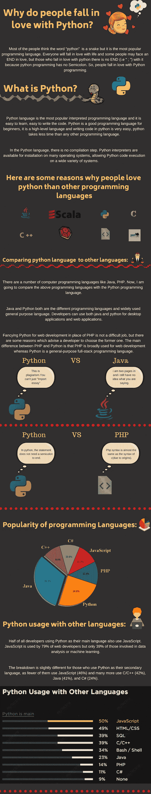
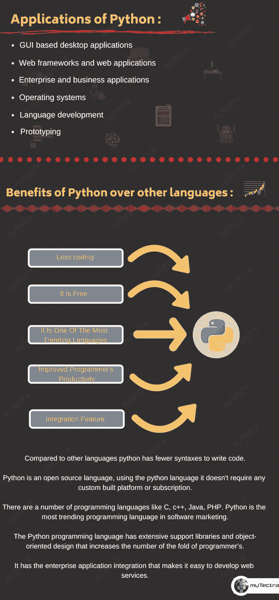

# 人们为什么会爱上 Python？

> 原文：<https://medium.datadriveninvestor.com/why-do-people-fall-in-love-with-python-4beadc1d1b21?source=collection_archive---------8----------------------->

大多数人认为“python”这个词是一条蛇，但它是最流行的编程语言。每个人都会爱上生活，有些人可能会面临爱情的终结，但对于那些爱上 python 的人来说，没有终结)因为 python 编程没有分号。所以，人们爱上了 Python 编程。

**少编码:**

与其他语言相比，python 编写代码的语法更少。用 python 编写的语法非常简单易用，这使得它更加用户友好。有些逻辑在另一种语言中需要 7 行代码，但在 python 中只需要 3 行代码就可以完成，这样效率更高。

 [## 2019 年最值得学习的编码语言|数据驱动的投资者

### 在我读大学的那几年，我跳过了很多次夜游去学习 Java，希望有一天它能帮助我在…

www.datadriveninvestor.com](https://www.datadriveninvestor.com/2019/02/21/best-coding-languages-to-learn-in-2019/) 

**免费:**

Python 是一种开源语言，使用 python 语言不需要任何定制平台或订阅。因此，任何台式机和笔记本电脑都兼容 [Python。](https://www.mytectra.com/python-training-in-bangalore.html)在 python 中，模块和库能够进行编码。

它是最流行的语言之一:

有几种编程语言，如 C，c++，Java，PHP。Python 是软件营销中最流行的编程语言。我们可以使用 python 语言进行商业开发，这对编程有更大的影响。

**提高程序员的生产力:**

Python 编程语言具有广泛的支持库和面向对象的设计，在使用 Java、Perl、c、c++等语言时，提高了程序员的生产力。

**集成特性:**

它具有企业应用程序集成，使得开发 web 服务变得容易。它有强大的控制能力，因为它直接通过 c，c++，java 调用。Python 还处理 XML 和不同的标记语言，因为它可以通过相同的代码在所有现代操作系统上运行。

*原载于*[*https://www.mytectra.com*](https://www.mytectra.com/blog/Why-do-people-fall-in-love-with-Python/)*。*