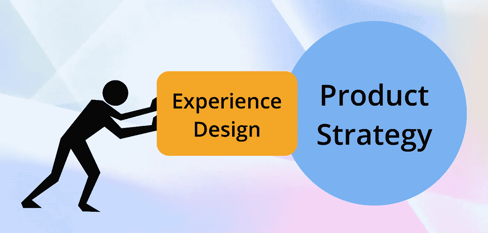

# 为什么我们每个产品策略都需要体验设计？

> 原文：<https://medium.datadriveninvestor.com/why-do-we-need-experience-design-in-every-product-strategy-10088b2114b1?source=collection_archive---------8----------------------->

这是星期五晚上…在忙碌了一周的工作之后，和家人在一家漂亮的餐厅享用一顿美味的晚餐听起来绝对棒极了。你选择餐馆是基于以下一个或多个因素:美食、预算、友好的员工以及餐馆的拥挤程度。现在想象一下，你已经预订了一家餐馆，这家餐馆的食物很好，价格不贵，顾客服务很好，让你感到愉快和满足。那将是多么美妙的经历啊！这会让你再次回到餐厅吗？是的。你会向你的朋友推荐这家餐馆吗？是的。你会记得这是一次愉快的经历，一次在你的记忆中储存很长时间的经历吗？是的，当然！除了产品或服务的特点，人们还记得他们的体验。[经验影响记忆，记忆引导行动](http://www.foolproof.co.uk/thinking/what-is-experience-design/)。

**什么是体验设计？**

[体验设计](https://medium.com/digital-experience-design/mindsets-tools-and-terminology-of-experience-design-7c25befd439e)是一种让人们与复杂系统的交互更加愉快的方法论，其中复杂系统是指银行、医院、打车应用、公共交通系统、保险公司、大学等等。[体验设计是一种视角](https://uxmag.com/articles/experience-design-is-a-perspective-not-a-discipline)，不是一门学科。毕竟，体验是一种主观现象，是由用户的视角和个人环境在任何给定的时间点定义的。花 50 美元搭车去附近的购物中心是令人难以容忍的，但在半夜花 100 美元搭车去急诊室也不算太糟糕。

*   [体验设计](https://www.wired.com/insights/2014/03/experience-design-innovation-isnt-enough/)不是一份清单、一份菜谱，或者一系列的机动动作；这是一种思维方式。它使用品牌作为识别差异化价值和体验的指南针。
*   体验设计并不能取代创新。它补充了这些努力。
*   体验设计不会取代品牌战略，但会超越定义品牌的传统方法。
*   体验设计为对产品有不同需求和期望的用户提供不同的用例。

**体验设计:产品战略的重要组成部分**

当今世界竞争如此激烈。对于每种类型的产品，都有几十个不同公司开发的应用程序。然而，我们只喜欢几十个应用程序中的一两个。为什么？因为我们获得的用户体验。如果你对某个应用有不好的体验，你还会再次使用它吗？因此，打造优秀产品的关键是创造愉悦的用户体验。这就是体验设计的用武之地。体验设计确保用户遇到的长期产品接触点在最坏的情况下，仅仅是愉快的，在最好的情况下，是完全愉快的。它考虑了产品、服务和解决方案如何在[随时间推移交付价值](https://www.wired.com/insights/2014/03/experience-design-innovation-isnt-enough/)中发挥作用，以及即使在创新或产品设计流程的早期阶段也必须考虑这一点。它将客户旅程的所有阶段都视为提供价值和进一步吸引客户的机会。它还将时间的概念带到了桌面上，作为探索选项、创新、含义和相互依赖性的一种方式。举个例子，一个洗衣服务应用程序，体验应该是几乎看不见的，并期望最少的用户交互。另一方面，如果它是一个游戏应用程序，用户将需要一个完全参与的体验。

《体验设计:整合品牌、体验和价值的框架》(Experience Design:A Framework for Integrating Brand，Experience and Value)的合著者帕特里克·纽伯瑞(Patrick Newbery)提出了这个问题: [*如果情感是体验*](https://uxmag.com/articles/experience-design-is-a-perspective-not-a-discipline) *的关键组成部分，你怎么能称之为体验设计，而不是针对并激活人们的情感反应呢？这是非常重要的，所有的设计都需要考虑这一点，但是选择哪种情绪为目标，以及如何最好地做到这一点，会随着时间和需求类型的变化而变化。像往常一样，有一天我开着一辆优步去上班，但那一天我感觉自己就像一位参加舞会的公主。坐在一辆很棒的车里，司机穿得无可挑剔，让我想起了一个豪华轿车司机，他的车储备充足，还放着可爱的古典音乐。他很有礼貌，并接受了我没完没了的问题。我发现他确实在退休后的几年里是一名豪华轿车司机，并决定坚持他在这个行业所学的东西。乘坐体验太棒了，我不再对优步的应用程序生气了，它花了我 15 分钟才连接到一个乘坐装置。在同一个司机第三次或第四次接我之后，我逐渐习惯了这种体验，并不像第一次那样有吸引力，尽管我知道乘坐体验会很舒适和安全。现在我需要一些新的东西来获得愉快的用户体验。*

今天和未来，用户体验将是价值的最终驱动力。随着不断创新和创造卓越用户体验的需求，体验设计将在所有行业的产品战略中发挥重要作用。你目前的产品策略是否实施体验设计？

**免责声明:本文表达的观点和意见仅代表我个人，不代表任何其他人或公司。所有内容都受版权保护。*