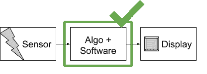
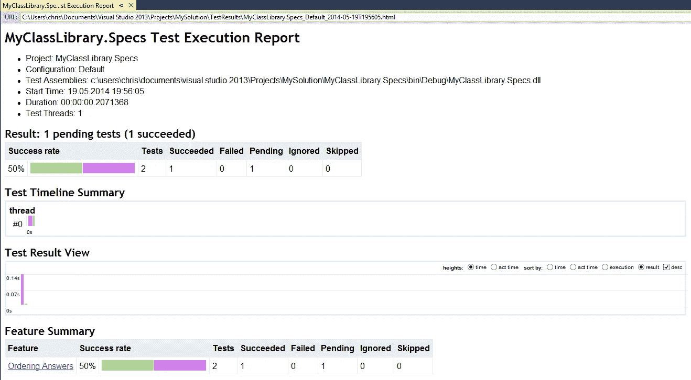
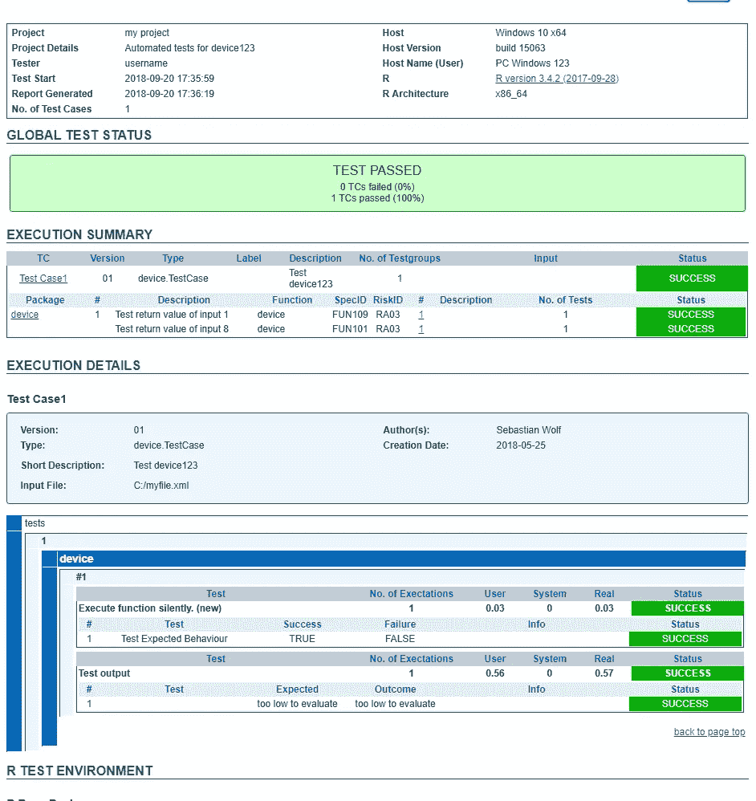

# 为什么我们需要对编程语言进行人类可读的测试？

> 原文：<https://medium.datadriveninvestor.com/why-do-we-need-human-readable-tests-for-a-programming-language-1786d552f450?source=collection_archive---------8----------------------->

## 软件可以拯救生命！— R 和 Python 编程语言在今天的[十大编程语言](https://stackify.com/popular-programming-languages-2018/)中名列前茅。这两种语言都来自开源和研究环境，现在正在进入行业。测试软件在工业中非常重要。为什么要谈论人类可读测试？

让我给你介绍一下我的工作环境。我每天都在用 *R.* 编写代码，从这些代码中我们构建出每天都在项目中应用的软件。许多人都同意软件应该被测试的事实。甚至深入测试，直到达到 100%的代码覆盖率。好吧，如果你不同意，你现在可以停止阅读。

此外，我的工作直接影响人们的生活。不仅仅是他们的生命，还有他们是否还活着。我在临床环境下写代码。因此，我的软件中一个未经测试的功能可能意味着我的软件产生了一个结果，即你的医生解释错误，这可能会给你带来痛苦，因为他做出了错误的治疗决定。到目前为止一切顺利，同样的事情也发生在一个为你的汽车方向盘编写微控制器软件的人身上。如果你因为不想撞上墙而转向左边，你也不想你的车转向右边，让你一蹶不振。这样的软件也应该进行深度测试。

# 临床环境和监管机构

现在，软件在临床环境中的特殊之处在于，无论是医疗设备还是药物本身，甚至是生产药物的过程，都必须经过检查。这一检查过程由政府指导。如果你正在服用药物或你的血液被医疗设备分析，你希望当局确保它挽救你的生命或至少使你更健康。如果你来自美国，这个权威机构叫做 [FDA](http://www.fda.org) 会为你做到这一点。如果你住在欧洲，找出我们 26 个不同机构中的哪一个对你负责，在德国是[TV](https://www.tuev-sued.de/plants-buildings-technical-facilities/fields-of-engineering/cleanroom-technology/pharma-life-sciences)，在法国是 [ANSM](https://ansm.sante.fr/) 。

让我们来关注一下，我会稍微限制一下这些权限的范围。我想讲一个临床应用的经典例子，比如尿检试纸。每个人都见过这样的事情。他们可以检测你尿液中的糖分。如果你的尿液中有糖分，你应该检查是否有糖尿病。因此，权威机构必须确保围绕测试条的整个过程改善了你的诊断。权威机构确保试纸可以告诉你是否需要进一步分析糖尿病。如果你有糖尿病，试纸至少会给出一个提示。

让我们把范围缩小一点。为了在试纸浸入你的尿液后对其进行评估，医生将试纸插入试纸阅读器。读者以数字的形式给出你的测试结果。它是怎么做到的？有一个软件评估传感器的测量值，并根据特定的算法将测试结果打印到显示器上。现在，监管机构必须有能力检查:

1.  算法是对的。
2.  该算法实现正确。
3.  软件从正确的传感器获取正确的输入。
4.  设备的显示得到软件的正确结果。

步骤 1 基本上需要软件和算法的良好文档。这是一个不同的话题。步骤 2-4 可以通过软件测试来完成，最好是自动化测试。让我们假设传感器和显示器工作正常，并且已经过测试。

# 测试案例

我刚刚制作的装置现在应该被测试。它由一个传感器和一个显示器组成，中间是一个运行软件的芯片。



我们现在必须有一组来自传感器的数字，这些数字将显示在设备屏幕上:

```
Sensor Value    Display Value
3               12
5               15
5.5             15
8               24
1               *too low to evaluate*
3               12
2.9             12
24.2            *too high to evaluate*
```

这个算法你可能不太清楚。但猜有详细的描述可用:

> *device123* 的算法应将小于 2 的值评估为“太低而无法评估”，将小于 5 的值评估为“12”，将小于 7 的值评估为“15”，将小于 15 的值评估为“24”，将大于 15 的值评估为“太高而无法评估”。

监管机构的任务不是测试算法，如果他们批准*装置 123。*其工作是检查设备制造商是否检查了算法及其软件实现。因此，必须存在以下两种情况:

1.  测试案例
2.  一份测试报告，说明测试用例是如何被评估的

编程语言 *R* 中的测试用例可以用 [*Runit*](https://cran.rstudio.com/web/packages/RUnit/index.html) 或者 [*testthat*](https://cran.r-project.org/web/packages/testthat/index.html) 的包编写。两者都允许开发人员和测试人员检查软件。上面代码框中显示的测试用例在[*test that*](https://cran.r-project.org/web/packages/testthat/index.html)*中可能是这样的，例如*

```
*[test_that](http://testthat.r-lib.org/reference/test_that.html)("1 is interpreted correctly", {
  [expect_e](http://testthat.r-lib.org/reference/expect_success.html)qual(device123(sensor=1),"*too low to evaluate*")
})[test_that](http://testthat.r-lib.org/reference/test_that.html)("8 is evaluated correctly", {
  [expect_e](http://testthat.r-lib.org/reference/expect_success.html)qual(device123(sensor=8),24)
})...*
```

*现在对于每天阅读 *R* 代码的人来说，这似乎很棒。[*test*](https://cran.r-project.org/web/packages/testthat/index.html)*包会告诉你你的函数 device123 在被 1 或 8 调用时是否给出了准确的值。唯一的问题是，test _ 没有告诉你测试是否成功，你的期望值是多少，输入是多少。这个小工具会告诉你运行了多少测试，哪些测试失败了。参见 Hadley Wickham 的博客:**

```
**Expectation : ...........
rv : ...
Variance : .72....**
```

**每行代表一个测试文件。每个`.`代表一个通过的测试。每个数字代表一次失败的测试。这些数字编入故障列表，提供了更多详细信息:**

```
**1\. Failure(@test-device123.R#5): 8 is interpreted correcty -----
device123(8) not equal to 24
Mean relative difference: 3**
```

**现在它假设所有的测试都运行了，您可以检查这些测试是否成功。但是结果只是命令行的东西，对于习惯于使用的人来说是可读的**

**我愿意以一个病人的身份回到你身边。你向监管机构纳税。你希望监管机构的人知道或者从中得出什么神秘的东西吗？你真的希望走进你的医生的办公室，看到他的设备上有一个“证明”标志，表明权威机构有人研究了这个设备的代码吗？**

****

**Icons from [dDara](https://www.flaticon.com/authors/ddara), [monkik](https://www.flaticon.com/authors/monkik), [prosymbols](https://www.flaticon.com/authors/prosymbols)**

**我的答案是**没有**。我希望监管机构关注该设备给医生带来的价值，也许关注试纸的化学性质，但软件应该是能够工作并完成所述工作的东西。如果有文件证明，则应遵循其文件。现在测试用例的责任在编写软件的公司一方。这家公司必须向权威机构证明软件已经过测试。当局只需要确定，这个过程是有效的。**

# **我们如何允许监管机构理解测试用例？**

**现在我们知道自动化软件测试允许检查*设备 123* 是否实现了正确的算法。我们遇到的主要问题是读取代码，测试代码并检查测试是否有效。用代码测试代码看起来不是正确的选择。对于一个公司来说，很难告诉权威，看我们用代码测试代码。我们有一堆神秘的命令行输出，你可以阅读证明。**

**不，你想要好东西。**

**以防你是一个*。有一个非常简单的解决方案。它叫做 [*specflow*](https://specflow.org/getting-started/) *。*它生成了非常容易理解的人类可读测试用例:***

```
*Feature: Device123\. We prepare a device that can use our algorithm to get a screen value out of a sensor value.Scenario: Check number 1   
Given the sensor measures *1* in the device
Then the result should be "*too low to evaluate*" on the screenScenario: Check number 8
Given the sensor measures 8 in the device
Then the result should be *24* on the screen*
```

*这些测试的结果在漂亮的报告中给出:*

**

*Image taken from: [https://specflow.org/getting-started/](https://specflow.org/getting-started/)*

*但我不是*。NET* 开发者并利用 *specflow* 在 *R* 或 *Python* 中编写测试代码是相当困难的。*

# *R 语言中人类可读测试的解决方案*

*2005 年，我们的团队想出了一个人类可读测试的解决方案，叫做[](https://cran.r-project.org/web/packages/RTest/index.html)*。这是一个 R 包，允许使用 XML 文件来测试其他 R 包，并以文档的形式给出报告。我们知道 XML 不如伪语言好，但是作为开始，我认为这是一个很好的开始。示例中的 XML 文件如下所示:**

```
**<device.TestCase>
<ID>Test Case1</ID>
<synopsis>
    <author>Sebastian Wolf</author>
    <date>2018-05-25</date>
    <desc>Test device123</desc>
</synopsis>
<tests>
    <device test-desc="Test return value of input 1">
     <params><sensor value="1" type="numeric"/></params>
     <reference>
      <variable value="*too low to evaluate*" type="character"/>
     </reference>
    </device>
    <device test-desc="Test return value of input 8">
     <params><sensor value="8" type="numeric"/></params>
     <reference>
      <variable value="24" type="numeric"/>
     </reference>
    </device>
</tests>
</device.TestCase>**
```

**这种设置不仅允许定义数字函数来测试器件内部的算法，还允许记录一些基本的环境信息，比如谁真正编写了这个测试，以及他何时开始编写这个测试。这些信息当然应该由源代码管理人员和合作开发人员进行验证。**

**使用 *RTest* 的结果看起来与此类似:**

****

**RTest report for a simple test case**

**测试报告不仅显示了每个测试是如何执行的，还显示了执行时间(如果成功的话)、参考值和结果。从[算法描述](#87af)中知道软件应该做什么的人现在可以通过阅读测试案例和测试报告，看看测试了什么，也看看这是否有意义。对于项目新手来说，也更容易了解项目。阅读测试案例和报告结果允许他们在一分钟内看到项目的哪些部分仍然有问题，或者哪些功能还没有被测试。**

# **摘要**

**理解软件是如何被验证的现在不再需要一个*程序员了。这里展示的环境允许人们看到软件是如何被测试的。我认为人类可读的测试将使统计软件更加防失败，更容易理解和更复杂。随着 *R 的*走出研究环境进入临床环境甚至汽车工业已经发生，这个过程还没有结束。要让监管机构信任这样一个大型开源项目，还需要更多的工具。人类可读的测试用例是帮助公司支持其开源解决方案有效性的第一步。使用 *R* 和一个好的测试框架将使人们的生活更加安全，因为你将不仅拥有伟大的统计工具，而且拥有伟大的**验证过的**统计工具。***

> *本文表达的观点和意见仅代表作者个人，不代表其雇主或任何其他人的观点。*