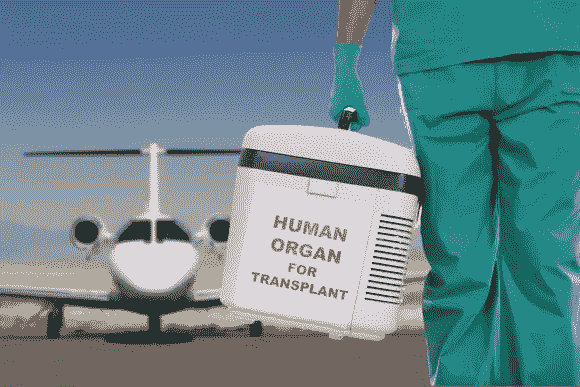

# 为什么我们会扔掉那么多捐献的肾脏？

> 原文：<https://medium.datadriveninvestor.com/why-do-we-throw-out-so-many-donated-kidneys-705e98f280f3?source=collection_archive---------12----------------------->

## 优步和联邦快递可以解决这个问题

你知道吗，有 93，000 名美国人在等待捐赠的肾脏，但每年有超过 3，500 个捐赠的肾脏被丢弃？

这是发表在《美国医学会杂志内科学》上的一项研究和美国有线电视新闻网(CNN)的一篇文章的结果。

 [## 医疗保健的未来正在被一场大型技术入侵所塑造|数据驱动型投资者

### 过去十年，全球经济的所有部门都经历了大规模的数字颠覆，而卫生部门现在…

www.datadriveninvestor.com](https://www.datadriveninvestor.com/2018/11/02/the-future-of-healthcare-is-being-shaped-by-a-big-tech-invasion/) 

20%的捐赠肾脏被丢弃。

这是我们医疗系统的失败。一个关键的罪魁祸首是我们的监管系统，它扔掉的肾脏是其他国家的两倍，比如法国。根据[国家肾脏基金会](https://www.kidney.org/)的数据，2016 年的一项研究发现，50%被丢弃的肾脏可以被移植。

但这也是我们供应链创新者的机会。有人能想出一个医疗保健逆向物流解决方案吗？这似乎是我们在 [UPS](http://www.ups.com) 、 [FedEx](http://www.fedex.com) 、 [DHL](http://www.dhl.com) 、 [XPO](http://www.xpo.com) 和其他地方的快递员、加急物流、医疗物流和逆向物流思想领袖应该能够解决的问题。

解决方案会是什么样的？

一个想法是创建一个地理地图，类似于物流公司使用的地图。你可以从覆盖在捐赠者地图上的病人地图开始。此外，你还可以创建一个专门运送人体器官和其他高价值货物的快递网络。

事实上，这类似于优步和 Lyft 这样的公司所做的事情。

因此，你可以将从捐赠到器官移植的时间缩短 90%。

这难道不是利用我们复杂的物流和技术推进我们社会目标的理想方式吗？