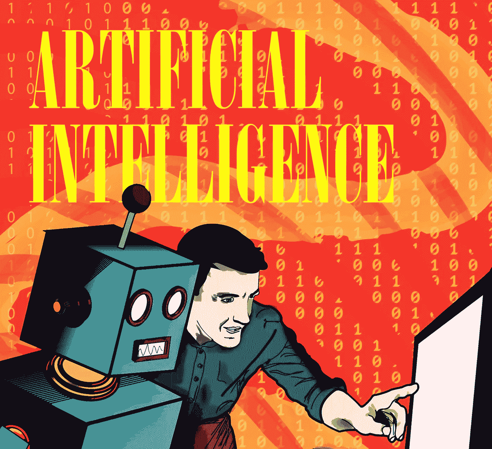

# 2018 年为什么需要学习高级自然语言生成(NLG)

> 原文：<https://medium.datadriveninvestor.com/why-do-you-need-to-learn-advanced-natural-language-generation-nlg-in-2018-634dcfbfe17a?source=collection_archive---------1----------------------->

雷·库兹韦尔，未来主义者、发明家，现任谷歌工程总监，他在 1990 年预测了互联网的快速发展。然后，他继续推广《纽约时报》畅销书《奇点》中的[概念](http://singularity.com/)，在这个时代，人类将与人工智能融合，超越我们的生物限制，并最终实现永生。无论你对库兹韦尔先生的更先进的预测有什么看法——尽管不得不指出他以前享有 86%的准确率——看起来肯定越来越有可能一些与不久的将来相关的预测将被证实。这是因为他的许多理论的基础在于我们现在目睹的计算能力的指数增长曲线。举个例子，每年的这个时候，我们都会发现世界上最强大的超级计算机的最新性能。目前的领跑者是中国的双威太湖之光，其高性能 Linpack (HPL)评级为 93.0 petaflops。

发现*对第三届星新一奖的挑战*来自*计算语言学协会在爱丁堡举办的 INLG 2016 年计算创造力和自然语言生成研讨会*的会议录，我们知道计算机写小说的那一天；优先追求自身快乐的计算机停止了为人类工作。1995 年，时任英国电信研究部主管的彼得·科克伦(Peter Cochrane)在一次精神病学家会议上演示了他的笔记本电脑给家里的电脑打电话，进行了几分钟的有限对话，直到他们没有话题可谈。21 年后，我们仍然没有证明他的观点，即这项技术永远不会达到声音告诉我“我爱你”而我们开始相信它的地步。然而，要从简单的数据问答转变为引人入胜的智能对话，从而揭示业务绩效的驱动因素，有必要为您的机器人和代理提供高级自然语言生成功能。

IA ILLUSTRATION by Meven Royo

# 自然语言生成

自然语言生成(NLG)是计算机将数据翻译成可读人类语言的过程。高级自然语言生成是人工智能的一个子领域，它使用高级分析来识别数据中的重要内容，然后将这些见解转化为智能叙事:机器规模的自动化、可操作、听起来像人类的故事。行业领导者联手在 2017 年 Gartner 数据和分析峰会上展示人工智能驱动的对话界面，最终将高级自然语言生成与商业智能相结合，为随时随地访问可操作信息创造了无限可能。

# 商务人士需要比机器人更聪明

你无法阻止人工智能等技术的指数级增长。你跑不过未来，但未来能跑得过你。在埃因霍温，我们甚至找到了一家为人工智能机器人提供灵活自动化硕士服务的 T2 职业介绍所。凭借人工智能和认知能力的贡献，我们正在创造自主实体，比如汽车，还有用于商业的人工智能机器人。这让它变得非常有趣:自主商业智能。

**相关:** [**像人工智能这样的新兴技术有助于提高商业智能**](https://titantwister.com/emerging-technology/)

# 人工智能机器人将会取代我们所有的工作

什么是[浮点数](http://floating-point-gui.de/formats/fp/)？对于任何不熟悉听起来可爱的 petaflop 或 HPL 评级的人来说，它相当于每秒一千万亿次浮点运算。同样考虑到这一点，将双威太湖之光的性能与前超级计算冠军天河二号的性能进行比较，天河二号的 HPL 评级为 33.8 petaflops。这就是我们所说的增长曲线。基于此，库兹韦尔先生提出的到 2050 年，1000 美元将购买一台比每个人的智力总和还要多 10 亿倍的计算机的建议，似乎并不那么遥不可及。

由于最近在计算和其他技术方面令人难以置信的进步，我们已经看到旧的“人对机器”的辩论的复苏，这往往在我们最激烈的工业化阶段达到顶峰。反过来，我们的新闻提要开始充斥着声称人工智能机器人将取代我们所有工作的头条新闻。与机器人并肩工作，让机器人按照制造业的要求举起沉重的设备是很好的，但在我们看到我们所拥有的潜力展现出来之前，机器与人类的集成将会毁灭我们这个物种。技术的发展没有错，但人们必须非常小心地对待它的应用。请注意，技术的指数级发展也伴随着意识的指数级飞跃。

# 区块链概念

人工智能机器人是一种新玩具，观察它的发展可能令人兴奋，但要注意——在我们将自然语言生成平台纳入商业智能参数之前，这个玩具并不像你想象的那样有吸引力。尽管不否认人们受雇从事的几乎一半活动有可能在未来几十年实现自动化，但他们也认为，人们将需要继续与他们的机器“同事”一起工作，在人们被自动化取代的地方，随着工作性质的改变，他们将找到其他工作。结合[区块链](http://www.dataversity.net/blockchain-intersection-supply-chain-data/)，区块链与供应链数据的交集，这些人工智能机器人将拥有银行账户等。很像人类。新的生态系统、新的基础设施和新的挑战，这些都与金钱、法律、控制和道德之间的平衡有关。有趣而且比我们大多数人想象的要近得多。

# 玛丽·雪莱的电影《T2》就是一个很好的例子

美国飞行员切斯利·舒伦伯格的故事，他为了拯救飞机上的乘客和机组人员，将损坏的飞机降落在哈德逊河，成为了英雄。接下来发生的事情更加引人入胜；然而，因为随着我们真正开始拥抱人工智能和虚拟或增强现实等系统的力量和潜力，人类和网络世界之间的界限将开始模糊——为我们进化的下一阶段铺平道路，成为数字化增强的人类，或“数字人”。我们即将面临一个非常艰难的决定:是继续做人类，还是成为机器？类似半机器人的东西，比简单地穿着外骨骼服要多得多。

**相关:** [**商业智能涉及伦理和成熟**](https://titantwister.com/business-intelligence/)

