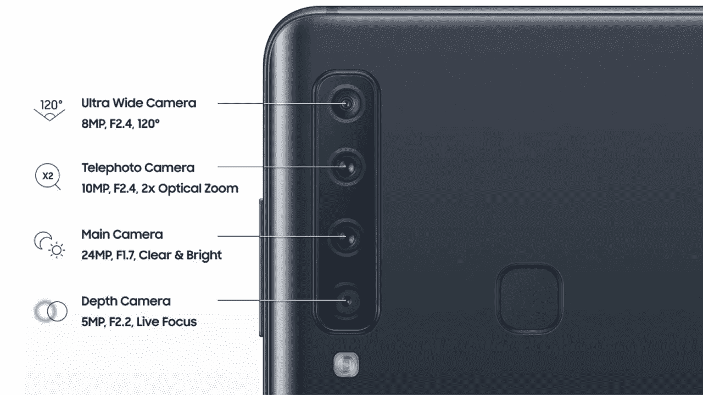
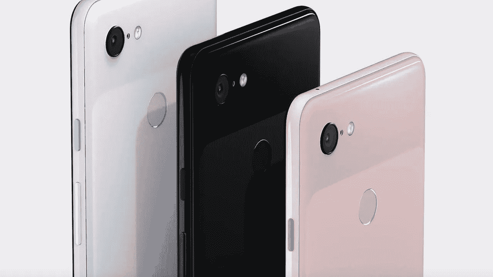

# 为什么一部手机需要 2 个以上的摄像头？

> 原文：<https://medium.datadriveninvestor.com/why-does-a-mobile-phone-need-more-than-2-cameras-981a41835d4?source=collection_archive---------10----------------------->

## 现在我们有 4 个镜头的智能手机

最近推出的三星 A7 有 3 个后置摄像头，而 A9 有 4 个后置摄像头，华为 mate 20 也有 3 个后置摄像头。

这让我想知道为什么人们需要一个智能手机来拥有这么多摄像头的手机？

The A9 has 4 cameras

通常苹果 iPhone XS 有两个摄像头，一个带长焦镜头，谷歌 Pixel 3 只有一个摄像头，苹果 iPhone XR 也只有一个摄像头。

谷歌 Pixel 和 iPhone XR 用软件带来了我们在图片中得到的散景效果，谁不喜欢散景效果呢？

说到照片和视频质量，iPhone 和谷歌 pixel 在日常摄影中做得相当好，那么为什么你需要在后面有这么多摄像头呢？

智能手机制造商打算在手机中包含多少摄像头？

Google Pixel 3 has only 1 camera

我还没有看到这些 3-4 镜头相机拍出任何非常棒的照片。

我认为如果你需要拍出非常好的照片，你应该买一台 DSLR，智能手机应该只是电话。

这可能会提高智能手机的价格，因为更多的摄像头最终会增加手机的价格。

> 对我个人来说，两个镜头就足够了，我不想要一个有这么多镜头的智能手机。

例如我昨天拍的这张照片，它甚至不是用旗舰手机拍的，只有两个镜头，对我来说，它适合日常摄影。

那么你是否拥有一部拥有 2 个以上镜头的智能手机，你喜欢你的照片吗？你对手机越来越多的摄像头有什么看法，应该有什么限制？