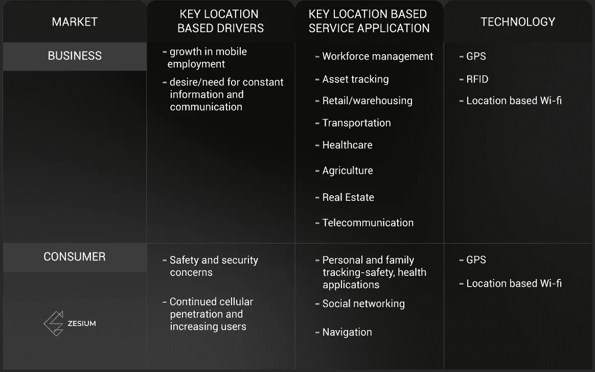

# 为什么你的应用需要地理定位功能？

> 原文：<https://medium.datadriveninvestor.com/why-does-your-app-needs-a-geo-location-feature-7f276d4d78bc?source=collection_archive---------17----------------------->

你可能听说过地理位置这个术语，我相信你每天都在苹果或安卓设备上使用它的一些功能。那么什么是地理位置呢？它是一个内置的浏览器功能，有助于确定和识别智能手机、平板电脑、笔记本电脑、雷达等设备的确切位置。地理定位从您的设备获取位置数据，并需要您的用户权限(您在手机/浏览器设置中设置的权限)。

# 地理定位技术

## 全球（卫星）定位系统

全球定位系统(GPS)是安装在智能手机中的无线电导航系统。该芯片通过使用卫星发送的时间和位置数据来确定和显示设备的当前位置。它需要来自大约 4 颗卫星的数据来提供准确的信息。

## 射频识别（Radio Frequency Identification）

射频识别(RFID)是安装在卡中的芯片。该芯片通过使用由射频发送的时间和位置数据来确定设备的当前位置。RFID 不需要电来工作，因为电磁场从卡上读取信息。这项技术主要用于零售领域，RFID 标签可以贴在衣服上。当你扫描一个货架上的牛仔裤时，你可以根据存储在 RFID 标签上的信息来区分两条一模一样的牛仔裤。每一对都有自己的序列号。

## 无线保真

Wi-Fi 连接也可用于确定设备的位置。手机正在测量一个范围内一个或多个 Wi-Fi 网络的信号强度，并给出每个 Wi-Fi 热点的大致距离。在多个信号的范围内，“最佳猜测”及其当前位置显示您的位置。在今天的手机中，它通常是相当好的(在大约 3-5 米之内)。Wi-Fi 连接用于确定位置，由于其覆盖区域较小，因此可以提供关于位置的精确信息。您可以使用[iOS 和 Android 的谷歌地图 APIs】将其与您的手机集成并启用地理定位。](https://medium.com/@onix_systems/how-to-build-location-aware-mobile-apps-using-google-places-api-907b3442049b)

# 如何瞄准你的受众？

## *地理定位*

地理定位是最古老和最不精确的方法，因为它跟踪网络浏览器的 IP 地址。IP 地址无法精确定位受众，因此地理定位最适用于广泛的营销，如整个城市或州。

您还可以利用特定于位置的关键字。在搜索的时候，用户可以直接给你一些关于他们位置的信息。这种方法的准确性变化很大，但好处是不需要收集数据。

## 地理围栏

地理围栏是一种使用 GPS 和 RFID 技术来确定用户与特定位置的距离的功能。地理围栏是一种检测进入该区域的手机的能力，并触发设备中或设备外的某些东西，以通知用户。地理围栏允许您在地图上标出一个区域，例如，您商店周围 500 米的半径，并向进入该半径的人发送您选择的[推送通知](https://www.biznessapps.com/blog/what-is-a-push-notification/)。当潜在顾客来到你的商店时，你可以向他们发送关于你的产品或促销的个性化信息。

## 灯塔

地理定位营销最具体的形式是[信标](https://www.shopify.com/retail/the-ultimate-guide-to-using-beacon-technology-for-retail-stores)。一个[信标](https://www.shopify.com/retail/the-ultimate-guide-to-using-beacon-technology-for-retail-stores)是一个小型蓝牙设备，可以从智能手机广播信号。这项技术可以准确显示顾客在空间中的位置，并据此向他们进行营销。有了这些信息，您可以创建个性化的用户体验。然而，根据蓝牙信号的活动，信标提供有限的通信范围，因此很难在公共场所放置和管理。

Types of Geo-location usage

# 不同行业如何从地理位置应用中受益？

## 1.零售

虽然许多行业都受益于基于位置的服务，但最突出的是零售业。由于移动搜索超过了其他搜索，大多数人都在搜索，所以在正确的时间锁定他们是很重要的。零售营销人员可以利用谷歌 Adwords 和 AdRoll 这样的工具来做地理定位广告。

对于大型零售商来说，位置数据对于改善客户体验和促进销售非常重要。地理位置允许零售商根据客户的位置向客户发送关于优惠或促销的个性化信息。因此，如果你正在使用这项服务，你可以建立一个个性化的信息，让顾客不仅接近你的商店，也接近你的竞争对手的商店。你知道他们准备购物，那么为什么不在你的店里打电话给他们，而不是竞争对手的店呢？

零售商现在有机会根据他们移动设备的位置来锁定他们的客户，这样可以给他们更好的客户体验和个性化的报价。

## 2.农业

气候变化和收入增加的全球人口增长意味着未来几十年世界将面临前所未有的农业挑战。这些压力鼓励对有助于提高产量、降低投入和环境成本的创新进行投资。

过去，农民很难将生产技术和作物产量与土地可变性联系起来。这降低了他们开发最有效的处理策略来提高产量的能力。如今，地理位置正在帮助农民和农业公司提高其农业生产过程的生产率和效率。

例如，具有地理定位功能的移动应用程序可以以网格形式显示温度、湿度、土壤湿度、亮度指数、风(速度、路线和阵风)、树叶湿度、降雨量和大气压力，从而有助于监测作物的状况。这样，农民就有机会积极监测作物，并在数据不令人满意时及时做出反应。

[移动应用](http://zesium.com/our-work/john-deere/)在农业领域的另一个用途是报告拖拉机、收割机等的任何故障。敬制片人。只需两次点击，农民就能联系他们的服务，其运营商拥有关于他们产品的所有信息，这样沟通变得更快更容易。另一个重要的事实是，他们将获得最快的服务，因为地理位置功能将他们与最近的服务联系起来。

## 3.运输

这是地理定位应用成为必须的另一个行业。用途很多，例如对出租车司机来说，地理位置服务增加了额外的价值。他们知道用户在哪里，调度中心控制着出租车司机的位置。

当你要去旅行时，你想避免交通堵塞和在路上工作。一个可以帮助你获得路上相关因素和行为者的必要信息的移动应用程序可以帮助你更安全、更容易、更快速地通勤。交通各方(加油站、汽车旅馆、酒店、服务站等)以及直接/间接参与交通的参与者(警察、道路工程、路况、基础设施等)之间进行通信。该应用程序结合了所需路线的所有重要细节，并提供了物体和人之间的安全通信，而不会干扰交通中的其他人。

# 结论

在许多不同的行业中，地理定位是一种非凡而有价值的工具。它节省了公司的时间和金钱，并提高了效率和活动的成果。对于寻求提高底线的企业来说，投资地理定位技术可以带来成功和竞争优势。