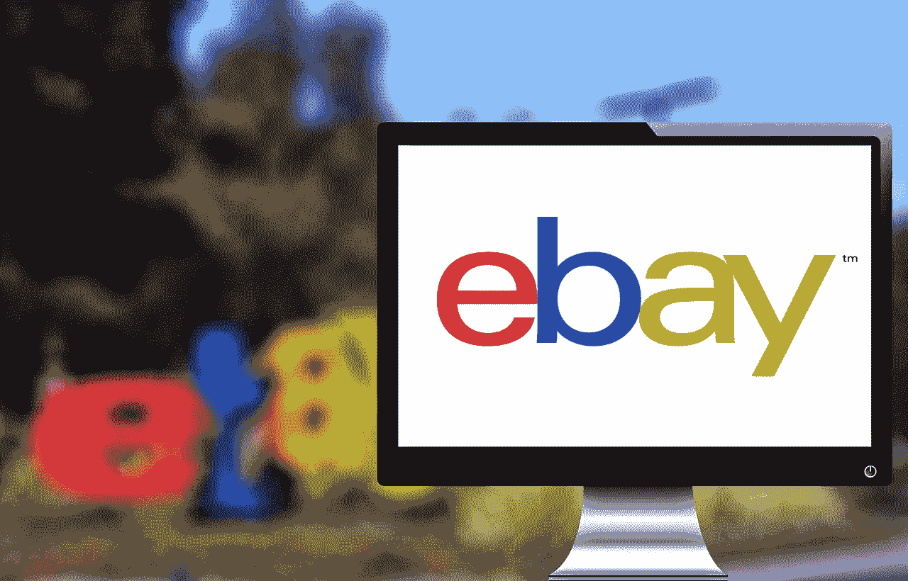
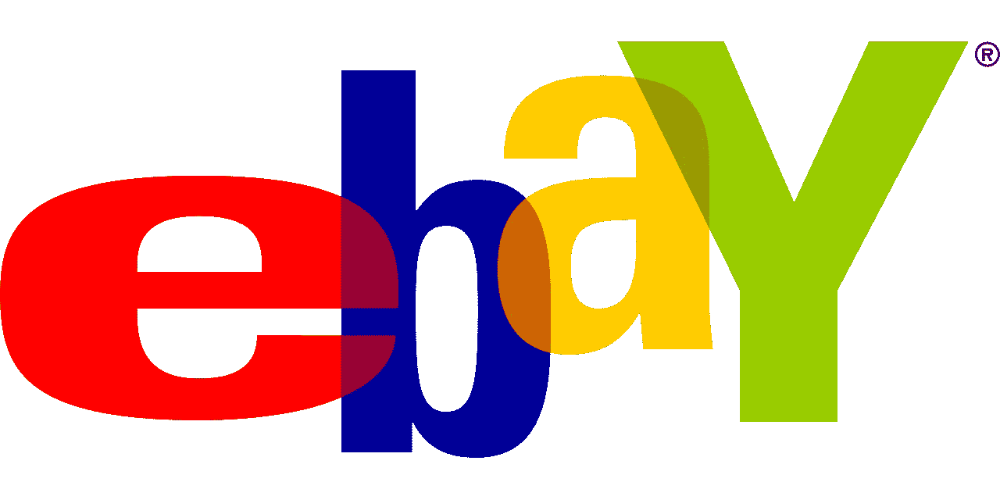

# 为什么易贝是一种价值投资？

> 原文：<https://medium.datadriveninvestor.com/why-ebay-is-a-value-investment-sort-of-13010e1e43e?source=collection_archive---------22----------------------->

易贝是一个价值投资，因为它的用户群不断增长，股价较低。例如，易贝的平台在 2018 年第三季度有 1.77 亿活跃用户，Statista [计算](https://www.statista.com/statistics/242235/number-of-ebays-total-active-users/)。

值得注意的是，这一数字高于 2016 年第三季度的 1.6 亿用户、2017 年第三季度的 1.68 亿用户和 2018 年第一季度的 1.75 亿用户。因此，易贝的用户群在两年内增加了 1800 万活跃用户。

在**亚马逊(NASDAQ: AMZN)** 的时代，这是一个令人印象深刻的成就。因此，易贝是一项价值投资，因为这个不断增长的平台的股票在 2018 年 1 月 17 日的交易价格为 30.38 美元。

**易贝是价值投资，因为它赚钱**

更重要的是，**易贝公司(纳斯达克代码:EBAY)** 正在从这个平台上赚钱。

例如，易贝在 2018 年第三季度的收入为 26.49 亿美元，毛利润为 20.41 亿美元。因此，易贝在 2018 年第三季度实现了 77.05%的惊人毛利率。

除了毛利，易贝公司在 2018 年第三季度产生了 7.21 亿美元的净收入和 5.56 亿美元的营业收入。最重要的是，易贝的收入在 2018 年第三季度以 6.04%的速度增长。

**易贝是价值投资，因为它能产生大量现金**

此外，易贝是一个价值投资，因为它产生了大量的现金。具体来说，易贝 2018 年第三季度的运营现金流为 5.58 亿美元，自由现金流为 3.79 亿美元，投资现金流为 9.26 亿美元。

因此，截至 2018 年 9 月 30 日，易贝拥有 20.86 亿美元现金及等价物和 27.52 亿美元短期投资。因此，**易贝公司(纳斯达克代码:EBAY)** 在 2018 年第三季度末拥有 48.38 亿美元的银行存款。

在这种情况下，易贝达到了经典的价值投资标准。特别是，易贝产生了大量现金，但股价却很低。

因此，市场先生低估了易趣的价值。这给了易贝公司另一个价值投资的特点。

**易贝不支付股息**

易贝是一种价值投资，但有一些严重的缺点。值得注意的是，EBAY 不支付股息。

此外，易贝缺乏像亚马逊和网飞(纳斯达克代码:NFLX)这样的平台所特有的大规模市值增长。例如，2019 年 1 月 17 日，易贝的市值为 292.5 亿美元。

与此同时，亚马逊在同一天提供了 8262.5 亿美元的市值。加上网飞，2019 年 1 月 17 日的市值为 1407 亿美元。

因此，易贝不是成长股，但缺乏增长可能是一种资产。值得注意的是，易贝股东将不必担心股价大幅下跌。因此，易贝没有如今许多估值过高的科技股的风险。

此外，一个人不用花很多钱就可以积累很多易贝股票。因此，如果易贝支付股息，投资者可以获得可观的股息收入。

**为什么易贝应该支付股息**

我认为易贝应该派息，因为不派息会赶走很多投资者。

为了解释，易贝目前的特点是零售；或工业价值投资，而不是科技成长股。因此，易贝需要吸引一类非常不同的投资者。

EBAY 需要的投资者是寻找稳定收入的人，而不是科技投机者。向这些投资者支付报酬的最佳方式是支付可观的股息。

**如果管理层愿意，易贝公司(纳斯达克代码:EBAY)** 有现金支付高额股息。此外，该公司正努力应对低股价和缺乏市场尊重的问题。

股息可以给易趣带来一点市场尊重，而且成本也不会那么高。此外，易贝可以通过分红将自己介绍给一批全新的投资者。

**易贝真的与亚马逊竞争吗？**

奇怪的是，易贝是一种价值投资，因为它可能不受亚马逊的影响。

解释一下，我不确定易贝是否直接与亚马逊竞争。例如，易贝迎合不喜欢亚马逊商业模式的更独立的顾客。

易贝买家包括喜欢讨价还价和出价的人。此外，易贝专注于不太稳定的市场类别，如收藏品。

因此，你可以把易贝描述成一个专业的卖方市场，而亚马逊是一个大众市场。此外，亚马逊的定价结构与易贝公司非常不同

亚马逊是一个批发市场，旨在以尽可能低的价格销售。易贝是一个零售市场，旨在以尽可能高的价格出售商品。

**亚马逊对易贝**

澄清一下，亚马逊通过以极低的价格销售大量商品来赚钱。因此，亚马逊和**沃尔玛一样**是一家大众折扣店。

另一方面，易贝通过收取卖家费用来赚钱。因此，价格越高，易贝赚的钱就越多。

这就是为什么易贝是古董、收藏家物品、艺术品和其他情感价值高的物品的热门市场。例如，一本旧漫画书或一枚古币只有在有人真的喜欢它的时候才有价值。

亚马逊卖书，但它把书卖给想读书的人。一般来说，读者在寻找一本书的最低价格。另一方面，易贝卖给收藏家。一个收藏家会为一本他从未读过的书的特别版支付额外的费用。

在这种情况下，亚马逊希望销售肥皂或袜子等实用物品，而不是珠宝或收藏品。是的，亚马逊上有珠宝，但价格很低。

这解释了为什么亚马逊的平台和收入总是远远大于易贝。然而，易贝不需要亚马逊的规模，因为它可以从一个小得多的平台上赚很多钱。

因此，易贝是亚马逊时代的价值投资。它是一个较小的平台，已经找到了如何在不与亚马逊直接竞争的情况下赚钱的方法。

这个故事最早贴在 [*市场疯人院*](https://marketmadhouse.com/) 。

## 来自 DDI 的相关故事:

 [## 股票市场投资的机器学习

### 当你的一个朋友在脸书上传你的新海滩照，平台建议给你的脸加上标签，这是…

medium.com](https://medium.com/datadriveninvestor/machine-learning-for-stock-market-investing-f90ad3478b64)  [## 为什么数据会改变投资管理

### 有人称之为“新石油”虽然它与黑金没有什么相似之处，但它的不断商品化…

medium.com](https://medium.com/datadriveninvestor/why-data-will-transform-investment-management-4a60966c1c81)