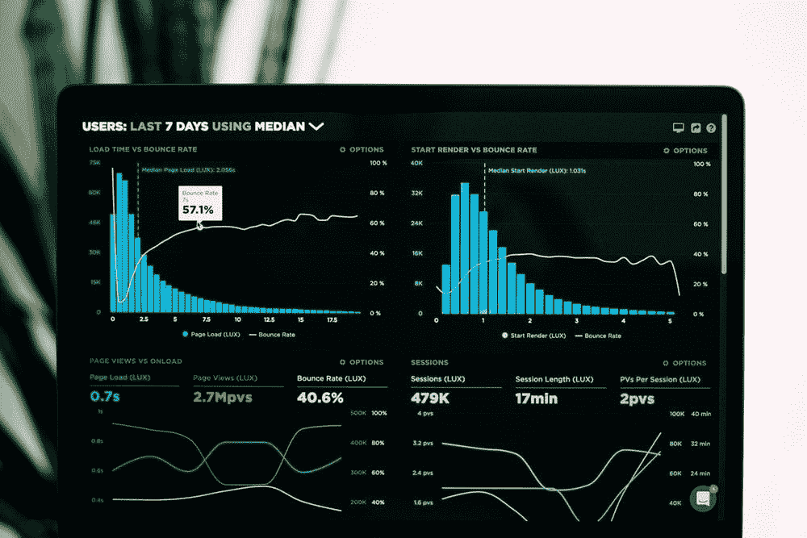

# 为什么每个组织都需要数据分析师|数据驱动型投资者

> 原文：<https://medium.datadriveninvestor.com/why-every-organization-needs-a-data-analyst-data-driven-investor-8406792fcf13?source=collection_archive---------12----------------------->

*如今，数据科学家的角色被大肆宣传，当一家公司需要一名专家从数据中获得一些见解时，第一个想法就是寻找数据科学家。但这真的是最好的选择吗？让我们来看看数据科学家和数据分析师的角色有何不同，以及为什么您可能想在聘用分析师之前聘用其他任何角色。*

# 数据科学家还是数据分析师？

那么，数据科学家和数据分析师之间的**区别是什么？**这些角色的定义可能会有所不同，但通常认为数据科学家集三种关键角色于一身——数据分析师、统计学家和[机器学习](https://www.datadriveninvestor.com/glossary/machine-learning/)工程师。换句话说，这些公司[希望数据科学家能够精通初步数据分析](https://academy.vertabelo.com/blog/from-data-analyst-to-data-scientist-new-skill-set-new-future/)，善于揭示因果关系，并在建立机器学习模型方面表现出色。有了这样的期望，显然 3 合 1 比 1 合 1 更好，数据科学家变得更受公司青睐。

 [## 成为数据科学家所需的 8 项技能|数据驱动型投资者

### 数字吓不倒你？没有什么比一张漂亮的 excel 表更令人满意的了？你会说几种语言…

www.datadriveninvestor.com](https://www.datadriveninvestor.com/2019/02/07/8-skills-you-need-to-become-a-data-scientist/) 

但是等等… **有没有可能一个人在三个角色上都很完美？更重要的是，这些角色都需要相似的技能吗？或者说，数据分析师和机器学习工程师使用的技能和方法完全不同？**

事实上，这些专家的**方法确实大相径庭**。谷歌首席决策科学家 Cassie Kozyrkov 对这种差异给出了精彩的解释。她声称，数据分析师在公司是为了提供快速的结果，例如，回答数据中有任何有趣的相关性吗？为了满足决策者对快速和简短答案的期望，数据分析师使用相应的编码风格- **使用更少的代码行**，并为管理者生成一个易于解释的相关矩阵。[机器学习](https://www.datadriveninvestor.com/glossary/machine-learning/)工程师有一种完全不同的编码风格——他们的目标是构建一个“完美”的模型，而这通常需要很多很多时间。

统计学家也不能提供快速的结果——他们会说:“等等，等等！我们无法从这些数据中得出任何因果关系。我们甚至不知道结果是否有统计学意义！”是的，有时你需要擅长统计的统计学家或数据科学家来回答这类问题。但是你真的需要这些答案来了解数据的相关性吗？实际上，不是。从数据分析师那里获得初步结果后，您需要聘请领域专家，由他决定哪些已识别的模式对业务确实重要，值得进一步研究。因此，正如你所看到的，在初步数据分析之后，深入假设测试之前，最好有一个领域专家的意见**——当同一个人执行数据分析和揭示模式的深入测试时，这是很难安排的。**

你可能已经看到，在某些情况下，数据分析师甚至比数据科学家更受欢迎。但是现在让我们来澄清一下，数据分析师应该具备什么样的[技能](https://www.datadriveninvestor.com/top-5-finance-business-skills/)才能满足决策者的需求，并成为组织的资产。

# 组织真正需要什么样的数据分析师？

数据分析师在组织中的主要角色是通过识别数据中有趣和重要的模式，并通过提供隐藏在大量表格、图表和日志文件中的快速答案来帮助决策者。简而言之，如果领域专家认为这些领域很重要，数据分析师会确定您可能需要统计师和机器学习工程师关注的领域。

所以，以下是你想在数据分析师身上看到的**品质**:

*   **数据讲故事。**一个好的数据分析师能够阅读数据，讲述围绕数据的激动人心的故事。但是真正**重要的**是高调的数据专家**从不超越数据**并且总是**允许多种可能的解释**。例如，他们可以说:“在我们介绍了上一次关于脸书的广告活动后，看起来我们得到了更多的线索。这可能是这次活动效果的一个信号，但线索数量的增长也可能是由于季节变化。需要更深入的分析。”
*   **数据可视化技巧。**创建**视觉上吸引人、有意义且易于解读的图表**的能力对于数据分析师来说也非常重要。故事总是受益于伟大的视觉化，这使得决策者的生活变得更加容易。
*   **技术专长**。专业的数据分析师可以为你提供隐藏在数据中的许多有趣的见解，只需要使用电子表格。然而，为了提供真正**快速的结果**并创建专业的可视化，数据分析师通常需要**电子表格之外的技术专长**。因此，今天你可以期待数据分析师熟悉编程语言 [Python](https://www.datadriveninvestor.com/glossary/python/) 并精通 Tableau 或微软 Power BI 等工具。
*   **针对速度优化的编码风格**。你不需要一个数据分析师拥有和软件工程师或机器学习工程师一样的编程技能。数据分析师应该知道如何使用 Python 清理数据，如何执行数据分析，以及如何用清晰的可视化和表格呈现信息。网上有一些非常好的课程教授这些技能。此外，数据分析师应该熟悉为数据分析创建的最流行的包，并使用这些包以最有效的方式**进行所有分析**。
*   **领域专长**(可选)。并非所有公司都要求数据分析师具备领域专业知识，但这绝对是专业数据分析师的一项关键优势。换句话说，如果有人想成为最好的数据分析师，他们应该熟悉一个领域。这项技能将帮助他们区分对业务真正重要的模式和不值得数据专家和决策者花费时间的发现。

现在我们知道了什么样的数据分析师可以成为公司的宝贵资产，让我们总结一下我们可以从一名优秀的数据分析师那里得到什么，以及为什么每个组织都需要这样的专家。

# 每个公司都需要一名数据分析师

如果一个组织的管理者做出数据驱动的决策，这个组织肯定需要一个数据分析师。有幸找到具备上述技能的优秀专家的公司将有一名专家负责:

*   收集**正确种类的数据**；
*   清理数据；
*   进行数据分析；
*   用漂亮而有意义的可视化方式呈现信息；
*   发现数据中有趣的模式，并**提供可能需要统计学家和机器学习工程师进一步关注的见解**；
*   进行分析时，**优先考虑对业务更重要的领域**。

总而言之，一名优秀的数据分析师是决策者的主要助手，将数据转化为有意义的故事，为困难问题提供快速答案，并推动业务朝着正确的方向发展。

*原载于 2019 年 7 月 24 日*[*【https://www.datadriveninvestor.com】*](https://www.datadriveninvestor.com/2019/07/24/why-every-organization-needs-a-data-analyst/)*。*