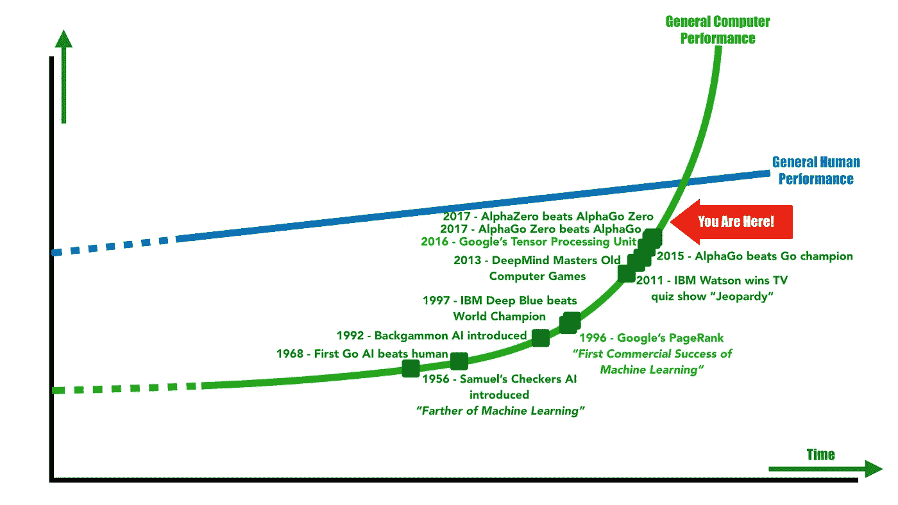

# 为什么每个人(包括你)都必须学习人工智能

> 原文：<https://medium.datadriveninvestor.com/why-everyone-including-you-must-study-artificial-intelligence-6da20f13edec?source=collection_archive---------2----------------------->

## ***或者说，我们是不是已经来不及了？***

Photo by [Jesus Kiteque](https://unsplash.com/photos/wn-KYaHwcis?utm_source=unsplash&utm_medium=referral&utm_content=creditCopyText) on [Unsplash](https://unsplash.com/search/photos/glasses?utm_source=unsplash&utm_medium=referral&utm_content=creditCopyText)

关于人工智能以及它将把我们带向何方，似乎有很多困惑。上周，我的两位同事(一位科幻迷和一位科学家)向我展示了两种截然不同的“未来人工智能机器”愿景，这再次向我展示了这种困惑。

对他们两人来说，人工智能是一个令人着迷的话题。毫无疑问，人工智能激发了人们的想象力，但我们现在在哪里，我们应该如何应对人工智能革命的现实？

 [## 挑战你对人工智能和社会的看法的 4 本书——数据驱动的投资者

### 深度学习、像人类一样思考的机器人、人工智能、神经网络——这些技术引发了…

www.datadriveninvestor.com](https://www.datadriveninvestor.com/2019/02/28/4-books-on-ai/) 

这些天你会听到很多类似的问题:

政府应该在为时已晚之前进行干预吗？你应该为人工智能革命做好准备吗？AI 是否应该成为教育中的必修科目？

## **人工智能仿人超级计算机**

这位科幻迷对人工智能和她所谓的“人工智能实验”非常怀疑她认为我们很快就会在现实生活中体验到我们经常在电视节目和电影中看到的东西:一个拥有人类水平的智能和意识的设备。更糟糕的是，这个人工智能很快就能“智胜”人类。

她的担忧是基于最近发表的一份报告，该报告显示人工智能领域的技术人员担心有害的项目。

不过，她的评论有些不同寻常。她指的不是众所周知的类人机器人(我们在《星际迷航》等剧集中看到的那种)。相反，她指的是“Zen”，这是我有史以来最喜欢的电视节目之一(布莱克的 7)中的超级计算机。

她确信“禅宗式”超级计算机是未来的发展方向，这种机器对我们所知的社会有潜在的危害。

她的信息很明确。我们现在必须采取行动阻止这种情况发生。

## **人工智能作为复杂而强大的统计机器**

我的一个年轻同事完全同意。他不是那种看科幻电影的人。而且他肯定没听过布莱克的 7。他相信科学，最近完成了一门机器学习和神经网络的课程。

他讲述了一个更接地气的人工智能进化故事，从通过进化编程的统计机器学习到最先进的神经网络。这些网络使用复杂的回归技术。但称他们“聪明”也不为过。他非常清楚地表明，科幻小说中对有感知能力和邪恶智能的恐惧与当前的科学艺术水平完全脱节。

他毫不含糊。人工智能现在是，而且很可能仍然只是一个工具。这是一个惊人强大的工具，有可能极大地改变我们的世界。它可以增强我们的智力，但仅限于特定问题和人类主导的领域，如医疗诊断。它还可以通过帮助人类来创造更安全的环境。想想现代汽车中辅助驾驶员的复杂系统。最后，人工智能有可能为产品/服务提供新的用户体验。游戏中增强的人工智能和改进的图形是这种用途的极好例子。

他的信息也很明确。AI 只是一个复杂的统计工具，用于组织大数据，帮助我们做出更有效的选择。

## **那么，谁是对的？AI 的真正未来**

预测人工智能的未来以及这些发展将我们带到哪里是一项挑战。但我上周与一位数学家讨论了这个问题，他证实，目前没有任何理论可以指出从根本上改善神经网络的方法，以实现真正的模仿人类或类似人类的人工智能。

作为“超级智能”的人工智能仍然是科幻小说中的生物。

但是，同样，这并不意味着我的第一个同事完全错了。我们不能坐以待毙。许多关于人工智能的警告指向了真正的威胁。人们会失业。

人工智能已经在自动化许多标准化的工作。

考虑你自己的工作，想想有多少是标准化的。会让你大吃一惊的。

遵从过程、模板和“最佳实践”几乎构成了我自己工作的 80%。这些工作已经成熟，可以被我们已经创造的强大的“统计机器”和神经网络所颠覆。

但是，将由机器执行的不仅仅是相对简单的标准化工作。

人工智能的发展目前正在加速。在 40 年代和 50 年代(该术语首次引入时)缓慢起步后，逐渐取得了重大进展。神经网络的惊人突破发生在七十年代末和八十年代。反向传播算法使神经网络能够自我训练和改进。

只需考虑游戏中的人工智能发展。我还记得 1997 年 IBM 深蓝的升级版打败了国际象棋特级大师加里·卡斯帕罗夫。但是真正的指数增长发生在过去六年左右。2013 年，英国人工智能公司 deep mind(2014 年被谷歌收购)展示了一个 AI 系统可以在 Pong、Breakout 和 Space Invaders 等老牌电脑游戏中超越人类的能力。

2015 年 10 月，DeepMind 的 AlphaGo 以五比零击败欧洲围棋冠军。它在 2016 年和 2017 年继续击败排名很高的围棋选手，直到最终被它的继任者 AlphaGo Zero 击败。与 AlphaGo 不同，AlphaGo Zero 的策略是通过自我对弈自学的。AlphaGo Zero 随后被更一般化的版本 AlphaZero(在 24 小时内掌握了国际象棋、五子棋和围棋的游戏)击败。谷歌的张量处理单元(TPU)，一种为神经网络/机器学习应用量身定制的计算机芯片，经常被认为是最近人工智能革命的主要原因之一。

这些例子表明，在执行“创造性”工作时，人工智能越来越胜过我们。人工智能越来越有能力提供创造性的输出。DeepMind 在围棋上的成功表明，AI 可以在更直观的游戏中用优雅的类似人类的招式击败人类。

下一代机器不依赖于传统的计算策略——蛮力——来压倒人类并迫使他们投降。

AI Breakthroughs in Games. Inspired by the graph used by Jeremy Howard in his [TEDx talk](https://www.ted.com/talks/jeremy_howard_the_wonderful_and_terrifying_implications_of_computers_that_can_learn?language=en#t-3867)

## 那么，下一步是什么？

现在还不算太晚，但我们必须更严肃地对待人工智能。不必深入细节(我把这个留到下一篇文章)，这里只是我研究(和担心)人工智能的几个原因:

*   我们并不总是理解神经网络(它通常仍然是一个黑盒)。
*   神经网络的发展令人兴奋，并且正在加速。
*   神经网络变得更聪明(与人类不同，神经网络永远不会忘记)。
*   神经网络进行全球交流。
*   神经网络是统计工具，而统计工具会受到统计误差和偏见的影响，从而引发大量的伦理问题。