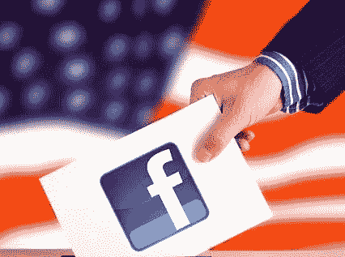

# 为什么脸书仍然不能左右选举

> 原文：<https://medium.datadriveninvestor.com/why-facebook-still-cant-sway-elections-d5f64b61084d?source=collection_archive---------17----------------------->

在整个 2018 年，“彭博社科技”的人气主持人艾米丽·常(Emily Chang)要求她的许多网络安全嘉宾评论俄国如何利用脸书改变 2016 年总统选举的结果。

大多数嘉宾回避了这个问题，但坦率的企业家、上市前脸书投资者加里·维纳查克没有回避。

“看，脸书，这个网络(彭博)，福克斯，CNN，推特..都是一样的游戏…我们做决定。脸书或俄罗斯，没有让我们为川普或希拉里拉杠杆。”

这是脸书政治广告的固有缺陷。用户不能立即采取行动——他们不能点击投票，或者“拉杠杆”，即使政治广告很有说服力。脸书只是一个全渠道的政治信息生态系统的来源之一，这个生态系统在竞选周期中充斥着选民。选民被网络和有线新闻节目、评论员、其他社交媒体、密友、家庭成员、YouTube 影响者和名人包围。此外，脸书用户可以过滤掉他们想看的内容。这限制了脸书政治广告的影响力。

接下来，大多数选民在竞选之初为他们支持的候选人“拉杠杆”。2016 年，各候选人[的有利和不利评分](https://news.gallup.com/poll/197231/trump-clinton-finish-historically-poor-images.aspx) **没有大幅波动。**尽管如此，希拉里和川普的竞选团队在脸书广告和信息上总共花费了 8100 万美元，在脸书创造了 6.4 亿条广告和信息。

第三，元事件可以摧毁数月的全渠道政治广告——一个关于候选人在竞选最后几周退出的爆炸性贬低故事或披露。2016 年，每个候选人都遭遇了元事件或“十月惊喜”。克林顿不得不忍受联邦调查局局长宣布重新开始对她的电子邮件调查。特朗普面临着以他的摸索言论为特色的“访问好莱坞磁带”的毁灭性发布。特朗普在这个故事中幸存下来。希拉里就没那么幸运了，贬低了她竞选团队在脸书广告上花费的数百万美元。

第四，假新闻现在能更快地被识别和曝光**。**无论是在 Reddit 还是在脸书，用户和记者都能够更快地压制虚假报道和帖子。在假新闻曝光之前，揭露一个虚假的故事需要更长的时间。

例如，当德克萨斯州奥斯汀的一家营销公司的联合创始人[在推特上发布](https://www.nytimes.com/2016/11/20/business/media/how-fake-news-spreads.html)关于付费的反特朗普抗议者被大巴送往示威游行时，他附上了一张奥斯汀街道上一长串白色巴士的照片。后来一家软件公司发表声明称，这些公交车与公司的会议有关。差不多过了 48 小时，真相才浮出水面。

现在，主流媒体可以在几个小时内蒸发一个虚假的故事。脸书和其他社交媒体[正在开发针对假新闻的抗病毒反应](https://www.digitaltrends.com/social-media/facebook-fight-fake-news/)。这降低了脸书发布非事实的正面或负面候选人消息的有用性。

最后，也是最重要的一点，脸书不去投票——志愿者去。所有竞选活动的核心目标都是诱导你的支持者去投票，投票率策略已经改变。传统上，我们的目标是让那些经常投票的积极性很高的选民或“高倾向选民”参加投票。这是希拉里竞选团队的普遍策略，而[远未成功](https://www.forbes.com/sites/omribenshahar/2016/11/17/the-non-voters-who-decided-the-election-trump-won-because-of-lower-democratic-turnout/#2a2a6b8453ab)。在最近的竞选周期中，候选人竞选活动一直专注于强烈支持他们的候选人，但不经常投票的选民——懒惰的选民或“低倾向选民”。

巴拉克奥巴马(Barack Obama)在 2008 年、伯尼·桑德斯和唐纳德特朗普(Donald Trump)在 2016 年的竞选中都使用了这种方法。2008 年奥巴马竞选的目标是关键州的低倾向青年和非洲裔美国选民。在初选和大选期间，特朗普竞选团队奉行的策略是[聚焦低倾向选民](https://fivethirtyeight.com/features/trump-campaign-memo-unlikely-voters/)。

为了激励懒惰的选民，需要成千上万的志愿者直接联系数百万选民，敲门，打电话，指引他们去投票站，或者指导他们完成缺席投票程序。2016 年初选刚刚过半，伯尼·桑德斯竞选团队就派出了一支 10 万人的志愿者大军，他们打了 3600 万个电话。

如果电话投票成为可能，脸书将成为政治竞选最有效的工具。然而，与大规模移动投票相关的无数安全威胁以及选票出售的威胁使得这不太可能。

目前，脸书仍将是众多政治游说渠道中的一个。但它不能左右选举。