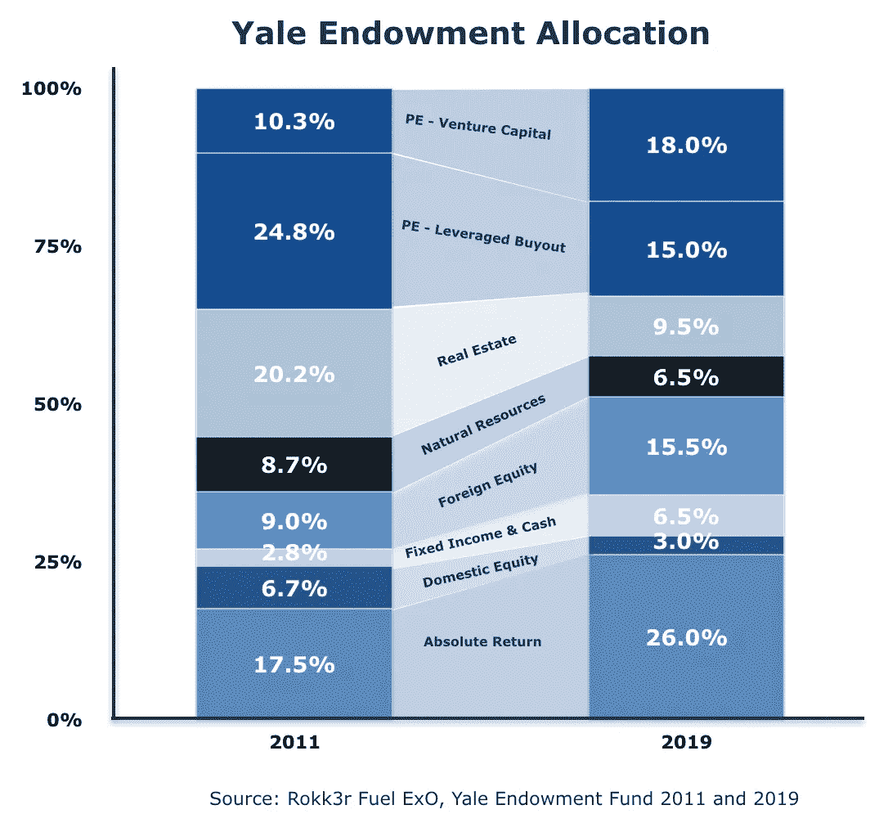
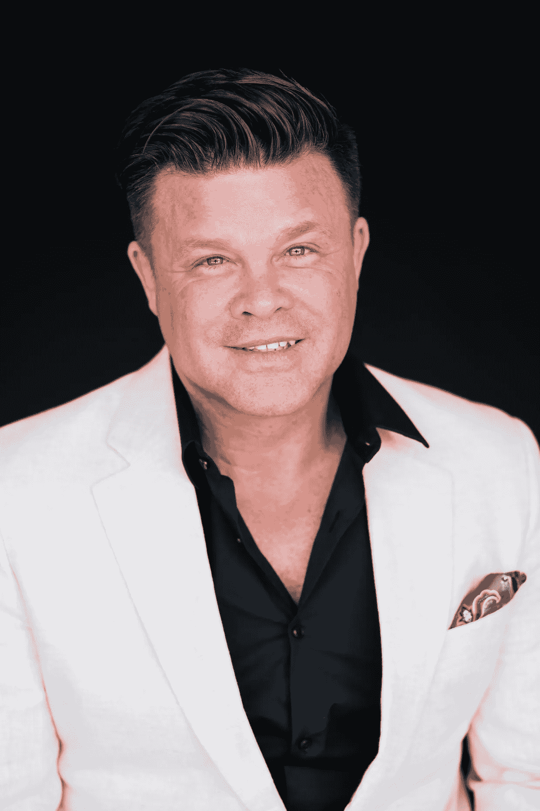

# 为什么财务顾问应该利用风险投资来拯救自己

> 原文：<https://medium.datadriveninvestor.com/why-financial-advisors-should-leverage-vc-to-save-themselves-aa9cf257c606?source=collection_archive---------2----------------------->

## 现代投资组合理论急需软件升级。

当你处于困境时——无论是在一段关系中，通过一个新的个人目标，还是在工作中的一个艰难时期——很难像对场景有更全面看法的人那样，筛选细节，抓住问题的核心，巧妙地解决问题。这就像从一英寸远的地方看一幅画——直到你后退几步，你才能看到它在描绘什么。当你这样做的时候，就像:瞧，就是这样。我自己也经历过这个难题。2016 年，当我离开作为美银美林(Bank of America Merrill Lynch)东南部门董事总经理监管数千名金融顾问的高薪职业生涯时，我看到了大局。

在从事财富管理大约 20 年后，我退一步，清楚地看到，该行业的指导原则正把其利益相关者推入一种生死存亡的威胁状态。

在技术正在全球市场和消费者偏好中引发翻天覆地变化的关键时刻，超级富豪的金融顾问们表现出愚蠢的犹豫，不愿调整自己的投资策略，以适应周围的世界并提高效率，这损害了他们的客户和他们所在行业的相关性。如果激励全行业加大另类投资配置的警钟没有敲响，金融顾问注定会被淘汰。

# 现状

想象你是华尔街银行的财务顾问。

你花了几年时间来发展你的业务，培养有价值的客户关系。如今，您的团队为数百名超级富豪客户管理着超过 10 亿美元的客户资产。高风险。

 [## 风险投资家在给创业公司播种时会考虑什么标准？数据驱动的投资者

### 2017 年，风险投资资金攀升至十年来的最高水平。你的创业公司目前吸引风险投资的机会是…

www.datadriveninvestor.com](https://www.datadriveninvestor.com/2018/04/20/what-criteria-do-venture-capitalists-consider-when-seeding-a-startup/) 

像你的前任一样，你日复一日地生活在一个简单的理念中:不伤害他人。就像各地的医疗专业人员所做的希波克拉底誓言一样，你采取谨慎的方法来提供令人满意的结果。你的客户很满意——或者你是这么认为的。你有固定收入，蓝筹股，等等。换句话说:只要你没有搞砸，你的表现超过市场 1%或 2%，那么很好，你又活过了一年。历史上，没有人因为击球 500 次而被解雇。

但是你认为你能坚持多久？

《华尔街日报》、《纽约时报》和其他所有有记录的报纸都充斥着热门科技公司在多年私有化后突破万亿美元估值的新闻，那些值得信赖的蓝筹股受到来自硅谷和拉丁美洲的好斗的新来者的冲击，这种安全的做法还能持续多久？直到有一天，你的客户一个接一个地在纸上写下并意识到:‘我靠！“在标准普尔 500 高出 1%或 2%的背景下，我将不得不再工作 10 年，以抵消我年复一年被收取的累计费用和佣金，不管我的表现如何，”

大多数财务顾问没有意识到的是，超高净值客户不会对他们的挫折发出警告。这个消息是在一个星期五的下午以一份转会文件的形式突然出现的。

每个人都必须意识到的事实是，超高净值人士愿意为他们所珍视的东西支付高于市场的价格，而且他们希望顾问理解他们所珍视的东西。因此，当你不提供这种价值时，他们会找到其他愿意提供的人。

如果你失去了为你提供 80%收入的 20%的客户中的一个，需要多少时间、精力、智力和金钱来替代他们？在一个金融服务丰富的世界里，服务和有人拿起电话是被期待的。超高净值人群想要的是便宜的贝塔和独特的、难以企及的阿尔法。过去向最大和最好的客户发放的银团贷款，现在是对一家将在不久的将来上市或被收购的私人公司的直接投资。你有网络和技能让你的客户参与这些交易吗？这是百万美元制片人的问题。

Cerulli Associates 在 2019 年调查的金融顾问中，只有 45%的人报告说将客户资产分配给了另类投资。根据 9 月份发布的同一份报告，平均而言，顾问在替代渠道中的分配比例低于 5%。

虽然与过去几年相比这是一个进步，每年都有更多的顾问转向 alt，但这是一个可悲的现实。这是个问题。

55%的财务顾问决定稳扎稳打，而其余的人则犹豫不决，不愿尝试真正做到这一点，这反映出他们忽视了一个简单的现实，即我们的时代正在发生变化。

商业和工业都会经历生命周期。当一个新的开始的时候，如果你没有采取必要的步骤来相应地改变，那就太晚了。

# 浪潮

就在几周前，美国最大的牛奶生产商****申请破产。****

> **牛奶曾经是美国冰箱的主食，但随着消费者寻求含糖更少或植物性替代品，它已经慢慢失去了消费者的青睐。**
> 
> **据欧睿信息咨询公司(Euromonitor)称，全球牛奶替代品市场预计今年将超过 180 亿美元，比 2018 年增长 3.5%。**

**消费者偏好的改变预示着迪安食品公司的末日。这反映了一个简单的事实:消费者今天做的几乎所有事情都与五年前不同。然而，大多数金融顾问继续以 20 年前的方式构建客户投资组合。尽管有强有力的证据表明事实并非如此，他们还是这样做了。**

**首先，公开市场已经今非昔比。**

**在过去的 20 年里，美国股票市场收缩了**——**，不是在价值上，而是在数量上。今天的市场只有 3500 多家上市公司，是 1996 年巅峰时期的一半，当时有 7322 家公司上市。**

**上市股票的补充速度不够快，不足以弥补通过收购、私有化交易以及(不太常见的)退市而被剔除的公司数量。年度首次公开发行(IPO)的数量从 1996 年的 600 家骤降至今天的 160 家。这意味着股票市场的预期回报越来越少。然而，大多数财务顾问的传统饮食仍然是一样的:股票、债券、现金。(要深入了解这一趋势，请参见我们的普通合伙人兼首席投资官 Maggie Vo 的[【场外】](https://medium.com/datadriveninvestor/off-the-market-30202042fa1a)。)**

**数据显示，在过去 25 年里，多元化程度较高的投资组合比多元化程度较低的投资组合表现更好。当牛市减弱，传统市场波动时，配置另类资产和直接投资另类投资有助于缓冲投资组合，并可以提供多样化战略，以降低风险和确保超额回报。虽然今天大多数金融顾问没有做出相应的反应，但其他机构已经做出了反应。**

**首先，根据皮尤慈善信托基金(Pew Charitable Trusts)2018 年 9 月的一份报告，公共养老金的资产配置显示，过去 10 年替代投资大幅增加。耶鲁大学捐赠基金更好地反映了这一重大转变。**

# ****设定标准****

**耶鲁大学捐赠基金拥有 200 多亿美元，是美国最大的捐赠基金之一。对许多人来说，这是分配策略的基准。**

**大约三十年前，耶鲁成为第一个将绝对回报策略定义为一种独特资产类别的机构投资者和大学捐赠基金，开始时的目标配置为 15%。“绝对回报策略”指的是对冲基金，因为对冲基金希望在牛市和熊市中都提供正回报。**

**以下是耶鲁 2019 年的计划资产配置，对比 2011 年的配置策略。**

****

**以下是该大学对此的说法:**

> **在过去的 25 年里，耶鲁通过将资产重新分配到非传统资产类别，大大降低了捐赠基金对国内有价证券的依赖。…**
> 
> **对非传统资产类别的大量配置源于它们的回报潜力和多样化能力。与 1990 年的投资组合相比，今天的实际投资组合和目标投资组合具有更高的预期回报和更低的波动性。…**
> 
> **另类资产就其本质而言，定价效率往往低于传统的有价证券，这为通过主动管理利用市场低效提供了机会。**

**与只投资股票和债券的典型投资者相比，耶鲁大学的资产配置非常多样化。它的多样化是由于捐赠基金的规模、渠道、经验和时间范围。大多数投资组合不会获得这样的多样化，因为大多数顾问没有资源或专业知识来投资这么多不同的资产类别。但它应该是一个为之奋斗的理想的例子。显而易见的第一步是:增加对替代品的分配。**

**我们建议的分配模型要求将大约 48%的资金分配给另类投资，风险资本、对冲基金、私募股权和房地产等投资构成了这块蛋糕。**

**投资者和他们的顾问可以转向替代方案，以帮助缓冲由于股票波动和利率上升造成的传统市场波动的影响。**

**超级富豪们，如果他们知道得更清楚的话，会嘲笑那些普通人在收听美国消费者新闻与商业频道电台，看看哪些股票上涨，哪些股票下跌时，为争夺相同的面包屑而争斗。当许多当今最大、最有影响力的公司上市时，真正的货币价值已经被创造出来，并在私人市场投资者和那些有幸参与共同投资的人中分配。投资者内心深处明白这一点。然而，对于“全押”仍有犹豫。**

# **不彻底的措施**

**据 Cerulli Associates 称，2020 年，独立和混合投资顾问将占金融服务业的近 30%。从铁丝网的举动反映了一个行业的重大演变，迫切需要结构变化，创新和愿景。**

**推动这种演变的一个重要因素是顾问对公司决定的投资和投资模式的失望，顾问认为这削弱了他们为客户的最佳利益服务的能力。然而，即使顾问们自己单干，他们也会重新思考他们的老方法，最终为客户的最大利益服务。**

**如今，很少有独立的金融咨询公司拥有能够分析风险资本交易信息、从而调整目标配置的分析师。更少的人知道如何利用这些数据揭示的机会，并获得能够真正使他们从竞争中脱颖而出的交易。燃料风险投资已经聘请了许多这样的公司来提供解决方案。**

**我们做尽职调查。我们降低风险。我们给你权限。这是一种基金结构，所以你可以分散风险，投资于世界各地不同行业的公司。这是一个微薄的分配——一个风险投资新来者实际上可以消化的分配。但态度的转变不会在一夜之间发生，尽管它们应该发生。**

**除了这些数字，顾问们似乎从根本上误解了消费者的偏好，因为它们与传统的金融服务业有关，而如今，传统金融服务业正日益受到硅谷新来者的干扰。**

**顾问们自我吹捧，认为他们的客户喜欢坐在车里感受人情味的体验。这种误解让我想起了一个类似的错误评估，一个具有致命后果的错误评估。还记得百视达吗？**

**视频租赁公司 beyond 拥有不止一次、而是多次收购网飞的机会，当时它只是一家价值约 5000 万美元的 DVD 订阅服务公司。(网飞今天的市值超过 1300 亿美元)。**

**百视达拒绝了这些机会，大概是因为他们的客户喜欢百视达的体验是进入一个实体场所，从工作人员那里获得最新发布和经典的推荐，并仔细阅读小吃选择。百视达在杂草中。他们没有看到大局。**

**我们都知道结果如何。现在是转向的时候了——否则。**

****

***本文由 Fuel Venture Capital 创始合伙人兼董事总经理 Jeff Ransdell 撰写。杰夫在美林工作了 20 年后，于 2017 年联合创立了燃料风险投资公司。作为金融巨头东南财富管理部门的董事总经理和市场主管，他管理着超过 1300 亿美元的全球私人客户投资资产，20 亿美元的损益和 2000 多名员工。他转向风险投资的动机是，他认为越来越多的证据表明，塑造经济和利用创新的机会正从公共市场稳步转移到私人市场。在社交媒体上关注 Fuel 风投，via*[*insta gram*](https://www.instagram.com/fuelventurecapital/?hl=en)*，*[*Twitter*](https://twitter.com/FuelVC)*和*[*LinkedIn*](https://www.linkedin.com/company/fuelventurecapital/)*。***