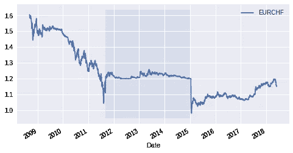
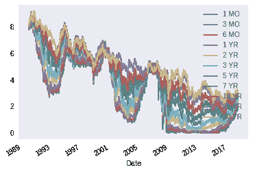
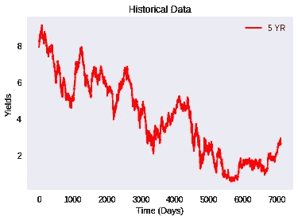
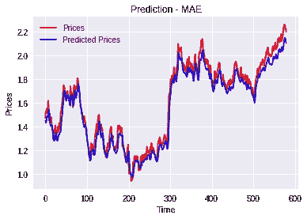
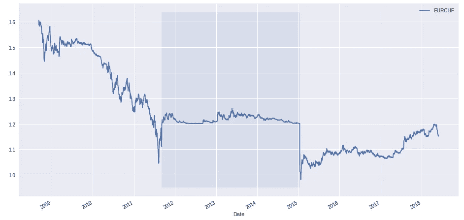

# 为什么金融时间序列 LSTM 预测失败

> 原文：<https://medium.datadriveninvestor.com/why-financial-time-series-lstm-prediction-fails-4d1486d336e0?source=collection_archive---------0----------------------->

[](http://www.track.datadriveninvestor.com/1B9E)

以及何时它可能会起作用。

在《T2》写了塞万提斯的《开胃菜》之后，LSTM 的一个神经网络在几个小时内“学会”了用西班牙语写作(这是一个令人印象深刻的结果，至少对我来说)，我把同样的技术应用到了金融领域。

这是我学到的:

[查看合作实验室](https://colab.research.google.com/gist/gjlr2000/6954900a0f6500bbe41867bb5b2ed140/lstm-ts-us-rates-prediction.ipynb)(带代码的笔记本)

# 用 LSTM 进行时间序列预测

在《像塞万提斯一样写作》中，我展示了 LSTM-神经网络(长期短期记忆神经网络)如何展示一位博客作者所说的“不合理的有效性([http://karpathy.github.io/2015/05/21/rnn-effectiveness/](http://karpathy.github.io/2015/05/21/rnn-effectiveness/))”。如果你看到我开发的例子，你会看到神经网络是如何在阅读整个“堂吉诃德”后，在不到 2 小时的时间内“学会”用西班牙语(一个字母接一个字母)写作的。

毫不奇怪，LSTM 神经网络已被提出来预测时间序列。

**剧透预警:**大部分在金融领域都不起作用(到目前为止我只见过一个声称起作用的:[金融市场价格形成的普遍特征:深度学习的视角——Sirignano 和 Cont](https://papers.ssrn.com/sol3/papers.cfm?abstract_id=3141294) ))。这可能是因为:

1.  实施了神经网络工作版本的从业者将利用法律的全部范围来保密(高盛起诉前程序员)并避免策略公布时发生的“阿尔法破坏效应”[学术研究会破坏股票回报的可预测性吗？](https://www2.bc.edu/jeffrey-pontiff/Documents/Predictability%20JF%20with%20copy%20edits%20Final.pdf)
2.  时间序列是不可预测的，因为正如 Sirignano 和 Cont 所写的那样，“用于估计的数据通常局限于最近的时间窗口，……金融数据可能是 ***【非平稳】*** *和***易于发生状态变化，这可能使较旧的数据与预测不太相关。**
3.  *时间序列是可以预测的，但是实践者/研究人员不能使用全部的数据集/计算机能力。*

*下面(在对第 2 点和第 3 点进行了一些讨论之后)，我将详细展示一个 5 年期美国利率时间序列预测的例子。*

*更多关于非平稳性和政体变化的内容——你可以在维基百科[非平稳](https://en.wikipedia.org/wiki/Stationary_process)中阅读正式定义，但让我给你一个现实生活中的例子。*

*2011 年 9 月 6 日[瑞士国家银行](https://en.wikipedia.org/wiki/Swiss_franc#2011%E2%80%932014:_Big_movements_and_capping):*

> *将最低汇率定为 1 欧元兑 1.20 法郎(限制法郎升值)，称“法郎的价值对经济构成威胁”，[18]并说它“准备无限量购买外汇”*

*该政策于 2015 年 1 月 15 日被放弃。*

*瑞士法郎对欧元汇率封顶的时期对应于下图中的阴影区域。前后的大动作对应的是**政权更迭**。反对神经网络不能识别它们的论点通常假设没有额外的变量可以用来识别它们，因此如果我们能够**添加**识别政权的输入变量(在这种情况下，中央银行干预)，它可以被削弱。*

**

*EURCHF — SNB intervention during shadowed range*

*然而，很难提前考虑预测所需的变量(事后来看总是更容易)，如果有多个政权，数据将被一遍又一遍地细分，从而降低了成功训练的可能性(心理练习:想想如果我们以上面提到的“堂吉诃德”为例，用不同语言的小博客而不是一种语言的大书来训练系统，会发生什么)。*

*Sirignano 和 Cont 声称他们可以通过以下方式实现:*

*   *使用大量数据:“*我们的数据集是 2014 年 1 月 1 日至 2017 年 3 月 31 日期间在纳斯达克交易的约 1000 只股票的所有订单、交易和订单取消的高频记录*”“*在纳斯达克等电子市场，新订单可能会以高频率到达——有时每微秒一次——某些股票的订单簿每天会更新数百万次。这导致了万亿字节的数据，我们用这些数据来建立价格形成过程的数据驱动模型。**
*   *巨大的计算机能力:“*大约 500 个 GPU 节点用于训练股票专用模型。**
*   *LSTM 神经网络:“*由此产生的 LSTM 网络涉及多达几十万个参数。与图像或语音识别等领域使用的网络相比，这相对较小，但与金融领域传统使用的计量经济学模型相比，这是一个巨大的数字**

*我对不可复制的研究很反感，并且缺乏对数百个 GPU 的万亿字节的极限订单数据的访问，我不能对论文发表评论。*

*但解释这种方法成功的一个非常重要的因素是使用了限价订单簿(LOB)的整个公共视图。*

*想一想:上面我展示了在欧元兑瑞郎的案例中，政权更迭是如何起作用的；声明发布后，1.20 瑞士法郎兑欧元的“下限”实际上是一个无限限价指令。事实上，限价单并不一定要无限制才能对后续价格产生影响；只要限价单是“大额的”:*

> *大额限价单可以通过“订单匹配”或“跳便士”来“先跑”。例如，如果向市场宣布以 1.00 买入 100，000 股的限价单，许多交易者可能会寻求以 1.01 买入。如果他们购买后市场价格上涨，他们将获得价格上涨的全部金额。然而，如果市场价格下跌，他们可能会卖给限价单交易者，损失只有一美分。[ [维基](https://en.wikipedia.org/wiki/Front_running)*

*因此，通过选择整个公共限价订单簿作为时间序列的输入，Sirignano 和 Cont 使用了一组额外的功能，可以提供有用的额外信息。*

***注意**:在尝试使用神经网络处理时间序列之前，有必要问一下我们是否有“足够”的数据**和**计算机能力(大多数孤独的日内交易者和在网络和科学论文上发表文章的学者都没有这种能力)。*

# *它是如何工作的？*

*尽管如此，我还是发现了负面结果的价值(研究的[暗物质](https://www.aje.com/en/arc/negative-results-dark-matter-research/))，所以为了我的缘故，我决定尝试一个简单的时间序列例子‘缺点和全部’。*

*在以前的时间序列中的人工智能的例子中，我展示了如何使用无监督的学习技术([聚类](https://medium.com/@gjlr2000/rates-clustering-611a3af9b294))来识别状态变化。但是，如果你点击这个例子，你会看到，一个时间序列大约有 2.5k(10 年 250 个工作日)的数据点，分为从几个月到几年的范围，为像“堂吉诃德”这样的大型神经网络提供的数据很少(需要训练的参数超过 100 万)。*

*用 LTSM 做预测的素材来源相当少，但我特别喜欢 coursera 的一门课:[原油价格预测](https://github.com/romeokienzler/developerWorks/blob/master/coursera/ai/week3/lstm_crude_oil_price_prediction.ipynb)*

*另一个有用的资源是:*

*   *利用长短期记忆对时态数据进行异常检测(LSTM)[http://www . diva-portal . org/smash/get/diva 2:1149130/full text 01 . pdf](http://www.diva-portal.org/smash/get/diva2:1149130/FULLTEXT01.pdf)*
*   *如何在 Keras [中准备截断反向传播穿越时间的序列预测](https://machinelearningmastery.com/truncated-backpropagation-through-time-in-keras/)*

*以下代码是 coursera 课程的副本，但我会尝试给出一些见解。*

**

*我做的第一件事是使用美元汇率——只是尝试一些不同的东西，并检查结果是否有意义(我这样做是因为我更熟悉汇率，但也因为数据是免费的，不需要我发布用户 id 和密码)*

*从视觉上看，我可以看到值的范围在 0 到 10%之间。*

***注意**:(第一个疣):用 *all* 预定义范围会引入[前瞻偏差](https://www.investopedia.com/terms/l/lookaheadbias.asp)，即使可以声称近期的利率仍将在此值之间波动。但到目前为止，我已经多次看到这个错误。*

*在下面，您可以看到数据以连续天数的数组表示。*

***注意**:(第二次疣)这种技术去除了可能相关的有用信息——是周末、季度末、月份([周末效应](https://www.investopedia.com/terms/w/weekendeffect.asp))？我们可以把它作为一个“特性”添加回去*

**

*这里我们开始输入一些“超参数”:*

*   *批量大小和时期告诉系统训练的速度和次数*
*   ***训练**时间步长告诉系统在训练期间要回溯多远。*

***注意**:(第三疣)超参数将影响预测器的准确性——如果我们只有一小组数据，那么使用不同的超参数可能会给我们一个“过度拟合的神经网络”,它将在可用的集合中非常好地工作**,但之后却很糟糕。***

*****注意**:我看到过**训练**时间步长与使用的内存量混淆(好像系统是 ARIMA 模型)——但事实并非如此。LSTM 会清楚地记得过去。阅读***

*   ***如何在 Keras [中准备截断反向传播穿越时间的序列预测 https://machinelementmastery . com/Truncated-back propagation-Through-Time-in-Keras/](https://machinelearningmastery.com/truncated-backpropagation-through-time-in-keras/)***

*****注意**:(再次为第一个疣)—最小最大缩放器引入了前瞻偏置。神经网络的输入需要在 0 到 1 的范围内，下面我们使用整个可用的数据集来缩放输入。***

***如果想预测股票价值(那会永远上涨)呢？好吧，你需要以某种方式将你的数据转换成介于 0 和 1 之间的数字——这就是为什么 Sirignano 和 Cont 对下一步上涨或下跌的概率建模——一个介于 0 和 1 之间的数字:***

> ****模型因此预测下一次价格变动是上涨还是下跌****

*****现在我们设置 LSTM 神经网络的架构:4 层，其中 2 层是 LSTM，每层 10 个神经元，最后一层是密集的。*****

*******注意**(又是第三疣)——我们这里有更多的超参数——层和神经元——我们如何定义它们？我们可以修改它们，直到网络具有更好的准确性，但我们会陷入过度拟合——这就是为什么需要越来越多的数据——我们需要为每个架构设置不同的测试集，以避免过度拟合的模型。*****

*******注意**注意，这里(与“堂吉诃德”的例子相反)LSTM 增加了一个 stateful =“True”命令——这意味着网络将具有长期记忆。*****

*****在[0]中:*****

```
******# Initialising the LSTM Model with MAE Loss-Function*
*# Using Functional API*inputs_1_mae = Input(batch_shape=(batch_size,timesteps,1))
lstm_1_mae = LSTM(10, stateful=**True**, return_sequences=**True**)(inputs_1_mae)
lstm_2_mae = LSTM(10, stateful=**True**, return_sequences=**True**)(lstm_1_mae)output_1_mae = Dense(units = 1)(lstm_2_mae)regressor_mae = Model(inputs=inputs_1_mae, outputs = output_1_mae)regressor_mae.compile(optimizer='adam', loss = 'mae')
regressor_mae.summary()_________________________________________________________________
Layer (type)                 Output Shape              Param #   
=================================================================
input_1 (InputLayer)         (64, 30, 1)               0         
_________________________________________________________________
lstm_1 (LSTM)                (64, 30, 10)              480       
_________________________________________________________________
lstm_2 (LSTM)                (64, 30, 10)              840       
_________________________________________________________________
dense_1 (Dense)              (64, 30, 1)               11        
=================================================================
Total params: 1,331
Trainable params: 1,331
Non-trainable params: 0
_________________________________________________________________*****
```

*****将待训练参数的数量(1.3k)与数据点的数量(6.6k)进行比较非常有用。与堂吉诃德的例子相比，我们有大致相同数量的参数和超参数，这是一个“好”的迹象。*****

*******注意**(第二个疣)—输入层使用 60 分的“批次”(以使训练更快)，30 个向后看的训练步骤和 1 个特征。上面我们提到我们已经丢弃了信息——这里我们可以以另一个特征的形式再次添加它，**但是**这会增加训练的参数数量，而我们的数据**没有**增加。*****

*****神经网络似乎已经逃脱了维度的[诅咒](https://hackernoon.com/what-killed-the-curse-of-dimensionality-8dbfad265bbe)(该诅咒称“所需训练实例的数量随着维度的数量呈指数增长”[链接](http://www.visiondummy.com/2014/04/curse-dimensionality-affect-classification/))，但这仍然不意味着你可以使用几个例子来训练一个巨大的神经网络。*****

*****下面我将开始网络的训练-请继续向下滚动以查看结果。*****

# *****结果—最终*****

*****嗯，他们很穷。*****

**********

*****上面的图表看起来并不太糟糕，因为预测至少“接近”上一次看到的水平。然而，预测只进行一步——一旦知道第二天的预测，通过在每个点将正确的值添加到序列中来构建序列，即使这样，预测也有向下的偏差，这将使任何交易者付出昂贵的代价。*****

*******注**:测试结果偏差较大(直方图显示欠冲 5bp)。在这一部分，有人可能会试图通过对超参数(添加神经元)进行一些更改来修正偏差。添加滞后？等等。)或者并行训练不同的模型，直到我们在最后一步中找到一个表现更好的模型。这是一个**错误**——这个‘样品之外’应该是‘布丁的证明’——你不能重复使用它来再次尝试这个系列。这就是为什么你需要更多的数据，这样你就可以为每一个你想尝试的模型保留一个现成的测试集。*****

# *****我学到了什么？*****

*****我的目标是展示如何使用这些 LTSM。*****

*****当更多的数据(和计算机能力)可用时，每一个“缺点”都可以得到解决和改进:*****

*   *****缺点 1:前瞻偏见——这需要有良好的领域知识。*****
*   *****缺点 2:删除有用的信息——这需要领域知识和更多的数据*****
*   *****疣 3:超参数选择——需要更多的数据来测试每个不同的模型。*****

*****三个字:数据，数据，数据。*****

*******注意** —通常认为通过增加每个例子的数据点可以克服“大量数据”的问题——这个时间序列每天只有一个数据点，但也许我们可以在同一天增加许多其他相关的数据点？如果我们要这样做，我们将向神经网络添加输入点，并增加可训练参数，但我们仍将有相同数量的示例。换句话说——假设你有 10 张图片来训练一只猫的识别器——如果你将图片的分辨率提高到高清而不是低分辨率，系统不会有所改善——你需要更多的*图片。******

**********

*****(编辑:在下面的窗口中点击“在协同实验室中查看”,你应该能够在谷歌协同实验室云环境中打开笔记本——假设你有一个谷歌帐户)*****