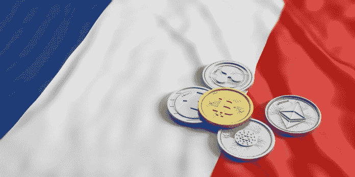

# 为什么法国成为 ICO 友好国家

> 原文：<https://medium.datadriveninvestor.com/why-france-is-becoming-an-ico-friendly-nation-4421007e846e?source=collection_archive---------32----------------------->

谈到基于加密的项目，法国并不总是被视为投资者和企业考虑的最佳国家之一。然而，风向变了，这可能会完全改变你的看法。

作为一个国家，法国在首次硬币发行(ico)和区块链发展方面一直处于边缘地位。

然而，在最近的新闻中，法国财政部已经开始认识到对 ico 的积极需求。简而言之，他们认为这有助于平衡 ICO 领域的创新和有毒投资。因此，法国金融市场监管机构*金融市场监管局* (AMF)已将 2018 年的 ICO 监管列为优先事项，未来的发展也将随之而来。

那么这意味着什么呢？

# 解读 AMF 报告

在 AMF 的年度报告中，它写道:*“…这项工作——特别是导致了 AMF 在 2017 年底就 ico 的不同管理方案进行公开磋商——旨在改变法国的监管框架，并为欧洲和国际工作组提供这些主题的信息。”*

《AMF 报告》还披露，AMF 已经启动了一个名为 UNICORN(ICO 研究与网络的通用节点)的项目，该项目将为企业提供支持并开展 ICO 研究。

该计划旨在为企业提供一个框架，并给予加密社区更多的透明度和保护，防止欺诈案件。

法国国内的进一步发展也表明，AMF 也将开始鼓励对 ICO 的学术研究，并将发起提高认识运动，使新的 ICO 投资者在参与之前了解所涉及的风险。

2017 年，AMF 发布了一篇论文，询问决策者他们希望如何监管 ico。82 名受访者中的大多数人投票支持一个具体的监管框架，但新法规是非强制性的。

# 未来会怎样？

在未来，我们应该会看到一份文件发布，其中包括告知代币购买者有关投资的来龙去脉、计划的进步以及他们拥有的任何权利的信息。

这将使法国成为一个非常透明和安全的地方，让创新者开始创造一些最好的基于密码的项目。

事实上，国际跨国公司国际商业机器公司(IBM)已经宣布，他们的目标是在未来两年内在法国创造 [1，800 个工作岗位](https://www.lemonde.fr/economie/article/2018/05/23/virginia-rometty-pdg-d-ibm-nous-allons-creer-1-800-emplois-en-france_5303293_3234.html)，以跟上区块链技术的不断发展。

法国将此视为向建立自己在人工智能和区块链领域的“卓越中心”迈出的一大步。

你对法国担任 ICO 全球之都有什么看法？可能吗？或者你认为这只是保持国家与其他欧洲领先国家竞争的一小步？

让我们知道你的想法。

*原载于 2018 年 8 月 30 日*[*【www.datadriveninvestor.com】*](http://www.datadriveninvestor.com/2018/08/30/why-france-is-becoming-an-ico-friendly-nation/)*。*