# 为什么是 Git？

> 原文：<https://medium.datadriveninvestor.com/why-git-f0a607f61a77?source=collection_archive---------0----------------------->

## 2.2 学习 Git

L *伊努斯·托瓦尔兹*发明了 Git 和 Linux，但他没有用[GitHub](http://github.com)**打补丁。**它是为开发 [**Linux 内核**](https://en.wikipedia.org/wiki/Linux_kernel) 而设计的。

他开玩笑说，他给 Linux 和 Git 都起了自己的名字。！

在开始探索更多关于 Git 的内容之前，我确实想到了一些问题:**我们为什么要使用**[**GitHub**](http://github.com)**？**

为什么我们不在 Google Drive 或 Dropbox 这样的云服务中直接复制文件和协作工作呢？

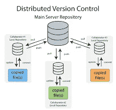

Git is a Distributed VCS

> 使用 Git 的原因是因为一些小功能，例如:
> -提交历史
> -在每次提交中做了哪些更改
> -它有能力回滚到时间线中的特定提交，即如果出错，丢弃最新的更改

完成以上所有步骤被称为“**版本化您的代码**”

> Git 是一个免费和开源的分布式版本控制系统的例子，旨在快速有效地处理从小到大的项目。

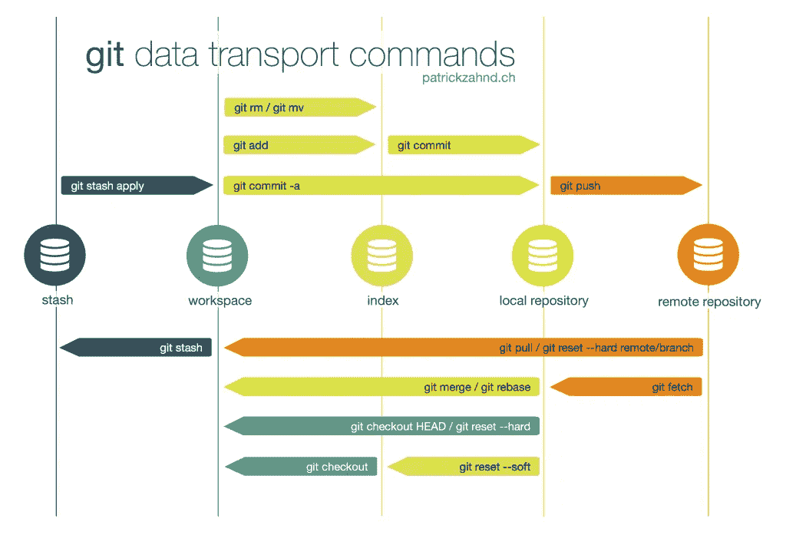

[http://obaida.info/blog/wp-content/uploads/2015/03/git-transport-v1.png](http://obaida.info/blog/wp-content/uploads/2015/03/git-transport-v1.png)

通常，人们在理解 Git 和 GitHub 之间的区别时会遇到问题。据全能[**stack overflow**](http://stackoverflow.com)，
**Git** 是分布式对等**版本控制系统**。… " **GitHub** 是一个基于 web 的*Git 存储库托管服务，它提供 Git 的所有分布式版本控制和源代码管理(SCM)功能，并添加了自己的特性。"*

*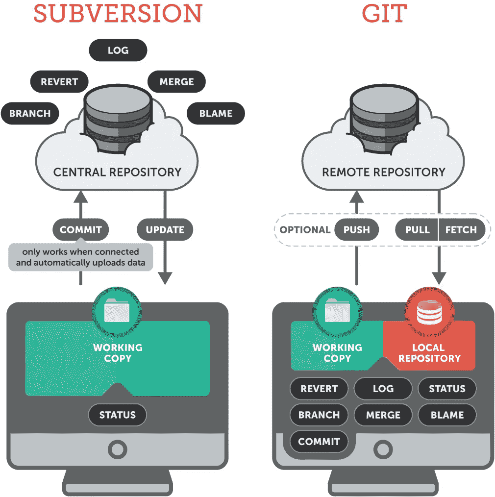*

*[https://www.git-tower.com/learn/content/01-git/01-ebook/en/02-desktop-gui/07-appendix/02-from-subversion-to-git/centralized-vs-distributed.png](https://www.git-tower.com/learn/content/01-git/01-ebook/en/02-desktop-gui/07-appendix/02-from-subversion-to-git/centralized-vs-distributed.png)*

*GitHub *是一个被许多程序员使用的强大平台，因为它独特的特性叫做版本控制，它允许人们存储多个版本的代码，并允许他们在它们之间遍历。**

* [## GitHub 学习实验室

### 边做边学，与 GitHub 学习实验室机器人一起完成任务，一步一个脚印。

lab.github.com](https://lab.github.com/) 

GitHub 是一个用于版本控制和协作的代码托管平台。它让你和其他人在任何地方一起工作。

本教程教你 GitHub 的基本知识，如*库*、*分支*、*提交*和*拉请求*。您将创建自己的 Hello World 存储库，并学习 GitHub 的 Pull Request 工作流，这是一种创建和审查代码的流行方法。

下面是一个简单的练习，可以帮助你开始学习新的东西。让我们从 GitHub 开始吧！

**您将学习如何:**

*   创建和使用存储库
*   开始并管理一家新的分公司
*   对一个文件进行修改，并将它们作为提交推送到 GitHub
*   打开并合并拉式请求

 [## 你好世界

### Hello World 项目是计算机编程中历史悠久的传统。这是一个简单的练习，让你…

guides.github.com](https://guides.github.com/activities/hello-world/) 

## 不需要编码

要完成本教程，您需要一个[GitHub.com 帐户](http://github.com)和互联网接入。你不需要知道如何编码，使用命令行，或者安装 Git(GitHub 构建的版本控制软件)。

## **提示:**在单独的浏览器窗口(或标签)中打开本指南，以便您在完成教程中的步骤时可以看到它。

# 第一步。创建存储库

一个**库**通常用于组织一个单独的项目。存储库可以包含文件夹和文件、图像、视频、电子表格和数据集—您的项目需要的任何东西。我们建议附上一份*自述文件*，或者一份关于你的项目信息的文件。GitHub 使得在创建新的资源库的同时添加一个库变得很容易。它还提供了其他常见选项，如许可证文件。

你的存储库可以是一个存储想法、资源甚至与他人分享和讨论的地方。

# 创建新的存储库

1.  在右上角，您的头像或身份图标旁边，单击
2.  然后选择**新建储存库**。
3.  将您的存储库命名为`hello-world`。
4.  写一个简短的描述。
5.  选择**用自述文件初始化该存储库**。

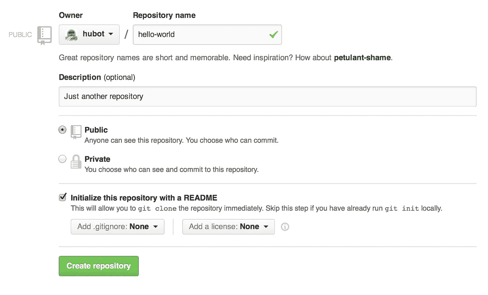

点击**创建存储库**。

# 第二步。创建分支

**分支**是一次处理不同版本存储库的方法。

默认情况下，您的存储库有一个名为`master`的分支，它被认为是最终分支。在提交给`master`之前，我们使用分支进行实验和编辑。

当您从`master`分支创建一个分支时，您正在制作`master`在该时间点的副本或快照。如果当您在您的分支上工作时，其他人对`master`分支进行了更改，您可以获取那些更新。

该图显示了:

*   `master`分公司
*   一个名为`feature`的新分支(因为我们正在这个分支上做‘特色工作’)
*   `feature`在并入`master`之前的旅程

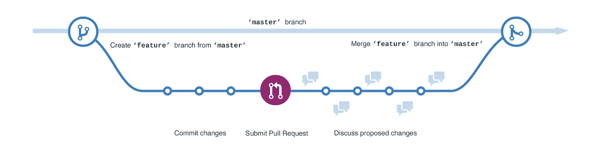

你曾经保存过不同版本的文件吗？类似于:

*   `story.txt`
*   `story-joe-edit.txt`
*   `story-joe-edit-reviewed.txt`

分支在 GitHub 存储库中完成类似的目标。

在 GitHub，我们的开发人员、作者和设计师使用分支来保持 bug 修复和功能工作与我们的`master`(生产)分支分开。当一个变更准备好了，他们将他们的分支合并到`master`。

# 创建新的分支

1.  转到您的新存储库`hello-world`。
2.  点击文件列表顶部的下拉菜单，显示**分支:主**。
3.  在新分支文本框中输入分支名称`readme-edits`。
4.  选择蓝色的**创建分支**框或点击键盘上的“回车”。

> [https://guides . github . com/activities/hello-world/readme-edits . gif](https://guides.github.com/activities/hello-world/readme-edits.gif)

现在你有了两个分支，`master`和`readme-edits`。他们看起来一模一样，但不会长久！接下来，我们将向新分支添加我们的更改。

# 第三步。进行并提交更改

太棒了。现在，您在您的`readme-edits`分支的代码视图上，它是`master`的副本。让我们做一些编辑。

在 GitHub 上，保存的更改被称为*提交*。每个提交都有一个相关联的*提交消息*，它是一个解释为什么做出特定更改的描述。提交消息捕获您的更改的历史，因此其他贡献者可以理解您做了什么以及为什么做。

## 进行并提交更改

1.  点击`README.md`文件。
2.  单击
3.  要编辑的文件视图右上角的铅笔图标。
4.  在编辑器中，写一点关于你自己的内容。
5.  编写描述您的更改的提交消息。
6.  点击**提交更改**按钮。

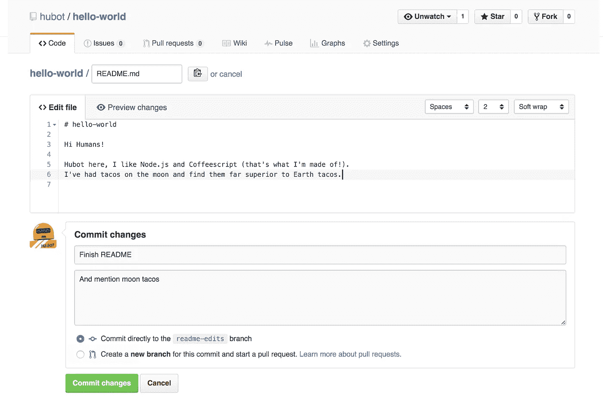

这些更改将只针对您的`readme-edits`分支上的 README 文件，所以现在这个分支包含了与`master`不同的内容。

# 第四步。打开拉取请求

不错的编辑！现在您已经在`master`的一个分支中进行了更改，您可以打开一个*拉动请求*。

拉请求是 GitHub 上协作的核心。当您打开一个*拉动请求*时，您正在提议您的更改，并请求某人审核和拉动您的贡献，并将它们合并到他们的分支中。拉请求显示来自两个分支的内容的*差异*。变化、增加和减少以绿色和红色显示。

一旦提交，您就可以打开一个拉请求并开始讨论，甚至在代码完成之前。

通过使用 GitHub [me](https://github.com/AbhishekBhattacharya) 或你的拉取请求消息中的某人，你可以向特定的人或团队寻求反馈，无论他们是在大厅的另一头还是在 10 个时区之外。

您甚至可以在自己的存储库中打开“拉”请求，并自己合并它们。在从事大型项目之前，这是学习 GitHub 流程的好方法。

## 打开对自述文件的更改请求

单击**拉动请求**选项卡，然后在拉动请求页面中，单击绿色的**新拉动请求**按钮。

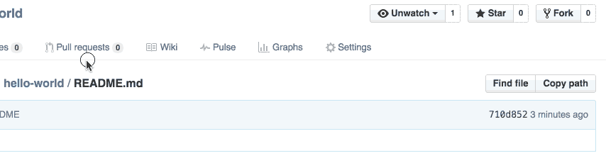

选择你制作的分支`readme-edits`，与`master`(原)进行比较。

在比较页面上查看您的差异更改，确保它们是您想要提交的。

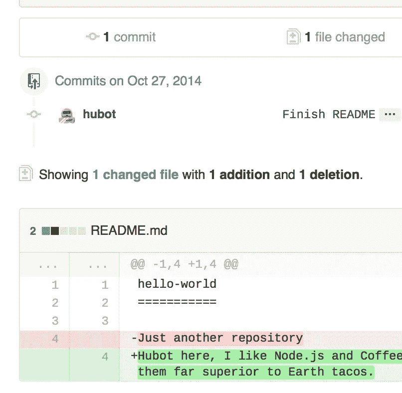

当您对要提交的变更感到满意时，单击绿色大按钮**创建拉动请求**。

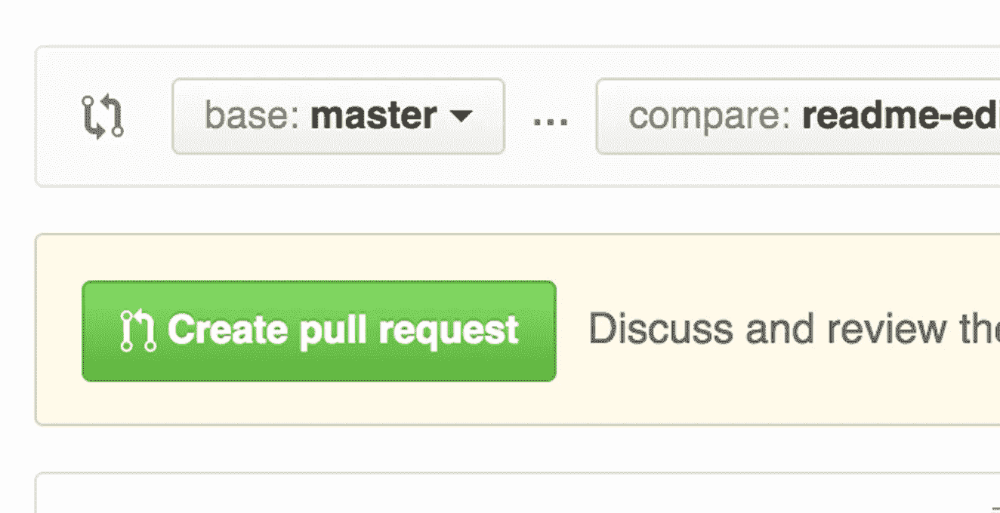

给你的拉取请求起一个标题，并写下你的改变的简要描述。

选择你制作的分支`readme-edits`，与`master`(原)进行比较。

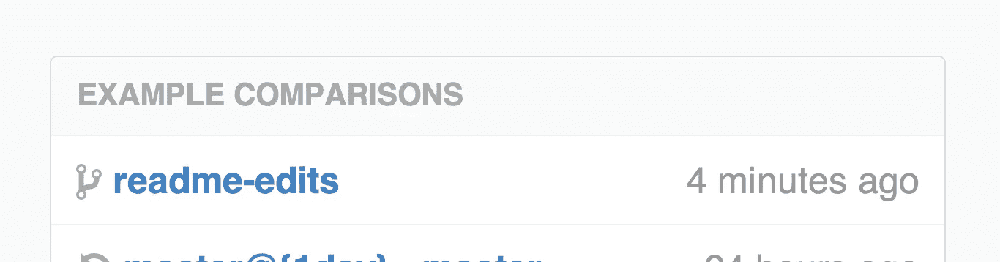

在比较页面上查看您的差异更改，确保它们是您想要提交的。

当您对想要提交的变更感到满意时，单击绿色的大**创建拉动请求**按钮。

给你的拉取请求起一个标题，并写下你的改变的简要描述。

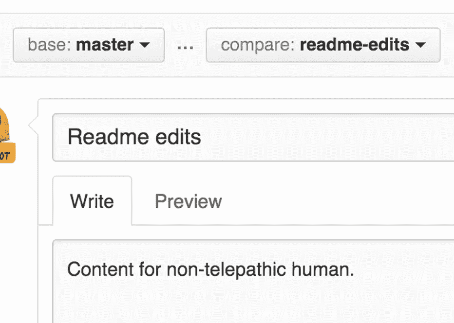

完成信息后，点击**创建拉式请求**！

> ***提示*** *:可以使用* [*表情符号*](https://help.github.com/articles/basic-writing-and-formatting-syntax/#using-emoji) *和* [*拖拽图片和 gif*](https://help.github.com/articles/file-attachments-on-issues-and-pull-requests/)*到评论和拉请求上。*

# 第五步。合并您的拉取请求

在这最后一步中，是时候将您的变更整合到一起了——将您的`readme-edits`分支合并到`master`分支中。

1.  点击绿色的**合并拉取请求**按钮，将变更合并到`master`中。
2.  点击**确认合并**。
3.  继续删除该分支，因为其更改已被合并，在紫色框中有**删除分支**按钮。

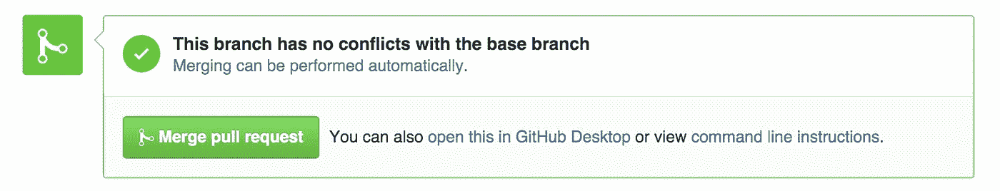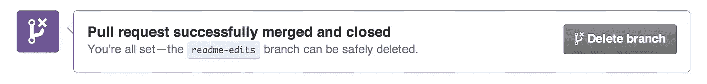

# 庆祝一下！

通过完成本教程，您已经学会了在 GitHub 上创建一个项目并发出一个 pull 请求！

以下是您在本教程中完成的内容:

*   创建了一个开源存储库
*   创办并管理一家新的分公司
*   更改了一个文件并将这些更改提交给 GitHub
*   打开并合并了一个请求

看看你的 GitHub 个人资料，你会看到你新的[贡献方块](https://help.github.com/articles/viewing-contributions)！

## 开始在 GitHub 上投稿，使用:

> [https://github.com/AbhishekBhattacharya/first-contributions](https://github.com/AbhishekBhattacharya/first-contributions)

开始你的第一笔捐款。

要了解更多关于拉请求的能力，我们建议阅读 [GitHub 流程指南](http://guides.github.com/overviews/flow/)。你也可以访问 [GitHub Explore](http://github.com/explore) 并参与一个开源项目

以下链接可用于熟悉 Git 及其术语:

 [## 一个非程序员的 Git 介绍- Scott 的博客-一个专门研究…

### Git 是一个分布式版本控制系统，被许多开源项目广泛使用。在这篇文章中，我…

blog.scottlowe.org](http://blog.scottlowe.org/2015/01/14/non-programmer-git-intro/)  [## 集中式和分布式版本控制系统的比较

stackoverflow.com](https://stackoverflow.com/questions/111031/comparison-between-centralized-and-distributed-version-control-systems)  [## 试试 Git

### 用代码学校的互动课程学习如何使用 Git，试试 Git。

try.github.io](https://try.github.io)  [## 学习 Git

### Git 是最流行的版本控制工具——开发者用来保存他们的…

www.codecademy.com](https://www.codecademy.com/learn/learn-git) 

下面的视频教程也很棒！

# 下一个

在下一篇博客中，我将讨论在你的机器上本地设置 [Hasura](http://hasura.io) 。

敬请期待！！*