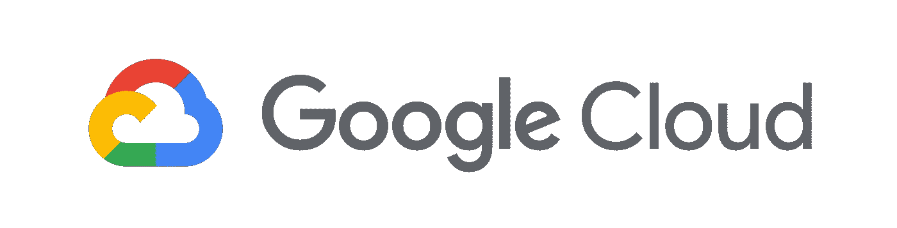

# 为什么为您的 M&E 工作负载选择谷歌云？

> 原文：<https://medium.datadriveninvestor.com/why-google-cloud-for-your-m-e-workloads-7385d7f97382?source=collection_archive---------3----------------------->

Source: [https://cloud.google.com/press/](https://cloud.google.com/press/)

**概述**

在担任了近十年的后期制作 IT 经理后，我开始体会到与 M&E 相关的许多特质。从紧张的预算和期限到依靠尖端技术来推动艺术的极限，其中不乏艰辛。虽然这是一项艰苦的工作，但超越它的许多挑战提供了一种大多数其他行业完全缺乏的感觉。

这类工作带来的传统挑战是繁忙时期的人员配备、硬件采购，以及最重要的保持在预算内。

 [## 信息图:云之旅|数据驱动的投资者

### 聪明的企业领导者了解利用云的价值。随着数据存储需求的增长，他们已经…

www.datadriveninvestor.com](https://www.datadriveninvestor.com/2018/09/22/infographic-journey-to-the-clouds/) 

进入云端。这是一个专门构建的基础，有助于促进创新，为公司提供更大的可能性，并提供前所未有的灵活性。利用云技术的公司能够更快地创新，专注于核心竞争力，并节省资金。创意人员现在正在全球范围内合作，构建只有在云计算规模下才有可能实现的电影世界。同样的技术也使流媒体平台能够使用复杂的网络和缓存架构向大众提供 4K HDR 的内容。

作为一个整体，云平台为行业做了许多伟大的事情。在基于 OTT 的工作流中，企业能够随着流量的增加和减少而扩大规模，只为他们需要的东西付费。试图预测流量并相应扩大规模的日子已经一去不复返了，最终往往是基础设施过剩。在后期制作中，我们看到无数制作公司将云计算用于突发渲染和云工作站。我以前的一个雇主，Luma Pictures，在一些最困难的漫威/迪斯尼场景中工作。使用 GCP，他们能够创建一个工作流，允许在更短的时间内进行更多的修订。此外，它允许渲染场几乎无限扩展，以满足紧迫的期限。使用传统内部资源的公司只能增加员工，并且在面临困难的截止日期时仍必须应对渲染瓶颈。有了云，他们可以调整计算机功率，以确保满足这些期限。最后，云归档存储非常适合将归档保存多年，没有磁带备份的复杂性、成本或缓慢的检索时间。

在我的 IT 管理生涯中，与许多云提供商合作后，我发现 GCP 最符合 M&E 的需求。谷歌在三个主要领域进行了超越亚马逊、Azure 和 IBM 的创新。

**档案存储+人工智能**

任何在后期制作部门工作过一段时间的人都知道故事片工作的进度压力。如果旧资产可以重复使用，就可以节省时间和金钱。GCPs 的所有存储层(包括归档层)都允许即时检索数据。例如，AWS 默认有 12 小时的等待期。有了这种类型的延迟，艺术家可能会更好地重新创建资产，并继续他们的任务。

在接下来的几个月里，GCP 将发布一个新的归档层。与传统的磁带工作流相比，每 TiB 成本略高于 1 美元，这很容易让人认识到成本的显著节约。试图找到无数年前创建的物理磁带的日子已经一去不复返了。这些数据也可以很容易地在谷歌领先的光纤网络的不同位置之间保持同步(见下面的网络部分)。

在利用 GCP 进行归档存储的同时，您可以利用人工智能工具来获得对数据的宝贵见解。所有媒体公司的一个共同点是大型数据集。这些通常包含不同类型的媒体资产，包括视频和静态图像。随着时间的推移，公司积累了数百 TB(如果不是数 Pb 的话)的资产。通过利用 Google 的视频智能 API 和 Vision API，资产库可以自动标记元数据。这创造了一种经济有效的方法，使得大型库可以用无限多的变量进行搜索。需要找到包含汽车的镜头吗？使用 Google 的 Vision AutoML 产品轻松创建模型，自动标记正确的资源。

**电脑&网络**

无论您是从事 OTT、后期制作还是广告技术，计算能力和网络可用性都是平台架构的最前沿。使用谷歌计算引擎，您可以创建自定义虚拟机。需要一台拥有强大 GPU 和最少 vCPU 内核的高内存机器吗？你能够创造这一切。使用 AWS，您会受到预定义实例类型的束缚，可能会浪费金钱。

此外，GCP 提供持续使用折扣。在客户没有任何承诺的情况下，谷歌将根据使用情况提供不同级别的折扣。运行计算工作负载的时间越长，折扣就越大。如果您对需要多少数量的核心有信心，承诺使用折扣甚至可以更高。

对于大多数媒体工作负载，安全性至关重要。谷歌是唯一一家不仅在区域间，而且在地区间运营私人光纤的提供商。这意味着您的数据在云中移动时保持安全。

**专长**

作为客户，给我留下深刻印象的一件事是谷歌对媒体和娱乐的深刻了解。他们有一个产品经理负责监管所有媒体事务。将这个行业视为一种产品，让谷歌能够从客户那里获得反馈，并在谷歌的大型产品套件中包含这些媒体的特定需求。

此外，有一个完整的解决方案架构小组致力于帮助谷歌的媒体客户。这些工程师来自屡获殊荣的工作室，拥有数十年的创作和技术经验。谷歌还提供专门研究 M&E 工作负载的客户工程师。正如你所看到的，有一个庞大的团队可以帮助你理解你的业务目标，并在 GCP 提供合适的工具来实现它们。

最后，还有专门从事媒体行业的谷歌云合作伙伴。我辞去了后期制作的工作，通过利用 SADA 的云来帮助客户创新。SADA 是谷歌云的首要合作伙伴，也是 2018 年度全球合作伙伴。我们有一个庞大的工程部门，并为我们的客户提供服务。在 SADA 和谷歌的媒体资源之间，您有一个专家团队准备好确保您有一个非凡的和变革性的云之旅。

**结论**

必须了解您当前的工作流程如何适应云平台。通过研究 GCP、AWS 和 IBM，你可以了解它们之间的区别，以及哪一个能带来最大的价值。我们看到越来越多的工作室利用云来完成几年前被认为是不可能的工作。至少，您需要知道将工作负载迁移到云的 TCO。了解相关的技术要求和运营优势对于战略决策至关重要。另一种选择是在竞争对手不断创新、通过削减资本支出成本来提高利润以及降低管理开销的时候被甩在后面。

您知道您的云总拥有成本吗？下面留言评论！