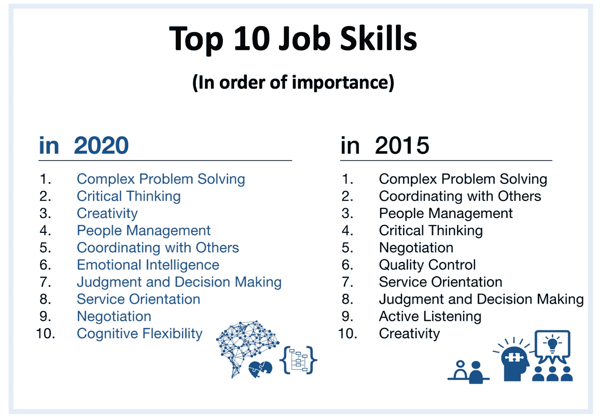
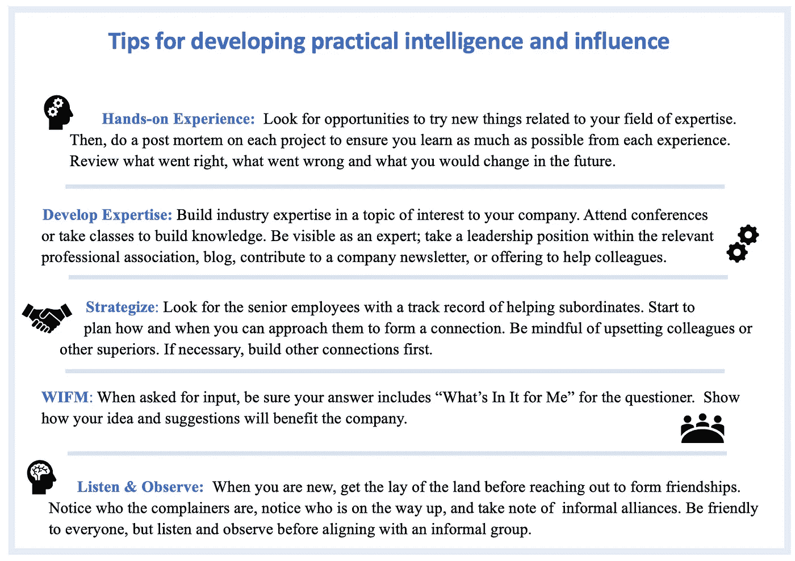

# 为什么努力和聪明被高估了成功

> 原文：<https://medium.datadriveninvestor.com/why-hard-work-and-brilliance-are-overrated-for-achieving-success-76f1361ea96b?source=collection_archive---------10----------------------->

## 相反，你的成功朋友关注的是什么

你的知识和技能是否让你在工作中成为一名有价值的员工，但不是一名有影响力的员工？你是否希望改变环境，但不知道该做什么或从哪里开始？

你知道如果你有一个平台将你的想法付诸实践，你可以做出更多的贡献 ***。***

如果你有影响力和权威，你会去解决紧迫的问题。你会做出辉煌的事情。你会吸引那些想要帮助你的人的注意，因为你的工作很出色，你让他们看起来很好。

你会在职业阶梯上步步高升。你会挣得更多，因为你的工作很重要，你会更有价值。

有了这些额外的钱，你将最终能够储蓄、投资并为你的家庭创造真正的财富。

> 但是问题来了——你没有影响力或权威，所以你渴望的成功已经远离了你。

你的成功朋友没有你那么精通技术，也不是最好的管理者，但是他们有一个平台和支持。今天，他们正在解决重要的问题，并获得相应的报酬。

你也渴望到达那里，但是你不知道如何去做。有时，你甚至不确定你知道“它”是什么。

如果你感到困惑，不能在事业上有所成就，我会给你一些你过去可能没有考虑到的原因。

然后，我会告诉你如何开始改变。

# **当传统的职业建议不奏效时**

你已经完成了困难的部分。你已经掌握了让你被聘用的技能，你已经学会了可以用来领导项目和团队的软技能。

你展示“勇气”，你“跳出框框思考”

但是，你远没有完成自己的剧本，而是被分配到了别人的项目中。你真正想要的是有机会充分发挥你的潜力，并获得相应的薪水和认可。

from [www.lynalden.com](https://www.lynalden.com/build-wealth/), “How to Build Wealth Fast -This Chart Shows What it Takes”

如果你想知道为什么认可和影响力对一些人来说似乎很容易，但对你来说却不是，那是因为努力工作和基于知识的技能已经不够了。

> 要在当今的组织中崛起，你必须能够赢得有影响力的人和能够帮助你推进职业发展的人。

Source: Future of Jobs Report, World Economic Forum

在专注于基于知识的技能多年后，你可能没有足够的实践来承担小组对话中的权力。如果力量的天平*碰巧向你倾斜，你会紧张或者大汗淋漓。问题是你还没有做得足够舒服和真实。*

因此，你会回避那些有助于提升你影响力的场合。

# 专家所说的当今最需要的职业技能是什么

你缺少一个关键技能，但这是一个很大的技能，所以和我呆在一起:

*能让你在世界上有效机动并得到你想要的技能，就是心理学家* [*罗伯特·斯腾伯格*](https://en.wikipedia.org/wiki/Robert_Sternberg) *博士所说的* **【实用智能】** *或 PI。*

> ***实用智能是*** ***“知道对谁说什么知道什么时候说，知道如何说才能达到最大效果。”***

圆周率与分析智能没有关联——你可以拥有一个，但不能拥有另一个。它是程序性的；这是关于知道如何做某事。在意识层面上，你可能不知道为什么你知道——你就是知道。

如果你的成功朋友能平稳地处理权力关系，但不能告诉你他们做了什么，他们可能使用了高 PI。

这里有两个例子:

Graphics from https://vecteezy.com

几十年来，甚至几百年来，实用智能一直是一个强有力的工具。看看这两个美国天才的真实对比:

根据 Sternberg 博士的观点，实用智力是一种习得的技能。你越早学习并开始练习，你就会学得越好。

那么它最初起源于哪里呢？像许多事情一样，它始于你的青年时代，伴随着你的成长。

# **两种截然不同且不平等的育儿方式**

社会学家安妮特·拉罗对实际智力的来源给出了最好的解释。她对三年级学生的家庭进行了一项研究，希望找到多种育儿哲学。相反，她发现只有两个:

*   第一种哲学她称之为 ***“自然成长的修养”。*** 这是孩子在计划外的活动中主要与同伴互动的时候。他们没有得到父母关于如何与成年人沟通的指导。一般来说，他们很少有机会和成年人&上级进行半平等的交谈。
*   第二种哲学她戏称为 ***【协同修炼】*** *。从孩子很小的时候开始，父母就鼓励和指导每个人在大人和上级面前培养自信和自信。孩子们经常有不止一个有组织的活动(足球，童子军，钢琴课等)，他们学习阅读社交场合。而且，父母*期望*他们质疑并与上级协商。*

如果你的朋友得到更多的**“协同培养”**哲学，他们很早就学会了实践智慧，并且有几十年的时间去实践。他们更愿意在群体中掌权，甚至是在上级中。他们通过说服和谈判来获得他们想要的东西，他们的世界没有那么等级森严。

他们寻找有利于职业发展的联盟和关系。通过自然对话，他们了解每个人的动机，然后以能引起决策者共鸣的方式提出想法。如果他们的想法赢得支持，他们可能会负责。如果没有，也没关系；他们会有其他的机会，因为这些人相信他们，希望他们成功。

相比之下，低绩效指数的员工还没有建立关系或建立支持。如果他们提出一个想法，它不太可能被采纳。如果是的话，也不能保证他们会掌权，所以他们收获很少。

# **现在规则变了怎么办**

幸运的是，即使你小时候错过了，你也可以学习和实践实用智能。把自己放在新的社会环境中来练习建立融洽的关系。这需要自信、社交能力，以及知道自己想要完成什么。

对于高后果的情况，比如在你的工作中，提前做一些功课，这样你就知道你的话题，知道如何接近一个人或一群人。以下是一些建议:

# **成为你想要的改变和影响&金钱会随之而来**

作为一个人，你是谁，你的影响力，以及你的工作质量都完全在你的掌控之中。不要希望你的环境改变，你可以让改变发生。你可以成为有影响力、有能力赢得支持、做大事的人，那种吸引成功的人。开发高实用智能是一项有帮助的基本技能。

你将与上司和有影响力的人建立持久的关系，他们会给你一个平台和解决问题的权威。你的价值会增加十倍，这意味着你可以要求更高的薪水。

你将最终掌控自己的未来。你开始不兴奋吗？