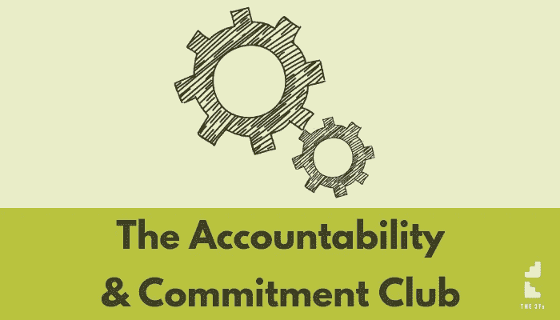

# 为什么只有目标是不够的&一个帮助你实现目标的系统

> 原文：<https://medium.datadriveninvestor.com/why-having-a-goal-isnt-enough-a-system-to-help-you-get-there-51c34273a8?source=collection_archive---------14----------------------->

新年伊始，人们谈论了很多关于设定明年目标的话题，并感到鼓舞，仿佛这将是有史以来最好的一年。

就是这个想法…

但我们知道，在现实中，对于许多设定这些目标的人来说……这不会持续很久。

为什么…？设定目标有问题吗？

当然不是。

对自己想要达到的目标有一个愿景并没有错。

然而……有一个目标或愿景只是过程的一部分。

为了得到你真正想要的东西，目标是必要的，但还不够。

# 一个例子

以奥林匹克运动为例。

目标是什么？

对大多数人来说，是为了赢得金牌，对吗？

然而，只有一个人能在单个项目中赢得金牌。

是不是其他人都有错误的目标？

几乎没有。

这说明了一个现实，有目标并不足以实现目标。

它可能会为你提供一些焦点、方向和动力…然而这还不够。

那么……什么会有所不同呢？

# 答案

实现你的目标所必需的，是要有一个方法或一个系统…去找出你要去那里的方法。

制度其实比目标本身更重要。

当你有了实现你想要的结果的系统…

…这将更容易实现。

当你知道如何得到你想要的，你就知道该怎么做。

而没有系统…嗯，你大概经历过这是什么样的(很多次！)—一个尝试和放弃的溜溜球套路。

我们都做过(没完没了？！)—转换到一个新的想法，尝试不同的东西……而事实上你需要做的只是搞定这个系统。

当你设计你的方法去实现你想要的东西的时候，生活和商业就会开始变得更加顺畅。

这样做你可能会变得不那么忙…

**那也是我**

我会设定雄心勃勃的目标，感到有动力、有灵感并准备好投入行动。

和我认识的几乎所有人一样，我只能在短时间内保持专注和承诺。其他优先事项(闪亮的物体？！)引起了我的注意。

结果呢？

时间过去了…当我回头看时，我可以看到我一直很忙…但还没有接近我的目标。

**所以我设计了一个系统**

事实是，我不相信“大规模行动”……至少对我来说是这样。

这没什么不好——大规模的行动完全有可能取得大的成果！

但是我发现我无法维持那样的强度和表现。

相反，我发现通过许多小行动来前进要容易得多。

诀窍(如果你可以这么说的话)是坚持不懈地采取这些小行动。

令人沮丧的是，这带来了另一个问题——采取一致的行动。

我知道我不是一个人在断断续续地工作，而是一直在工作。

所以…我也需要一个能处理一致性问题的系统。

这就是我所建立的。

我希望你也拥有这套系统。

有没有一个系统可以帮助你决定什么是重要的…无论是未来还是现在？

那么，一个支持你做出必要决定的系统怎么样呢？

使用您已经在使用的系统怎么样？(我最不想要的就是手机上的另一个应用程序！)

这就是我设计的……现在我希望你也能使用它。

当我和你分享它的时候，我想它需要一个名字。

这个系统的工作原理是为你自己创造承诺，然后它帮助你检查你是否完成了这些承诺…所以它是责任和承诺的结合。

所以我称它为责任与承诺俱乐部(简称 ACC)。

这不是一个社区意义上的俱乐部——没有 FB 小组，没有聚会。已经有很多这样的工具可供你使用，你根本不需要另外一个来让一个系统为你工作。

这是一个俱乐部，因为这个系统有许多用户。

如果你想在接下来的 12 个月里通过关注小步骤获得“惊人的成功”,那么你可以加入这个俱乐部来体验它是如何为你工作的。

这里有更多信息和邀请函:【https://the3Fs.com/acc-join

每周 10 分钟左右，每天 3 分钟。

如果你能找到时间，我想你会在 ACC 做得很好。

我希望你接受邀请。

前往战略导师[博客页面](https://www.strategicmentors.co.uk/blog/)获取更多关于如何发展业务的技巧和诀窍。