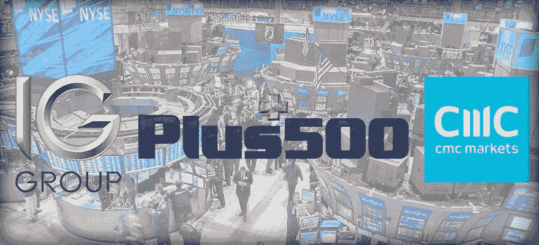
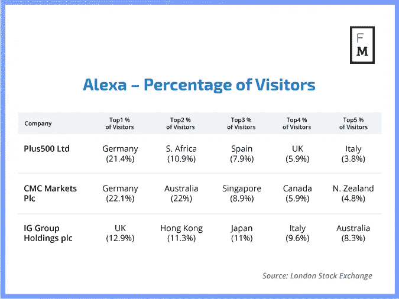
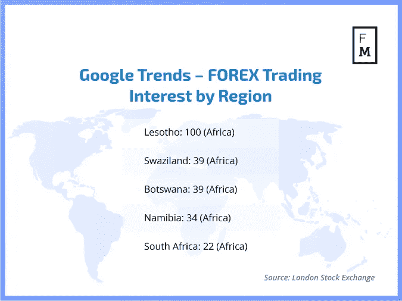
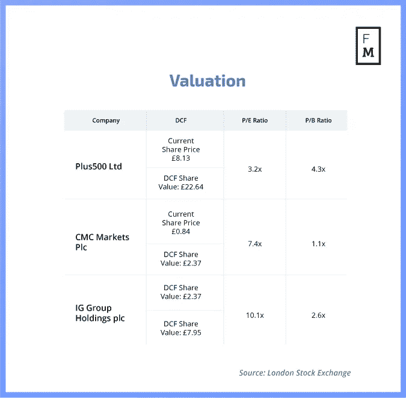
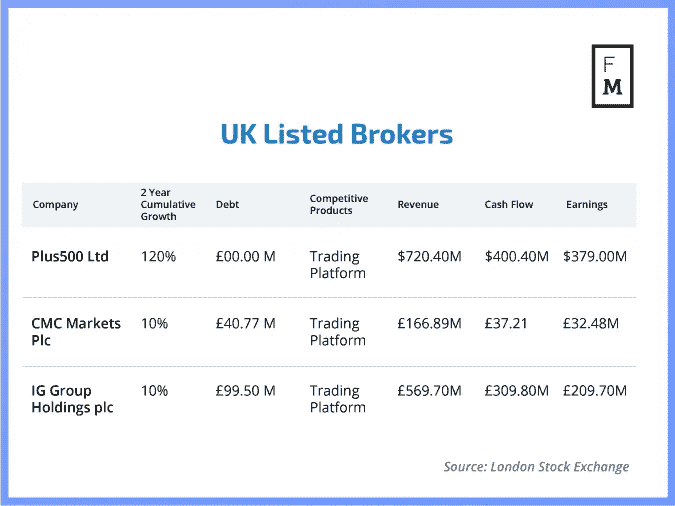

# 为什么市场波动加剧对零售外汇经纪商很重要

> 原文：<https://medium.datadriveninvestor.com/why-heightened-market-volatility-is-important-for-retail-fx-brokers-d0f1300b5a2c?source=collection_archive---------6----------------------->

## …以及如何解决这一问题——使用伦敦证券交易所上市外汇经纪商的循证方法

正如我在题为“零售欧元/美元外汇市场的异质性和技能——调查不确定性和交易者技能的行为偏差的影响”的博士论文[中所讨论的，有大量证据表明市场波动和交易者参与之间存在正相关关系。](https://kclpure.kcl.ac.uk/portal/files/97918343/2018_Zamboglou_Demetrios_1061417_ethesis.pdf)

潜在的原因似乎是，市场波动加剧会导致价格大幅波动，交易员将此解读为潜在的高利润。然而，高波动性也可能对业绩不利，尤其是对于高杠杆交易头寸。结果，市场波动越大，交易者就越不能判断市场的方向，因此，个人就越不可能展示他们的技能。

换句话说，随着时间的推移，波动性的增加会对交易者的技能和表现产生负面影响。

 [## 机器学习对外汇交易的挑战——数据驱动的投资者

### 机器学习是人工智能的一个分支，之前占据了很多头条。人们是…

www.datadriveninvestor.com](https://www.datadriveninvestor.com/2019/02/18/the-challenge-of-forex-trading-for-machine-learning/) 

为了确定金融经纪人的当前波动性，人们可以衡量[外汇欧元 VIX 波动指标](https://markets.businessinsider.com/index/fx-euro-vix)。由于外汇经纪商之间的大部分订单流发生在欧元/美元货币对中，市场波动直接反映了底线盈利能力。推而广之，人们可以假设市场波动越大，经纪人的盈利能力就越高。

# 我们如何衡量经纪人的“质量”？

[优质投资](https://en.wikipedia.org/wiki/Quality_investing)是一种新的投资策略，它可以教会我们一项投资是否值得长期追求。

以下是五个关键属性:

1.  市场定位:行业有增长潜力吗？
2.  商业模式:公司是否健康(不断增长的营业额、低负债和有竞争力的产品)？
3.  公司治理:公司是否有合适的高层管理人员和规模？
4.  财务实力:公司是否有财务动力(收入、现金流和收益)？
5.  有吸引力的估价表现为:

*   高贴现现金流(DCF)；
*   低市盈率(市盈率)；
*   低价格与帐面价值比率(市净率)。

如果我们将“质量战略”应用于英国最大的经纪商，我们可以获得以下结果。

# 国际清算银行——一个不断增长的市场

**零售外汇市场正在增长吗？**

要回答这个问题，我们可以参考[国际清算银行最近的报告](https://www.bis.org/publ/rpfx16fx.pdf)来发现，从 2013 年到 2016 年，外汇市场在即期外汇交易方面经历了负增长率。

如果这是真的，我们希望看到进一步的市场整合(监管，更高的注册会计师，等等。)——而这正是我们在过去三年里所看到的。

Alexa — Percentage of Visitors

Google Trends — FOREX Trading Interest by Region

# **商业模式**

截至 2019 年 3 月 8 日的公司现状快照，包括营业额增长、债务和竞争产品。

**公司| 2 年累计增长|债务|竞争产品**

[**plus 500 ltd .**](https://www.plus500.co.uk/Investors/FinancialHighlights)**| 120% | 00.00m |交易平台**

**[**CMC Markets Plc**](https://www.cmcmarkets.com/group/results/three-year-summary)**| 10% | 40.77 米|交易平台****

****[**IG 集团控股有限公司**](http://www.iggroup.com/investor-relations/financial-results/five-year-summary) |25% | 99.50M |交易平台****

# ******公司治理******

****[**加上 500**](https://www.reuters.com/finance/stocks/company-officers/PLUSP.L)****

****首席执行官:[阿萨夫·埃利米勒](https://www.linkedin.com/in/asaf-elimelech-37945689/)****

****一个 UTIP 应用程序中外汇经纪人的最佳 PSP[转到文章> >](https://www.financemagnates.com/thought-leadership/the-best-psps-for-forex-brokers-in-one-utip-app/)****

*   ****年龄:37 岁****
*   ****任期:2.8 年****
*   ****学历:会计和经济学学士(海法大学)****
*   ****经历:审计师(普华永道以色列)****

****领导:18 人，平均年龄 43 岁(基于 17 人的样本量)。****

****[**军委集贸市场**](https://www.reuters.com/finance/stocks/company-officers/CMCX.L)****

****首席执行官:彼得·克鲁达斯****

*   ****年龄:65 岁****
*   ****任期:6 年****
*   ****经历:银行和贸易****

****领导:8 人。****

****[**IG 组**](https://www.reuters.com/finance/stocks/company-officers/IGG.L)****

****首席执行官:[朱恩·易·菲利克斯](https://www.linkedin.com/in/junefelix/)****

*   ****年龄:61 岁****
*   ****任期:1.2 年****
*   ****学历:化学工程学士(匹兹堡大学)****
*   ****经历:咨询和银行业****

****领导层:12 人，平均年龄 58 岁(基于 8 人的样本量)。****

****************

# ****在低波动时期，零售外汇经纪商有哪些选择****

****在市场波动性较低的时期，经纪人需要采取行动来保护自己的盈利能力。最典型的选项包括:****

1.  ****交易、产品、客户或净未结头寸限额(NOP)的 A-Book(对冲)e. VaR 或替代物；****
2.  ****增加产品的差价和展期费用，如增加加价；****
3.  ****增加停止水平，例如从 20%到 50%,在某些情况下甚至更高；****
4.  ****通过衍生产品和/或新产品形式的额外产品实现多样化，以增加交易量；****
5.  ****在某些管辖区增加杠杆(如果可能)并引入“浮动”杠杆。****
6.  ****更严格的风险管理和风险缓解 e .对客户和产品头寸的限制。****

# ****未来的 CEO 和未来的公司****

****当谈到领导一家公司时，整体思维非常重要，尤其是在领导岗位上。一些公司可能在开始时表现出这一点(加速增长)，但需要随着时间的推移继续这样做。****

****在某些方面，这个规则的例外是**加 500** 。该公司一直在努力推出吸引零售商的新产品。这可能意味着需要改变管理，需要促进产品创新。它目前的困境可能意味着该公司将被迫在不久的将来推出一系列新产品。****

****[**CMC markets**](https://hbr.org/2016/12/the-5-skills-that-innovative-leaders-have-in-common) 可能有能力通过聘用或提拔自己人担任营销领导角色来展示其坚韧不拔的精神。这一举措将与 Forextime 和 XM 等低线高增长公司实施的操作方式形成鲜明对比，并将寻求抓住当前的市场机遇，扩大其在新兴市场的增长。CMC 管理层可能决定包括营销和产品创新，而不仅仅是削减成本的模式。****

****最后， **IG Group** 应该保持其主导地位，密切关注当前的竞争，不要被众所周知的“美国梦”分散注意力。IQ Option、Olymp Trade 和 XM 等新的市场进入者一直在抢占市场份额，但 IG 已经做好了应对的准备。对这家英国券商来说，坏消息是，它已变得专注于内部政治，而不是专注于创新和维持其战略目标。****

****在许多方面，IG 已经成为一个营销工厂，拥有类似好莱坞系列片《纸牌屋》的铁板一块的官僚机构。就像在系列中一样，可能是时候让一个更精简、更雄心勃勃的现代和进步的领导团队取代旧的精英了。这是 Plus500 走过的发展道路，也可能是 IG 董事会考虑的一步棋。****

****当经纪人遇到低市场波动时，可以实施各种缓解措施来降低对业绩的连锁效应:****

1.  ****重组，包括降低成本和竞争分析；****
2.  ****简化和推广创新产品；****
3.  ****投资数字营销并在新市场获得曝光率；****
4.  ****更加注重留住客户，减少高成本的客户获取计划。****

*****原载于 2019 年 3 月 21 日*[*【www.financemagnates.com】*](https://www.financemagnates.com/institutional-forex/why-heightened-market-volatility-is-important-for-retail-fx-brokers/?tg=1553160583)*。*****