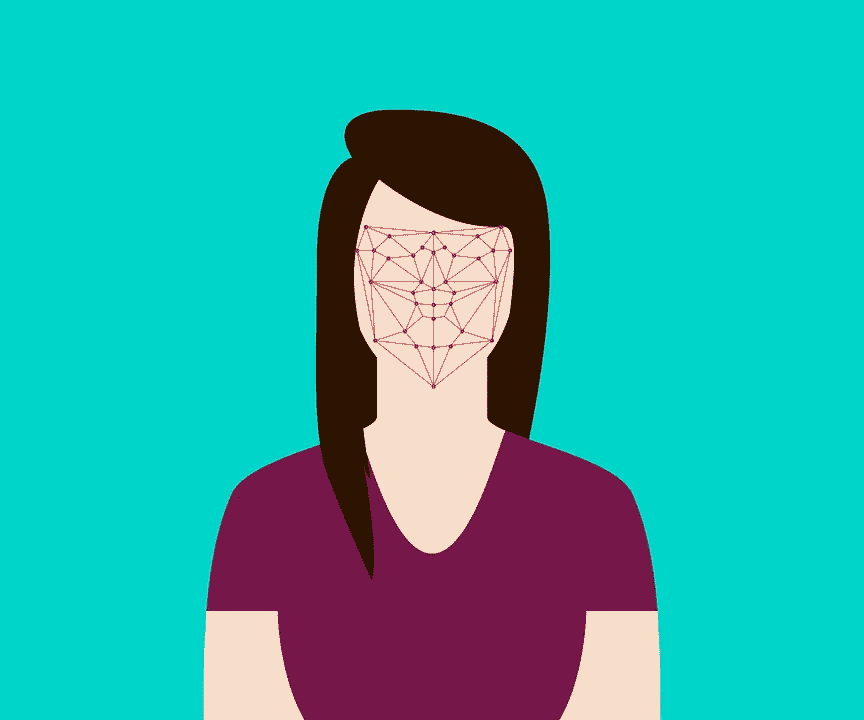

# 为什么以及如何使用面部识别

> 原文：<https://medium.datadriveninvestor.com/why-how-we-should-be-using-facial-recognition-62289df1a82?source=collection_archive---------16----------------------->

面部识别技术正在慢慢进入英国的公共部门。它可以帮助识别犯罪分子，控制赌博成瘾，但并不是每个人都参与了这项技术运动。虽然在警察部队和医疗保健等公共部门组织中使用面部识别有一些明显的优势，但在隐私和控制这些系统中存储的数据方面也有一些明显的劣势(T2)。由于目前英国法律中没有提到面部识别，法律是否应该更新以考虑面部识别？或者是每个人都关心自己吗？**让我们来看看……**

Facial Recognition: Are You A Fan? — Credit: [Pixabay](https://pixabay.com/illustrations/flat-recognition-facial-face-woman-3252983/)

## 面部识别到底是什么？

面部识别是使用摄像机捕捉一个人面部的“地图”。面部特征是使用相机和软件绘制的，例如，面部识别的一个关键特征是你双眼之间的距离。来自所有不同测量的数据然后被存储为一个**面部特征**。然而，这引起了隐私问题。有人能黑进面部识别数据库，从这些数据中编辑出你的面部照片吗？你可能不知道，但是乔治城大学的一项研究发现，一半的美国成年人将他们的脸存储在一个或多个面部识别数据库中。

重要的是要知道面部识别技术不止一种。相当多的存在，一些商业和一些纯理论的研究项目。2014 年，[脸书开发了一款名为 DeepFace 的面部识别软件](https://www.technologyreview.com/s/525586/facebook-creates-software-that-matches-faces-almost-as-well-as-you-do/)，该软件经过测试，旨在了解它在区分同一个人的两张陌生照片方面的能力。虽然人类可以在 97.3%的时间里正确无误，但软件却能在 97.25%的时间里正确无误，只比普通人少了不到 1%！

 [## 人们对隐私的不理解是什么？-数据驱动型投资者

### 你知道那种感觉。无论是访问应用程序、订阅还是你最喜欢的运动鞋。你按下…

www.datadriveninvestor.com](https://www.datadriveninvestor.com/2019/04/11/privacy-and-convenience/) 

## 为什么我们应该/不应该使用面部识别？

虽然有些人同意我们应该使用面部识别，没有什么可隐瞒的，但有些人仍然担心围绕该软件的隐私问题。例如，如果黑客设法进入面部识别数据库，理论上，他们可以对计算机的算法进行逆向工程，找出面部特征的测量值，然后使用这些数据来编辑计算机生成的用户照片。虽然我可以看到面部识别被用于越来越多的安全场合，例如解锁你的银行账户应用程序。我认为面部识别数据库是网络罪犯非常有利可图的目标。接下来不仅是面部签名本身的问题，还有存储在它们后面的数据的问题。这些数据可能包括你的姓名、购物习惯、购物次数，甚至更多关于你的私人数据。在我看来，这才是真正的问题。如果服务器被犯罪分子入侵，与面部签名一起存储的数据可能会构成真正的安全问题。

许多人还说，我们应该支持面部识别，只要它得到监管和正确使用，但正如我之前提到的，在英国法律中绝对没有**提到面部识别技术。这意味着面部识别技术不受**监管**，这意味着只要不违反现有法律，公司就可以在任何范围内使用面部识别。无论是帮助他们的商业活动，还是出于任何原因与第三方分享数据，反正在英国，除了老牌的 GDPR 没有什么能阻止他们这么做。**

**说到**[**GDPR**](https://eugdpr.org/)**……你知道那个被遗忘的** [**吧？**](https://eugdpr.org/the-regulation/) 好吧，很多人都在面部识别数据库上，甚至自己都不知道！虽然许多数据库都有要求从它们中删除的方法，但是您如何知道自己是否又被另一个数据库捕获了呢？当您甚至不知道自己是否在数据库上时，您怎么知道何时向数据库所有者发送删除请求呢？！更好的预警方法和更好的监管需要到位，以控制这种技术，在一些可以做一个世界的好，做一个宇宙的坏…

## 我们应该如何使用面部识别？

就我个人而言，我认为我们应该以这样一种方式使用面部识别，即人们可以通过应用程序或电子邮件得到警告，如果你被面部识别相机捕获并添加到数据库中，他们已经被登录到面部识别数据库中。从这个应用程序，你应该有权利被从数据库中删除，如果你想。当涉及到警方的数据库时，问题就出现了，你应该有权把自己从这些数据库中删除吗？从未被定罪或逮捕过的无辜者应该被列入名单吗？这些都是值得思考的有效问题…