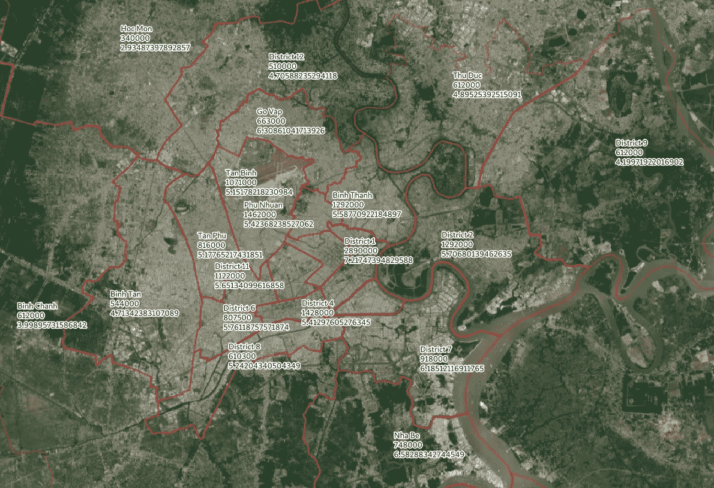
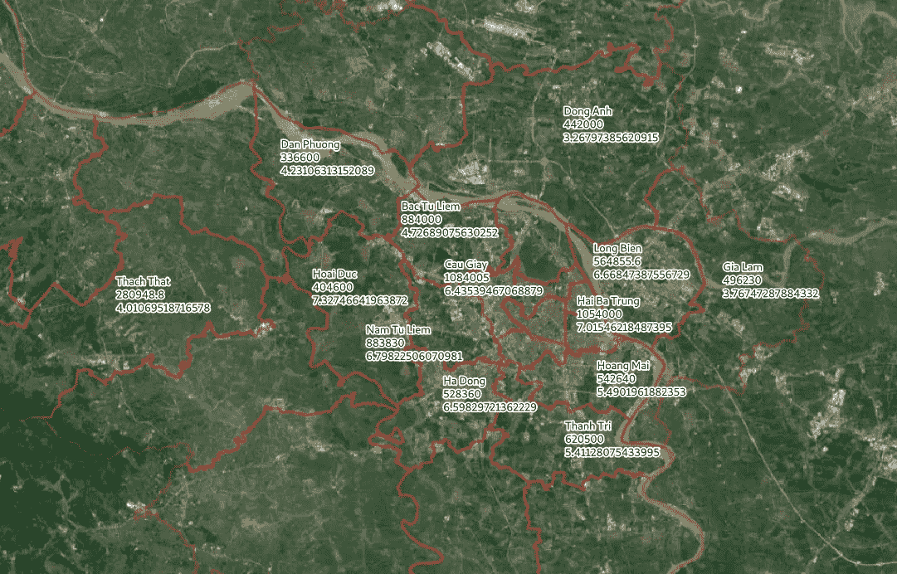

# 为什么我改变了购买越南房产的主意

> 原文：<https://medium.datadriveninvestor.com/why-i-changed-my-mind-in-purchasing-vietnam-property-d3e8c82aad57?source=collection_archive---------4----------------------->

唐纳德·特朗普(Donald Trump)在越南首都河内会见朝鲜领导人金正恩后，越南引起了我的注意。出于好奇，我开始对越南进行一些研究，我发现越南的 GDP 增长非常令人印象深刻，2018 年约为 7%。最近的外国直接投资(FDI)达到创纪录的 167.4 亿美元，同比增长 69%。

作为一个年轻人，自然本能和资本主义促使我去寻找像房产这样的投资机会。作为一名数据分析师，我通过收集和发现数据中的洞察力来寻找投资机会。

# 越南房产的吸引力

## 返回

我从当地著名的房产网站 [Batdongsan、](https://batdongsan.com.vn/nha-dat-cho-thue)上删除了一千多页的房产数据，并试图做一些分析。

计算出的平均回报率为 6.37%。如果与香港相比，回报率相当高(约 2%至 3%)。房产的回报的意义就是每年会产生多少现金流与房产价格相比(r = cash flow _ year/房产价格)。这也可以看作是永续公式中的回报(PV = D/r →房产价格=现金流 _ 年/r)。

在做了整个胡志明市，和河内市的平均之后，我想我找到了一个机会！然后我开始仔细观察。市内不同区的回报呢？(幸好我是环境顾问，所以我用了 GIS。)

Ho Chi Minh City, Median Price (HKD), Median Return (%)

对于胡志明市来说，你马上可以从图中看出，1 区是均价最高的市中心。而且中心周边地区的回报也相当不错。5%的回报随处可见。(我好激动！)

河内也是！

Hanoi, Median Price (HKD), Median Return (%)

## 价格

价格是另一个重要因素。香港的楼价是全球最高之一。在香港购买一套中等面积房产的首付可以在越南购买一套相当不错的公寓。可以仔细看看上面 2 个图。在胡志明市，即使是市中心的 1 区，房价中值也只有 13 万英镑。

还没说，房价不是本地人能承受的。在胡志明市，平均工资在 300 美元左右。

# 非本地人的障碍

## 所有权证明

2015 年修订住房法后，获准进入越南的外国人有资格拥有房产。

最有力的所有权证明是土地使用权和土地上房屋及其他资产的所有权证明。简而言之，粉红色的书。

但是给外国人买粉红色的书并不容易。理论上，住房法修改后，外国人有资格获得粉红色的书，这是所有权。但是，外国人不得在划定为国防和安全的土地区域拥有房屋，并且在省级层面，各部门可能没有允许外国人购买的项目列表(对于河内，似乎他们在 2018 年 3 月有一个[列表](http://www.soxaydung.hanoi.gov.vn/vi-vn/tin/danh-sach-cac-du-an-nha-o-thuong-mai-cho-phep-to-chuc--ca-nhan-nuoc-ngoai-duoc-so-huu-tren-dia-ban-thanh-pho-ha-noi/272308-516106-979937))。一些房产中介告诉我，他们从来没有见过外国人拿到一本粉红色的书。一些房地产经纪人告诉我他们看到了。信息是矛盾的。

那么你可能会问，如果他们不能得到粉红色的书，为什么他们购买的财产。还有其他安排，包括销售购买协议(SPA)和长期租赁协议(LTLA)。它们通常与房地产开发商签订。

## 融资

融资不像香港。很难获得抵押贷款，利率很高，比如 10%。所以，就算是对本地人来说，也是全额支付。

如果你有钱，那很好。但是，如果你没有，你需要寻找其他融资方式，例如，个人贷款。但是，期限太短，你需要等待几年才能从你的财产中获得正现金流。

# 吸取的教训

作为一名数据分析师，我通常通过首先查看数据来解决问题。但是，实际上，还有更多因素需要考虑。如果我能看看立法，并首先保护所有权，我可能不需要花几个小时来写一个程序来抓取网页。

它就像一棵决策树。您首先使用具有最高信息增益的因子。:)