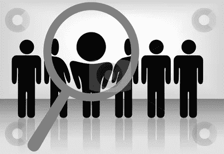

# 我为什么选择人？

> 原文：<https://medium.datadriveninvestor.com/why-i-choose-people-6a46bfc2a52f?source=collection_archive---------4----------------------->

人们很大程度上对自己的工作不满意，即使他们做的项目很好，薪水也很高。就他们想做的事情而言，他们变得越来越挑剔和谨慎。我们不再处于父母工作的时代。在这个时代，人们很大程度上满足于朝九晚五的工作，这给了他们工作保障、稳定的工资和尊重。

但是当我说我们变得更加挑剔时，那是什么意思呢？我们选择什么？我们是在选择薪水、有趣的项目、好的津贴、好的工作生活等等吗？

 [## 零工经济如何改变未来的就业前景——数据驱动的投资者

### 随着自动化的发展和 Z 世代的出现，劳动力的构成和动态正在发生变化…

www.datadriveninvestor.com](https://www.datadriveninvestor.com/2018/12/19/how-is-the-gig-economy-changing-the-future-jobs-landscape/) 

简而言之，我认为每个人都想要一个美好的未来，他们有不同的标准来决定什么是好的，因此不同的人有不同的选择。这些衡量标准可以是稳定的收入和增长、有足够的时间和爱人在一起、有成就感等等。

现在我同意，基于个人的欲望和对生活的期望，以上所有的选择都是有效的。但是我们大多数人忘记了做一个非常重要的选择，即选择我们应该一起工作或为之工作的人。现在，这些人可能是你的导师、经理、领导、客户或者仅仅是你的同事。与你直接互动或工作的任何人。

我敢肯定，在你人生的某个阶段，你的老师或父母一定告诉过你，你应该和优秀的人交往并交朋友，因为一个人可以通过他交的朋友而了解他。这是非常明显的，同样适用于你的公司生活。好与坏的定义是与上下文相关的，可以因人而异。对我来说，任何有知识并愿意教我不知道的东西的人都可以。这些事情可能与我的工作直接相关，也可能没有。

如果你不和优秀的人一起工作，一份完美的薪水或这个世界上最有趣的项目迟早会变得令人沮丧和无聊。即使在这个数字世界，你的大部分知识也来自你周围的人。这些学习可以分为三类。首先，直接与工作相关的知识。第二，与你的工作没有直接关系但对你同样重要的知识；第三，通过与这些优秀的人在一起学习更多知识的动力。

选择好的薪水、好的项目、好的工作文化更容易，因为你有客观的衡量标准来决定。但是选择优秀的人是不客观的，你可能最终只是相信你的勇气。尽管如此，这不应该阻止你继续寻找。这个世界充满了伟大的人和领袖。你只需要不断寻找机会，并准备好抓住机会。这是连锁反应。你开始和优秀的人一起工作，你开始做好你的工作，因此你会被其他优秀的人注意到，你继续前进。大多数时候只需要一个开始，其余的会自然发生。

现在有两种方法可以让这些好人看到你。首先是通过你的努力工作和求知欲&变得更好，其次是通过你自己成为一个好人。

最后，我会留给你以下的想法:

***“知其人，不知其友”***