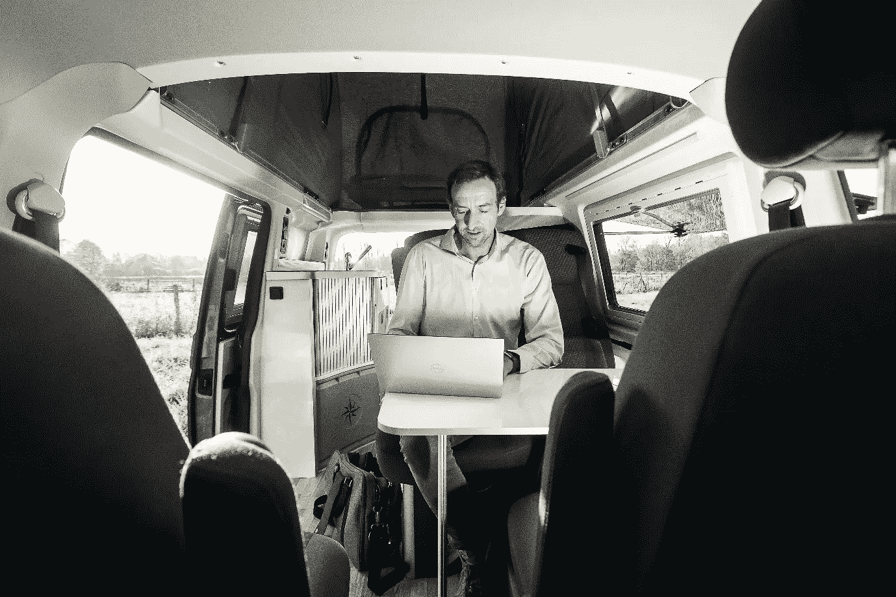
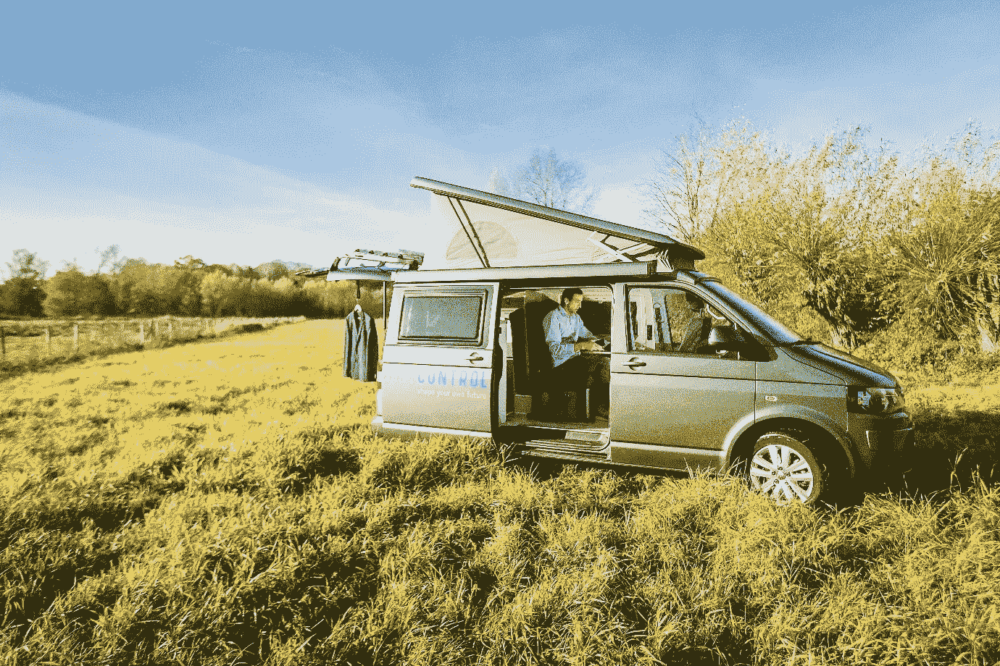

# 为什么我创建了自己的游牧工作场所

> 原文：<https://medium.datadriveninvestor.com/why-i-created-my-own-nomadic-workplace-88e990927cf8?source=collection_archive---------22----------------------->

工作在变化，这一点很明显。它在组织层面以及我们作为个人在日常生活和办公室中管理工作的方式方面不断发展。这还没有把机器人和人工智能考虑在内，它们将深刻地破坏我们曾经认为是“正常”的一切。

在我作为一名个体顾问的三年多时间里，我一直试图谨慎管理我在客户办公室、在家或其他地方工作的时间。无论是开会还是仅仅与客户接触，总会有完成工作和亲自到场之间的平衡。此外，还有家庭、朋友和私人时间等非职业方面的平衡。我努力保持这些生活方面的平衡。

# 咖啡吧和其他地方

我从户外获得很多能量。不知何故，呆在家里经常会导致一种潜在的紧张，担心没有真正“在工作”，或者更糟糕的是，洗碗拖延时间。这就是为什么我是镇上咖啡馆的常客。除了咖啡，看到其他人完成工作似乎也激励我去做同样的事情。平躺在一臂之内，戴着耳机，正在处理待办事项。咖啡吧的氛围真的很适合我。如果你想在家里或办公室营造这种氛围，你可以在 Hipstersound.com 提供的[这里听到一些不错的咖啡吧音频。](https://hipstersound.com/)

但是咖啡吧的特点是或多或少都有相同的人去那里参观或工作，而且它们也有固定的地理位置。诚然，如果你经常去咖啡馆，感觉就像你要去工作一样——但重点是咖啡、素食午餐和良好的 WiFi。很公平。这基本上是一般公司无法提供给员工的所有东西。我喜欢。

# 向前，去快乐的地方

但是，如果你可以在任何你想去的地方开店，在没有固定办公室的地方工作，那会怎么样呢？例如，在大自然中，靠近水的地方。你知道，能让人开心的地方。那么你就需要一个移动办公室——姑且称之为流动工作场所吧。有轮子的东西，有工作和开会的地方——还有煮咖啡甚至午餐的设施。
进入大众威斯特法利亚野营车。用我以前的宝马换这辆多用途车基本上是一件很容易的事情。当然，除了费用。但是我会处理的。

这里有一个简短的好处列表:

1.  我有很大的自由来决定在哪里工作。如果我能停车，这是一个潜在的办公地点。
2.  这是我自己的办公室。我拥有它。好吧，它没有邮政地址，但它是我的办公室。
3.  从旅行模式切换到办公模式只需几分钟。
4.  我可以中途见客户，即使中途没有卫星办公室或酒店大堂。
5.  交通堵塞对我来说已经失去了所有的意义。
6.  我是设备部、IT 部和人力资源部的主管，也是餐饮部的主管。#喜欢
7.  我带着运动装备，这样我就可以去户外跑步或锻炼(当然，如果天气允许的话)。
8.  我遇到一些有趣的人，他们从我身边经过，甚至顺便来打个招呼。
9.  曝光率是惊人的:无论我走到哪里，人们都能看到我的标志和我的品牌。
10.  它给我一种无与伦比的快乐和掌控的感觉。

仅仅过了几个星期，这些好处就变得惊人的清晰，我相信以后还会有更多的好处。如果你想了解我们游牧式工作场所的最新情况(我非常喜欢这个说法)，请[在 Instagram](https://www.instagram.com/shftctrl/) 上关注我们的轮班控制冒险。

祝(工作)愉快！
汉斯