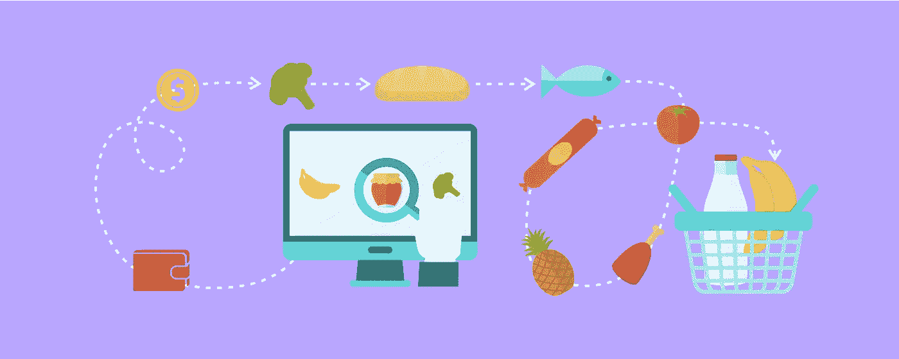
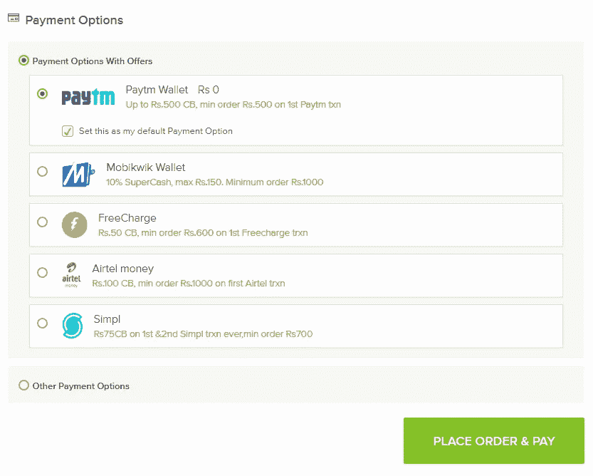
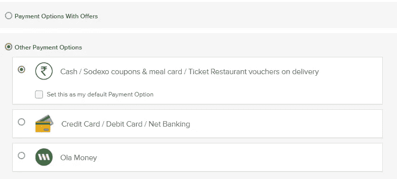
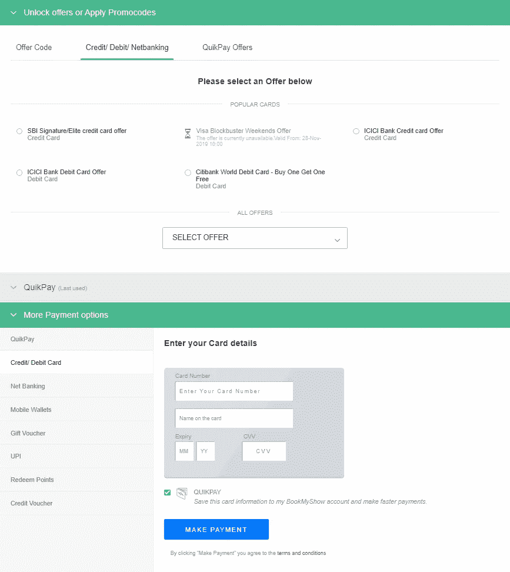
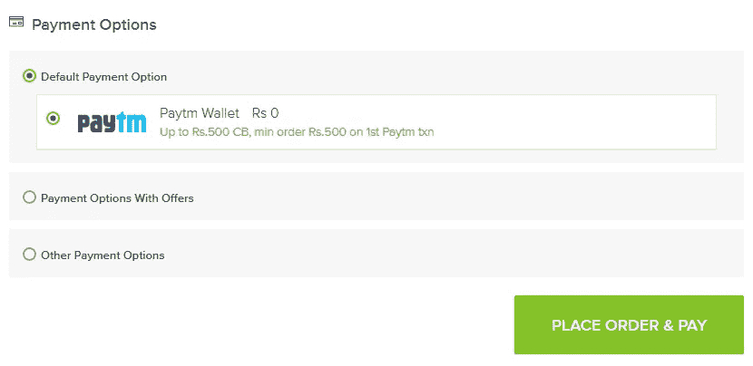
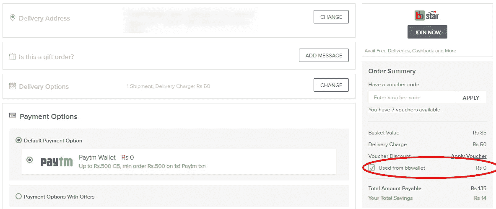
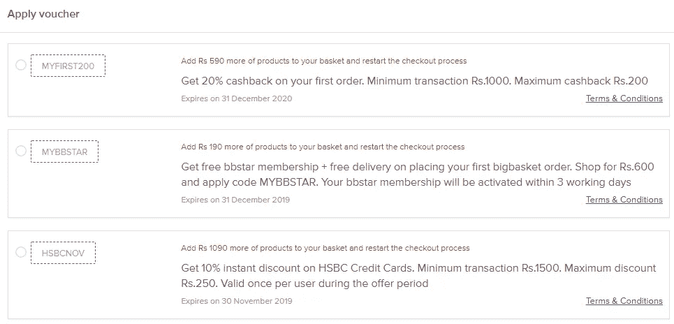
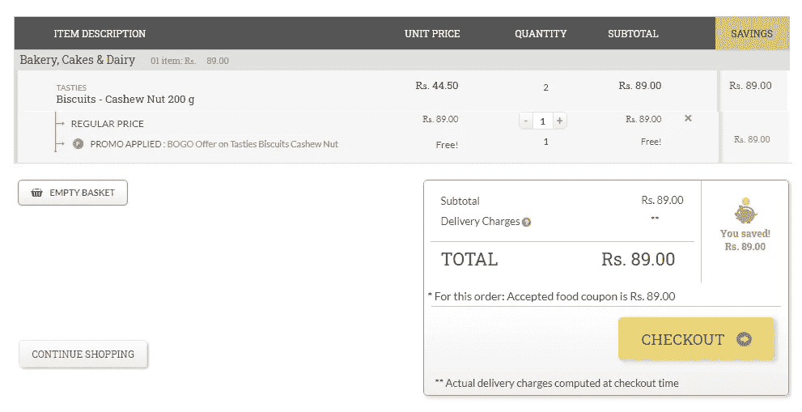
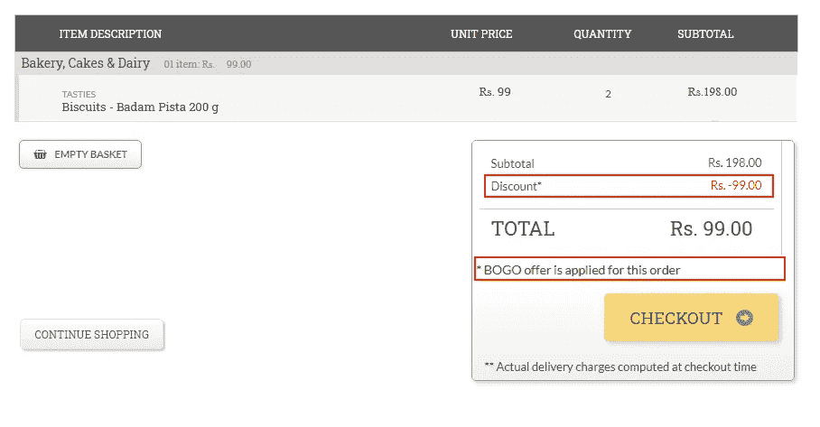

# 为什么我把我的车倒在 Bigbasket.com 身上

> 原文：<https://medium.datadriveninvestor.com/why-i-emptied-my-cart-on-bigbasket-com-43f4aebc1a11?source=collection_archive---------4----------------------->

当我最后一次查看购物车中的所有商品时，我很兴奋地体验了大篮子的服务。我从未通过网上购物购买过蔬菜和水果等易腐食品，当我浏览大篮子精心设计的产品目录时，我激动不已。

但是，当我点击结帐按钮时，我完全被下一个屏幕上看到的东西吓了一跳。它笨拙、混乱，并且与产品的其他部分不一致。

因此，与我对 [Zomato](https://endangeredblog.com/2019/11/04/zomato-food-delivery-ux-analysis/) 和 [Cure.fit](https://endangeredblog.com/2019/10/08/the-missing-piece-in-cure-fits-customer-experience/) 所做的类似，我花了一些时间在这个应用上，看看是什么阻碍了一位即将在 BigBasket.com 结账的顾客的用户体验

# 即将盈亏平衡的独角兽

在说用户体验之前，我们先来看看大筐的崛起。

Big Basket 是一家成立 8 年的在线杂货超市，目前估值为 22 亿美元。Big Basket 的投资者之一是中国巨头阿里巴巴，该公司从他那里学到了许多关于推动增长、优化物流和留住客户的知识。

 [## 动荡迫使暴风雨中的平静|数据驱动的投资者

### 自然界中很少有东西是直线行进的，尤其是经济。当投资者和消费者希望平静时…

www.datadriveninvestor.com](https://www.datadriveninvestor.com/2019/03/25/volatility-compels-calm-amid-the-storm/) 

Big Basket 是第一批将网上购物引入美国的公司之一，在 Grofers、亚马逊和 Flipkart 等竞争对手中，它仍然是一个知名品牌。

根据[商业标准](https://www.google.co.in/url?sa=t&rct=j&q=&esrc=s&source=web&cd=6&cad=rja&uact=8&ved=2ahUKEwjexqbqooTmAhVLvY8KHeqZDZEQFjAFegQIBRAB&url=https%3A%2F%2Fwww.business-standard.com%2Farticle%2Fcompanies%2Fbig-basket-will-break-even-in-all-tier-1-cities-this-fiscal-ceo-hari-menon-119111300362_1.html&usg=AOvVaw31x1_JdwUo5h3Z5XV7TH2I)，该公司上一财年销售额为 320 亿卢比，增长了 60%。首席执行官 Hari Menon 表示，到本财年结束时，他们将在 10 个一线城市实现 530 亿卢比的收入和盈亏平衡。这对公司来说绝对是一个好兆头。

但是，拥有超过 1200 万客户的 Big Basket 也应该专注于调整他们的结账页面的体验，这可能会阻碍客户的购物体验。

他们为什么要这么做有两个原因:

更多的客户意味着更多的收入 —他们应该获得更多的客户来保持增长和盈利。每个顾客，如果对体验满意，每个月都会回来。这意味着增长、忠诚度和经常性收入。

**竞争优势**——他们应该保持对竞争对手的优势，如亚马逊、Flipkart 和 Grofers，以及 Dunzo(从当地超市和杂货店运送食品)。如果竞争对手通过提供比 Big Basket 更好的用户体验来赢得潜在客户怎么办？

现在，我们来看看 BigBasket.com 支付页面的所有用户体验问题

# 令人困惑的付款方式

当我点击**结账**按钮时，首先让我失望的是支付选项。

首先可见的是一个标题为“**付款选项和优惠**”的部分。你在这里看到的是 PayTm、MobiKwik、Simpl、Airtel Money 和 Freecharge 等钱包支付。

我感到惊讶的是，没有通过信用卡、借记卡、网上银行或合众国际社支付的选项。然后我意识到有第二个标题为“**其他支付选项**的部分，当我点击它时，我发现了三个选项:

*   交付现金/索迪斯优惠券和饭卡/餐厅券
*   信用卡/借记卡/网上银行
*   奥拉钱

**信用卡/借记卡/网银**选项隐藏在其他**支付选项**部分下。

我这里有几个问题

信用卡/借记卡优惠未列在“**带优惠的支付选项**”部分。仅列出了在线/移动钱包。我认为大篮子首先想推广基于钱包的支付。那很好。但是，为什么要把这个部分命名为“带优惠的支付选项”。真的很混乱。

在展示商品时，BookmyShow 做得非常出色。退房时，您可以获得所有信用卡、借记卡、钱包和 UPI 优惠的完整列表。最棒的是，它们不会被放在应用程序的显著位置。逻辑是，抛出太多的优惠和促销代码可能会迷惑客户。此外，当顾客想省钱时，他们肯定会找到合适的方法。

另一件事，我发现在页面上失踪的是合众国际社的选项。他们怎么会遗漏了最近最流行的支付方式之一。UPI 选项意味着更短的结账时间。这将实际上有利于客户以及大篮子。

此外，Ola Money 是一种移动钱包(也为高于 1000 卢比的订单提供 100 卢比的返现),列在**其他支付选项**下，而不在**带优惠的支付选项下。**为什么？！

当您选择其中一个选项作为您的**默认支付选项**时，屏幕会变得更加混乱。现在，您有三个展开/折叠部分(accordion):默认支付选项；提供支付选项；其他付款方式。我的天啊。

# bb wallet——但是，为什么呢？

整个支付页面中最令人费解的是 **bbwallet** 。

bbwallet 未列在任何支付选项下。任何有自己钱包的公司都会为那些经常使用钱包支付现金的人提供更多的返现和折扣。但是，我没有看到关于 bbwallet 的报价。它只是作为**订单汇总**下的一个复选框。

还有，在网站上找你的 bbwallet 也没有什么简单的方法。它藏在**账户**部分的某个地方。如果钱包不容易拿，那它还有什么用？

# 优惠券，有一个转折

当我准备结账时，我看到**订单汇总**下的一个链接，上面说我的订单有 8 个优惠。点开一看才知道，这些代金券没有一个是适用的。相反，它要求我添加更多的商品到我的购物车中，以使优惠适用。

如果有人给我相关的工作机会，而不是一些对我没用的东西，我会有更好的体验。

像亚马逊和 Flipkart 这样的在线零售网站在结账时显示上下文相关的优惠券和优惠券代码方面做得非常好。我打赌大篮子也能做到。

# 令人困惑的 BOGO 提供

主页传送带上有一个部分说 BOGO(买一送一)提供精选零食。于是，我点击了一包标价为 99 卢比、有优惠的饼干，把它加入了购物车。

当我查看购物车时，我对摘要的显示方式感到困惑。它有两行:第一行显示数量为 2，第二行显示免费！数量为 1。

相反，总结可以是一行，可以说 198 卢比，数量为 2，另一行说扣除 99 卢比的折扣。

我冒昧地重新设计了这个屏幕(使用 Inspect Element ),使它看起来简单易懂。

# 未来在于简单

我在两家市值数十亿美元的 SaaS 公司担任技术作家期间，最大的收获就是用户体验是产品最大的优势。每个产品都应该在整个产品中提供一致的用户体验——从主页到支付页面/订阅页面。良好的用户体验会吸引并留住你的客户。

但是，有时候，产品经理和 UX 设计师无法理解用户体验的力量，而是专注于构建一个看起来美观但妨碍用户体验的精美页面。

前几天我在一家书店，有机会翻阅了《对 Jugaad 说不:大篮子的制作》的前几页。这本书的前言由 Helion Ventures 的联合创始人 Sanjeev Agarwal 撰写。前言的第一行引用了亚伯拉罕·林肯的话

> *“重要的原则可以而且必须是不可改变的”。*

我相信良好用户体验的原则也是不可改变的。
大篮子会变大。这是毫无疑问的。但是，与此同时，他们还应该专注于为用户提供卓越的客户体验。