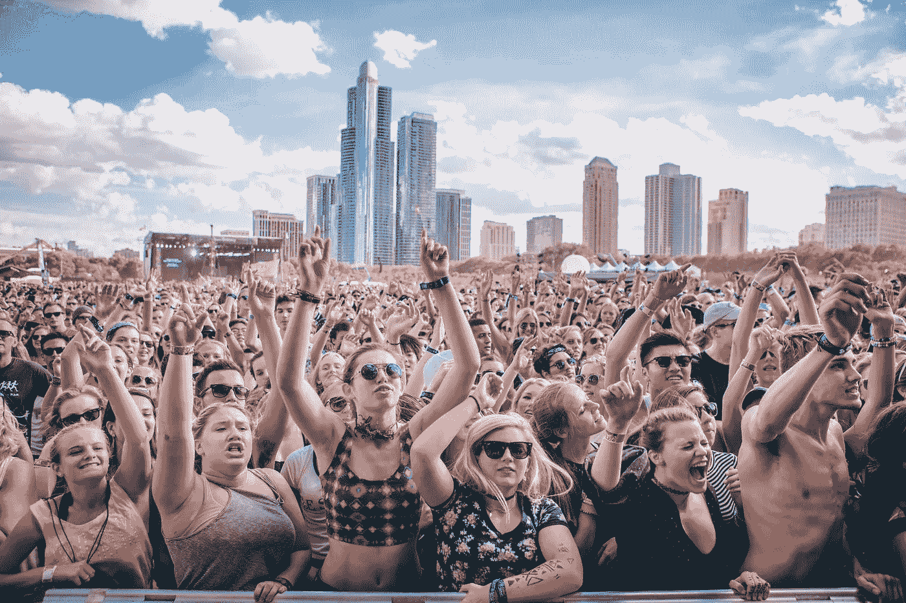
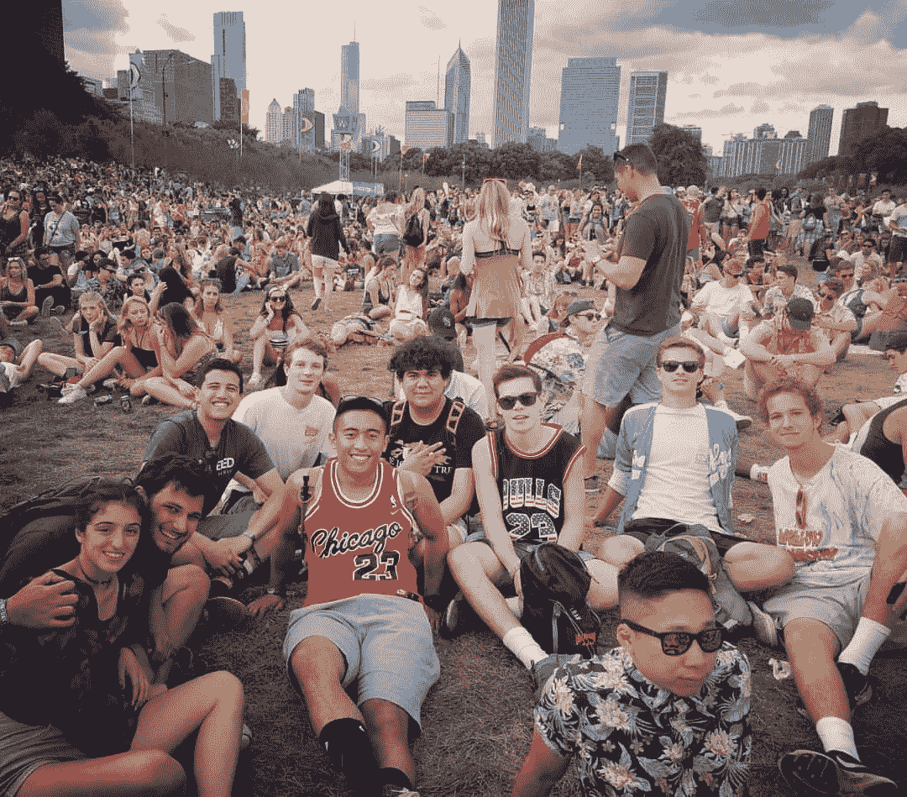
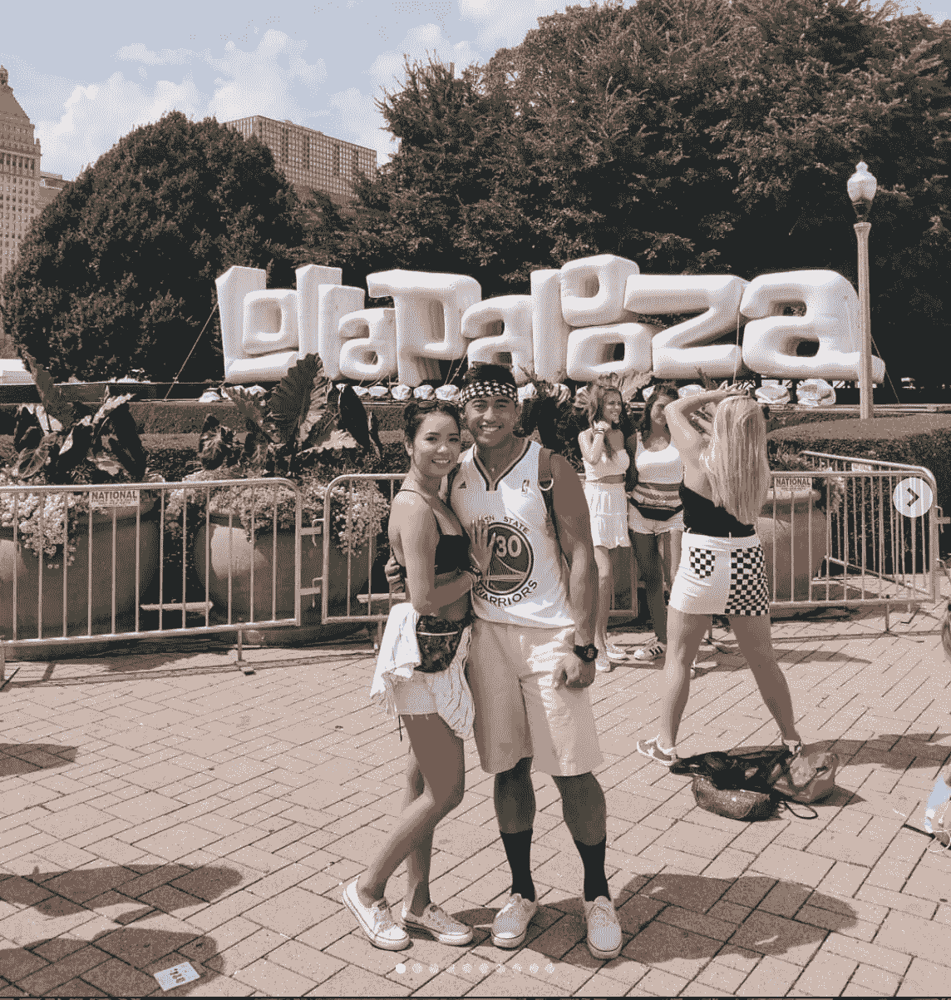

# 我参加这么多音乐节的原因

> 原文：<https://medium.datadriveninvestor.com/why-i-go-to-so-many-music-festivals-2416ee474592?source=collection_archive---------6----------------------->

## 我热爱音乐，它是我的生命！

我想象着一个充满闪烁灯光的房间，快乐的人们和舞台上的艺术家准备好点燃你的夜晚。这是我对充实生活的看法。我们都需要脱离日常生活。两个月前去听了我的第 27 场演唱会后，我可以说它们对一个人的福祉是高度有益的。

自从我的第一次 Lollapalooza 经历以来，我已经参加了 20 多场音乐会和 6 个周末音乐节。

在参加了我的前几次音乐会后，我注意到的健康益处包括:提高了身体健康的动机，增强了社交技能，减少了压力，减少了社交焦虑，增加了整体幸福感。

在我去我的第一场音乐会(U2)之前，我觉得我错过了那些只为有很多钱和时间的人准备的经历。但事实是，这笔钱是值得的，时间是可以优先安排的。

**就当是稍微便宜一点的一日游吧。**

虽然 U2 的演唱会很棒，我也很感激我朋友的妈妈邀请我和他们一起去，但我还是想去看一场我个人想看的演出。2017 年夏天，我开始购买芝加哥 Lollapalooza 的 4 日通票，以便与我高中时的一些最亲密的朋友和我在 Tinder 上遇到的一个完全陌生的人一起去。我们稍后将回到火绒女孩。

节日前几周，我从 Instagram 和 Pinterest 上获得灵感，选择了想要穿的服装。我决定买一件乔丹公牛队的运动衫、一件夏威夷衬衫、一件背心和一颗钮扣。这次冒险让我既兴奋又不敢去。我很兴奋我将拥有我生命中的时间，但又担心我无法融入人群。

在我和我的朋友们“预先游戏”之后，我们乘火车去了那个城市，我立刻就被吸引住了。甚至不是因为节日，而是火车上的人群。这是女人们穿着的时髦衣服和欢闹的家伙们一路高喊“去他妈的罗耀拉”的组合。我不知道到底发生了什么，但感觉很好。

我的第一个节日来得再好不过了，因为我刚刚高中毕业，还没有完全找到自己的定位。当我和其他人准备参军的时候，我的好朋友们正在走向大学。

除了看到我喜欢的艺术家和发现新的艺术家，这也是做其他事情的机会。这对我来说是一个重塑自我的机会，也是一个和一群人交往的机会，这些人包括交朋友和庆祝人类精神。在过去的四天里，我很确定要见的艺术家包括:说唱歌手吉斯、DJ 斯内克、斯卢希、大肖恩和维兹·卡利法。2018 年的阵容是不可战胜的，但这个故事是另一天。

这么说吧，朋友先打 EDM 舞台《佩里的》把我扔火里了。这是我听当时一个 19 岁的 DJ 的地方，他的名字叫“Slushii”。当我听到电子版的 Brightside 先生，接着是柔和的低音和夏日氛围时，我的心跳加速了。在节目中的某个时刻，Slushii 叫人们进入一个“mosh 坑”。mosh pit 是一群人围成一个圆圈，等待节拍最终落下，导致每个人都以乐观的方式互相推搡。人们开玩笑地互相推来推去，笑着，笑着，最后带着一脸的成就感结束。

与音乐相关的聚会令人沮丧的部分是，一旦活动的最后一天到来，你会感到悲伤，因为很快每个人都必须回到他们日常的生活中。

*演唱会后抑郁由以下内容组成:*

*   对乐队音乐的严重痴迷
*   闪回音乐会
*   漫无目的地浏览你拍摄的照片和视频
*   穿着你下个月在那里买的衬衫
*   寻找下一个旅游日期，以便再次体验

音乐会已经成为逃避现实的最大形式之一。每个人最终都有机会放下他们白天经历的所有烦恼，让音乐冲刷他们。音乐会给了我们一个机会，所以当它结束，梦想破灭时，感觉就像一个完全不同的世界崩溃了，真实的世界就在我们面前。总会有另一场音乐会，另一个感受自由的机会。

从第 2 天和第 3 天快进到第 4 天。最后一天是我和我之前提到的那个叫 tinder 的女孩约会的同一天。我独自去见她，并告诉自己这可能是繁荣或萧条的第一次约会。在过去的三天里，我的信心直线上升，这让我在她面前展现出最好的自己。

用尽可能少的话来说，这是我一生中最美好的一次约会。我们有非常相似的音乐品味，我们真的玩得很开心。所有的颜色、音乐和相处时间让它感觉像一部电影。直到今天，我们仍然保持联系，并计划在接下来的几个 Lolla's 见面，我非常高兴。

## 这个故事的寓意是，如果你正在努力寻找自己的身份，你必须做一些让你脱离舒适区的事情。音乐节绝对让我成为一个更外向、更有实验精神的人。

音乐会和节日改变了我的生活。2020 年来 Lollapalooza 亲自看看吧！(不是赞助，而是应该！).