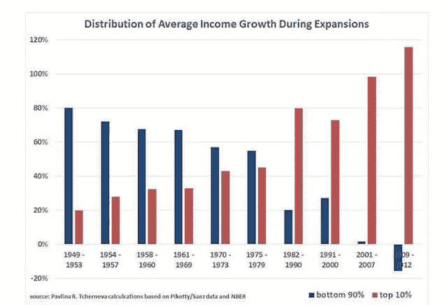
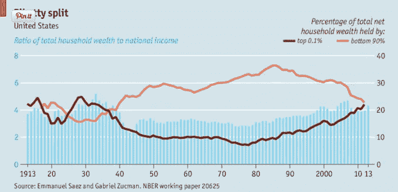
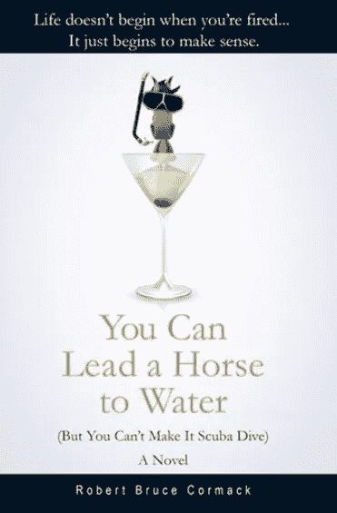

# 为什么我讨厌图表。

> 原文：<https://medium.datadriveninvestor.com/why-i-hate-graphs-37806e732853?source=collection_archive---------7----------------------->

## 我也不喜欢兰博基尼。

Courtesy of Dreamstime

我讨厌图表。我就是鄙视他们。”拉什·林堡

如果我在这里完全诚实，图表吓死我了。高中的时候，体育办公室里有一个关于性传播疾病的排名。这是一个条形图，淋病(红色条)几乎触及天花板。直到今天，如果测试模式出现在电视上，我都不能做爱。我过去常常试着在 T2 约翰尼·卡森 T3 之前完成——即使是和别人在一起的时候。

图表显示了不同程度的困惑，基于研究者想要*的*迷惑像我这样的人的严重程度。从我这些年的困惑来看，我要说大多数研究人员——实际上是所有的人——都做得非常出色。

> “这项研究的结果仍然需要在像金星或太阳这样的温暖气候中进行测试。”

最让我困扰的是那些在底部有一堆限定细节的图表，比如“这项研究的结果仍然需要在金星或太阳这样的温暖气候中进行测试。”

研究人员显然不想把自己逼到墙角。任何质疑他们的数字的人只能等到“太阳统计”回来，这可能需要几百年，如果我们真的到达太阳，我们将更加担心可怕的晒伤和失明。

我也对那些声称“结果精确到 0.0000006 个百分点以内”的限定词保持警惕。我很确定这绝对没有任何意义，除了做研究的人有一个非常棒的计算器。

由于我过去 25 年的大部分工作都与图表有关，我有相当多的挑战要克服，一个是我的眼睛，另一个是头疼。这些头痛可能与眼睛有关，也可能只是头痛。不管怎样，我现在戴着更坚固的眼镜，服用的阿司匹林足以击沉一艘船。我确信我的腕管是安全帽的结果。

> 我没有任何财富，所以我想我最好在责怪俄罗斯人之前找到原因。

过去的一周，我在研究财富的分配。我没有任何财富，所以我想我最好在责怪俄罗斯人之前找到原因。我特别喜欢那些写着“被大量引用”的图表，这意味着几乎每个人都读过它。在这种情况下，图表是由利维经济研究所的 Pavlina R. Techerneva(如果我听说过俄罗斯名字的话)绘制的。

追踪扩张时期的平均收入增长，Techerneva 有了一个有趣的发现。自二战以来，财富分配变得有些疯狂。过去，社会底层 90%的人拥有 80%的收入。今天，我们有负 20%。另一方面，社会上收入最高的 10%的人已经从收入的 20%上升到 150%。看一下图表。我们拥有的每一美元，富人都拥有，比如说，剩下的，包括我们的美元，如果我们蠢到从口袋里拿出来的话。

唯一比脱离页面的条形图(如淋病)更让我困惑的是一个挑战传统智慧的图表。让我们看看国际货币基金组织提供的下图。他们声称政府不应该给“就业创造者”减税，因为大公司宁愿留着钱搬到墨西哥去，让我们，你猜对了，没有工作。

然而，银行认为他们已经找到了解决办法。他们会给我们现成的信用卡，说“别担心，用这张卡，我们会对你无法偿还的钱象征性地收取 18%的费用。”再说一次，这是行不通的，因为，嗯，我们*不能*还钱。我们的工作在墨西哥。

> 给前 20%的人，他们就会买兰博基尼。GDP 增长下降了 0.08 个百分点，因为兰博基尼完全没有刺激经济。

现在让我们来看看为什么国际货币基金组织认为支持社会下层(你和我)比减税更好。如果我们将社会底层 20%的人的收入份额增加仅仅 1%的**，你会得到 0.38 个百分点的 GDP 增长。给前 20%的人，他们就会买兰博基尼。GDP 增长下降了 0.08 个百分点，因为兰博基尼完全没有刺激经济。**

****

**因为我没有兰博基尼，也永远不会有兰博基尼，所以我只能相信国际货币基金组织成员的话(他们可能有兰博基尼)。他们说财富分配至关重要，但我们的政府却说税收减免至关重要，特朗普总统说他在土耳其有一家双塔酒店，这不重要，但你可以打赌，他，伊万卡，或她的丈夫 Jarod，有一个兰博基尼。**

**我确信有一张图表显示了有多少人拥有兰博基尼，包括明星运动员、卡达西亚人和水管工。**

**如果我对图表理解正确的话，要么我们更公平地分配这些兰博基尼，要么我们用我们通常会给公司的钱，做一些疯狂的事情，比如雇人做一些看起来像兰博基尼的东西，或者，见鬼，任何事情。**

> **我敢肯定这些数字是被篡改的，如果我有脑子的话，我会提供一个看起来像三级手指画的特朗普图。**

**这就是为什么图表会让我害怕、困惑，有时还会让我恼火。我不知道谁说的是实话。我敢肯定这些数字是被篡改的，如果我有脑子的话，我会提供一个看起来像三级手指画的特朗普图。他有一份关于黑人就业的报告。**

**图表是为了证实我们最糟糕的噩梦(比如淋病)，或者激发讨论，或者开阔我们的眼界。显然，大公司不想让我们睁大眼睛，所以我很确定他们会画出自己的图表，大概是这样的:**

****

**如果我们真的理解了图表，我们无疑会拔头发，或者等待另一个看起来更好的图表——或者至少是彩色的。**

> **我已经不再试图在测试模式出现之前完成性爱。此外，我有网飞。我可以去一整晚。**

**对于那些说电视上的测试模式根本不是条形图的人，我现在知道了。请不要给我发评论说我是个笨蛋。我已经不再试图在测试模式出现之前完成性爱。此外，我有网飞。我可以去一整晚。我没有，因为我在看网飞。在网飞没有一个单一的条形图或测试模式或任何其他令人困惑的东西。**

**只是，嗯，编程，比图形好。**

**罗伯特·科马克是小说家、记者和博客作者。他的第一部小说[“你可以把马牵到水边(但你不能让它潜水)”](http://robertcormack.com/?source=post_page---------------------------)在网上和大多数主要书店都有售。查看[天马出版社](http://skyhorsepublishing.com/?source=post_page---------------------------)或[西蒙和舒斯特](http://simon/%20and%20schuster.ca?source=post_page---------------------------)了解更多细节。**

****