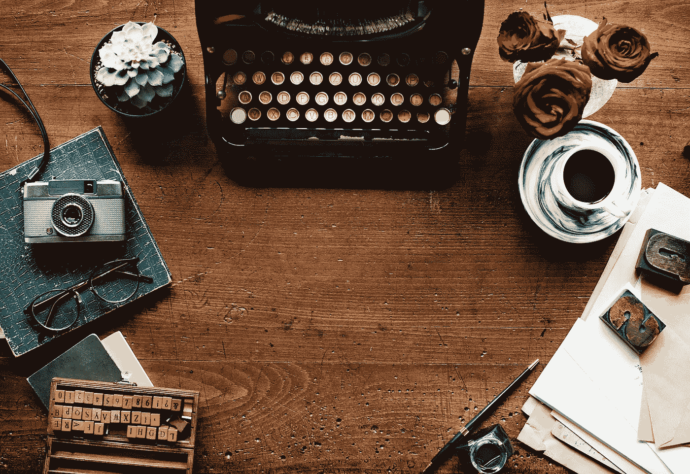

# 为什么我的心慢媒体(你也可以)

> 原文：<https://medium.datadriveninvestor.com/why-i-heart-slow-media-and-so-can-you-8a21358cc25a?source=collection_archive---------5----------------------->

# 不久前，我发现自己站在纽约市一个朋友的公寓前，向她的窗户扔石头。

During six months of using only Slow Media, my writing desk looked pretty much like this one.

我的手臂和我的目标足以击中二楼的玻璃。但她的公寓在三楼。我苦思如何引起她的注意。在外面等人来？触发了我的汽车警报？问题是，她没有门铃。最后，我找到了一个公用电话给我的朋友打电话，因为虽然大多数口袋和钱包里都有数码设备，但我的却没有。

为什么？在陶醉于数字媒体的奇迹 20 年后，我已经放弃互联网 6 个月了。插画家 Edward Gorey 的精美信件展览让我想到了被数字通信所掩盖的物质艺术品。我错过了打印信件，也错过了接收信件。我希望离线一段时间会恢复发送信件和明信片等模拟习惯，这些习惯曾带来如此大的快乐。然而，我对数字的醒悟远不止是邮件。

曾几何时，我花了几个小时从事触觉和身体活动:自学书法，在阿巴拉契亚小径上徒步旅行，在刺鼻的暗房里打印照片。我浏览了唱片店、图书馆、书店和其他 Gary Shteyngart 称之为“印刷、装订媒体制品”的供应商。我意识到，随着我花更多的时间看屏幕，线下休闲逐渐被推到了一边。我一直想象自己是一个多才多艺的人，但是数字媒体让我感觉很单一。像我们许多人一样，我开始发现数字媒体的好处更加模糊，负担更加沉重。暂时离线生活的前景激起了我的好奇心。(也许*你*也想知道那会是什么样子。)

我突然想到，人们可以将慢餐理念应用到他们使用媒体的方式中。我不想总是慢条斯理地做每件事，只是为一种更温和的节奏创造空间，以平衡和补充快速媒体。那时，我觉得把慢餐和媒体联系起来是孤独的。然而，我推测某个地方可能会有一场志同道合者的运动。我在[我的博客*慢媒体*](http://slow-media.org) 中阐述了这些想法。我最终在脸书遇到了一个慢媒体团体，并且很高兴地得知其他人已经和我“共同发现”了慢媒体的概念。

我设计了一个雄心勃勃的实验:离线六个月。我渴望将时间和精力转向非中介的消遣。受马歇尔·麦克卢汉的妙语“我们不知道是谁发现了水，但它可能不是鱼”的启发，我想从一个超然的角度重新评估媒体在我生活中的作用换句话说，你不能清楚地感知你沉浸其中的物质或情况。

我的计划是回到 20 年前的媒体技术:1989 年，在互联网和手机开始崛起之前。任何印刷品都是合法的:报纸、杂志、书籍。我听黑胶唱片和录音带。我看了有线电视和录像机磁带。我用打字机或离线电脑写作(没有联网或下载或“在云端”)。我用固定电话打电话，听地面广播。

当涉及到其他人使用技术与我联系时，我没有偏好。我没有指示他们做(或不做)他们通常不会自己做的事情。如果有人打我的手机，我会和他们说话。如果有旅行社在网上帮我预订机票，那就这样吧。如果向我提供产品或服务的人需要互联网来完成他们的工作。无论他们在幕后做了什么，都没有改变我的经历。

与记者莎莉·赫希普斯的一次谈话引发了[一个关于 NPR 市场](https://www.marketplace.org/2011/02/18/tech/woman-swears-internet-six-months)上的慢媒体的故事，这个故事在博客世界传播并抓住了公众的想象力。在向国家公共电台的全球听众宣布了我的拔掉插头计划后，就没有回头路了。

# 我也喜欢数字媒体！

不知何故，人们认为我讨厌数字媒体。在我们继续之前，让我们弄清楚一件事。这个故事不是关于在有[在此插入技术]之前[在此插入十年]生活是如何好得多。听到我喜欢数字媒体的许多方面，你应该不会感到惊讶。真的，如果我讨厌互联网，我的拔插头项目不会很无聊吗？没有挑战，没有牺牲。这就像我在大斋节放弃泡菜或沙丁鱼一样。

我意识到我们有数字技术是多么幸运，尤其是在相互交流方面。20 世纪 80 年代，我在海外生活很孤独，那时我与美国的朋友和家人失去了联系。90 年代我也在国外生活过，当时互联网太慢了，不是很有用，打往美国的座机电话非常昂贵。像我们大多数人一样，我被我们可以利用互联网做的所有事情弄得眼花缭乱:在全球范围内发送免费信息，立即找到过去几乎无法获得的信息，与任何地方的任何人分享博客、照片和视频。信息技术解放了我们！而没有使用新媒体的人呢？太落后了。勒德分子。他们只是不明白。

将数字媒体放在次要位置并不是一个容易的决定。我选择那条路是因为我感觉——有时仍然如此——有太多天我醒来后上网查看信息，在我意识到之前，六、八个小时已经在我阅读电子邮件、发送电子邮件、点击链接、查看脸书、浏览网页的时候溜走了。在一天结束的时候，我经常觉得——有时仍然如此——我在地球上有限的时间里没有完成足够多有意义的事情。

我作为一名教师、一名学者和一个普通人的经历把我引向了慢媒体，尽管作为一名反向投资者也同样驱使着我。我越是和人们谈论离线，他们越是说这是不可能的，我就越想证明我可以。当我告诉他们这个计划时，很多人都笑了。反应分为两大阵营:1)这是一个不受欢迎的计划，无法实现；或者 2)这是一个*令人钦佩的*计划，不可能实现。他们的抵抗只是坚定了我的决心。

一些朋友取笑我应该拿出我的随身听和兔耳天线。一位亲爱的老朋友相信我有能力完成这个项目，因为，她说，我擅长否定自己。(我希望她注意到我刚才叫她“老”。)当你把注意力放在你正在得到的东西上，而不是你正在放弃的东西上时，拔掉插头就不会觉得是自我否定了。这种积极的否认有助于你逃离学者所谓的“快乐跑步机”，它将新奇的快乐变成纯粹的舒适，最终变成不再带来快乐的失望。换句话说，远离数字媒体有助于你从他们那里获得*更多的*满足感。

对我来说，慢原则的另一个巨大吸引力是时间政治。像我这样的学者每周工作 60 多个小时是很典型的。职业责任占据了我们的夜晚、周末和闲暇时间，部分原因是——你猜对了——数字媒体。诸如锻炼、个人护理和家务维护等日常活动经常被搁置一旁。(因此，教授心不在焉、风格受到挑战的刻板印象可能是有道理的)。研究表明，学术界的身体和心理压力超过了普通人群。

当然，在努力实现工作与生活平衡的过程中，学者们并不孤单，但他们敏锐地感受到了时间的紧迫。在麻省理工学院的一项调查中，78%的教职员工表示“无论他们多么努力，都无法完成所有工作。”相比之下，48%的首席执行官。大学削减了教授的资源，同时增加了工作量、生产力预期、竞争、评估和审查。与此同时，越来越少的时间花在吸引我们去学院的事情上:阅读、写作、思考、深思熟虑、共事合议。

我无法改变大学文化，也无法改变它对效率、量化和速度等企业价值观的屈从。但是我*可以*通过控制我自己的媒体使用来抵抗更多、更好、更快工作的压力。慢媒体提供了一种个人干预的方法。

我花了几个月的时间准备计划和实施我的慢媒体项目。我从 4 月份开始，租了一个邮政信箱，翻出旧的录像带和唱机，安装了一部固定电话，并找到了宝丽来的胶卷和打字机色带。三个月后，我放弃了我的电脑:7 月 4 日，为了纪念独立日和梭罗在瓦尔登湖的传奇撤退。

# 众所周知，鱼离水

好吧，让我们来评估一下*你是否准备好去度网络假期:你会在车里放打印好的路线图吗？你最后一次使用黄页或者寄明信片是什么时候？你有座机吗？转盘？胶片相机？传真机？时钟收音机？单机计算器？手动还是电子打字机？手表？报纸订阅？通讯录？你在乎你书法的质量吗？*

当长时间没有手机或电脑时，这些是需要考虑的事情。这可能会让拔掉插头听起来非常不方便，以至于你排除了尝试的想法。不是这样的！不要误解我:它*是*不方便。然而，这个实验给我带来了快乐，让我大开眼界，也出乎我的意料。

模拟媒体成为我观察世界的新镜头。在这种背景下，1980 年电影《我和安德烈的晚餐》中的一些对话引起了特别的共鸣。在谈到我们如何体验现实时，安德烈告诉沃利，无聊是一种幻觉，一种压迫的工具，用来压制异议。人们认为我会因为失去互联网和手机而痛苦不堪，但对我来说，这更像是一种解放。

我确实允许一个小的释放阀，让自己每月上网一小时。我小心翼翼地守着这段时间，每周抽出 15 分钟，旁边有一个厨房计时器在滴答作响。有限的上网时间让你专注于真正重要的事情。这是银幕之外设定生活优先级的一个缩影。

我的拔插头实验在 2011 年新年前夜结束，就在那时我丈夫摔坏了他的手机。午夜前我们正要去参加一个派对。目的地地址在他的手机上——他把手机留在了我们家，太远了，找不到了。找不到聚会，我们回到家，他把他的设备扔过房间，扔得有点过猛。我们在一起，一对职业情侣——一个新闻学教授和一个创新技术专家——我们之间连一部手机都没有。这个场景清晰地提醒了我，数字设备在现代世界中的中心地位，我有点矛盾地回到了这个世界。

我把慢媒体介绍给更多观众的动机并不完全是无私的。今天，我离线六个月会比 2010 年更难。有一天我想再做一次，我需要帮助。更重要的是，我希望*你*能够在你想要的时候拔掉电源插头。沉默的大多数是时候大声疾呼，寻求更好的生活方式，通过减缓媒体的使用和生产来促进人类和环境的可持续性。

我们中没有人能单独做这件事。

*作者注:这个故事改编自我的书*慢媒体:为什么慢是令人满意的、可持续的和聪明的*，由牛津大学出版社出版。你可以在*[*http://jennifer-rauch.com*](http://jennifer-rauch.com)*了解我的更多信息。*