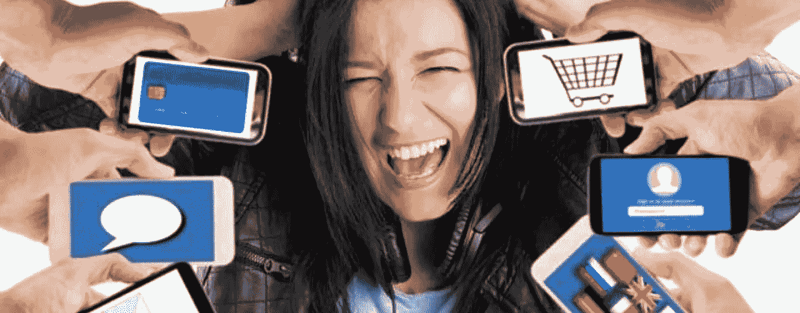
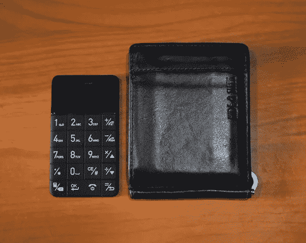

# 为什么我停止使用智能手机

> 原文：<https://medium.datadriveninvestor.com/why-i-stopped-using-a-smartphone-eb10cbd9a64d?source=collection_archive---------25----------------------->

如果你忽视了一个事实，那就是你已经把一天 24 小时的大量时间都花在了智能手机上，你要么是一个无知的混蛋，要么是太懦弱而不敢面对它。让我们面对现实吧，这个微小的设备(每天都在变大)正在劫持我们的日常生活。

当我准备午睡时，我正在收集这个想法，但却无法入睡。这个想法让我崩溃。一些计算突然出现，我决定把它放在一起。

平均来说，每次我拿到手机时，我平均会看 10 分钟。将它乘以大约每天 12-15 次(如果少于这个数字，你可能在撒谎)，那么**你只是漫不经心地浏览，实际上已经浪费了 2-2.5 个小时**。添加一些你沉迷的游戏的威胁(在我的例子中是 PUBG)，是的，**(至少)又过了两个小时。**

我和很多女孩有过短信关系，沉浸在恋爱关系的虚拟满足感中。在 Tinder 上直接滑动，在 WhatsApp 上与我喜欢的人聊天，看着 Instagram 模特的惊人照片，在 Twitter 上咆哮意识形态，我都参与其中。

# 我可以在智能手机上找到更多有效(上瘾)的东西，但即使是这 4 个小时的完全浪费，每天都让我感到恐惧。

Image credits: www.fusecrunch.com

在某种程度上，我们认为它让我们更有效率，但每天花 4 个小时看着让你头晕的蓝光光源是多么有效。

我决定结束这一切。你会吗？

这是我现在正在使用的手机，只需要称它为“手机”，甚至比我的钱包还小。

