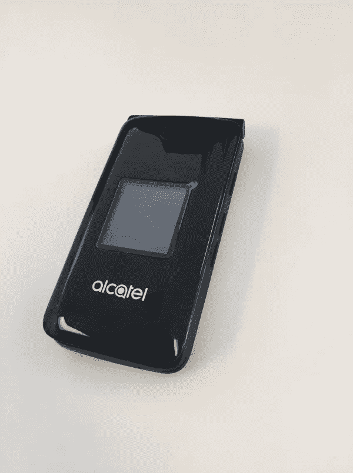

# 为什么我在 2018 年换了翻盖手机，再也没有回头

> 原文：<https://medium.datadriveninvestor.com/why-i-switched-to-a-flip-phone-in-2018-and-never-looked-back-891e6a082385?source=collection_archive---------0----------------------->

我再也受不了了。

回顾我生命中的最后十年，我觉得它是带着令人失望的千篇一律过去的。

每一个无聊的时刻都会出现在我的手机里。每个不眠之夜都会变成 Youtube 狂欢。当我情绪低落的时候，我会翻看很多自助的文章和视频，但实际上却什么也做不了。

我和妻子尝试了很多方法来抑制我们对网络的沉迷；每晚九点把我们的手机放在盒子里。我们外出时关闭数据。改变设置，这样我就可以在周末不用上网了。

但不可避免的是，它会自己渗透回来。突然会是凌晨 2 点，我们都在床上打电话。*我们到底是怎么来到这里的？*

别误会，我相信凡事都要适度。但是这些年来，我渐渐明白，我只是不够强大，无法控制*这个*。

想象一下，对于你使用的每一个应用程序，背后都有成千上万的科技公司员工试图找出如何让你尽可能长时间地使用它。我无法和他们竞争。

我有人生目标；我想扩大我的 youtube 频道，多锻炼，早起，吃得更健康……尽管有时效率很高，但这些都会毫无用处地流失到我的手机里。

更糟糕的是，我觉得一切都很无聊，除非我在一个设备上。生活变成了我在网上阅读令人惊叹的文章和视频之间不得不做的事情。

不过，有一些亮点会让我在现实中感到不安:我们的女儿出生了。结婚。旅行。以及更多的经历，既惊艳又悲壮。但是，总的来说，我感觉自己越来越像是生活的旁观者，而不是真正的生活。

我展望了未来 10 年。如果我不总是分心的话，我的目标会进展得多快？如果我继续努力维持现状，事情会有多少保持不变？

我能感觉到有什么不对劲，因为我记得我年轻时精力充沛得多！我记得活在当下，每当我无聊的时候，我就会环顾四周，寻找娱乐的方式。我的日子似乎变长了，回想起来，生活感觉更有活力了。我有一种挥之不去的感觉，再也无法忽视:*这有多少是对我童年的玫瑰色怀旧，又有多少是因为我在没有互联网的时代过得充实而快乐？*

我决定测试一下。我关闭了一个月的数据计划。

起初很难，当聚会上有一段沉默时，我想去脸书排队付款或查看通知(你知道该怎么做)。

我决定让我的大脑回到童年时的思维状态，这样我就可以进行冥想，想象自己回到那些日子。我会想到我听的音乐类型，我穿的衣服，我上学时想的事情。回到互联网还不存在的时候，至少对我和我的朋友来说是这样。

在把自己放入这种心态之后，我会在接下来的几分钟里感觉更有活力。我感觉自己就在那个房间里，就在眼前。

我意识到对我来说，限制我的数据还不够。我需要我的大脑有一种无压力的体验，即**不相信*互联网一开始就存在。我知道这听起来有点疯狂。但是你有没有停下来想一想，更疯狂的是，我们的大脑已经进化了数百万年，能够在野外生存，突然通过移动我们的拇指就可以获得无限量的图像、视频和文章。***

当你坐在沙发上时，移动你的拇指，而不是去图书馆找些东西。不要听收音机或看书，只要动动你的大拇指，就可以看无穷无尽的有趣的视频。不要担心与你的朋友交谈和听到他们的声音，只需给他们发短信——你肯定不想在他们正忙着的时候打电话打扰他们。

很明显，我们新石器时代的祖先不能给人打电话或去图书馆……但我指出了有形的真实世界的体验被数字消费所取代的区别，这种消费只需要最少的努力就能实现。例子不胜枚举。

我读了很多关于这个话题的文章——作家、哲学家、心理学家。每个人都同意:这不正常。我们的大脑不适合处理这么大的刺激。相比之下，我们越是使用这些设备，现实生活就越显得乏味。

这种智力上的突破，加上我的冥想，在我更多地实施这种练习的日子里，对我产生了一些难以置信的影响:

我一整天都精力充沛

我变得更快乐了

(3)我觉得自己更有活力，活在当下

又过了一个月，尝到了自由的滋味，我知道是时候了。

My actual flip phone

我已经经历了改用翻盖手机的利与弊(如果我迷路了，需要 GPS 怎么办？如果我需要检查我的电子邮件呢？如果我需要在结账时将资金转入我的账户，该怎么办？).对于出现的每一个问题，我都会想到非数字化的解决方案，并制定计划来减轻我的恐惧。

最后，在 8 月 17 日的一个星期五下午，我去了我的提供商那里，换了一部翻盖手机。

帮助我的员工说，我是他遇到的第一个这样做的人。这让我觉得我比以前更奇怪了。

我有没有提到过我在程序广告领域工作过？你知道网站上那些烦人的盒子广告吗？我会看到关于广告商如何根据你的行为和人口统计来跟踪你和评估你的电子表格。我看到了网站出版商是如何做出基于数据的决定，试图让你尽可能长时间地呆在他们的网站上，尽管他们在大多数情况下都是出于好意。我看到了香肠是怎么做的。这也帮助我做了决定。

在那之后，我用一个限制(我不知道密码)关掉了我的 iPhone 上的几乎所有东西，所以它本质上只是一个摄像头。

这仍然是一场斗争，但没多久就感到无比的自由。事实上，几个星期后发生了大约 10 年没有发生的事情:我厌倦了等待，所以我抓起一支铅笔，开始在一张碎纸上画画。

我不是故意这样做的，它只是自然而然地出现了。我童年的岁月又回到了我的脑海中，在课堂上，我在活页夹和纸张的边缘画出草图。我突然想到:*我已经有* ***年没做过这个了。***

在这个疯狂的实验中，我有一些其他的顿悟，我会在另一个时间分享。但是现在，我要结束我的演讲，说这是我一生中做的最好的决定之一。具有讽刺意味的是，我现在的重点是在网上建立一些东西(一个关于媒体音乐的 youtube 频道)。但我并不是说我认为每个人都应该这样做——我知道有些人比我更有毅力，但对网络世界却不感兴趣。

但对我来说这是正确的决定。多年来，我第一次在将继续占据我生活大部分时间的平凡时刻中感觉到了完全的活力和当下。

这个变化对我来说是一个永久的软件升级。就像锻炼和良好的饮食会惠及我们生活的方方面面一样，这也提升了我的体验。

我还没有想要回智能手机。一年后我会写一篇更新，看看那时情况如何。但考虑到现在的情况，我不认为自己会很快回头。

*   弗雷德里克·利蒙