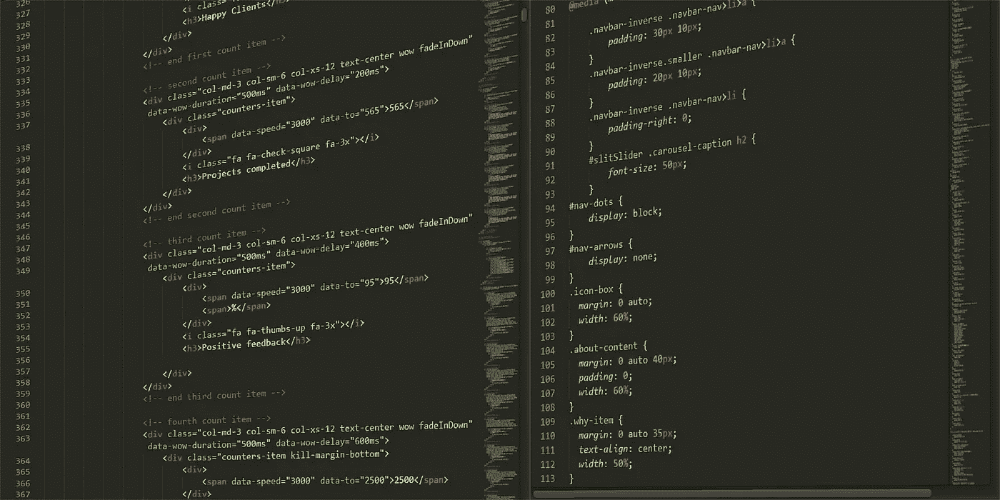
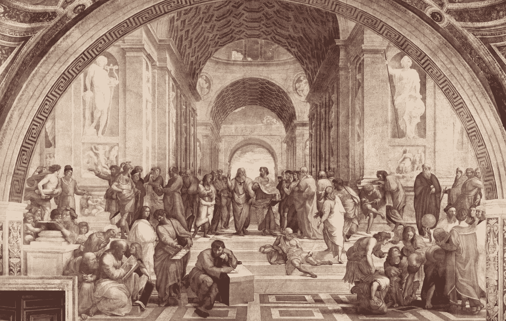

# 为什么我希望我选择了软件工程这一职业。

> 原文：<https://medium.datadriveninvestor.com/why-i-wish-id-chosen-a-career-in-software-engineering-8cd5e2243e96?source=collection_archive---------0----------------------->

Only a couple-thousand more lines to go…

# 编织未来的织锦。

> “这不关你的事，但我打算教书！”
> 
> “人类学？”
> 
> “什么——是的！”
> 
> “去……呃……人类学专业？”
> 
> “嘿……你知道吗——”
> 
> "如此继续**的循环，为什么还要麻烦**！"
> 
> —阿彻(2009 年至今)。

—

你可能还不知道，技术型工作在就业市场上一直是最受关注的。

如果你想要一个过于简单的，我们将继续把技术缩小到**计算**；人工智能，软件，硬件，电线，网格，工程，编程，X+Y=Z。从表面上看，这些都是触发词，可以根据你问的人带来各种各样的想法和感受。虽然一般社会可能不理解计算机是如何工作的，但是他们欣赏计算机做的事情。

在过去的半个世纪里，创业公司和个人完成了青铜时代的壮举，忠诚的斯巴达战士上升到了真正的泰坦地位。在奥林匹斯山脚下的一次不确定的旅行演变成了一场建造最大神庙的热潮。纯粹的凡人将很快陷入自动化的交叉火力中；金属工人和工匠将会破产，不仅巨头们要为此负责，政治家们也可能要为此负责。

这也是为什么我希望从事软件工程而不是人文学科的原因之一。

—

# **现代的泰坦们。**

> “苹果之所以能够创造出像 iPad 这样的产品，是因为我们一直试图处于科技和人文艺术的交汇点。”—苹果公司首席执行官兼联合创始人史蒂夫·乔布斯。

如果你不能告诉，我是一个单词和字母头脑的人。我涉足于制作自命不凡的文化-神话-隐喻，甚至起草无缘无故的关于鸡块的论文。当人文学科不局限于人们在百货商店购物的镀金时代故事——或者花十页纸描述家具——它们还包括哲学和宗教研究中的冒险。

这些课程中没有一门涉及到把数字放在一起。没有图表——除了比较城市人口规模——也没有公式可循或脚本可完善。取代冰冷的、经过计算的逻辑的是思想、感情和观念。学期论文马拉松比编程马拉松更受欢迎。唯一的“开始”包括研究哲学运动和*他们影响了谁……*(以及为什么)。**

我希望我至少尝试过前者。

当你学习人文学科时，你会学习思想家、作家、哲学家、活动家、教师、政治理想主义者、经济学家、神学、战争和其他足够接近的同义词。当你学习软件工程时，你学习计算理论，脚本理论，如何编程，编程什么，变量，常数，公式，以及其间的一切。

编程马拉松和头脑风暴会议在所有公司都很常见，无论是大公司还是小公司。这些方法不仅教你如何把事情做好，还能让你的职业生涯适应未来；如果你拥有软件工程或计算机科学的任何学位，你就不必为你的余生担心就业问题。

这些学科的巨大交集具有相当大的讽刺意味——苹果、微软、谷歌、IBM、脸书、Twitter、惠普或其他数十家公司的影响力水平，相当于每个历史时期的哲学家和作家在各自领域的影响力。在人类学会利用电之前，我们思考了关于死亡率、*、道德*、命运、公民和上帝意志的问题。现在我们思考如何使研究和操作系统*更快…更好…更直观…*

Plato and Aristotle arguing over the School of Athens’ mobile-app interface.

*下一级计算是什么？工程师们在夜深人静时问这个问题，在埃及亚麻布的实体床单和编码图案的心理床单下辗转反侧。*下一个重大突破会是什么？谁来设计这个系统，会有什么结果？**

对于许多寻求职业道路的年轻人来说，突破口已经在这里了。

—

# **所罗门王的云网络。**

> “硅谷的合格软件工程师、经理、营销人员和销售人员可以随时获得数十份高薪、高回报的工作机会，而全国的失业率和就业不足率却居高不下。”—马克·安德森(Marc Andressen)，网景公司的联合创始人，《马赛克》的合著者。

软件工程领域——尤其是对那些位于旧金山湾区的人来说——提供了足够的财富，足以让大学毕业生在其他领域竞争工作时嗤之以鼻。

软件工程的优势——连同它的硬件兄弟——是它仍处于婴儿期；这是人类历史上的一个时代和科学里程碑，我们甚至无法理解尚未收获的红利。如果亚瑟·C·克拉克的第三定律是“任何足够先进的技术都无法与魔术区分开来”，那么我们已经掌握了纸牌魔术，并且正在接近从想象的帽子里变出真实的兔子。

这个领域出现在虚构的“STEM”缩写中是有原因的:科学。技术。工程。数学。从科学研究到装配机械零件的一切都包括在内，因为这些工作是高度专业化和高要求的。这些工程或非工程专业中的每一个——完成你选择的专业——都可以被指望提供中产阶级、中上阶级以及最终的上层阶级的收入；(*如果*你打好自己的职业牌，并且足够努力地工作，那么你会被认为是一笔高价资产)。

这种说法当然是假设一个高中毕业生在他们十几岁的时候进入大学，在他们二十出头的时候离开。这还假设他们去了一所无聊的公立大学，并获得了五位数的学生贷款。也许他们得到了一些经济资助，也许没有。如果他们设法完成了学位，并愿意四处打听——也许与一些教授擦肩而过，建立关系网——那么他们就能找到一份收入远高于其他学科入门级工资的工作。

—

# 众神之谷。

> “我是一个硅谷人。我认为硅谷的人无所不能。”—特斯拉首席执行官埃隆·马斯克(Elon Musk)。

然而，即使你没有在名牌大学获得全额奖学金，当谈到确保未来的财务时，你仍然领先一步——至少在理论上。

在这个世界上,[的生活成本呈指数增长,](https://www.cbsnews.com/news/cost-of-living-2018-increasing-at-fastest-rate-in-10-years/)而[的工资却停滞不前,](https://www.npr.org/2018/09/03/644260170/why-wages-are-stagnating)大学一毕业就拿到六位数的薪水，就相当于在高尔夫球场的第一个球洞放了一只老鹰。对 glass door[的一项不科学的搜索揭示了薪酬是如何全面提供出色的补偿的，不仅是基本工资，还有奖金。如果你做得足够好，可以获得高额报酬，你可能会拒绝 50 万美元，因为你已经赚了 300 多万美元。](https://www.glassdoor.com/Salaries/software-engineer-salary-SRCH_KO0,17.htm)

即使你在一家小公司开始工作，年薪只有 7 万到 9 万美元，跳槽到一家大公司也会导致薪水大幅提升；在一个小葡萄园辛勤工作几年，可能会有机会为一个多代同堂的葡萄园打造更好的葡萄酒品牌。一旦你达到一个门槛，只有最昂贵的市场才能让你的钱包出汗，那么为真正重要的东西存钱就变得更容易了；紧急储蓄、婚礼、葬礼、购买公寓或房子，以及*退休。*

快速搜索一下所有涉及人文学科的薪水——即教学、策展或自由职业——都不会接近早期的六位数范围，更不用说七位数范围了。如果你是一位成功出版了全球畅销书的作家，那么恭喜你——你已经在未出版手稿的海洋中获得了一座岛屿。

也许你走的是大学教授培训路线，可以接近六位数的范围；通过发表研究、演讲和采访变得足够高调，你很快就能赚到六位数。对于那些想追随财富脚步的人文学科的人来说，机会来了，但它很少敲门。

到目前为止，我已经让这份工作听起来像是上帝赐予的礼物，尽管这一次他们让杰森和他的一帮 Argonauts 寻找一个金色的操作系统，而不是金羊毛。

那么主要的缺点是什么呢？如果这个职业很吃香，待遇也不错，为什么大家都不去做呢？

为什么真的。

—

# 克罗诺斯的祭坛是无情的。

Money may threaten to collapse at any moment but time remains a constant threat.

> "时光飞逝，却留下了它的影子."——小说家纳撒尼尔·霍桑。

在一个正常的工作日，你可以工作 8-10 个小时。这不包括公司会议、午餐会，以及其他你希望参加的活动，如果你想提高自己的知名度的话。这还不包括最后期限的紧要关头，在这种情况下，每天 12-18 小时和不规律的睡眠模式不仅会成为初创公司的常态，也会成为巨头们的常态。

一个截止日期错过导致另一个截止日期错过。这导致了办公室里的摩擦。这导致了个人的崩溃，因为缺乏睡眠会鼓励人们在人为错误中大喊大叫。对于那些考虑组建家庭或者已经组建家庭的人来说，这导致工作与生活的平衡被完全抛到了九霄云外。

正如在金融领域一样，在软件工程领域也是如此——你的工作与不断变化的市场联系越紧密，你就越有压力与时俱进。你牺牲的关系和家庭时间是为了帮助公司和它提供的产品向前发展。

教授过去比设计未来更费时。你可以让教导过去成为一个耗费一生的过程，但是未来需要一个燔祭；无限可能的时间线只会在*某人*做*关于它们的事情*时汇聚。

肯定会有好处。许多公司提供很好的度假套餐、投资机会、股票期权、健康保险，如果你友好地提出要求，甚至可以提供一间视野开阔的角落办公室。

但是时间。

时间总是一去不复返的东西。

—

# 自私的结论。

“Why didn’t anybody buy my 549-page, epic poem about a time-travelling-dolphin-assassin?”

> “钱不是答案，但它很重要。”——巴拉克·奥巴马，美国第 44 任总统。

我是一个 20 多岁的小伙子，目前除了父母之外，没有任何人可以立即供养。没有家庭责任，没有孩子，这意味着我可以一个人住在廉价的公寓里，在真正的生活开支开始之前，尽可能多的赚钱。尽管我有人文学科的学位，但我从事的是销售工作——信不信由你。我所走的这条路有望比一个老师或历史学家在同样的年龄希望遇到的更多。

虽然有些人会感到失望，因为我没有走正道，宣扬要活出你的激情，即使这会让你贫穷到死，但我就是做不到。面对停滞不前的工资和一天比一天高的生活成本，我不能简单地决定勉强凑够一份中产阶级的收入就是我想要做的。

对于那些教书的人，你们永远是我的英雄。你是由比大多数称地球为家的人更强的物质构成的。

你可以拿起一本辞典，用矮星的愤怒来称呼我任何数量的仇恨词汇，我会耸耸肩。我将继续销售我公司的产品，并在网上兼职，直到我有资本开始自己的生意——不管是网上的还是实体的。

*这么喜欢为什么不回学校读软件工程专业？我听到有人在后面叫。*

朋友，原因很简单。

任何一种基础数学都会让我惊恐地逃离，像疯子一样口吐白沫。我这么说并不是为了给自己找一个受害者的借口，也不是为了开始一轮“我真倒霉”的对话，而是为了惊叹我的才能到底在哪里。排序算法或做最轻微的代数提示都会引起哭泣和咬牙切齿。尽管我参加了补习班，但不知何故，我在必修的数学课上得到了及格分数，这让我的大学导师感到困惑。也很少有噩梦能与物理课堂相媲美。

所以如果你有能力对抗数字公式…

…而且你可以在高压力的环境中茁壮成长，在这种环境中，你可能会连续几天见不到你的配偶或孩子…

…以及如果你在公司的门槛越来越高，需求只会越来越大…

…那么我强烈推荐你从事软件工程。

在你设计了未来之后很久，我会很乐意写你的成功。

[【1】](#_ftnref1)金羊毛出现在希腊神话中，其意义和象征备受争议。众所周知，它是希腊英雄杰森必须获得的物品，以确保神的证据，证明伊奥库斯城的王权理应属于他。