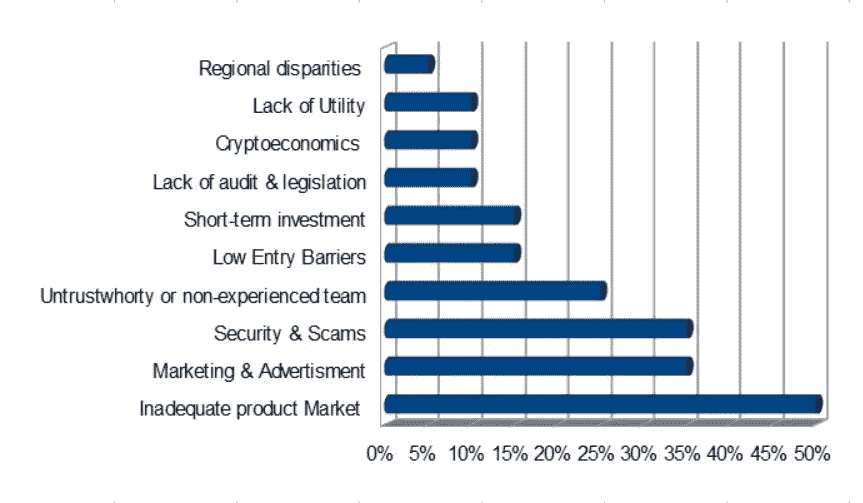

# ico 为什么会失败？它们还值吗？

> 原文：<https://medium.datadriveninvestor.com/why-icos-fail-are-they-still-worth-3b9a20a6ad9c?source=collection_archive---------3----------------------->

在过去的一年里，ICO'a 的数量呈指数级增长，然而，并不是所有的都是成功的。随着市场上 ICO 数量的增加，失败的 ICO 数量也在增加。为了实现它的目标，计划做 ICO 的公司必须做大量的研究。

下面我们来看看 ICO 失败的原因有哪些？在对 20 多篇关于 ICO 项目失败的可能原因的文章和研究论文进行分析后，结果如下:

*   **产品市场不足。**是 ICO 失败的主要原因，意味着所提供的产品或服务没有增加市场价值。在大多数情况下，开发区块链项目的公司对他们的目标行业或受众没有清晰的认识。
*   **营销和广告。** ICOs 之所以失败，是因为在营销和品牌方面的投入不足或不够。从白皮书到网站，到颜色、标识视觉效果和字体的选择，一切都会受到客户、投资者或用户的质疑。不仅如此，一些项目失败是因为他们与错误的 ICO 顾问合作，而这些顾问对项目不够关心。
*   **安全问题和诈骗。**有人故意破坏项目，或者发生重大硬币失窃或数据泄露事件，破坏了项目的声誉。在过去的 2 年里，诈骗的数量增加了，而且毫无价值的项目也在发展。
*   不值得信任或没有经验的团队。为了增加项目的可靠性，应该核实创始人或主要团队的经验和总体情况。不仅如此，他们的雄心也可能使他们在商业模式上做得不够，无法吸引更多的投资者。
*   **进入门槛低。ICO 发布时没有 MVP，甚至没有概念证明。尽管他们没有考虑到一个小市场的竞争，在这个市场中，用户和投资者只占整个投资市场的一小部分。**
*   **短期投资**。创始人没有考虑到代币的长期价值，以及它是否会随着时间的推移而增加。大多数加密货币提供短期投资选择，而不太重视未来可能发生的事情。
*   **缺乏审计&立法**。众所周知，大多数 ico 失败的原因是，它们是由对在线营销了解有限的新人发起的，或者没有应用一致的审计、衡量和报告的基本规则来改进 ico。然而，我们还可以加上缺乏明确的监管场景，这可能会导致一些项目的法律问题。
*   **密码经济学。**区块链项目的创始团队主要由开发人员或更有技术背景的人组成，对他们来说，经济部分不如开发重要。象征性的经济框架决定一个项目的成功是至关重要的，然而它并不总是被清楚地定义。
*   **缺乏效用。**一个位于区块链的项目需要证明未来的效用。为了最大化代币的效用，公司必须定义代币发行的特征和目的，并分析是否需要代币。
*   **地区差异。**当一个项目对于加密货币的使用来说过于具体，并且仅限于一个地理区域时，就会出现这种情况。这类项目很可能失败，因为它们只适用于非常有限的市场。

但是，哪些因素可以预测项目的成功呢？根据 [**营销科学&灵感**](https://www.mins.sk/marketing-behind-ico/) **研究**以下几个方面定义了理想的 ICO:

1.一个被证明有执行能力的团队。
2。商业生存能力检查。
3。技术检查。
4。有效利用资金和基于业务的最低和最高筹资门槛。
5。明确的法律框架。
6。诈骗保护。
7。透明的 ICO 流程。
8。托管。
9。资金的受控释放。10。延迟的创始人流动性。

总之，ico 是有用的，尽管如此，为了成功，在它们的背后还有许多艰苦的工作要做。