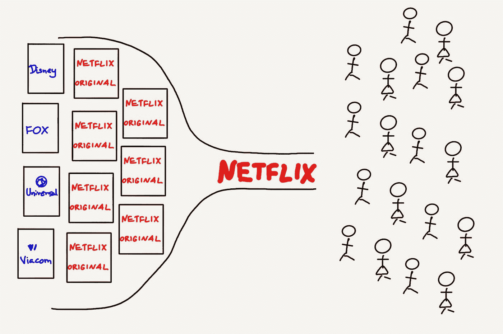

# 为什么我要赌迪士尼

> 原文：<https://medium.datadriveninvestor.com/why-im-betting-on-disney-to-beat-netflix-b064e70eea96?source=collection_archive---------3----------------------->

# 迪士尼的核心战略

在过去的大约 100 年里(成立于 1923 年)，迪士尼已经从一个儿童动画内容的利基供应商发展成为世界上最大和最强大的媒体娱乐公司。这种巨大的增长是由一个潜在的战略推动的，即帐篷杆内容。迪士尼的帐篷杆战略是制作、授权或收购一部爆破电影，目的是围绕电影和角色支持广泛的辅助搭配产品。

这一策略在迪士尼获得了广泛的成功。就看 1953 年出的《小飞侠》(虽然[原著](https://en.wikipedia.org/wiki/List_of_works_based_on_Peter_Pan#Film)出道于 1904 年，迪士尼授权)。它已经有了十几部后续电影，今天仍然幸存下来，在世界各地有多个主题公园和活跃的剧院巡回演出。

迪士尼将其 IP(剧情和人物)视为固定成本。对于任何固定成本，目标总是使用固定成本来创造尽可能多的产出。利用这一战略，迪士尼建立了一系列业务和分销渠道，以进一步利用其知识产权赚钱。

*   创建主题公园和度假村(6 个公园，2017 年[有 1.5 亿游客](http://www.teaconnect.org/images/files/TEA_268_653730_180517.pdf)
*   [开始了图书出版](https://books.disney.com/)
*   [建立了游戏业务](http://lol.disney.com/games)
*   [创建了一个剧院巡回演出团](https://liveshows.disney.com/)
*   建造酒店([超过 25 个地点和 30，000 间客房](https://disneyworld.disney.go.com/faq/resorts/resort-hotel-list/)
*   买了三艘大型游轮
*   [出售玩具和商品](https://www.shopdisney.com/toys)
*   买下了一支 NHL 球队([强大的鸭子队](https://en.wikipedia.org/wiki/History_of_the_Anaheim_Ducks))和一支 MLB 球队([阿纳海姆天使队](https://en.wikipedia.org/wiki/Los_Angeles_Angels))
*   当然，还拍了后续电影和连续剧。

1984 年，一旦迪士尼投入大量资金建立这些业务和分销渠道，它就开始专注于扩大青少年娱乐之外的观众群。它创造了试金石电影，以创造更成熟的内容，如漂亮女人和早安，越南。随后，迪士尼开始了内容收购狂潮，在成人和体育市场构建自己的内容。迪士尼收购或创造了:

*   好莱坞电影公司(1990 年)
*   米拉麦克斯(1993 年)
*   ABC/ESPN(1996 年)
*   福克斯家庭网络(2001 年)
*   皮克斯动画公司(2006)
*   漫威娱乐(2009 年)
*   卢卡斯影业(2012 年)
*   21 世纪福克斯(2017)

通过所有这些收购和新部门，迪士尼成为世界上最大的娱乐公司，现在为从幼儿到老年人的每个年龄组提供内容。

> 迪士尼本质上是在创造一个巨大的正反馈循环。由于迪士尼巨大的物理足迹和分销渠道，它可以在内容上产生超过其竞争对手能够产生的增量收入，从而可以在产生新内容和资本支出上花费比竞争对手更多的钱，从而继续并加强循环。

# 行业动态和技术变革

从历史上看，如果你想看电视，你的家必须通过当地的电线杆或地下电线连接到电缆分配线上。然而，城市和县不喜欢让成吨的有线电视公司在城市中挖掘铺设电缆的想法。因此，城市将能够提供有线电视的公司数量限制在一两家，从而形成了自然垄断。

这些自然垄断限制了内容创作者直接接触消费者的能力。电缆技术和商业模式创造了两个重要的行业动力。

*   **线性节目—** 节目由广播公司提前选定，然后在设定的时间观看。观众不能快进内容或者选择在不同的时间观看内容。
*   **有线电视公司控制着内容—** 由于有线电视公司控制着提供家庭电视的实际线路，他们能够选择他们想要为消费者提供的内容。有线电视公司与内容制作商就特定频道的价格进行协商，通常为每个客户支付固定金额，即使客户没有观看该频道。

从历史上看，这两个因素使得电视内容迎合了最小公分母。其中内容被创建以具有大众市场吸引力或吸引人口的强大子集，例如体育观众。此外，由于电视的线性节目性质，内容库存的容量是固定的。

随着互联网上流媒体的出现，这两种动力都消失了。开放了一个分发渠道，让内容制作者与最终用户建立直接关系，最终用户能够更好地控制他们观看的内容。这些根本性的转变导致了三个重要的新行业动态。

1.  **关于用户观看模式的海量数据** —通过流媒体，公司能够准确了解用户如何消费内容。他们知道节目暂停的时间和地点，观众离开的准确时间，以及哪些节目与观众相关，因此他们可以了解潜在的用户偏好。
2.  **为小群体提供更个性化的内容** —由于对内容库存没有限制，可以为社会上更小的群体制作更多内容，这些群体通常不会大到足以保证内容创作成本。因此，内容的数量显著增加。
3.  **内容提供商数量的增加**——没有实体来选择最终用户看到的具体内容，更多的人和公司可以创建和分发内容，自由市场然后决定什么内容是好的或坏的。

# 网飞的崛起

由于大多数人都非常熟悉[网飞作为一家邮寄 DVD 租赁公司的历史渊源](https://en.wikipedia.org/wiki/Netflix#Establishment)，我将跳过这一点，专注于网飞如何走到今天这一步及其核心战略。

网飞在 2007 年以内容聚合商的身份开始了在线流媒体业务。终端用户每月支付固定的订阅费，网飞利用这笔收入与内容制作商签订许可协议，购买网飞认为终端用户想看的内容。当时，迪斯尼等内容制作商很乐意将他们的内容授权给网飞。他们认为这只是尽可能广泛地传播他们的知识产权，并在创造知识产权的固定成本上增加收入的另一种方式。

这种内容聚合商业模式在网飞非常成功，[截至 2012 年底，它拥有 2700 万订户和近 10 亿美元的收入](https://www.theverge.com/2013/1/23/3907424/netflix-announces-q4-2012-earnings)。然而，网飞正确地认识到这种商业模式是不可持续的。它完全依赖于内容制作者，72%的收入直接流向内容制作者。网飞发展得越大，这些内容制作商就越会将网飞视为威胁，因为网飞威胁要侵蚀他们的核心电视业务，而网飞的品牌由于与消费者的直接关系而取代了他们的品牌。

为了应对这些日益逼近的风险，2013 年，网飞迅速转向创建自己的原创内容，推出了《纸牌屋》和《橙色是新的黑色》等热门节目，两部剧都取得了巨大成功。快进到今天，网飞拥有 1.3 亿订户，每年在原创内容上花费 110 亿美元，一年内将发布 700 多场演出和 80 多部新故事片。相比之下，迪士尼今年只会上映 10 部特色电影。

from Stratechery by Ben Thompson

展望未来，我认为网飞将采用五项核心战略来继续其高增长轨迹。

1.  **创造大量的新内容，特别是节目**——因为节目自然比电影有更多的内容，往往会给订户留下更多悬念，从而鼓励他们更多地重复回到网飞。此外，每花费一美元，电视剧通常比电影产生更多的播放时间，因为前期成本(例如，创建布景或寻找演员)可以分散在多个剧集和季度中。
2.  **成为内容创作者想去的地方—** 从历史上看，电视和高票房电影对什么可以制作，什么不可以制作有更严格的规定。由于其非线性编程，网飞可以为创作者提供更多自由，并作为更多创意内容的理想目的地，从而减少网飞购买内容的费用。
3.  **利用数据找到偏好群体，并为这些群体创建量身定制的内容** —正如我在“行业和技术变革”一节中所说，数据和更个性化的内容是流媒体内容的基石。网飞将不断分析其用户数据，以找到偏好，并使用这些数据来通知应该创建什么类型的新节目和电影。
4.  **扩展到新的目标人群和基于区域的内容** —随着网飞市场渗透率的提高，它将越来越多地寻求为其他年龄段(主要是儿童)扩展内容，并通过为不同地区创建文化相关的内容来进行国际扩展。
5.  **专注于技术和用户体验** —网飞一直专注于提供简单而强大的用户体验，甚至是最小的元素。例如，不久前，网飞推出了跳过介绍按钮，因为数据显示，许多消费者在那一部分试图快进，而因为错过了介绍而不得不倒带。

# 迪士尼的机会

> 我对这种竞争格局和技术变革的影响思考得越多，就越觉得迪士尼已经为成功做好了准备。迪士尼的战略不需要彻底改变，只是交付机制需要改变。

可以说，这种新的交付机制为迪士尼提供了更好的服务。其品牌将在消费者面前更加突出，迪士尼最终可以拥有直接的消费者关系，并提供其主题公园一贯提供的卓越客户体验。

与网飞不同，一旦迪士尼创建了直接面向消费者的应用程序和网站，它将立即拥有一个大规模的老电影和节目库，使产品立即受到目标群体的欢迎。与此同时，将工作室的重点稍微转向为特定的交付渠道创造内容。此外，由于迪士尼有大量的其他业务线，它将能够在其他业务部门传播它制作的所有新的原创内容，以产生超过网飞仅在数字流媒体领域所能产生的额外收入。

但是不要误解我。迪士尼的成功当然不是必然的。为了在这些不断变化的行业动态中取得成功，迪士尼将需要正确的战略眼光和出色的执行力。我认为以下五点对迪士尼的成功至关重要。

1.  创建三到四个不同的内容产品。迪士尼最大的资产是其针对大量用户类别的内容优势。他们有面向儿童、体育迷、老年人、科幻迷、非小说爱好者等的内容。通过将这些内容分成许多产品，迪士尼可以对消费者进行价格隔离并增加收入。目前有三种明显的内容产品，体育(ESPN)、儿童(迪士尼)和更成熟的内容(可能是 Hulu，因为迪士尼现在拥有其 60%的股份)。然而，随着时间的推移，随着电视的进一步恶化，我认为他们可以增加第四个新闻内容，提供全球到超本地的内容。
2.  **将其他产品捆绑到流媒体服务中(想想亚马逊 Prime)。**这是迪士尼的核心帐篷支柱战略，由于迪士尼直接接触消费者，这一战略应该会大幅增加。由于迪士尼将完全控制用户体验，迪士尼应该营销、捆绑和折扣其他迪士尼产品和体验。订阅迪士尼的流媒体服务应该被视为儿童娱乐领域的一站式商店，最终也将被视为其他领域的一站式商店。
3.  在等式中保留部分广告。电视广告是一种行之有效的营销媒体，通过向流媒体服务商提供更多数据，电视广告将变得更加有效。Hulu 目前提供两种订阅套餐，一种有广告，一种没有。迪士尼应该继续这一战略。相对于传统电视，与流媒体相关的数据增加以及直接链接到屏幕上的广告内容的能力将增加广告的价值。此外，有广告和无广告订阅允许更多的价格歧视，以减少需求过剩。
4.  **创建更多内容，尤其是节目。**正如我在网飞的核心战略中概述的那样，节目是吸引用户的基础，也是每小时最具成本效益的内容。这可能是迪士尼收购 21 世纪福克斯的主要原因，但迪士尼仍然需要转移一些工作室，生产更多的内容，以便与网飞的数量竞争。
5.  **拥抱数据，关注用户体验。**转向流媒体为迪士尼带来了大量的机遇，但也伴随着许多风险。迪士尼需要完全接受其向数字化的转变，并采用领先互联网公司的最佳实践。具体来说，迪士尼需要专注于用户体验和 A/B 测试，构建统一的数据存储以轻松利用数据，最重要的是，快速移动。

只有时间才能证明迪士尼是否能够设定正确的战略愿景并有效执行。在写这篇文章的时候，迪士尼将在 2019 年底发布流媒体服务，这将是我们真正知道结果的一两年后。