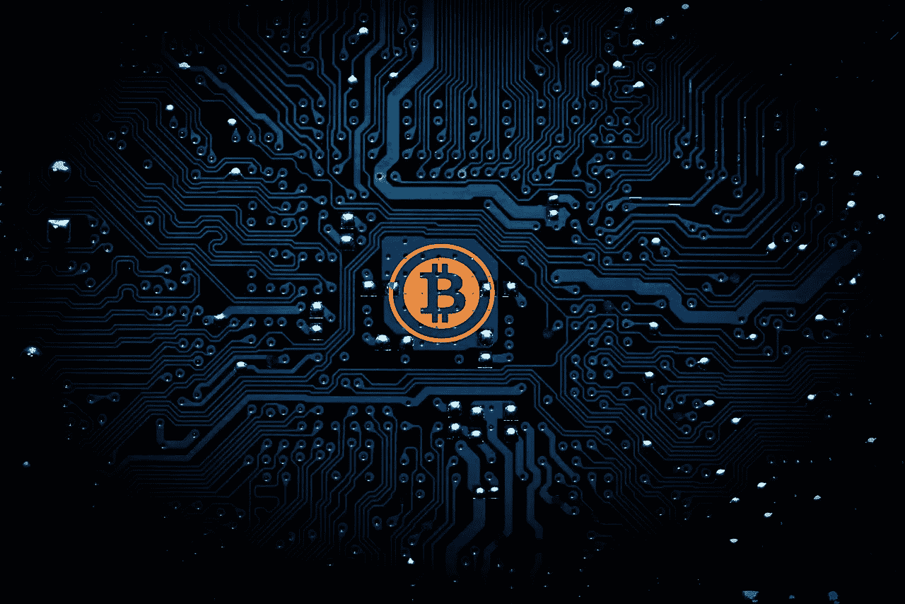

# 我为什么要买比特币

> 原文：<https://medium.datadriveninvestor.com/why-im-buying-bitcoin-6b64f7efa30?source=collection_archive---------6----------------------->

*(我一天的工作是作为* [*作家*](https://www.fool.com/author/1901/index.aspx) *为杂色傻子。由于比特币不是一个专业知识很深的领域，这将* ***而不是*** *在那里发表，而是在 Medium 上发表。)*

我不是比特币牛。我甚至不是一个加密货币的牛市。我相信比特币有超过 50%的可能性永远徘徊在现在的价格和 0 美元之间；我个人希望事实确实如此。

然而，到今年年底，我将为我家的整体投资组合购买比特币。我这样做不是作为一项长期投资。相反，我这么做是为了保险起见。

对于那些有几年经验的投资者来说，他们明白*他们可能会失去他们投入的一切*，这个想法仍然*值得考虑。*

Pixabay

# 比特币的基础知识

对投资者来说，比特币代表了一个巨大的范式转变。很难理解它到底是什么。加密账本公司 Chain 的首席执行官亚当·路丁在写给摩根大通首席执行官杰米·戴蒙的一封公开信中说，没有人比他做得更好了。

Ludwin 表示，加密货币——比特币是其中最大和最受欢迎的——更好地理解为“加密资产……一种支持分散化应用的新资产类别。”

为了理解这实际上意味着什么，路丁鼓励我们这样想:

*   股票是为上市公司服务的——允许它们筹集资金以换取所有权。
*   大多数债券服务于政府机构——帮助联邦、州和市政团体筹集资金，并在日后偿还。
*   抵押贷款服务于土地所有者——帮助人们购买房屋，以特定的利率换取 15 年或 30 年的付款。

加密资产遵循相同的结构。它们主要通过首次公开募股(ico)发行，以帮助开发分散应用的团体筹集资金，使他们的应用更好。以太坊为构建去中心化的应用程序提供了一个平台——它是微软的 sAzure 或亚马逊的弹性云的去中心化形式。Filecoin 帮助你远程存储数据 Dropboxor 或 Alphabet 的 Google Drive 的去中心化版本。

Networks are becoming decentralized. Pixabay

比特币的目的有两个:它代表了一种不需要银行等第三方的货币转移方式，以及一种真实的货币本身——比如美元或欧元。

比特币没有内在价值:你不能吃它，不能用它来运输自己，也不能种植它期望食物会生长。它只是一种价值储存手段:因为世界上存在的比特币数量是有上限的，所以理论上来说，比特币变得有价值。

如果这是一个很难理解的概念，那就把它比作黄金:虽然它很漂亮，但它对生物的生存没有任何帮助。相反，它的价值来自于这样一个事实，即全世界的黄金供应是有限的——而且每个人都同意它的价值。

# 为什么比特币会大幅下跌

当你从 30000 英尺的高空阅读路德维希对加密资产的看法时，你会认为他对比特币及其同类产品的未来非常悲观。谈到这些工具在现实世界中的应用，他说:

> *几乎在每个方面，分散式服务都比集中式服务更糟糕:*
> 
> 他们比较慢
> 
> 它们更贵
> 
> 它们的可扩展性较差
> 
> 他们的用户体验更差
> 
> 他们的治理不稳定、不确定
> 
> *不，这不仅仅是因为它们是新的。这不会从根本上改变……这些服务的主要设计目标直接导致了结构性的权衡，在这种权衡之下，所有其他目标都必须从属于它们，以便它们是相关的:*去中心化。

换句话说，你可以拥有一个易于使用、高效的集中式工具，也可以拥有一个不太直观、低效的分散式工具。

但是你不能两者兼得。

正因为如此，如果世界继续相对平稳地运转，这些加密货币将没有多大意义，在这种情况下，比特币的价值将随着时间的推移而下降，因为它根本不需要。

# **为什么我还在买比特币**

在描述他为什么还在追赶加密潮流时，Ludwin 解释了这种资产击败集中式应用程序的一个方面，也是唯一的一个方面:

> ***抵制审查。***
> 
> *…*
> 
> *对分散式应用的访问是开放的，不受限制的。这些服务的交易是不可阻挡的。更具体地说，没有什么能阻止我把比特币发给我喜欢的任何人。*

在这种抵制审查的情况下，我们需要生活在什么样的世界里？政府、社会、文化和经济体制开始瓦解。自从内战以来，我们在美国还没有经历过这样的事情。但这并不意味着我们永远不会。

不要误解我，我不是末日论者。我没有储备物资的地堡来度过核冬天。相反，我想接受这样一个事实，那就是我们生活在一个双手都是黑天鹅的世界里，并采取简单的措施来减轻任何可能因此降临到我家人身上的灾难。

比特币已经在处于动荡之中的国家证明了自己的勇气。比特币多头最近的一条推文强调了这一点:

Twitter

虽然像你我这样的美国人可能认为没有必要使用货币，但那些处于灾难中的人可以证明它们的效用。一名伊朗人声称，比特币“将(他)从可怕的通胀和审查局面中拯救出来”，而一名委内瑞拉人表示，比特币“被用作保值手段，以逃避通胀和货币贬值。”

简而言之，这就是我购买比特币的原因:作为在美国发生灾难的保险政策。如果被迫做出选择，我希望这种事情不会发生——比特币最终会归零，因为我们能够继续和平地生活。

这和你成家后得到的大额寿险保单是一样的。一想到不得不使用它，就会令人心碎。你希望它永远不会发生。但你也意识到，忽视没有你在身边的家庭收支平衡的风险是不明智的。

虽然你可能会对 Twitter 上的匿名轶事感到犹豫，但畅销书作家、前交易员、NYU 大学风险工程教授纳西姆·塔勒布[指出](https://medium.com/opacity/bitcoin-1537e616a074)比特币不仅对个人来说是一份很好的保险，对整个社会来说也是如此:

> *它的存在本身就是一份保险单，提醒政府，当权派能够控制的最后一个对象，即货币，不再是它们的垄断。这给了我们这些人一份应对奥威尔式未来的保险。*

# **只买你愿意失去的东西**

就像定期寿险一样，我购买比特币的方法是只支付我愿意完全失去的部分。正如投资朋友早就说过的，“如果失败了，我想要的只是一笔小投资。如果成功了，我只需要一笔小小的投资。”因此，我只打算将我家庭投资组合的最多 1%投入比特币。

这听起来可能很愚蠢，但在比特币起飞的不太可能的事件中，它可以作为一种重要的储备，在需要的时候调用。这就是保险单应该发挥的作用。