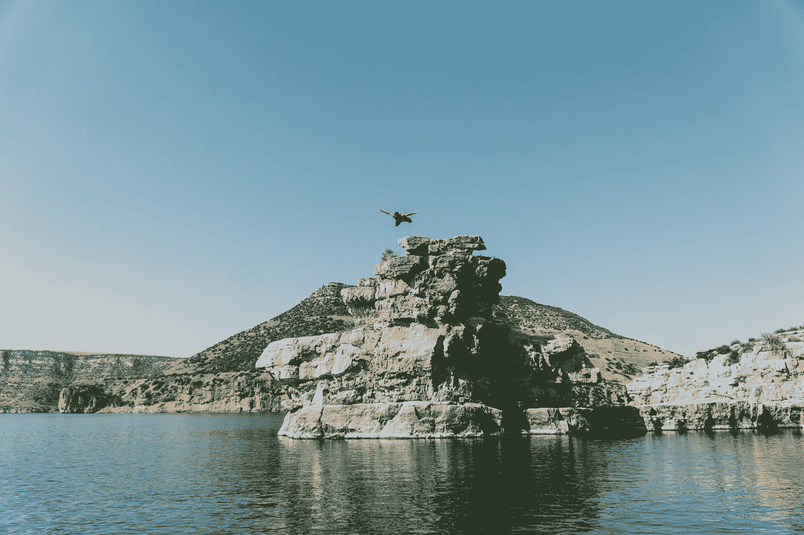
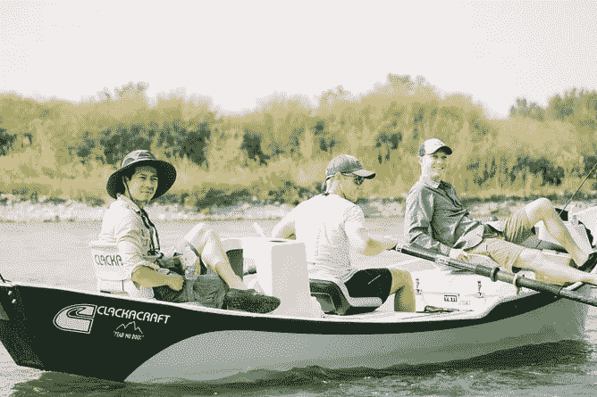
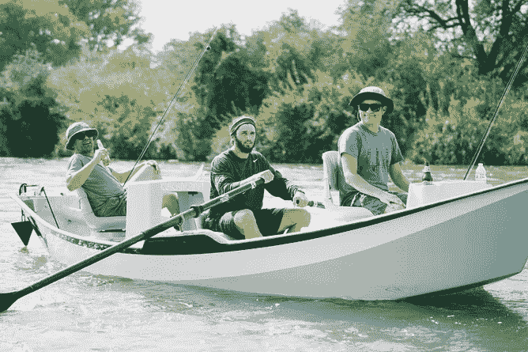
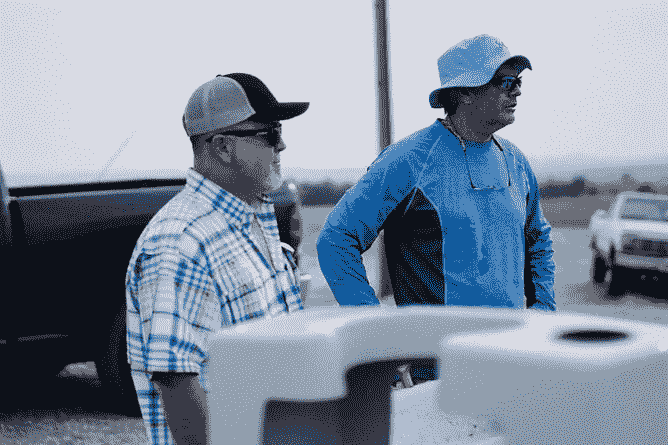
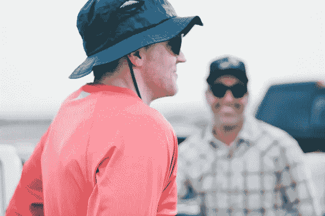
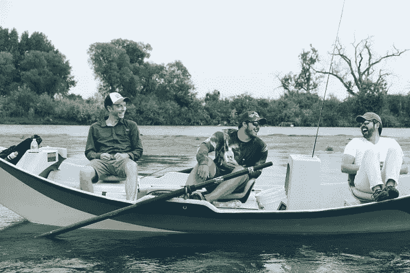
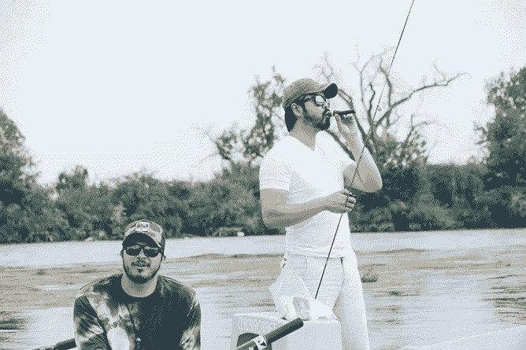

# 为什么我要投资我的团队…

> 原文：<https://medium.datadriveninvestor.com/why-im-investing-in-my-team-a772ae40cc49?source=collection_archive---------27----------------------->

## 以及为什么要在蒙大拿州的大角河呆上一周。

我还没有遇到过不同意投资于员工的领导者。都说投资很重要。多少，是另一个故事。

几年前我开始了一项新的传统。我带着我的管理团队和一些朋友去蒙大拿州一周，帮助他们断开连接。为什么是蒙大拿？

让我解释一下。

蒙大拿州是大角河的所在地。太美了。
我们飞鱼。我们知道如何飞鱼吗？
没有。大多数人以前从未飞钓过鱼。
那么，为什么又要这样做呢？因为有一些非常重要的事情我想加强，我会用创造性的方式去做。

首先，我们公司必须是一个学习型组织。

我的工作是将这一点深入组织内部。我们以小的方式做到这一点，比如在 Slack 的“分享”频道分享内容，以大的方式做到这一点，比如去蒙大拿。要成为一个学习型组织，你必须热爱学习。不仅仅是更多地了解你的工作。

所以，我们学习如何飞鱼。

在学习新事物的过程中，你会绊倒。你失败了。失败是好事。
新手真好。事实是，从现在开始我们都是新手。你可以感谢现代科技和更广泛的科技生态系统，一切都是其中的一部分。我什么意思？我们所有的工具和技术都在不断更新。你的 iPhone 很快就需要更新操作系统了。本周你至少会有半打应用需要更新。就在你学习一个特性的时候，一个新的发布了，你要重新学习东西。算法和软件也是如此。还有婚姻。但那是另一回事了。事实是，我们都是新手——即使是“专家”,我也希望我的团队能适应这一点。

*我希望他们流畅自如。*

飞钓一周特别有效。

当你学习像飞钓这样的技术时，你必须集中注意力。你必须敞开心扉。当你和 10-11 个其他人一起做的时候，会有更多的压力。这是件好事。但是在蒙大拿这样美丽的地方学习是锦上添花。

我记得我的第一天，我糟透了。很糟糕。非常糟糕。有好几次，我钩住了我的钓鱼线，弄得一团糟。想象一只鸟在一根线上筑巢。那是我的台词。我为我的钓鱼向导感到难过。然而，他耐心地解开它，每次都鼓励我再试一次。有一次我想，“嘿，伙计，如果你想的话，你可以带我回小屋。”

他回答说:“不可能。”

我怀疑他以前见过这个。高管和专业人士在某个领域处于领先地位，现在却在摸索着学习新东西。当你做不好某件事的时候，你的感觉很有趣。在所有人面前。有人曾经说过:

> “每一个有意识学习的行为都需要一个人的自尊愿意受到伤害。这就是为什么年幼的孩子在意识到自己的重要性之前，学得如此容易。”

在那次挫折中，我也有机会回到现在，重新获得在这样一个美丽的地方和伟大的人们一起学习新东西的特权。说真的，这是一种特权。当你能回到这一点，它是变革性的。这就是我对我的团队和旅途中其他人的期望。

但是所有这些都是有代价的。而且不便宜。

除了机票，所有费用都已支付。所以，如果你能去，剩下的就交给我了。对于小企业主来说，这是一项投资，但我相信热爱学习的人会获得长期收益。

## 休息和断开连接

作为一家数字代理公司，我们永远在线。一直保持联系。总是在技术中，所以断开连接很重要。我需要在这方面发挥领导作用。我试图通过创造一个我的管理团队也能这样做的空间来做到这一点。当你断开时，自然地，你也重新连接了…一些东西。

某样东西是必不可少的。

首先，身体和思想会经历一次数字化撤退。你如此习惯于查看通知、电子邮件和社交媒体。我们和工作有联系。到项目。敬财务。敬你的家人。孩子们的足球时间表。但是在蒙大拿，除了一两部电话，旅馆里没有信号。没有网络。那是故意的。这是一种被迫的分离。你知道会发生什么吗？“找到时间了。”你获得了很多时间。有了它，你可以小睡、阅读、吃饭、聊天、大笑、点火、抽雪茄、享受饮料、钓鱼、小睡、远足或再次小睡。大约三天后，你的呼吸变得更深更慢。你感受空气，看日落。你连接到更深层的东西。有时候，你会清晰地听到自己的声音和愿望。

## 实践脆弱性

脆弱曾经是禁忌。我不是被教育成脆弱的。这些年来，我已经忘记了很多。相反，我相信那些拥抱脆弱的人成长得更快。他们有优势。*他们的领导力和成长速度超过了同龄人。*我不是说我们整天互相拥抱，强迫进行这些对话。一点也不！我只是说，整天和不同的人在一条船上呆一周会让你变得开朗。你说话。你笑了。你敞开心扉。这有治愈的作用。我非常尊重这一点。当事情开始变得有点脆弱时，我会停止想要打断和改变进程的倾向。现在，我放手，顺其自然。有一次，一个男人公开了他的婚姻。又一个瞬间，有人谈到了抑郁症。这些都是强有力的，杰出的，非常有能力的领导人。但是它们也有阴影。我们都是。脆弱给这一切带来一丝光明。不做评判。只有好人(和威士忌)。

## 富足与匮乏的心态

从小到大，我们没有钱。我时不时地与稀缺心态作斗争，因为坦白地说，我没有太多。像这样的旅行让我想起了富足。蒙大拿很大。天空很大。星星又大又亮。它提醒我，到处都有很多。我们很幸运。但有时我们会忽略这一点，并因资源匮乏而采取行动。在稀缺的情况下，关系可能会很紧张，我们的视角也会受到限制。这种强度会流失。另一方面，富足激发我们去探索各种可能性。它也可能是激烈的，但它激发行动、希望、创造力和慷慨。

我希望这些人都能利用这一点。如果他们做到了，那么更多的事情是可能的。

底线是，蒙大拿是一种旅行。非常具体的一个。这并不适合每个人，也不是每个人都想要这样的旅行。这不是关于蒙大拿，这是关于当你有能力的时候投资于人。值了。回报可能不总是立即反映在底线上，但它总是表现在人民的福祉和活力上。从长远来看，这肯定会影响底线。以人为本。利润会随之而来。