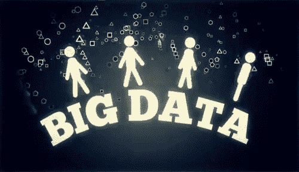
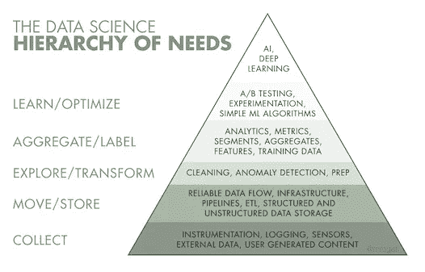

# 为什么我要回到科技行业？……数据科学

> 原文：<https://medium.datadriveninvestor.com/why-im-switching-back-to-a-career-in-tech-data-science-b0aceb8e71e?source=collection_archive---------11----------------------->

Image from gyfycat.com

我一直热爱技术，因为我喜欢与人一起工作，我想这让我在本科时学习了计算机科学，后来，我的硕士学位转向了可持续发展。但是，即使在国际发展领域，在我生活过的三个国家，津巴布韦、印度和美国，也不断给我留下深刻印象的是技术工具在解决世界上最关键的问题方面的力量，以及在商业术语中，技术和数据帮助制定最先进的技术解决方案的能力。

随着世界通过互联网变得越来越紧密，越来越多的人使用智能手机，每个人都有多个移动应用程序，从社交媒体应用程序、拼车、娱乐流媒体、银行、支付、在线约会、度假，基本上任何你能想到的人类行为、爱好或交易都有某种形式的移动应用程序或网络界面，允许我们在所有能连接到互联网的设备上实践这种行为。

根据 Business insider 的一篇文章，截至 2019 年 3 月，游戏应用堡垒之夜的下载量超过了 2.5 亿次，对于一个在 2017 年 8 月还不存在的应用来说，这是非常惊人的。脸书拥有超过 20 亿用户，全世界近三分之一的人都在使用它。这些全球使用的平台的一个共同特点是它们都是免费下载的。人们不禁要问，为什么如此神奇的工具的开发者愿意免费提供呢？答案是，用户并不完全免费使用应用程序，我们每次使用在线平台时都会分享数据，无论是移动应用程序的网站。公司正是利用这些数据来制定商业决策、进行有针对性的营销以及开发有针对性的、信息灵通的解决方案。

任何有能力创建产生流量的平台的人都有能力从潜在的数百万甚至数十亿人那里收集大量的大数据。虽然大多数企业和创作者都专注于创建获得多个用户和关注的平台，但能够充分利用从用户那里收集的数据的组织正在获得最大利润，新的商业机会正在从这种不仅收集数据，而且清理、转换、分析、建模、可视化和交流商业发现的能力中出现。简而言之，这就是所谓的数据科学领域。

Image Source: Monica Rogati Hackermon Blog

几周前，我报名参加了为期 15 周的密集数据科学沉浸式训练营，开始了成为数据科学家的旅程，我希望成为访问数据(收集)方面的专家，发展清理和组织数据(探索/转换)的技术能力，能够对数据进行分析、度量和聚合(聚合/标签)，并掌握运行机器学习算法、人工智能和深度学习(学习/优化)的技术技能和工具。当我写下这些技能时，似乎有些雄心勃勃，但我下定决心要把它变成现实，并将利用这个平台记录我成为数据科学家的经历。