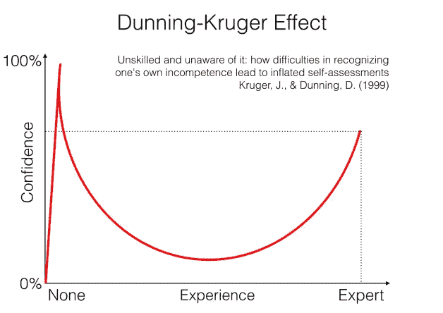
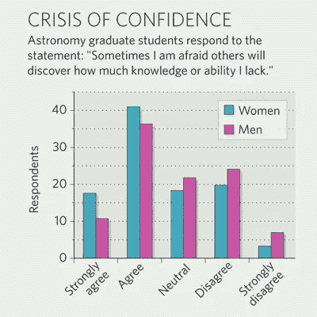

# 为什么冒名顶替综合症会影响最成功的人

> 原文：<https://medium.datadriveninvestor.com/why-imposter-syndrome-affects-the-most-successful-people-d3e5c8bb977e?source=collection_archive---------0----------------------->

参见[杰出女性](https://www.theremarkablewoman.com.au/insights)获得更多可行的见解，以提升你的生活:个人、职业和财务。

Don’t feel like reading? Listen to this story now.

有没有感觉到你在假装？就像你被赋予了一个职位或者一个责任，完全是因为运气，你知道你还没有准备好——而你一直告诉自己你不值得拥有它？或者更糟的是，你生活在持续的恐惧中，害怕人们会发现你是个骗子，害怕你真的不知道自己在做什么。正如他们所说，光芒背后没有实质。一想到它，你就会感到羞愧难当。

如果你这样做了，你并不孤单。你患有“冒名顶替综合症”。最近的一项研究发现，估计 70%的美国人患有冒名顶替综合症——一种对自己所做的事情不够好或不够聪明的普遍感觉。

事实上，即使是软件公司 *Atlassian* 的联合创始人[迈克·坎农-布鲁克斯](https://www.youtube.com/watch?v=zNBmHXS3A6I)，以及一位澳大利亚亿万富翁，在他的公司赢得奖项、招标并不断壮大的时候，也面临着骗子综合症的感觉。他说:

> “冒名顶替综合症是指你觉得自己力所不及，但已经深陷其中，内心觉得自己不够熟练、不够有经验或不够有资格来证明自己的存在。但是你在那里，你必须想清楚，因为你走不出来。更多的是一种侥幸逃脱的感觉，以及对被发现的恐惧。”

## 你越熟练，越觉得自己是个骗子

你越成功，越有技能，你就越有可能认为自己很愚蠢，而且是装出来的。关键在于感知与现实，以及成功人士如何在努力实现目标的同时，处理好感觉像个骗子的问题。

What the imposter syndrome feels like to the sufferers

那些没有面对过冒名顶替综合症的人可能会认为这是妄想。但是，患者知道他们不断面临焦虑和“被抓住”的威胁。

在这里，我们列出了不同类型的冒名顶替综合症，它是如何在家庭和社会环境中开始的，以及你如何发现和管理它，以便你可以享受你的成功，避免冒名顶替综合症对你生活的负面影响。

# 5 种类型的冒名顶替综合征

研究显示，困扰大多数成功人士的冒名顶替综合症不止一种，而是五种:

完美主义者:这些人是高绩效者，他们为自己能做出最高水准的工作而自豪。他们倾向于微观管理，很难授权。完美主义者必须是做事的人，因为他们担心如果他们不参与，事情就不会做好。

**专家:**这种人觉得他们是靠欺骗才获得现在的职位，他们不应该得到这个职位。

**强壮的个体/独唱者:**这种人不喜欢寻求帮助。他们为自己肩负着公司的重担而自豪，不想因为寻求帮助而显得无能。

女强人:这是一种态度积极的人，容易将自己推向极限。这类人觉得有必要证明自己，并觉得他们需要不断赢得他们的条纹。

天生的天才:这个人有他们这边的基因。他们天生聪明，有才华，但面对挑战时却有困难，因为这让他们觉得自己很愚蠢。

# 女性领导者更容易患上冒名顶替综合症

在对女性和冒名顶替综合症的研究中，宝琳·罗斯·克拉伦斯和苏珊娜·艾姆斯发现，大多数女性面临冒名顶替综合症是因为她们觉得自己不够聪明，尽管她们的成就并非如此。他们发现，女性比男性更频繁、更强烈地面临冒名顶替综合症，因为家庭和社会结构勾勒出了女性“应该”是什么样子。

> “经历过冒名顶替现象的女性坚信自己不聪明；事实上，他们确信他们愚弄了任何不这么认为的人……换句话说，这些妇女找到无数的方法来否定任何与她们认为自己实际上不聪明的信念相矛盾的外部证据。”

我们看到男人和女人对成功、挑战和失败的看法非常不同。

> “女性倾向于将她们的成功归因于暂时的原因，如运气或努力，而男性则更倾向于将她们的成功归因于内在的、稳定的能力因素。相反，女性倾向于用缺乏能力来解释失败，而男性更倾向于将失败归因于运气或任务难度。

就连研究人员也对冒名顶替综合症的毒性感到震惊——他们把它描述成一种病毒:

> “我们对自我延续的本性感到惊讶……我们的高成就女性的欺骗情绪的普遍性和持久性，以及她们对自身能力的持续低估和对失败的持续恐惧。我们没有发现仅仅是重复的成功就足以打破这种循环。”

重要的是要记住，当你达到目标或取得成功时，冒名顶替综合症不会消失。事实上，你只是觉得自己是一个更大的骗子，你必须更加努力工作，这样人们才不会发现你。这是一个可怕的地方，因为你的成功让失败的恐惧变得更加可怕。

为了有效地处理和打破冒名顶替综合症的循环，你必须深入。你必须挖掘出你对自己的信念，看看你的家人和部落如何看待你，以及你如何看待自己。

# 冒名顶替综合症的起源:家庭和社会契约

当谈到冒名顶替综合症的种子时，人们分为两类。

1.  “敏感”标签:有兄弟姐妹的人会被他们的父母贴上标签。通常，一个兄弟姐妹被视为“聪明的一个”，而另一个被视为“敏感的一个”。这意味着，如果你被贴上了“敏感者”的标签，你就无法证明你是聪明的，因为你被放在了一个你应该完成的类别中。冒名顶替综合症开始在这里出现，因为你有一个家族身份，说你是“敏感的”，这是现在与你的个人身份的战争，这是试图反驳这种说法。
2.  **“自我”标签:**这是另一个家族标签，告诉孩子他们很特别，是个天才，很聪明，没有什么是他们做不到的。当孩子面临困难、经历挑战或失败时，就会出现骗子综合症，导致他们相信自己是“骗子”，为了家庭，他们需要继续假装聪明。

冒名顶替综合症的种子很早就开始了。不幸的是，它们始于家庭，并被我们父母的期望和我们坚持叙述的个人义务所延续。

## ***社会契约***

几个世纪以来，西方文明为女性创造了一个盒子，让她们成为管家、母亲、照顾者，她们情绪化、敏感，比男性更少参与职业。这意味着不断取得成功的成功女性会解释她们的成功来适应这种社会模式。这是男女双方无意识参与的社会契约。从童年到中年，女性已经习惯于对成功和成就有较低的期望，所以当一个女人取得很高的成就时，她认为她是一个骗子，她很幸运，因为“只有男人才能做到这一点”。这些强烈而根深蒂固的信念是冒名顶替综合症的燃料。

这就是为什么患有冒名顶替综合症的成功女性也会应对焦虑——因为她们相信自己正在打破为她们设定的社会和家庭模式；他们担心会有后果和影响。

Eleanor Maccoby (1963 年)指出，“保持独立和积极努力(成就导向)的品质(这是掌握智力所必需的)的女孩无视性别适当行为的惯例，必须付出代价，焦虑的代价。”

> ** Clarence&times，*心理治疗理论、研究与实践 *(1978)，卷 15，3。*

# 那么，你怎样才能不再觉得自己是个骗子呢？

意识到其他人也有同样的感觉。事实上，你越成功，就越容易觉得自己是个骗子。

冒名顶替综合症的感觉不会随着时间的推移而消失，它们会伴随着我们，污染我们所有的经历和未来的成功。经历过冒名顶替综合症的人有一个共同点:他们不会放弃他们所处的处境——他们不会放弃。他们将对失败和尴尬的恐惧转化为不断前进的动力。

患有冒名顶替综合症的人倾向于通过最小化他们的工作和投入来解释他们的成功，比如说:

*   ***我只是在对的时间出现在对的地方***
*   ***我只是运气好***
*   ***我只是运用我的直觉，我没有做过任何正式的训练***

# ***冒名顶替综合征的临床症状***

研究人员发现，长期患有冒名顶替综合症的人往往会在 4 个主要方面产生副作用:

1.  普遍焦虑
2.  缺乏自信
3.  沮丧
4.  挫折感与无法达到自己强加的成就标准的感觉有关。

# 如何对抗冒名顶替综合症的思想

重要的是要认识到，没有患上冒名顶替综合症的人并不更聪明。他们只是想法不同，信仰不同。所以，如果我们能改变我们的想法和我们内在的信念，我们就能突破我们的“冒名顶替综合症”的感觉。记住，你不可能成为每个领域的专家，你必须让自己摆脱困境，释放对自己的高不可攀的期望。放下你给自己施加的压力，让自己做好每件事。

# 可行的策略:

## ***1。提醒自己所有你擅长的事情***

写下你擅长的所有事情的清单，放在你每天都能看到的地方。其实不用怕裱起来贴墙上！我们经常意识到我们需要改进的所有事情，以至于忘记了已经被证明的技能。这样做会建立你的自信，并开始驱散你的冒名顶替感。

如果你还不知道自己擅长什么，问问你的朋友和家人。一个很好的方法是发送一个简短的调查(是的，360！).我还建议做一些外部心理测量调查，弄清楚你的自然优势，这些是你比一般人更擅长的事情——对这一点的了解开始把骗子综合症的驱动因素推到它的头上。

## ***2。写一份“我做过”的清单***

我们都听说过“要做的事情”清单，但是“我做过的事情”清单呢？！我曾经被要求写一份清单，列出我一生中取得的 15 件让我感到骄傲的事情，我认为我不会超过 5 件。但是一旦我开始写作，我发现我要添加的东西比我最初意识到的要多得多。写一张“我做过”的清单意味着你将开始欣赏你在生活中真正实现的所有事情，这些事情帮助你成为今天的你，并帮助你接受不是运气为你赢得了那个项目或晋升——而是你所有努力的总和。

## ***3。将经验和直觉与一些知识相匹配——这样你就可以在“做，还是不做”的问题上做出明智的决定:***

通常大多数人会觉得自己是个骗子，因为有人比他们知道得更多，或者比他们做得更好。但是你有没有坐在研讨会或会议的后排，然后想，那是错的，我本可以解释它/或者做得更好？当你这样做的时候，你可能会更有信心，因为你已经将你的个人风格和直觉的做事方式与一种明智的方法相匹配。当你仅凭自己的直觉单飞时——担心别人可能知道更多或你不知道的事情会让你变得虚弱，不管你是对是错。

所以这里的诀窍是花时间阅读你想成为专家、谈论或运行项目的领域。然后，你就可以做出明智的决定，决定是否要走一条预先设定好的道路——或者按照自己的方式去做。

## ***4。简单地观察你的想法***

看看那些说“你是个骗子”的想法。就像看一个繁忙街道上的路人一样看着他们。不要抓住或纠缠这些想法，让它们过去。

## ***5。学会重视建设性的反馈***

围绕建设性的反馈重新构建你的信念。提醒自己，这不是对你自我形象、自信或能力的攻击。学会欢迎组织中专家的反馈，并将其视为让自己变得更好、更有技能的一种方式。

## **⑥*⑥。求助***

有时候，当我们处于领导角色时，我们会觉得我们必须成为所有方面的专家。说我们不理解某事或我们力所不及会让我们感到脆弱和尴尬。每当你有这种感觉的时候，就是练习求助的时候了。事实是，每个人，无论是专家还是初学者，都需要帮助才能成长。如果他们不向有知识的人寻求帮助，他们不得不假装知道他们不知道的事情。这就是你成为冒名顶替者的原因。

## ***7。拥有强大的个人和专业网络***

列出你在组织和个人生活中依赖和信任的人。当冒名顶替综合症的感觉变得沉重到无法承受时，记得依靠这些人。

## **第八期*。质疑你目前的知识和信念，而不是你自己***

迈克·坎农-布鲁克斯说“我认识的成功人士不会质疑自己。他们质疑自己的知识，也不怕寻求建议。”

## ***9。团体治疗***

把我们自己放在那里并和其他人分享我们的信仰是不舒服的。心理治疗师发现，当患者与同样患有冒充综合征的其他人分享他们的感受和信念时，他们的病情会有最大的改善。这给你提供了一剂清醒的现实，让你质疑你对自己能力的根深蒂固的信念。当你听到另一个人说他们觉得自己很不聪明，或者觉得自己是装出来的，你可以评估一下自己的信念。

如果一个拥有博士学位的人说他们只是运气好，并通过他们的成功来伪装自己，你会坐下来说，等等——这是不对的，她很聪明，她有能力，所以也许我也是，我只是在没有真正证据的情况下相信我没有能力。

## ***10。记录正反馈***

这是一个伟大的实践，将滋养你的精神，鼓励和激励你。这也重塑了你的思维，让你不再觉得自己是个骗子。它也提供了你有能力和智慧的证据，提醒你你的重要成就。

## 接触有成长意识的女性

加入我们专属的[脸书团队](https://www.facebook.com/groups/trwprivategroup/)，接触女性领导者。

注册加入我们的[核心圈子](https://www.theremarkablewoman.com.au/inner-circle)来接收我们关于商业、生产力和心理学的每周见解。