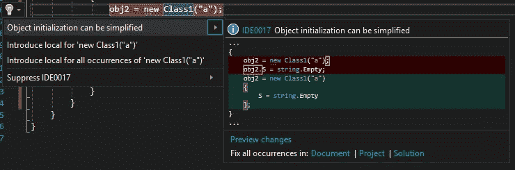
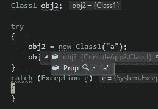
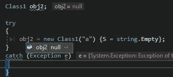

# 为什么内联初始化不只是 C#中的语法糖

> 原文：<https://medium.datadriveninvestor.com/why-inline-initialization-is-not-just-syntax-sugar-in-c-3df25b5022fe?source=collection_archive---------10----------------------->

每个人都知道 C#的特性，我们不需要单独初始化每个对象属性，只需要用构造函数写就行了。

```
var obj2 = new Class1("a");obj2.S = string.Empty;
```

与相同

```
var obj2 = new Class1("a") {S = string.Empty};
```

甚至 ReSharper 也这么认为:



但它不仅仅是语法糖，它是不一样的。

让我们想象一下第一类描述的例子:

```
public class Class1{
      public string Prop; public Class1(string s) { Prop = s; } public string S { set => throw new Exception(); }}
```

因此，将 S 属性设置为 string。空值会导致异常。在这种情况下，我们可以看到内联初始化和显式初始化之间的区别。



当我们调用构造函数时，只有在它初始化之后，对象才不为空，在内联初始化的情况下，我们有空对象。

如果我们看一下 IL 代码，我们会看到实现中的差异:

显式初始化:

```
IL_0002:  ldstr      "a"
    IL_0007:  newobj     instance void ConsoleApp2.Class1::.ctor(string)
    IL_000c:  stloc.0
    IL_000d:  ldloc.0
    IL_000e:  ldsfld     string [System.Runtime]System.String::Empty
```

内嵌初始化:

```
IL_0002:  ldstr      "a"
    IL_0007:  newobj     instance void ConsoleApp2.Class1::.ctor(string)
    IL_000c:  dup
    IL_000d:  ldsfld     string [System.Runtime]System.String::Empty
    IL_0012:  callvirt   instance void ConsoleApp2.Class1::set_S(string)
    IL_0017:  nop
    IL_0018:  stloc.0
```

这里主要的是 stloc.0 指令(从堆栈中弹出一个值到局部变量 0)所在的位置。在内联初始化的情况下，新的 Class1 对象被创建并放置到堆栈中，但是由于 IL_0012 指令中的异常，它没有被移动到局部变量中。