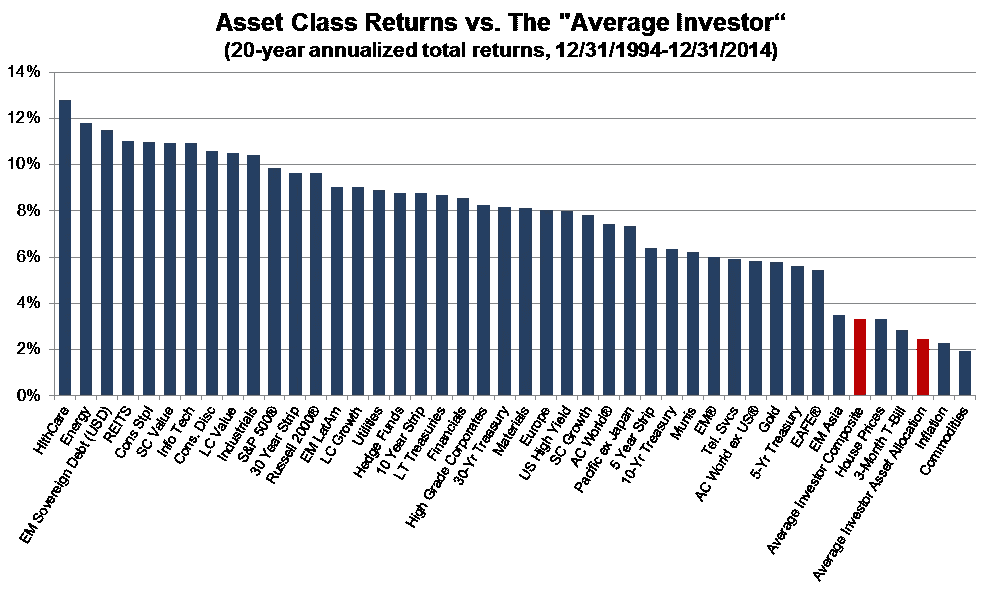

# 为什么投资者不能超越简单的基准

> 原文：<https://medium.datadriveninvestor.com/why-investors-cannot-outperform-simple-benchmarks-d6a587a54967?source=collection_archive---------4----------------------->

许多投资者认为，通往财富的门票是一种优越的投资策略。如果他们能得到“专业人士”的秘密配方，他们就能以最小的损失每年每个月都赚钱。

许多不同的策略都有效，但没有多少投资者获得这些策略产生的回报。买入并持有的作品；逆势作品；价值作品；技术、趋势跟踪等等也是如此。然而，许多投资者的表现仍然不如该策略本身。

原因？缺乏纪律。许多不同的饮食让我们变得苗条和健康，但没有多少人坚持足够长的时间来工作。我们从一个地方跳到另一个地方，却没有任何进展。

从 1994 年 12 月到 1994 年 12 月，标准普尔 500 的年化回报率在 10%左右；高等级公司债券的收益率约为 7%。普通投资者的表现明显不如人意，年收益率仅略高于 3%。

## 百分之三！！！

[https://www.advisorperspectives.com/commentaries/2016/03/07/no-one-ever-grew-wealth-being-scared](https://www.advisorperspectives.com/commentaries/2016/03/07/no-one-ever-grew-wealth-being-scared)

这是一场闹剧。作为一名经理，我对我的投资者表现低于我的基金综合回报的前景感到极度沮丧。如果我允许他们对短期的起伏情绪化，他们可能会犯代价高昂的错误。当谈到我如何做出投资决策，我们在什么环境下做得好和不好，以及随着时间的推移会出现什么样的波动时，我喜欢不断的教育和彻底的诚实。

“买入并持有”受到各地被动投资者的喜爱；轻松击败各地的对冲基金，对吗？是的，也许最近就是这种情况，但总的来说，投资者通常表现不佳。指数运行良好，但故障发生在我们身上。

想想有多少买家和持有者在金融危机期间逃离了股市，错过了有史以来最好的牛市之一。我知道很多。我想知道如果投资者更好地理解风险——也就是说，指数有时会损失一半(或更多)的价值，会有多少投资者会退出。也许投资者可以坚持到底，然后抓住随后的上涨趋势。

所有的投资策略都有奏效的时候。没有什么是永远有效的。

投资者和交易者出错的地方在于没有做好理解他们选择的策略如何运作的工作。如果没有这种理解，他们就不知道预期会有什么样的回报和损失，什么时候表现好，什么时候挣扎，以及投资决策是如何做出的。因此，当他们不喜欢业绩时，他们会变得情绪化，做出轻率的决定——经常在底部附近解套，在顶部附近加仓。

缺乏准备，以及后来的纪律助长了对业绩的追逐，损害了回报。

我认为，基金经理需要更好地与投资者沟通，了解他们的策略是如何运作的，以及预期会有什么样的回报和损失。然后，投资者可以决定投资是否符合他们自己的理念和风险承受能力，这增加了他们在不可避免的起伏中坚持投资的几率。

**披露:**

过去的表现不一定代表未来的结果。期货交易总有亏损的风险。

本通信仅供参考，不应被视为出售或购买任何金融产品的要约、任何交易的官方确认或 Melissinos Trading LLC 的官方声明。所有信息如有更改，恕不另行通知。

这些图表显示了趋势的例子。包含一个图表作为趋势的例子并不意味着任何类型的建议，购买，出售，持有或留在外面。

