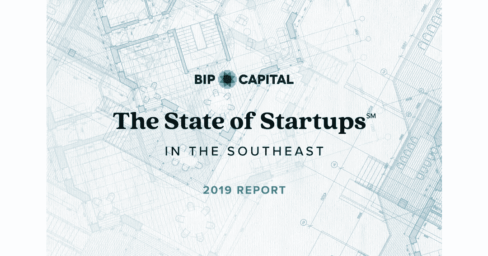

# 为什么投资者应该重新审视东南公司的创业环境

> 原文：<https://medium.datadriveninvestor.com/why-investors-should-take-a-second-look-at-the-southeasts-startup-environment-befe8983d25b?source=collection_archive---------6----------------------->

Photo by [Startaê Team](https://unsplash.com/@startaeteam?utm_source=medium&utm_medium=referral) on [Unsplash](https://unsplash.com?utm_source=medium&utm_medium=referral)

*由丹·德雷克塞尔、* [*BIP 首都*](http://bipcapital.com/)

当考虑将资金投向何处时，许多投资者自然会将目光投向位于波士顿、旧金山湾区和纽约市等长期“创新中心”的初创公司。然而，越来越多的另一个美国地区出现在投资者的视野中:美国东南部。

惊讶吗？一段时间以来，东南部一直在发展成为一个地区强国，原因有很多，例如一流大学的存在——佐治亚理工学院、范德比尔特大学、杜克大学、弗吉尼亚大学、北卡罗来纳大学和佛罗里达大学等——提供了人才和研究。还有大量的本土资本以及著名的企业孵化器和加速器，如亚特兰大技术发展中心(ATDC)等。为此，在过去的 20 年里，这个国家的这个地区已经有无数成功和著名的出口，包括 Cardlytics、Checkfree、Cvent、Evolent Health、GreenSky、S1、Secureworks、Shipt 等等。

 [## 金融科技初创公司正在颠覆全球银行业|数据驱动的投资者

### 传统的实体银行从未真正从金融危机后遭受的重大挫折中恢复过来…

www.datadriveninvestor.com](https://www.datadriveninvestor.com/2018/10/20/fintech-startups-are-disrupting-the-banking-industry-around-the-world/) 

我们公司每年都会发布 [**东南地区初创企业状况**](https://bip-capital.com/the-state-of-startups-2019) 报告，全面概述该地区的风险投资和初创企业生态系统。今年的报告深入研究了美国东南部九个州在 2014 年 1 月 1 日至 2019 年 6 月 30 日的五年半时间里的创业活动。这份报告是免费的，可以在网上阅读。

**报告关注市场成熟度**

虽然去年的研究表明，相对于波士顿、旧金山湾区和纽约市等更知名的资本密集型创新中心，东南部是一个具有吸引力的投资场所，但在我们 2019 年的报告中，我们开始了解东南部的风险生态系统到底有多成熟。

我们是怎么做到的？宏观经济趋势告诉我们，预计估值会上升。从全国范围来看，流入私人市场的美元总量正在上升，投资于早期和成长期公司的美元比以往任何时候都多。这意味着，我们可以预计，在交易动态方面，尤其是估值上升方面，中国各地将出现“涨潮”。使用前货币估值作为到期的代理，然后我们检查了每个地区前货币估值的稳定性。

根据这一标准，我们发现东南部的成熟速度超过了已经成熟的创新中心。我们的研究表明，东南部比以往任何时候都有更多的创新和更具竞争力的早期交易。

将亚特兰大、夏洛特、纳什维尔和研究三角区与波士顿、旧金山湾区和纽约市进行比较，亚特兰大和研究三角区显示出成熟的迹象，而夏洛特和纳什维尔仍在以远远超过创新中心的速度成熟。

其他一些值得注意的观察结果:

东南部和创新中心之间的收入倍数差距正在缩小，东南部的收入倍数增长速度更快。

东南投资者投入的资本比以往任何时候都多，这为外部资金投资该地区创造了更少的机会。

在吸引“定义类别”的大型回合(超过 8000 万美元)方面，该地区仍有增长空间。

总体而言，自 2014 年以来，东南部的初创公司共获得了 8383 笔投资，投资额为 280 亿美元。媒体以 50.1 亿美元位居第一，生物技术/制药和 SaaS 分别以 50 亿美元和 46 亿美元位居第二和第三。

**逐个州的数字**

以下是今年报告中对东南部一些州的主要观察结果:

媒体公司仍然是佛罗里达州吸引投资者的第一名，在审查期间筹集了 27 亿美元。然而，其中 23 亿美元是由行业独角兽 Magic Leap 筹集的。其他行业也继续吸引大量投资。

佐治亚州仍然是东南部 SaaS 创新的领导者，在审查期间的 1，275 笔交易中，有 349 笔交易总额为 17 亿美元，交易总额为 55 亿美元。

肯塔基州的生物技术/制药是最受欢迎的类别，自 2014 年以来，共达成 62 笔交易，总价值 3.27 亿美元。

南卡罗来纳州在 2019 年表现非常好，投资总额已经高于 2018 年全年。

医疗保健 IT 继续在田纳西州独占鳌头，在五年半的时间里达成了 158 项交易，总额达 4.66 亿美元。

2019 年将成为 SaaS 在弗吉尼亚州投资的又一个强劲年份，交易和美元有望与 2018 年持平。

**未来会怎样**

从今年的报告中还可以得出投资者在未来几个月和几年可能会看到的结论:

如果没有政府的干预使上市变得更加有利，预计私募市场的融资和投资数量将继续增长。

随着资本供应的增加，将资本投入使用的需求将超过投资的优质创业公司数量的增长。这将创造更高的估值和更多轮的资本。

我们的 2019 年 [**东南部创业状况**](https://bip-capital.com/the-state-of-startups-2019) 报告证实，东南部仍然是投资者和创业者创业初期的绝佳环境。底线是:不要忽视这个地区。

*今年的报告采用了多种数据来源，包括对多家基金的关键人物的采访、对企业家的采访以及独立的第三方数据。*

***关于作者:*** *丹·德雷克塞尔(Dan Drechsel)是风险投资公司* [*BIP 资本*](http://bip-capital.com/) *的高级副总裁，负责监管该公司在 SaaS、金融科技和开发工具/架构方面的投资。Drechsel 在职业生涯中一直参与发展和运营私募股权和风险投资创新公司，包括 S1 和全球能源决策。他在美国和国际上的企业软件、金融技术和技术支持服务公司，包括 SAP、ADP 和 Dun & Bradstreet，担任过许多行政级别的销售、营销和工程职位。他还是默瑟大学斯特森商业和经济学院的市场营销执行讲师。Drechsel 拥有佐治亚理工学院的工业管理学士学位和美世大学的工商管理硕士学位。*