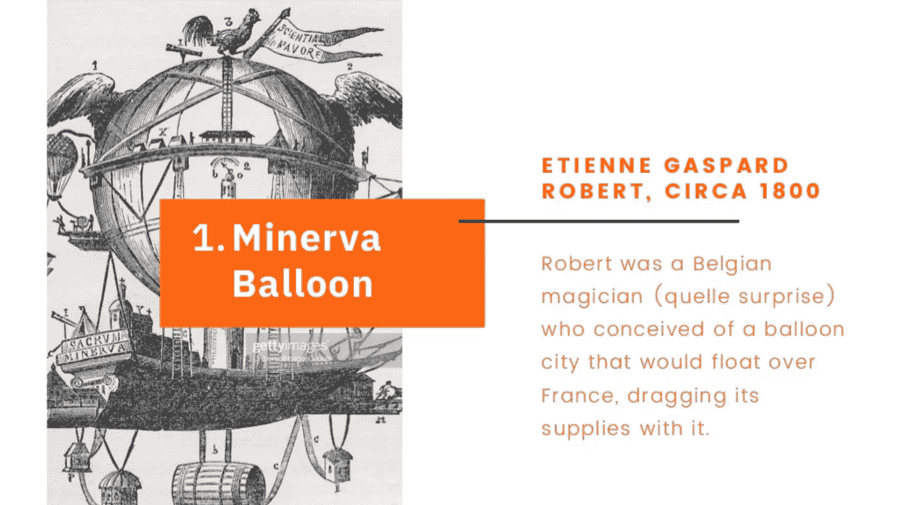
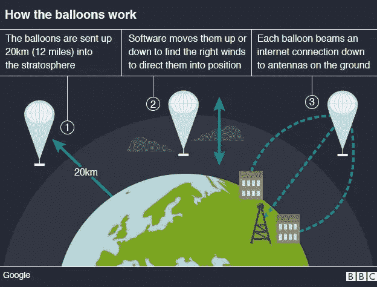
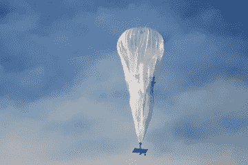
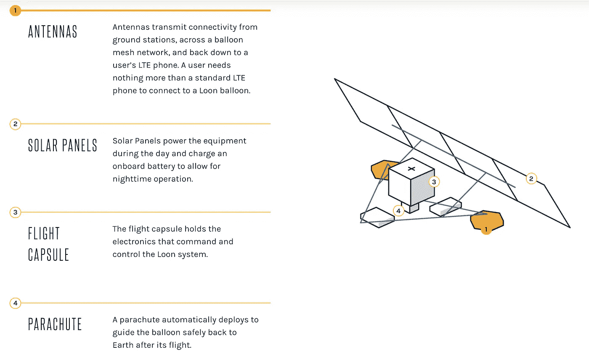

# Alphabet 为什么要给亚马逊雨林送气球？

> 原文：<https://medium.datadriveninvestor.com/why-is-alphabet-sending-balloons-to-the-amazon-rain-forest-e16d2adc73f2?source=collection_archive---------13----------------------->

## 潜龙计划回来了！

记得潜龙计划吗？这听起来像是一个讽刺性的政党，旨在竞选中制造一点混乱，但没有赢得席位的希望。

好吧，Project Loon 最初是谷歌实验部门“X”的一部分。

其目的是利用气球向偏远地区提供互联网接入。

联合国将互联网接入列为一项人权，但据保守估计，全球至少有 30 亿人仍然缺乏这一资源。

它现在拥有自己的字母表子公司:Loon。

Loon 在 2015 年一度是大新闻，但它很快就销声匿迹了。

当我们继续生活时，气球一直在飞。总的来说，他们现在已经飞行了超过 4000 万公里。

本周，他们宣布与秘鲁互联网协会达成协议，为居住在亚马逊雨林或附近的 600 万人提供永久的互联网接入。

 [## 幸福的算法？数据驱动的投资者

### 从一开始，我们就认为技术正在使我们的生活变得更好、更快、更容易和更实用。社交媒体…

www.datadriveninvestor.com](https://www.datadriveninvestor.com/2019/03/08/an-algorithm-for-happiness/) 

当政府拖拖拉拉时，我们应该欢迎 Alphabet 旗下公司的大胆干预吗？或者，我们是在允许一家动机可疑的公司发展难以摆脱的垄断吗？

**我们来看看:**

*   人和气球是怎么回事？
*   什么是 Loon 以及它是如何工作的。
*   秘鲁的潜鸟。
*   安德鲁·卡内基的教训。

# ***上升，上升，又消失***

气球在我们的集体想象中占有特殊的位置。

谁没有梦想过把一堆气球绑在自己的胳膊上，然后去那里和鸟儿一起飞翔，以此来忘记自己的烦恼呢？

只有我吗？

嗯，自从 1783 年让·弗朗索瓦·皮勒特雷·德·罗齐尔和阿尔朗德侯爵乘坐第一批热气球在巴黎公园上空漂浮以来，我们确实不断回到这个可能性、进步和儿童般放纵的相同象征。

热气球曾经是科学尖端的高度，现在却被降级为休闲追求的地位。

在某些情况下，它们只不过是一种新奇的东西。

请看这张墨西哥气球比赛的照片:

我们还保留着在云中开始新生活的幻想。

一种特殊的高科技。特色 我忘记在社交媒体上提及或发布了，我们看了比利时魔术师提议的密涅瓦气球城:

谁能忘记乔治·布鲁斯在发展受阻构想的天空之城？还是皮克斯的绝世 *Up* ？

因此，当谷歌在 2015 年宣布他们将气球送入平流层，为偏远地区的人口带来互联网接入时，我认为他们是在吹牛。

他们确实是。

但是他们对这个想法也是认真的。

# ***气球***

Loon 于 2011 年开始在谷歌的实验性“X”部门工作。

经过各种测试，并向 FCC 书面声明这些气球“不会伤害人类或动物”(字母 [**此处**](https://apps.fcc.gov/els/GetAtt.html?id=171957&x=.) ，如果你感兴趣)，Loon 于 2017 年从“X”毕业，成为 Alphabet 的子公司。

一旦谷歌(这是在字母表时代之前)开始公开谈论这个想法，它立即激起了我们的注意。该项目在 2015 年成为全球头条，因为我们爱气球。

很多技术都很复杂，但这个概念很简单。

引用该公司的官方描述:“Loon 是一个在太空边缘旅行的气球网络，为世界各地没有服务和服务不足的社区提供连接。”

当然，我们日常生活中的许多技术已经存在于太空中。

然而，我们看不到。

当我们把技术贴在气球上，让它在丛林和沙漠中滑行时，突然每个人都想知道。

与其说是我们的感官欺骗了我们；相反，它们完全限制了我们认为重要的东西。

事实上，自成立以来，Loon 已经介入了许多场合来揭穿所谓的 UFO 目击事件。那些“不明飞行物”只是气球在做他们的事情。人们想知道在这种情况下谁是真正的笨蛋。

正如你所知，除了把调制解调器绑在气球上，然后抱最大的希望之外，还有很多事情要做。

BBC 提供了这张方便的图表来总结气球的工作原理:

这些气球由聚乙烯塑料制成，厚度和三明治袋差不多。

它们在飞行中看起来不像大众想象中的气球那样雄伟:

实际上，它看起来像一个巨大的三明治袋。不管是谁报告了 UFO 目击事件，他都需要帮助。

每个充气气球大约 50 英尺宽、40 英尺高(15 米宽、12 米高)，表面积大约为 5381 英尺(500 平方米)。

它们的覆盖区域非常有限，这意味着必须同时发射大量的气球来为一个大区域提供互联网接入。

需要 7 个气球覆盖 1000 公里的区域，Loon 开发的新“发射器”可以每 30 分钟将一个气球送入平流层。这些气球可以在最远 700 公里的距离内相互通信。

这些气球有一个太阳能泵，它们像船一样前进，为它们的旅程找到正确的风向。

Loon 的工程负责人萨尔瓦托勒·坎迪多谈到该软件时说:“它收集风力预测数据，构建旅行地图，然后处理每个气球的观察结果，以便根据地图做出改变。是这个软件指挥气球的运动，而不是 24/7 的工程师团队监控它们。”

这是一个迷人的洞察力，不是吗？

我们知道自动化软件和人工智能系统可以根据输入数据做出“决定”，但这是一个这样的系统以我们无法理解的方式解释我们世界的基本力量的例子。

坎迪多继续说，“我第一次看到一个气球决定在人类会选择的地方曲折前进，我不得不盯着算法试图执行的策略看了一会儿。我从来没有同时感到自己变得更聪明和更笨。”

你我都是，塞尔瓦托。

这让我想到了下一个相关的问题。

气球甚至可以决定在某个区域“游荡”，等待合适的气流。它们被编程为向目标区域发送恒定的 LTE 信号，如果电流的速度、方向或温度不理想，它们将选择不进入电流路径。

当然，潜鸟是一种鸟，这种行为与许多海鸟非常相似。

一个偶然的机会，我最近读了宏伟的 [**海鸟的叫声**](https://www.amazon.co.uk/Seabirds-Cry-Puffins-Gannets-Voyagers-ebook/dp/B01M310G5Y/ref=sr_1_1) (它获得了 2018 年著名的‘克拉克·博伊德年度图书奖’)，这些关于 Loon 的启示让人想起信天翁和管嘴猴走过的路。

在书中，作者亚当·尼科尔森写道，“如果它们偶然被卷入无风高压的中心，卫星显示它们会在几乎相同的地点停留、漂浮几天，等待大风返回，在那里它们可以再次升空。”

用珀西·雪莱的著名描述来说，它们是风的“看不见的存在”的主人。

正如我们上面提到的，这个看不见的存在的概念对我们许多人来说是一个无法解决的悖论；眼见为实。对气球或潜鸟来说，不存在这样的限制。

非常吸引人的是，这些气球竟然重复了信天翁完全合乎逻辑的行为，而没有被编程这样做，甚至不知道信天翁到底是什么。它们像海鸟一样，以不同于——但不亚于——我们自己的智能运作着。

Loon 项目沉寂了几年，也许是在等待它自己的最佳潮流重新进入公众的意识。

这样的机会就在本周出现了，它宣布了与秘鲁互联网 Para Todos 的一项新协议。

# ***秘鲁潜龙计划***

秘鲁和 Loon 已经建立了关系——Loon 在今年早些时候 8.0 级地震破坏了该国的大部分基础设施后部署了它的气球。

根据新协议，到 2021 年，Loon 将为 600 万秘鲁农村居民提供互联网接入，其中包括一些土著居民。

在这些地区，铺设标准互联网电缆所需的物理基础设施几乎是不可能的。

Loon 的目标是为该地区提供永久的互联网接入，该地区大部分位于亚马逊雨林内。

为了联网，人们只需要一部标准的 LTE 手机。

但是他们能够访问哪些服务呢？到目前为止，我在这个问题上找到的关键引用是，Loon“提供了对谷歌互联网服务的访问。”

我们已经知道，Alphabet 希望提供互联网接入，作为其进入我们日常生活更多角落的一部分。

人们会想到安德鲁·卡内基的利润丰厚的“尤里卡！”当他意识到为铁路提供钢材比拥有火车更好的时候。拥有基础设施可以让一家公司变得不可或缺、不可动摇。

如果 Alphabet 能够漫游天空，并首次为数百万甚至数十亿人提供互联网接入，它将占据令人羡慕的地位。一旦‘谷歌’和‘互联网’在个人心目中成为同义词，这两个概念就很难再分开。

Loon 的这一倡议背后可能至少有一点慈善的推动力，作为一家企业，当然也会有长期的商业利益。

我们在谷歌进入健康数据和金融服务领域时看到了类似的做法。

在许多领域，垄断被认为是有害的，因为它们对个体消费者是不利的。

当涉及到金融、医疗和互联网接入等基本服务时，情况往往也是如此。

然而，我们正在进入一个新时代。Alphabet(或亚马逊、苹果或微软)的动机是首先行动并占领这些市场，正是因为这将使他们能够提供最好的服务。随着更多的数据和更多的资源，他们的服务将会蓬勃发展和改进。

旧的反垄断论调可能仍然适用:这种情况创造了不公平的竞争优势，政府应该干预，以确保创新不会被扼杀。

然而，当最好的医疗服务可以得到，甚至可能更便宜时，你会想要第二好的医疗服务吗？

将可行的替代方案引入 Alphabet 的气球大军所独有的服务领域有多容易？这场游戏从一开始就对他们有利。

脸书也有类似的野心，尽管并不总是空中楼阁。它在一系列非洲国家提供免费接入脸书的服务，并与谷歌竞争建设非洲大陆的海底互联网电缆。

Loon 项目是创新工程的胜利，是一个“如果会怎样？”思想练习产生了素材。

我们应该庆祝数百万人将获得联合国定义的“人权”。

然而，我们仍然可以质疑为龙创造机会的环境。

数十亿人仍然没有互联网接入，不平等现象继续加剧。

对于企业来说，这是一个有利的时机，如果有未得到满足的需求，它们自然会按照自己的利益行事。

它们提供的短期解决方案令人满意，但我们必须评估它们可能产生的长期影响。众所周知，一旦它们到位，这些垄断就很难改变——尤其是如果我们让它们建设基础设施的话。

[*报名参加 hi，tech。时事通讯。*](https://mailchi.mp/16ff381c064c/hi-tech-signup)