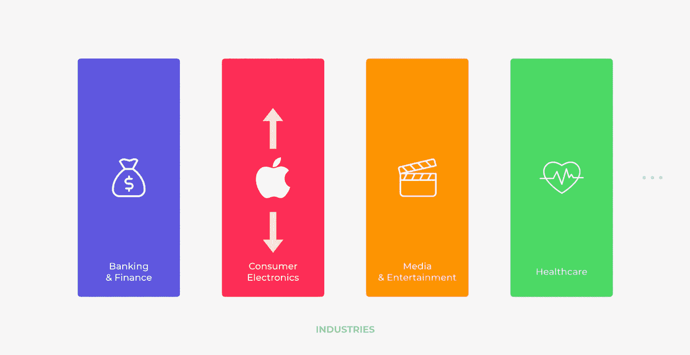
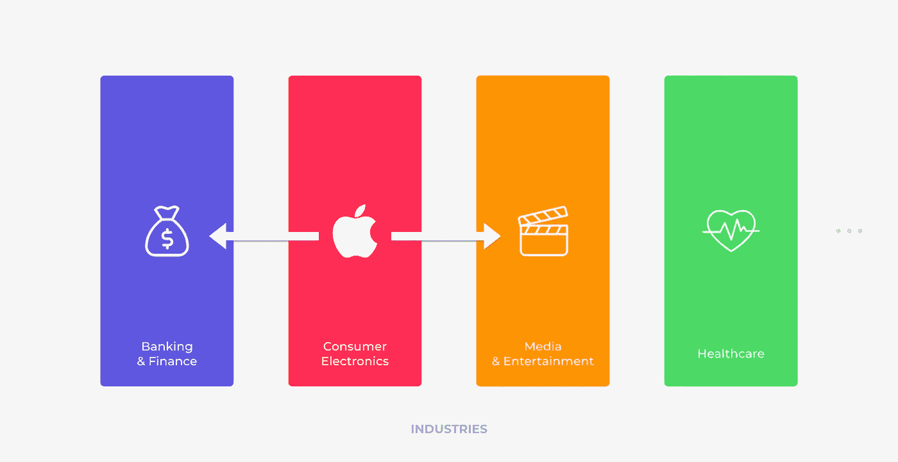

# 苹果为什么在服务上投入这么多？

> 原文：<https://medium.datadriveninvestor.com/why-is-apple-investing-so-much-in-services-734fbafd6a1f?source=collection_archive---------1----------------------->

## 为什么苹果会全力以赴提供服务，为什么他们会同时推出这么多服务？

在最近 3 月份的苹果主题演讲上，我们没有看到 AirPower，也没有看到新的 Mac Pro。取而代之的是，苹果推出了四项新服务，他们计划在今年全年推出。

虽然对你们中的一些人来说，这可能会让其他人大失所望，但这是对苹果产品的一个非常受欢迎的补充。既然你正在读这篇文章，你可能会问自己，为什么苹果要全力以赴提供他们的服务，为什么他们要同时推出这么多的服务？所以让我试着回答这些问题，并向你解释为什么我认为从商业角度来看，这是苹果公司的一个明智之举。

 [## 苹果会成为新的网飞吗？-数据驱动型投资者

### 有可能。然而，该公司肯定会与大公司竞争。许多人不得不看到这一天的到来…

www.datadriveninvestor.com](https://www.datadriveninvestor.com/2019/02/15/will-apple-be-the-new-netflix/) 

# 四项新服务

首先让我提醒你一下苹果公司在三月份的主题演讲中宣布的服务:

Apple’s four new services. Visual created by me.

*   苹果新闻增强版(Apple News Plus)——*这是一项基于订阅的服务，除了提供常规新闻之外，你还可以获得 300 多种杂志的全部数字内容。*
*   **Apple TV Plus** — *一种类似于网飞的基于订阅的服务，在这里他们将获得与不同名人合作创作的独家内容。*
*   **苹果卡** — *苹果公司以信用卡形式推出的一项金融服务。*
*   **Apple Arcade** — *一种基于订阅的游戏服务，让你可以玩到高级游戏。*

# 利用 20 亿英镑的帝国

既然我们已经谈到了这一点，让我来解释一下为什么我认为这是苹果公司的一个明智之举。首先，在过去的几年里，苹果一直非常关注 iPhone——他们一直在不断增加新功能，让人们可以轻松方便地在智能手机上执行日常任务。因此，iPhone 成为了日常生活的必需品和必不可少的一部分。iPhone 的销量每年都在持续增长，这导致了今天的苹果存在于超过 20 亿人的口袋里。

Image source: [Apple Insider](https://appleinsider.com/articles/18/09/13/how-apple-has-hit-2-billion-ios-devices-sold-and-when-it-will-hit-2-billion-iphones)

那么，当你建立一个存在于 20 多亿人口袋里的平台时，你会怎么做呢？你开始**探索你可以向用户提供的其他补充服务**，从而使你的产品多样化，封闭你的生态系统，并利用你在过去 12 年中建立的移动平台。

而当你问一个苹果用户，为什么不从 iPhone 转行？他们中的大多数人会告诉你他们喜欢苹果的生态系统。这正是苹果在这里的目标，他们正在**扩展他们的生态系统**并且实际上**试图关闭这个循环。**

用商业术语来说，这叫做横向产业扩张。让我很快为你澄清一下。

当今的行业被聚集成垂直行业。例如，银行和金融、消费电子、媒体和娱乐、医疗保健等垂直行业。在过去的几年里，苹果主要是垂直扩张，创造更多的消费电子产品。在商业术语中，垂直扩张被定义为:

> “通过深入当前市场，在现有业务范围内扩展您的服务/产品。”

Industry verticals & Apple’s vertical industry expansion. Visual created by me.

为了让它看得见摸得着，垂直扩张将引入 AirPods 作为 iPhone 的补充产品。

但现在发生的是，苹果开始跨行业横向扩张。在商业术语中，横向行业扩展是:

> "将产品或服务扩展到新的市场，无论是新的地理区域还是商业领域."

Apple’s horizontal industry expansion. Visual created by me.

随着这一举措，苹果开始与你当地的银行、电视台和网飞等服务直接竞争。

想想看，这些行业中的很多都在努力尝试，投入大量资金，以成为我们日常生活的一部分。而另一方面，苹果已经存在，并且已经证明了它们的便利性和质量，这降低了我们尝试苹果这些新服务的障碍。

所以现在，如果你想要一个电视订阅，一个游戏，音乐，一本杂志或者一个新的 MacBook。没问题。你可以毫不费力地得到它，并用苹果卡支付。这正是苹果如何慢慢建立他们的端到端生态系统，这也是为什么我在一开始就说这是苹果做出的一个明智之举。

让我知道你的想法…

你认为这是苹果做出的正确决定吗？会得到这些服务吗？

*我也有一个 YouTube 频道，叫做* [*【数字脉冲】*](http://www.youtube.com/digitalpulse) *，在那里我以评论和教程的形式分享我对最新科技和数字趋势的看法、经验和建议。*