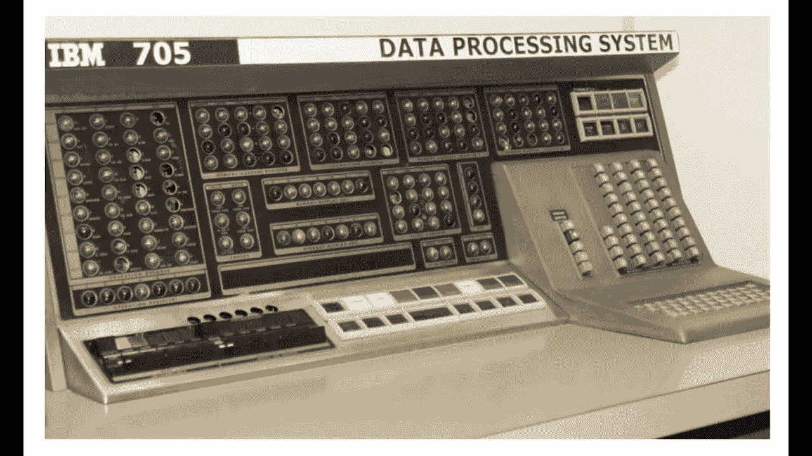

# 为什么人工智能会卷土重来？

> 原文：<https://medium.datadriveninvestor.com/why-is-artificial-intelligence-making-a-comeback-3cce23782432?source=collection_archive---------14----------------------->

虽然人工智能可以追溯到 20 世纪 50 年代，但这不是你奶奶的人工智能。爆炸式的数据、量子计算和商业用途，即使是好莱坞也无法想象，以结束人工智能的冬天。

这是关于 [**“你一直想问的关于人工智能的 4 个问题”**](https://www.aitruth.org/posts/4-questions-about-ai-you-wanted-to-ask) 的 4 部分系列的第 3 部分。访问 AITruth.org查看该系列的其余部分并订阅。下周的帖子是**《第四部分:企业为什么要 AI？他们用它做什么？”**

人工智能研究可以追溯到 1954 年，由于美国国防部的兴趣，在 1960 年代获得了大量资助。像所有技术一样，人工智能也有炒作周期，兴趣和资金水平波动不定。最近 AI 卷土重来，有三个基本原因。

首先，现在世界上的数据要多得多。 我们以数字、社交媒体的身份生活，随之而来的是大量丰富的数据。甚至有些过时的医疗保健系统也终于过渡到了数字时代，患者的电子病历加上新的集体医生诊断系统，允许在患者同意的情况下在医生之间共享数据。由于对祖先遗产进行基因检测的流行，现在有了新的基因组数据。由于谷歌、脸书、YouTube、Twitter、What's App、LinkedIn、Instagram 和 Snap Chat，社交媒体数据和地理跟踪数据正在呈指数级增长。物联网或互联设备正在创造数十亿字节的数据，从检测石油钻井平台的维护需求到确保你的房子保持安全、完好和舒适的温度，无所不包。零售商正在从你为了方便或回报而下载的应用程序(如星巴克、亚马逊、沃尔玛和塔吉特)中收集买家行为数据。您正在使用的一些服务应用程序也在创建数据档案，例如:银行、婚介、排卵跟踪、公寓/房屋寻找/评估、金融咨询、游戏。现在只要看看你的智能手机。所有这些应用程序都在收集关于你的数据，要么直接收集，要么通过你手机上的地理追踪或你拍摄的照片或以上所有方式收集。更不用说公司正在利用他们现有的数据或增加他们的数据来开发专门用于潜在商业伙伴的人工智能系统的数据集。例如，健身追踪器小组正在通过应用程序编程接口(API)将他们的数据与其他健康数据相结合，以便更深入地了解健康习惯，如为减肥目标进行锻炼和营养。而另一个小组正在标记不同成熟度的特定作物的图片，这样拥有特定机器人收割拖拉机的农民就可以在田地里描绘出哪些作物是坏的，哪些是好的。在这个新的人工智能时代，数据和算法的训练是差异化的来源，而不是算法本身。因此，为什么我花了这么多时间来解释所有可能的数据来源，这样你们就可以亲眼看到人工智能领域的数据机会是多么多样和巨大。

**其次，计算能力是指数级的**,新的量子能力与数据存储相结合——数据存储变得更高效、更便宜。有史以来第一次，计算能力，处理所有数据的能力，实际上跟上了人工智能系统的雄心。虽然那些训练算法的人会抱怨仍然需要几周而不是几小时，但计算能力正在迅速发展。有趣的是，当 IBM 的沃森在 2010 年第一次参加 Jeopardy 时，计算硬件占据了一个巨大的空间，同时可以做很多不那么复杂的事情。截至 2017 年，同样的技术有三个披萨盒那么大，并且随着每个新芯片的推出，它还会继续下降。

**第三，与以往相比，更多的企业正在投入更多的人工智能应用**，这在很大程度上要归功于过去无法获得的大量数据。政府武装和情报组织一直对 AI 感兴趣。自从黑客和欺诈出现以来，银行就一直需要人工智能的机器学习方面。但最近，保险公司、制造集团、大型技术公司、媒体和娱乐公司、石油和天然气公司、零售商、汽车公司都想出了创造性的方法来在业务中利用人工智能。IBM 拥有超过 150 个不同用例的日志，几乎涵盖了这个星球上的每一个行业；那是在 2015 年。

下周的文章将是:[**企业为什么要 AI？他们用它做什么？”**](http://www.aitruth.org)

如有任何问题，请联系[Cortnie@AITruth.org](mailto:Cortnie@AITruth.org)。

相关故事:

 [## 用 7 个步骤解释深度学习

### 和猫一起

medium.com](https://medium.com/datadriveninvestor/deep-learning-explained-in-7-steps-9ae09471721a)