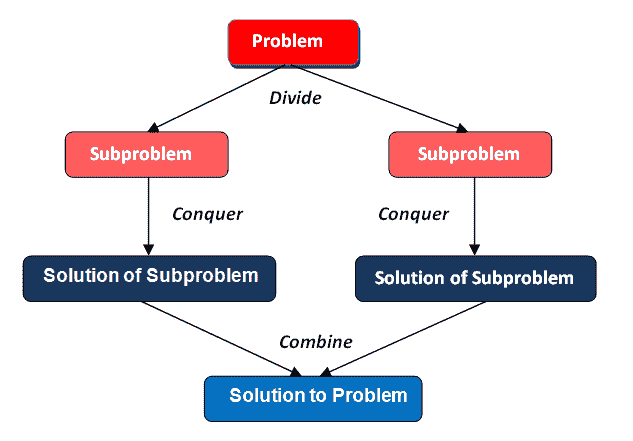

# 为什么协作对开发人员如此重要

> 原文：<https://medium.datadriveninvestor.com/why-is-collaboration-so-important-for-a-developer-fc46695c2004?source=collection_archive---------11----------------------->

How Linux is built

正如我们在前面的视频中看到的，众所周知，Linux 是世界上使用最多的操作系统。这样做的主要原因是因为它支持大量的架构，而且**字面上的**任何人都可以改变代码并分享这种改变。我们都可以自由地使用和改变世界上最常用的操作系统。

开源就是在这个前提下。根据项目或代码拥有的许可证，您可以自由地使用、更改和保留代码。你为什么要做免费的事情？因为我们都赢了。如果我们都在一个任何人都可以使用的项目上做了一点改进，我们都赢了。

以下是为什么开发人员最有协作意识的三个原因。

# 1 —大部分时间你将在团队中工作

大而成功的项目通常是由大团队开发的。

大公司如谷歌、脸书、亚马逊等。需要尽快开发出高质量的产品。这个过程不是一个人可以完成的。他们需要一个大团队来完成这个过程。

即使是小公司也需要开发团队来满足软件需求。

# 2 —没有英雄

我这么说是什么意思？

不能试图背着队友或者自己开发项目。记住，有一整个团队和你在一起。永远不要试图自己做所有的事情，因为你是“特别的”。最成功的人是那些有领导能力的人。这是因为你我成为天才的几率真的很低。所以我们需要相互支持。即使你非常擅长软件开发，你也可以在团队中工作得更好。

# 3 —更聪明地工作，而不是更努力

当作为一个团队工作时，你可以为每个成员分配任务，这样软件可以在更短的时间内完成。这种分而治之的策略在构建软件时最常见。你能想象自己开发并维护像脸书这样的大型软件吗？

大多数时候，你会开发项目的某个领域。不是整个。所以你必须相信你的队友他们正在开发什么。

想想这个。当你有一个多核处理器，其中一个内核运行缓慢时，你可能不会想:“**哦，其中一个内核坏了**”。
你认为:“**这个处理器坏了**”的几率要高得多。因为当你在团队中工作时，你就不再是一个个体了。你是一个团队成员，影响着你的团队被如何看待和它的表现。

## 以下是我的个人经历

我是 Pernix 公司的一名软件学徒。我第一次在团队中工作时，我是独自完成任务的。没有交流，没有帮助。我是团队中的一员。我开发后端，而团队的另一部分开发前端。我创建的端点没有收到我所期望的请求，也没有返回前端所期望的数据。我做的重构花了我几个小时。改变数据库中的逻辑和模型。

如果我是团队的一员，就后端必须如何工作进行强有力和持续的沟通，这一切都可以避免。

在这个过程中，我学到了最有效的发展方式是团队合作。

快乐编码:)

# 参考

1.  [Linux](https://en.wikipedia.org/wiki/Linux)
2.  [伯尼克斯](http://www.pernix-solutions.com/)

