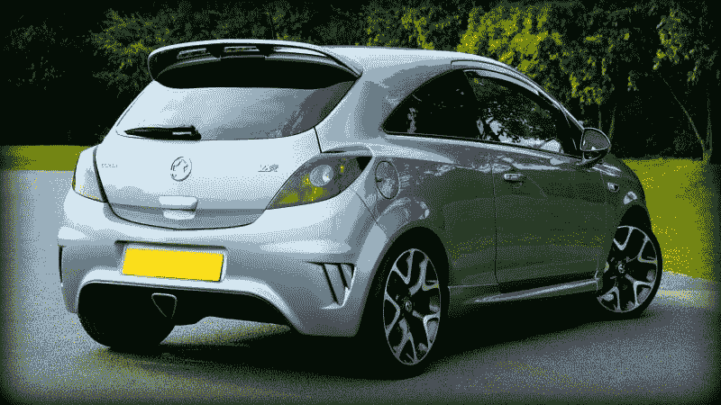
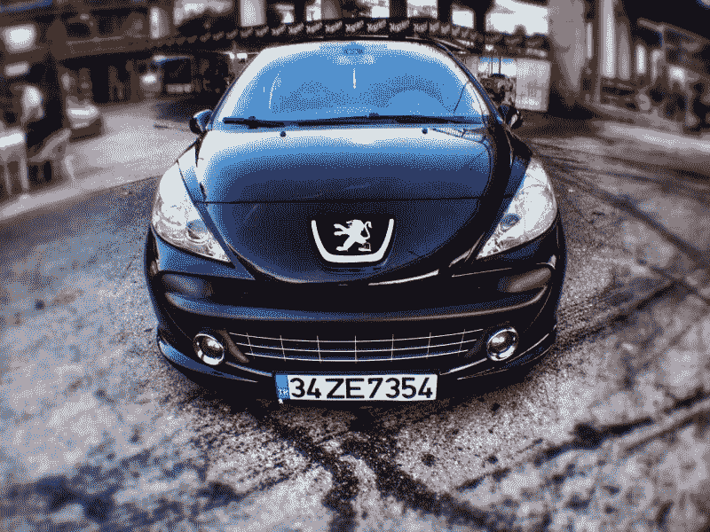
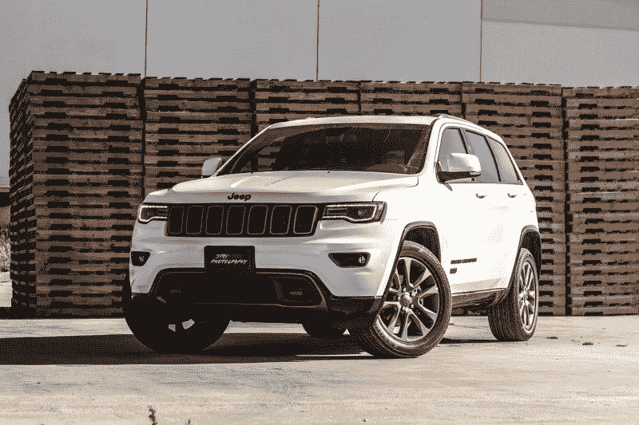
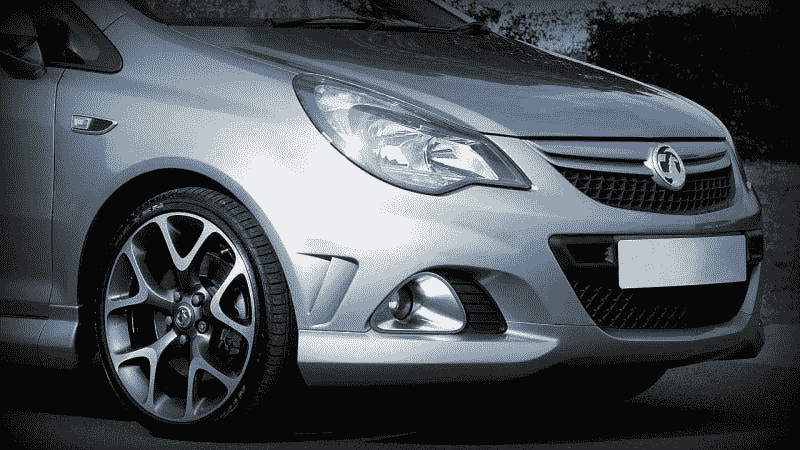
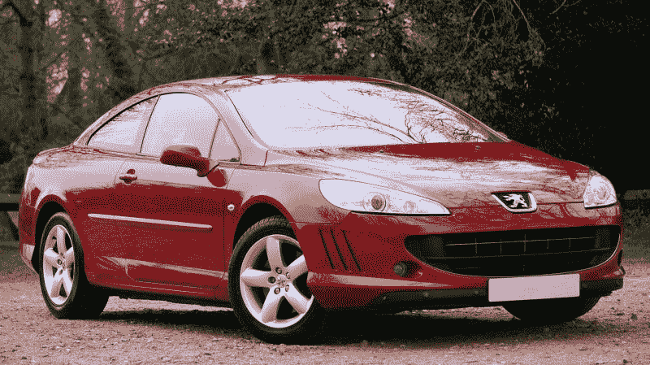
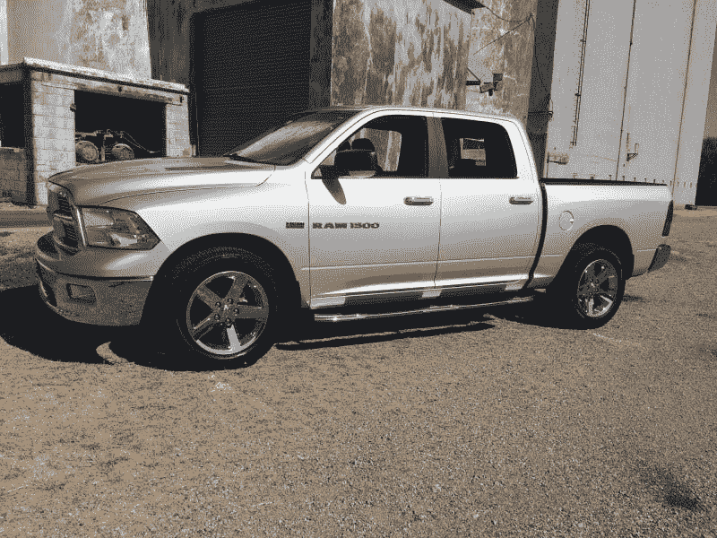
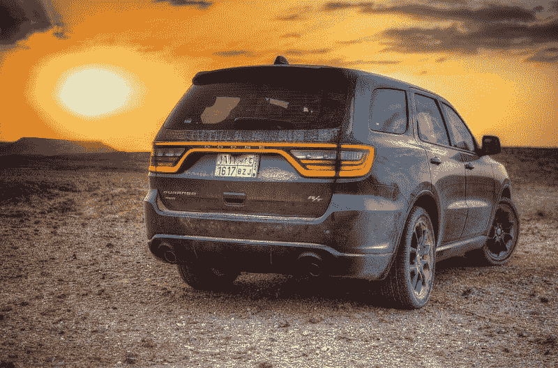

# 为什么菲亚特-克莱斯勒要和标致合并？—市场疯人院

> 原文：<https://medium.datadriveninvestor.com/why-is-fiat-chrysler-merging-with-peugeot-market-mad-house-559440ff90?source=collection_archive---------9----------------------->

如今的汽车市场越来越残酷。甚至像菲亚特-克莱斯勒这样成功的汽车制造商也感到需要合并才能生存。

菲亚特-克莱斯勒汽车公司和 PSA 集团；标致和雪铁龙的所有者于 2019 年 12 月 18 日签署了一份“具有约束力的合并协议”，*《底特律自由新闻报* [报道](https://www.freep.com/story/money/cars/chrysler/2019/12/17/fca-peugeot-merger/2680490001/)。两家公司计划联手应对电气化和自动驾驶汽车发展的挑战。

这笔交易将把几个历史悠久的汽车品牌聚集在一起。菲亚特-克莱斯勒拥有吉普、公羊、克莱斯勒、道奇、菲亚特、阿尔法·罗密欧和玛莎拉蒂。同时，PSA 集团拥有标致、雪铁龙、欧宝和沃克斯豪尔。

 [## 在自动驾驶汽车发生事故的情况下，谁应该承担法律责任？数据驱动的投资者

### 我仍然认为自动驾驶汽车是一种奢侈品，而不是必需品…

www.datadriveninvestor.com](https://www.datadriveninvestor.com/2018/11/02/who-is-legally-accountable-in-the-case-of-an-autonomous-vehicle-accident/) 

合并的一个显而易见的原因是让 PSA 集团进入北美市场。PSA 将其业务集中在欧洲。合并的另一个目标是让 PSA 进入克莱斯勒、Ram 和 Jeep 广受欢迎的皮卡、货车和运动型多功能车。

# 菲亚特-克莱斯勒赚钱了吗？

奇怪的是，菲亚特-克莱斯勒正在赚钱。菲亚特-克莱斯勒报告称，2019 年 9 月 30 日的毛利为 39.52 亿美元，收入为 303.82 亿美元。

然而，菲亚特克莱斯勒在同一天报告了 1.9905 亿美元的税后亏损，214.55 美元的净亏损和 5.5266 亿美元的营业收入。然而，菲亚特-克莱斯勒的收入和利润增长了。

FCAU 报告 2019 年 6 月的收入为 300.57 亿美元，9 月增长至 303.82 亿美元。有趣的是，菲亚特-克莱斯勒的毛利从 2019 年 6 月的 259.52 亿美元增长到 9 月的 264.3 亿美元。

相比之下，菲亚特-克莱斯勒报告连续四个季度收入增长萎缩。特别是，Stockrow 估计菲亚特-克莱斯勒在截至 2019 年 9 月 30 日的季度收入增长率为-5.3%。

# 菲亚特克莱斯勒有多少现金？

因此，菲亚特-克莱斯勒在赚钱，但却在努力维持收入和利润。

此外，菲亚特克莱斯勒公司正在产生一些现金。菲亚特-克莱斯勒报告 2019 年 9 月 30 日的运营现金流为 25.6 亿美元，期末现金流为 4.4575 亿美元。

令人印象深刻的是，菲亚特-克莱斯勒在 2019 年 9 月 30 日有 182.91 亿美元的现金和短期投资。因此，我认为菲亚特-克莱斯勒是一家健康的公司，因为它现金充裕。然而，菲亚特-克莱斯勒的管理层认为，为了生存，它需要与 PSA 合并。

# 为什么菲亚特-克莱斯勒和 PSA 要合并

PSA 集团和菲亚特-克莱斯勒正在合并，因为汽车工业正在成为。

解释一下，汽车工业制造了整辆车，然后卖给司机。因此，驱动力是客户和利润中心。

相比之下，在新的汽车行业，“客户”将是自动驾驶汽车公司，如 [Waymo](https://waymo.com/) 。T2 Alphabet 的子公司 Waymo 将提供操作系统；或者软件来驱动汽车。菲亚特-克莱斯勒等公司将提供车辆或硬件。

# 菲亚特-克莱斯勒是一家硬件公司

Waymo 为自动驾驶汽车提供了一个操作系统，称为 Waymo Driver。Waymo 司机正在亚利桑那州、加利福尼亚州和乔治亚州接受测试。

因此，未来的汽车行业将制造汽车，但 Waymo 可以提供操作系统。同样，**Alphabet**提供 Android 操作系统，而三星或富士康等公司则生产手机。

在这种环境下，菲亚特-克莱斯勒/PSA 将为 Waymo、**苹果(纳斯达克:AAPL)** ，可能还有**优步(纳斯达克:优步)**等公司提供制造服务。重要的是，菲亚特-克莱斯勒制造了 Waymo 的标志性自动驾驶汽车克莱斯勒 Pacifica 小型货车。

# 菲亚特-克莱斯勒的未来

我认为 PSA/菲亚特克莱斯勒的未来是为不同的市场制造自动驾驶汽车。PSA 可以在英国生产无人驾驶的沃克斯豪尔；例如，法国的自主品牌标致或雪铁龙。

销量好得多的将是自主克莱斯勒 Pacifica 面包车、Ram 皮卡、Ram Promaster 面包车和自动驾驶吉普 SUV。自动驾驶有轨电车可能会有巨大的市场；因为**亚马逊(NASDAQ: AMZN)** 等公司会用它们来送货。

值得注意的是，杰夫·贝索斯声称亚马逊可以购买 10 万辆 Rivian 电动货车用于主要交付，*多通道商业* [报道](https://multichannelmerchant.com/operations/amazon-buy-100000-electric-delivery-vans/)。因此，电动 Ram Promaster 和 [Promaster City](https://www.ramtrucks.com/ram-promaster-city.html) 面包车可能会有巨大的市场。

除了送货之外，我认为对自动驾驶拼车和出租车的需求也会很大。重要的是，Waymo 正在使用克莱斯勒 Pacifica 面包车在亚利桑那州进行其 [Waymo One](https://waymo.com/apply/) rideshare 测试。

# 菲亚特克莱斯勒是价值投资吗？

我认为**菲亚特克莱斯勒(纽约证券交易所代码:FCAU)** 可能是一项价值投资，不管有没有 PSA 集团。

特别是，公羊是美国第二畅销的皮卡。Statista [估计](https://marketmadhouse.com/why-is-fiat-chrysler-merging-with-peugeot/#5edbd48c3a08)详细来说，克莱斯勒在 2019 年 1 月至 9 月期间销售了 461，115 辆 Ram 皮卡。因此，Ram 的销量超过了雪佛兰、丰田和 GMC 皮卡。

例如，**通用汽车(纽约证券交易所股票代码:GM)** 在 2019 年前三个季度销售了 412，258 辆雪佛兰 Silverados 和 163，603 辆 GMC Sierras。同时，**丰田(NYSE: TM)** 同期售出 187，622 辆 Tacoma 皮卡和 86，062 辆 Tundra 皮卡。

美国最畅销的皮卡；然而，仍然是福特 F 系列。**福特(纽约证券交易所代码:F)** 在 2019 年 1 月至 9 月期间售出了 662，574 辆 F 系列皮卡。

令人印象深刻的是，*商业内幕* [将](https://marketmadhouse.com/why-is-fiat-chrysler-merging-with-peugeot/#3-chevrolet-silverado-23) the Ram 列为 2019 年 6 月美国第二畅销车辆。因此，菲亚特克莱斯勒控制着美国汽车市场的健康份额。值得注意的是，皮卡现在是美国中部的家庭用车。

# 菲亚特克莱斯勒在美国中部繁荣发展

相反，菲亚特-克莱斯勒在运动型多功能车(SUV)部门也有工作要做。例如，AutoNXT [对](https://autonxt.net/best-selling-suvs-in-america-first-half-2019/)三款 Jeep 车型进行排名；美国十大畅销 SUV 中的大切诺基、切诺基和吉普牧马人。

详细来说，那些车型是 Jeep 大切诺基；2019 年上半年销量 123，272 辆，2019 年上半年销量 116，985 辆的 Jeep 牧马人，2019 年上半年销量 97，210 辆的 Jeep 切诺基。

因此，菲亚特-克莱斯勒在北美取得了令人印象深刻的销量，这是真正的美国人喜欢驾驶的汽车。因此，菲亚特-克莱斯勒是北美汽车市场的重要参与者。

菲亚特-克莱斯勒和 PSA 可以利用这一地位成为自动驾驶汽车和电动汽车的主要参与者。例如，菲亚特-克莱斯勒可以利用皮卡的利润来资助自主驾驶电动 SUV 的研发，吉普和标致都可以销售。

# 菲亚特-克莱斯勒是价值股吗？

**菲亚特克莱斯勒汽车公司(纽约证券交易所代码:FCAU)** 由于其低股价、巨大的美国汽车销量和大量现金，具有价值潜力。例如，市场先生在 2019 年 12 月 24 日支付 14.979 美元购买 FCAU 股票。

此外，我认为 PSA 可以为菲亚特克莱斯勒增加一些价值。因此，我认为菲亚特-克莱斯勒是一项价值投资，尽管它不支付定期股息。此外，我认为与 Waymo 的联盟为菲亚特克莱斯勒增加了许多价值。

解释一下，菲亚特-克莱斯勒拥有谷歌所有的资金、智力和技术。因此，菲亚特-克莱斯勒可以通过 Waymo 和 Waymo Driver 成为自动驾驶汽车的主要参与者。特别是，如果 Waymo Driver 成为自动驾驶汽车的标准操作系统，菲亚特-克莱斯勒可能会赚很多钱。

如果你正在寻找可以从自动驾驶技术中获利的汽车价值投资，菲亚特-克莱斯勒可能是一个不错的选择。菲亚特-克莱斯勒有很多价值，PSA 可以为这个传奇的汽车制造商增加更多的价值。

*原载于 2019 年 12 月 25 日*[*【https://marketmadhouse.com】*](https://marketmadhouse.com/why-is-fiat-chrysler-merging-with-peugeot/)*。*